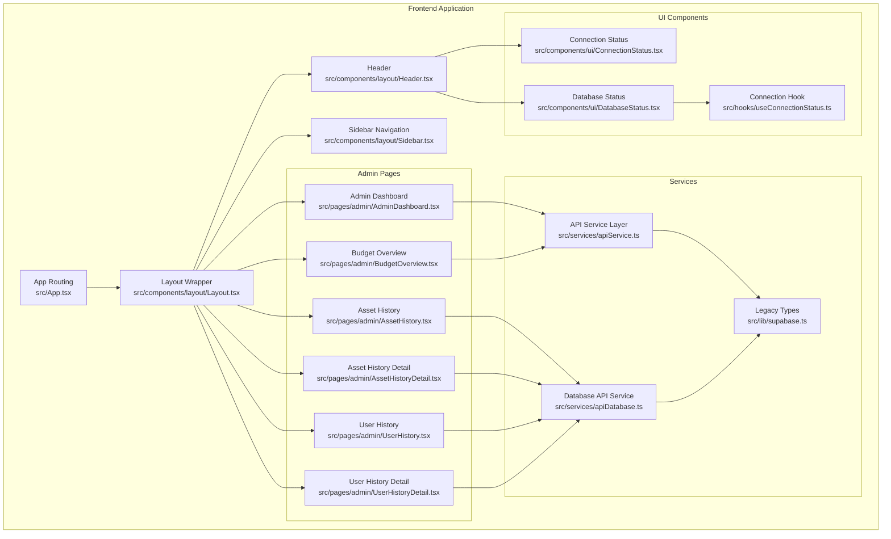
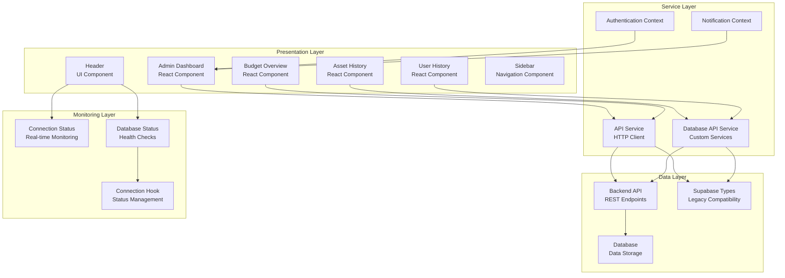
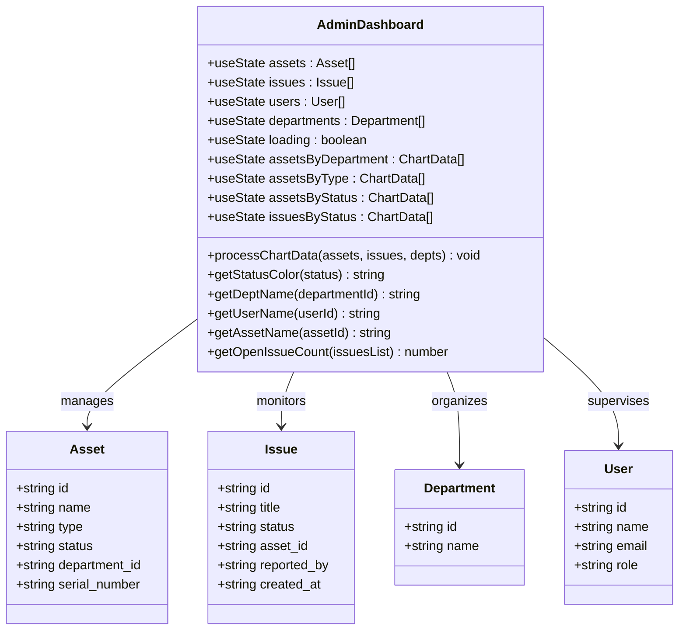
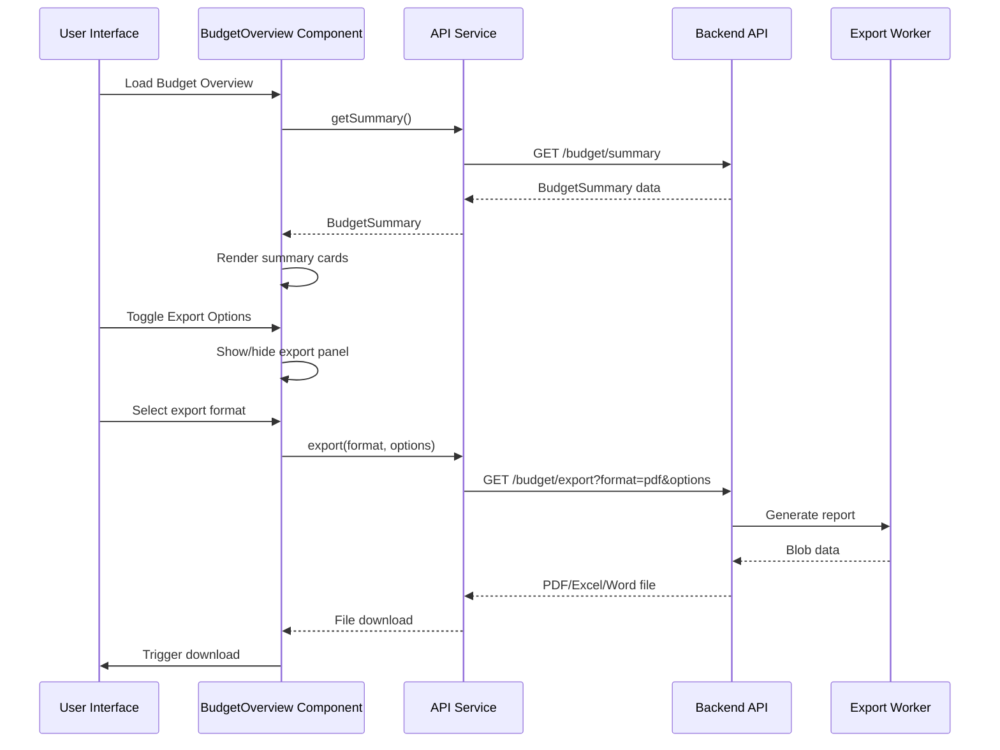
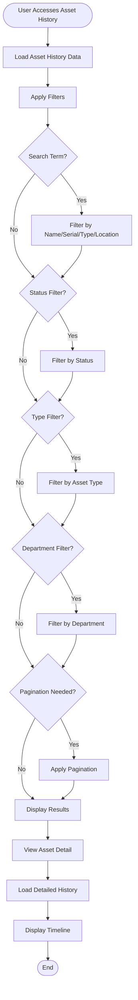
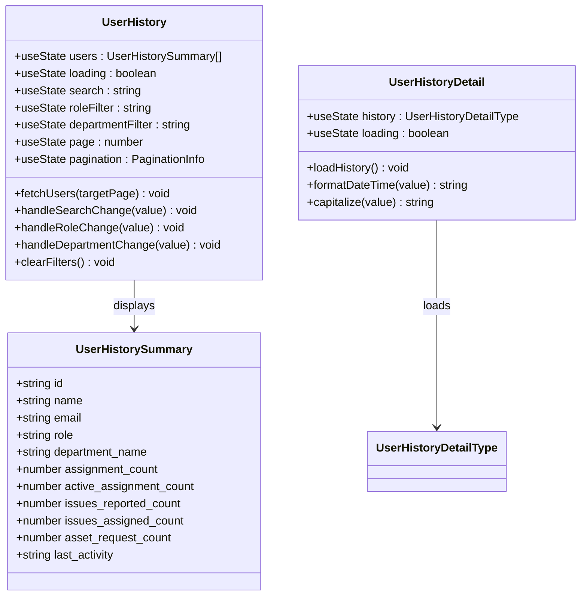
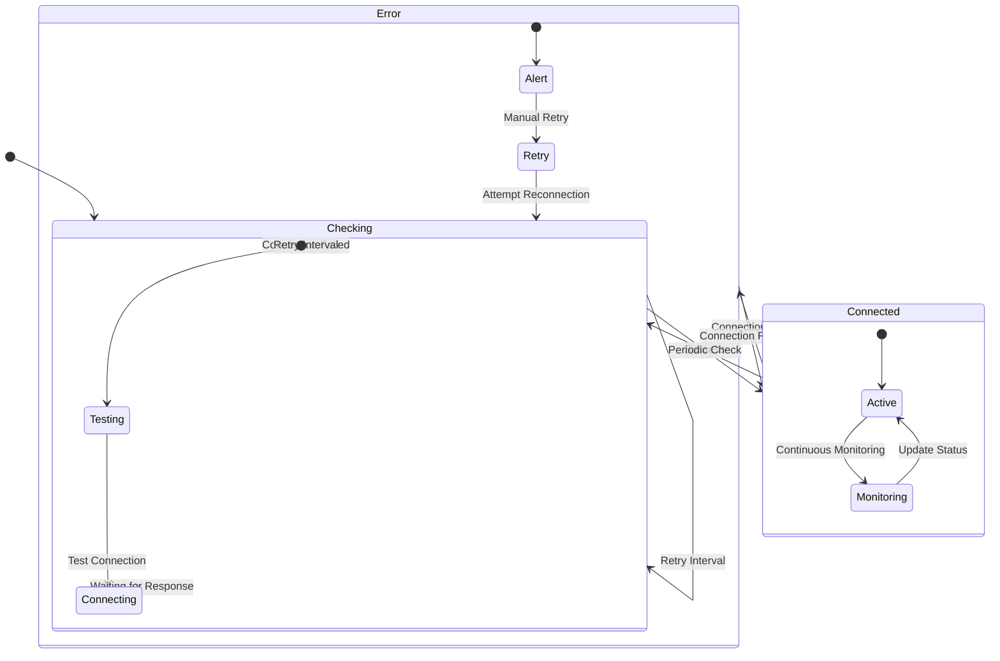

# Admin Dashboard & Overview

## Table of Contents
1. [Introduction](#introduction)
2. [Project Structure](#project-structure)
3. [Core Components](#core-components)
4. [Architecture Overview](#architecture-overview)
5. [Detailed Component Analysis](#detailed-component-analysis)
6. [Dependency Analysis](#dependency-analysis)
7. [Performance Considerations](#performance-considerations)
8. [Troubleshooting Guide](#troubleshooting-guide)
9. [Conclusion](#conclusion)

## Introduction
This document provides comprehensive documentation for the Admin Dashboard and system overview features of the Assets Management application. It covers the dashboard interface, key metrics display, system health indicators, budget overview functionality, asset valuation summaries, financial reporting capabilities, asset history dashboards, trend analysis, performance metrics, real-time monitoring widgets, administrative shortcuts, customization options, and administrative decision-making support tools.

## Project Structure
The Admin Dashboard and system overview features are implemented as React components within the frontend application, integrated with a centralized API service layer and supporting UI components for system health monitoring.

## Core Components
The Admin Dashboard and system overview features consist of several key components that work together to provide comprehensive system visibility and administrative capabilities.

### Admin Dashboard
The primary dashboard displays key metrics, system health indicators, and quick administrative actions. It aggregates data from multiple sources and presents it in an intuitive interface with real-time updates and responsive design.

### Budget Overview
This component provides financial reporting capabilities with budget tracking, cost breakdowns, and export functionality for administrative decision-making.

### Asset History Dashboard
A comprehensive asset tracking system that allows administrators to review asset histories, filter by various criteria, and drill down into detailed timelines of asset assignments and issues.

### User History Dashboard
Similar to asset history but focused on user activities, tracking device assignments, issue participation, and asset requests per user.

### System Health Monitoring
Real-time monitoring components that track database connectivity, system status, and provide alerts for potential issues.

## Architecture Overview
The system follows a layered architecture with clear separation between presentation, business logic, and data access layers.

## Detailed Component Analysis

### Admin Dashboard Component
The Admin Dashboard serves as the central hub for system overview and administrative tasks.

The dashboard implements several key features:

#### Key Metrics Display
- **Total Assets**: Real-time count of all registered assets
- **Open Issues**: Current unresolved issues requiring attention
- **Total Users**: Active user accounts in the system
- **Departments**: Organizational units managed

#### Data Visualization
- **Assets by Status**: Pie chart showing distribution across different asset statuses
- **Assets by Department**: Top 5 departments by asset count
- **Issues by Status**: Distribution of issue statuses
- **Assets by Type**: Horizontal bar chart of asset type distribution

#### Recent Activity Feed
- **Recent Issues**: Latest issues with status indicators and asset associations
- **Recently Added Assets**: New asset additions with status and department information

#### Administrative Shortcuts
- **Manage Assets**: Direct navigation to asset management
- **Manage Issues**: Access to issue tracking and resolution
- **Manage Users**: User administration and management
- **Manage Departments**: Organizational structure management
- **Asset Requests**: Request processing and approval workflows

### Budget Overview Component
The Budget Overview provides comprehensive financial reporting and budget tracking capabilities.

#### Financial Reporting Features
- **Issue Budget Tracking**: Total cost of tracked issues with individual status breakdowns
- **Asset Request Budget**: Cost projections for asset requests across different statuses
- **Combined Budget Analysis**: Integrated view of both issues and asset requests
- **Recent Activity Tracking**: Timeline of recent budget-related updates

#### Export Capabilities
- **Multiple Formats**: Support for PDF, Word, and Excel exports
- **Flexible Filtering**: Customizable export options based on status filters
- **General vs Custom Exports**: Predefined filters versus custom selections
- **Automatic Currency Formatting**: Localized currency display and export

#### Status-Based Cost Analysis
The component provides detailed cost breakdowns by status categories:
- **Open/Closed Statuses**: Issue lifecycle tracking
- **Pending/Approved/Rejected**: Asset request processing stages
- **Scheduled/In Progress**: Project and maintenance cost tracking

### Asset History Dashboard
The Asset History component provides comprehensive tracking of asset lifecycle and usage patterns.

#### Asset Tracking Features
- **Comprehensive Asset List**: Display of all assets with key metrics
- **Advanced Filtering**: Multi-dimensional filtering by status, type, and department
- **Search Functionality**: Keyword search across asset names, serial numbers, types, and locations
- **Pagination Support**: Efficient handling of large datasets with configurable page sizes
- **Real-Time Updates**: Automatic refresh capability for current asset status

#### Asset Metrics Display
Each asset card shows:
- **Basic Information**: Name, serial number, type, and location
- **Usage Statistics**: Assignment counts and issue activity
- **Current Status**: Active/in-use/maintenance/retired indicators
- **Last Activity**: Timestamp of most recent activity

#### Detailed Asset Timeline
Clicking an asset reveals a comprehensive timeline showing:
- **Assignment History**: Who had the asset, when, and for what purpose
- **Issue Events**: Related issues and their resolutions
- **Maintenance Records**: Service and repair history
- **Condition Changes**: Asset condition over time

### User History Dashboard
The User History component tracks user activities across devices, issues, and asset requests.

#### User Activity Tracking
- **Comprehensive User List**: Display of all users with activity metrics
- **Multi-Factor Filtering**: Filter by role, department, and search terms
- **Activity Metrics**: Detailed statistics on assignments, issues, and requests
- **Pagination and Search**: Efficient navigation through large user datasets

#### User Metrics Display
Each user card provides:
- **Basic Information**: Name, email, role, and department
- **Device Assignments**: Total and active assignment counts
- **Issue Participation**: Issues reported and assigned to the user
- **Asset Requests**: Submitted asset requests
- **Last Activity**: Timestamp of most recent system interaction

#### Detailed User Timeline
The detailed view shows:
- **Device Assignment History**: Complete history of asset assignments and returns
- **Issue Tracking**: All issues reported and assigned to the user
- **Asset Request History**: Submitted and processed asset requests
- **Issue Event Timeline**: Timeline of issue-related activities

### System Health Monitoring
Real-time monitoring components provide visibility into system connectivity and database health.

#### Database Connectivity Monitoring
- **Automatic Connection Testing**: Regular checks for database accessibility
- **Status Indicators**: Visual indicators for connection status
- **Error Detection**: Immediate detection of connection failures
- **Retry Mechanisms**: Automatic retry attempts with manual override

#### Real-Time Status Display
- **Connection Status Widget**: Prominent display of database connection status
- **Offline Mode Handling**: Graceful degradation when connection is lost
- **Health Check Integration**: Integration with broader system health monitoring
- **User Feedback**: Clear communication of system status to users

## Dependency Analysis
The Admin Dashboard and system overview features have well-defined dependencies that support maintainability and scalability.

```mermaid
graph TB
subgraph "External Dependencies"
React["React 18+"]
Lucide["Lucide Icons"]
Recharts["Recharts"]
Axios["Axios"]
ReactRouter["React Router DOM"]
end
subgraph "Internal Dependencies"
AdminDashboard["AdminDashboard.tsx"]
BudgetOverview["BudgetOverview.tsx"]
AssetHistory["AssetHistory.tsx"]
UserHistory["UserHistory.tsx"]
ApiService["apiService.ts"]
ApiDatabase["apiDatabase.ts"]
SupabaseTypes["supabase.ts"]
Header["Header.tsx"]
Sidebar["Sidebar.tsx"]
ConnectionStatus["ConnectionStatus.tsx"]
DatabaseStatus["DatabaseStatus.tsx"]
UseConnectionStatus["useConnectionStatus.ts"]
end
AdminDashboard --> React
AdminDashboard --> Lucide
AdminDashboard --> Recharts
AdminDashboard --> ApiService
BudgetOverview --> React
BudgetOverview --> Lucide
BudgetOverview --> ApiService
AssetHistory --> React
AssetHistory --> Lucide
AssetHistory --> ApiDatabase
UserHistory --> React
UserHistory --> Lucide
UserHistory --> ApiDatabase
ApiService --> Axios
ApiDatabase --> Axios
Header --> React
Header --> Lucide
Header --> ConnectionStatus
Header --> DatabaseStatus
Sidebar --> React
Sidebar --> Lucide
ConnectionStatus --> UseConnectionStatus
DatabaseStatus --> UseConnectionStatus
AdminDashboard --> SupabaseTypes
BudgetOverview --> SupabaseTypes
AssetHistory --> SupabaseTypes
UserHistory --> SupabaseTypes
```

### Component Coupling and Cohesion
The components demonstrate good separation of concerns with minimal coupling between unrelated features. Each component focuses on a specific domain area while sharing common infrastructure through the service layer.

### Data Flow Patterns
- **Top-down Data Flow**: Parent components pass data and callbacks to child components
- **Event-driven Updates**: User interactions trigger data refresh cycles
- **Centralized State Management**: Shared state through React Context providers
- **Asynchronous Data Loading**: Non-blocking data fetching with loading states

### External Dependencies
The application relies on modern web technologies with carefully selected dependencies that balance functionality with performance and maintainability.

## Performance Considerations
The Admin Dashboard and system overview features are designed with performance optimization in mind through several key strategies.

### Data Loading Optimization
- **Parallel Data Fetching**: Multiple data sources are loaded concurrently to minimize initial load time
- **Efficient Pagination**: Large datasets are paginated to prevent memory issues and improve responsiveness
- **Lazy Loading**: Detailed views are loaded only when needed to reduce initial payload size
- **Caching Strategies**: Response caching prevents redundant network requests for frequently accessed data

### Rendering Performance
- **Virtualized Lists**: Long lists are rendered efficiently using virtualization techniques
- **Memoization**: Expensive computations are memoized to avoid unnecessary recalculations
- **Conditional Rendering**: Components only render when data is available or when visibility changes
- **Optimized Charts**: Chart components are optimized for large datasets with efficient update mechanisms

### Network Efficiency
- **Request Batching**: Multiple related requests are batched to reduce network overhead
- **Compression**: API responses utilize compression to reduce bandwidth usage
- **Connection Pooling**: HTTP connections are pooled for improved performance
- **Timeout Management**: Appropriate timeouts prevent hanging requests from blocking the UI

### Memory Management
- **Component Cleanup**: Proper cleanup of event listeners and subscriptions prevents memory leaks
- **State Optimization**: State is structured to minimize re-renders and memory footprint
- **Image Optimization**: Asset images are optimized and lazy-loaded to reduce initial bundle size

## Troubleshooting Guide
Common issues and their solutions for the Admin Dashboard and system overview features.

### Dashboard Loading Issues
**Problem**: Dashboard fails to load or shows incomplete data
**Causes**:
- Network connectivity issues
- API endpoint unavailability
- Authentication token expiration
- Database connection problems

**Solutions**:
1. Check network connectivity and firewall settings
2. Verify API endpoint availability and response times
3. Ensure authentication tokens are valid and not expired
4. Monitor database connection status and retry connectivity tests

### Performance Degradation
**Problem**: Slow loading times or unresponsive interface
**Causes**:
- Large dataset sizes without proper pagination
- Inefficient data processing calculations
- Excessive re-renders due to state changes
- Memory leaks from unclosed subscriptions

**Solutions**:
1. Implement proper pagination for large datasets
2. Optimize data processing with memoization and efficient algorithms
3. Use React.memo and useCallback hooks to prevent unnecessary re-renders
4. Ensure proper cleanup of event listeners and subscriptions

### Export Functionality Issues
**Problem**: Budget export fails or produces incorrect results
**Causes**:
- Invalid export parameters
- Server-side processing errors
- File generation failures
- Browser compatibility issues

**Solutions**:
1. Validate export parameters before submission
2. Check server logs for processing errors
3. Verify file generation process and temporary storage
4. Test export functionality across different browsers and versions

### Real-time Monitoring Problems
**Problem**: System status indicators show incorrect information
**Causes**:
- Stale connection status data
- Failed health check endpoints
- Timer-based status updates not firing
- Network latency affecting status accuracy

**Solutions**:
1. Force refresh of connection status manually
2. Check health check endpoints for proper responses
3. Verify timer intervals and automatic update mechanisms
4. Monitor network latency and adjust polling intervals accordingly

## Conclusion
The Admin Dashboard and system overview features provide a comprehensive solution for asset management oversight and administrative decision-making. The implementation demonstrates strong architectural principles with clear separation of concerns, efficient data management, and robust monitoring capabilities.

Key strengths of the implementation include:
- **Comprehensive Coverage**: Full spectrum of asset, user, and financial tracking
- **Real-time Monitoring**: Live system health and connectivity status
- **Flexible Reporting**: Customizable export options with multiple format support
- **Performance Optimization**: Efficient data handling and rendering strategies
- **User Experience**: Intuitive interface with quick administrative shortcuts

The modular design allows for easy extension and maintenance while the service layer abstraction enables future migration to different backend systems. The combination of visual dashboards, detailed reporting, and real-time monitoring provides administrators with the tools needed for effective asset management oversight.

Future enhancements could include advanced analytics capabilities, customizable dashboard widgets, and integration with external reporting systems to further strengthen the administrative decision-making support ecosystem.
