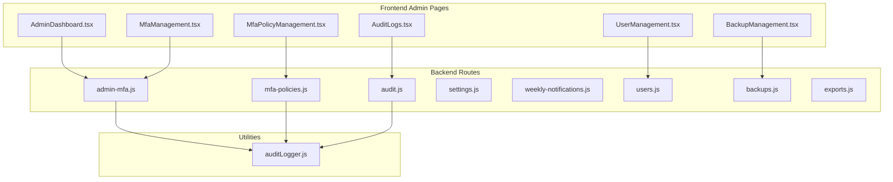
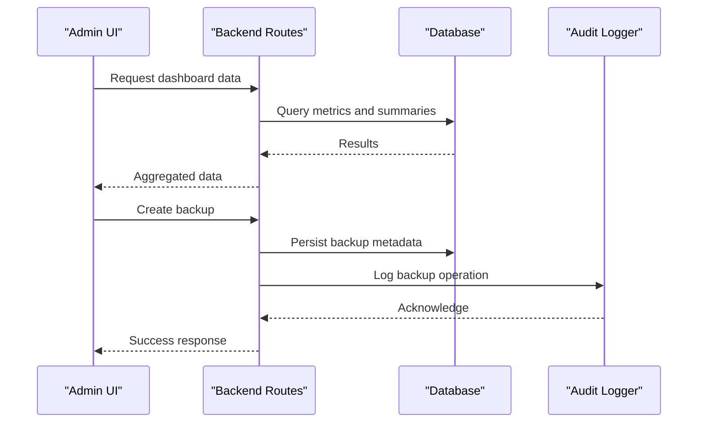
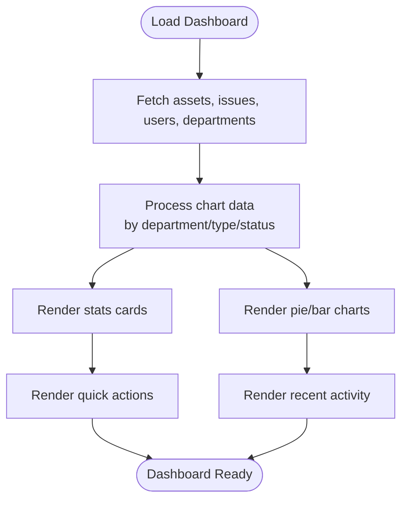
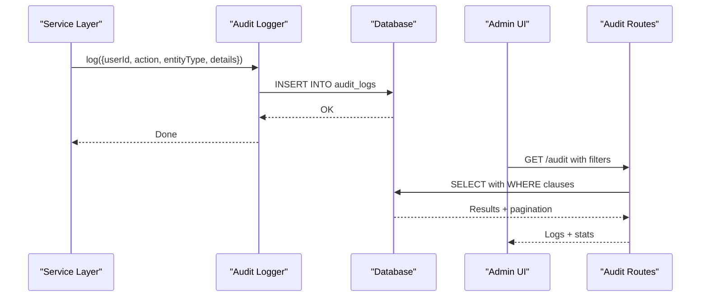
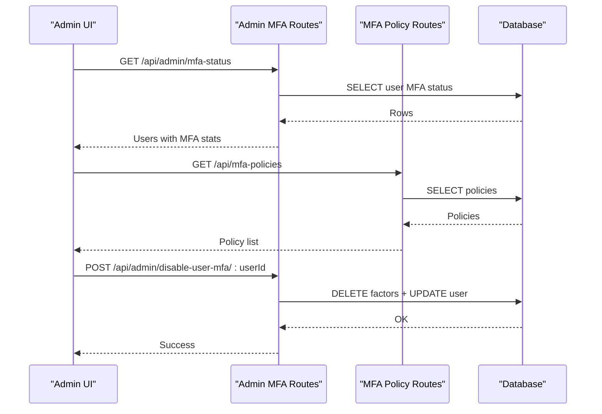
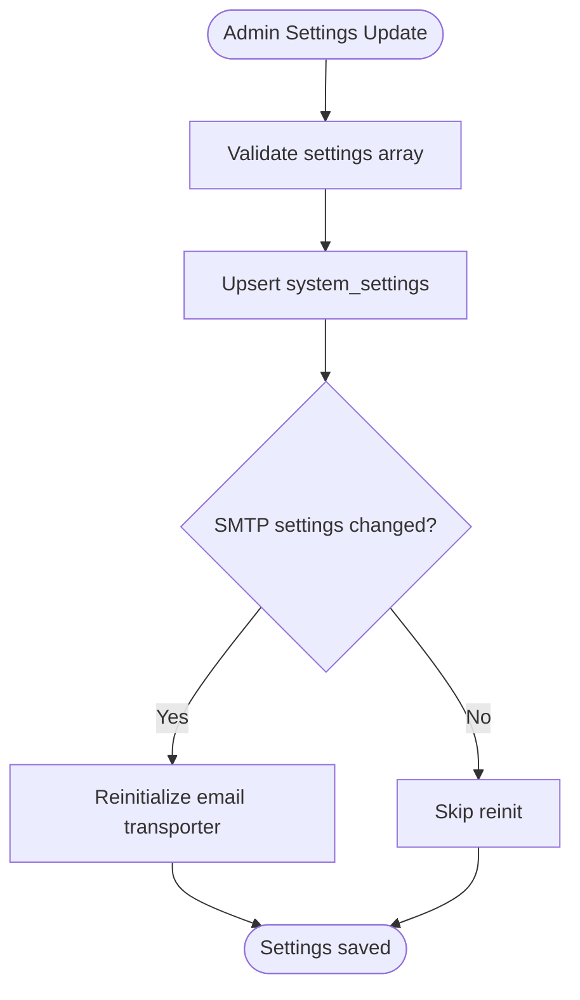
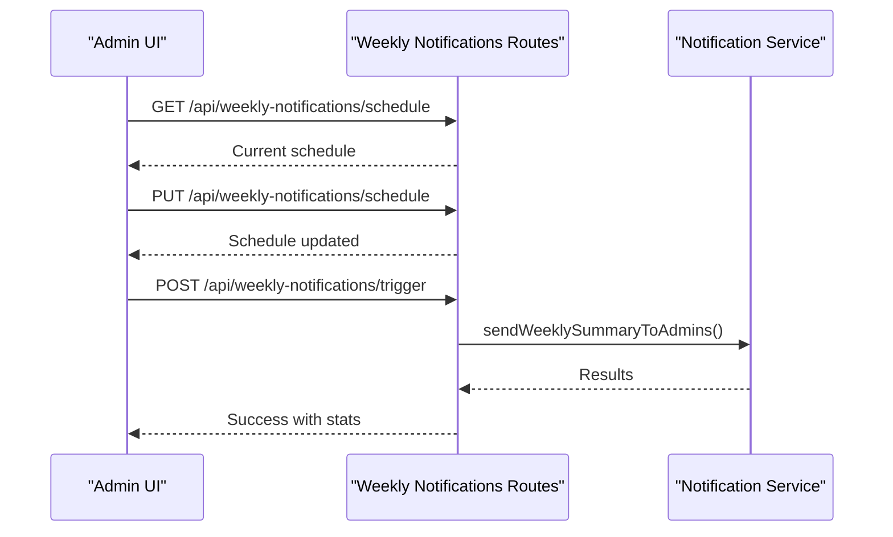
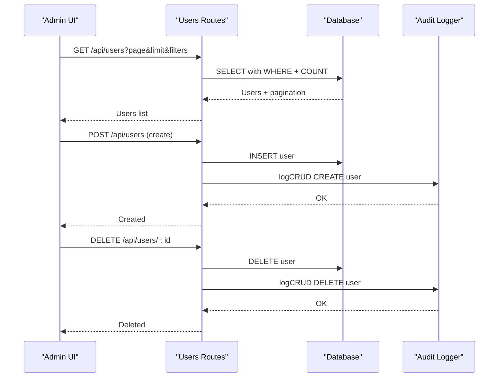
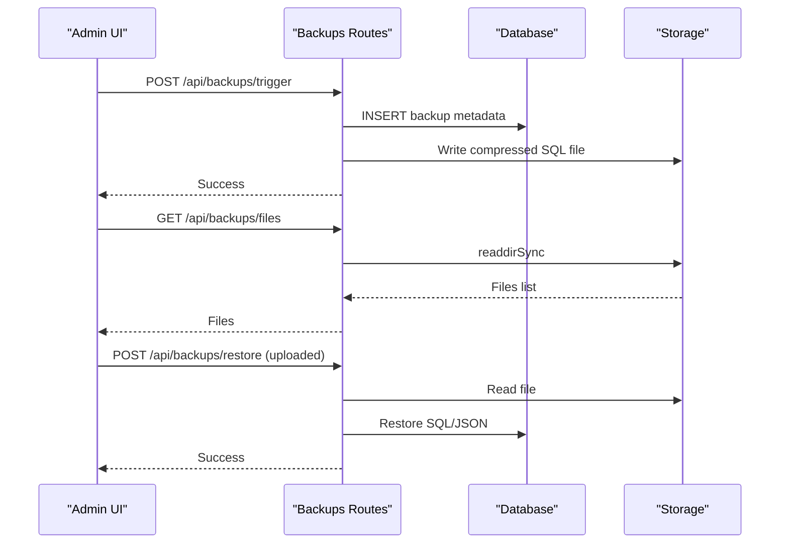
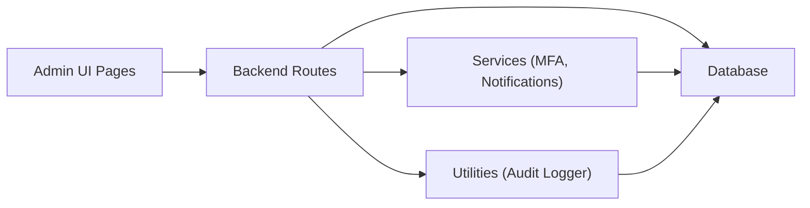

# Administration & System Management

## Table of Contents
1. [Introduction](#introduction)
2. [Project Structure](#project-structure)
3. [Core Components](#core-components)
4. [Architecture Overview](#architecture-overview)
5. [Detailed Component Analysis](#detailed-component-analysis)
6. [Dependency Analysis](#dependency-analysis)
7. [Performance Considerations](#performance-considerations)
8. [Troubleshooting Guide](#troubleshooting-guide)
9. [Conclusion](#conclusion)

## Introduction
This document provides comprehensive coverage of the Administration and System Management features within the Assets Management System. It focuses on the admin dashboard overview, system health monitoring, administrative controls, audit logging and compliance reporting, MFA management and policy configuration, system settings and branding, weekly notifications and automated reporting, user management and bulk operations, and system maintenance and troubleshooting workflows.

## Project Structure
The administration and system management functionality spans both the frontend React application and the backend Node.js/Express APIs:

- Frontend Admin Pages:
  - AdminDashboard.tsx: Administrative overview and analytics
  - AuditLogs.tsx: Audit trail viewing and export
  - UserManagement.tsx: User lifecycle and bulk operations
  - BackupManagement.tsx: Backup scheduling, creation, restoration, and recipients
  - MfaManagement.tsx: MFA status and factor management
  - MfaPolicyManagement.tsx: MFA policy configuration and compliance stats

- Backend Routes and Services:
  - Admin MFA routes: `/api/admin/mfa-*` for MFA status and management
  - MFA Policy routes: `/api/mfa-policies` for policy CRUD and compliance
  - Audit routes: `/api/audit` for audit logs and statistics
  - Settings routes: `/api/settings` for system configuration and branding
  - Weekly notifications: `/api/weekly-notifications` for schedule and triggers
  - Users routes: `/api/users` for user management and history
  - Backups routes: `/api/backups` for backup creation, restoration, and file management
  - Exports routes: `/api/exports` for CSV exports of teams, issues, assets, and requests
  - Audit logger utility: centralized logging for compliance



## Core Components
- Admin Dashboard: Provides overview cards, charts, quick actions, and recent activity feeds for assets, issues, users, and departments.
- Audit Logging: Centralized audit logging with filtering, statistics, and export capabilities.
- MFA Management: Admin view of user MFA status, factors, and controls to disable MFA or factors.
- MFA Policy Management: CRUD for MFA policies, enforcement levels, grace periods, and compliance statistics.
- System Settings and Branding: Admin-only configuration of system settings, SMTP, and branding assets.
- Weekly Notifications: Configurable schedule, manual triggers, and reload mechanisms.
- User Management: Full lifecycle management, history summaries, bulk operations, and exports.
- Backup Management: Automated SQL backups, manual triggers, file storage, restoration, and email recipients.
- Export Tools: CSV exports for team members, department issues, department assets, and asset requests.

## Architecture Overview
The system follows a layered architecture:
- Frontend Admin Pages (React) consume REST endpoints exposed by backend routes.
- Backend routes enforce authentication and authorization, delegate to services/utilities, and interact with the database.
- Audit logging is centralized via a utility that persists entries regardless of main flow outcomes.
- MFA and policy management integrate with database tables for compliance tracking and enforcement.



## Detailed Component Analysis

### Admin Dashboard
The Admin Dashboard aggregates system-wide metrics and provides quick navigation to key administrative areas. It displays:
- Stats overview cards for total assets, open issues, total users, and departments.
- Charts for assets by status, assets by department, issues by status, and assets by type.
- Recent activity sections for issues and recently added assets.
- Quick action buttons to navigate to asset, issue, user, and department management screens.



### Audit Logging System
The audit logging system captures all significant system activities for compliance and security monitoring:
- Centralized logging utility supports multiple log categories (auth, CRUD, config, backup, security).
- Backend routes provide listing, filtering, statistics, and creation of audit logs.
- Frontend allows filtering by user, action, entity type, and date range, with export to CSV/JSON/TXT/PDF.
- Statistics include totals, unique users, and counts per action type.



### MFA Management and Policy Configuration
MFA management enables administrators to:
- View MFA status across users, including enrollment dates, verification timestamps, and factor counts.
- Inspect user MFA factors and disable individual factors or complete MFA enrollment.
- Configure MFA policies with enforcement levels, target/exempt roles, grace periods, and enable/disable toggles.
- Review compliance statistics and resolve policy violations.



### System Settings and Branding
System settings management includes:
- Admin-only retrieval and update of system settings with validation.
- Public exposure of branding settings for client-side rendering.
- SMTP configuration testing and dynamic reinitialization of transporters upon changes.
- Google OAuth client configuration exposure without leaking secrets.



### Weekly Notifications and Automated Reporting
Weekly notifications provide:
- Configurable schedule with enabled flag, days, time, and timezone.
- Manual trigger endpoint for testing and immediate delivery.
- Endpoint to reload cron schedule after updates.
- Integration with notification preferences and email service.



### User Management and Bulk Operations
User management encompasses:
- Listing users with filters (search, role, department, status) and pagination.
- History summaries and detailed user histories across assignments, issues, and requests.
- Creation, updates, deletion, and password changes with audit logging.
- Bulk operations including selection and deletion.
```bash
Export capabilities for team members and CSV generation.
```



### Backup Management and Automated Reporting
Backup management supports:
- Automatic SQL backups with configurable schedule and email recipients.
- Manual creation of JSON and SQL backups with email delivery.
- Server-side file listing, download, and deletion.
- Restoration from uploaded files or server-stored files.
- Backup email recipients management with activation toggles.



### Export Tools and Compliance Reporting
Export tools provide standardized CSV exports for:
- Team members (managers/admins)
- Department issues (managers/admins)
- Department assets (managers/admins)
- Asset requests (managers/admins)

These exports support compliance reporting and external audits by providing structured datasets.

### Administrative Workflows and System Optimization
Common administrative workflows include:
- Onboarding new users with creation, notifications, and audit logging.
- Enforcing MFA policies during login and recording violations.
- Generating compliance reports via audit logs and MFA policy statistics.
- Scheduling and triggering weekly notifications for stakeholders.
- Performing backups and restoring from backups for disaster recovery.
- Managing branding and system settings with SMTP testing.

Optimization recommendations:
- Use pagination and filtering for large datasets (users, audit logs).
- Leverage database indexes on frequently queried columns (user_id, created_at, entity_type).
- Batch operations for bulk user deletions and exports.
- Monitor backup retention and automate cleanup of old files.
- Validate and sanitize inputs for settings and notifications.

## Dependency Analysis
The admin features exhibit clear separation of concerns:
- Frontend pages depend on backend routes for data and actions.
- Backend routes depend on database utilities and services.
- Audit logging is decoupled and invoked from various routes/services.
- MFA and policy management rely on dedicated database tables and services.



## Performance Considerations
- Pagination and limits: Use sanitized pagination for large datasets (users, audit logs, backups).
- Indexes: Ensure indexes on audit_logs (user_id, created_at), users (is_active, role), and backups (created_at).
- Background processing: Offload heavy operations like backup generation and exports to background jobs.
- Caching: Cache branding settings and static lists where appropriate.
- Validation: Validate inputs early to reduce database round trips.

## Troubleshooting Guide
- Audit logs not appearing:
  - Verify audit routes are reachable and database connectivity is healthy.
  - Check audit logger fallback behavior if database writes fail.
- MFA policy enforcement not applied:
  - Confirm policy is enabled and targets the user's role.
  - Review policy violations and compliance records.
- Backup failures:
  - Check filesystem permissions for storage directory.
  - Validate database credentials and connection for SQL dumps.
  - Confirm email configuration for backup notifications.
- User management errors:
  - Validate role-based access and permission checks.
  - Review audit logs for failed CRUD operations.
- Weekly notifications not sent:
  - Verify schedule configuration and timezone.
  - Test SMTP settings and notification preferences.

## Conclusion
The Administration and System Management features provide a robust foundation for oversight, compliance, and operational excellence. The admin dashboard offers actionable insights, while audit logging, MFA management, and policy configuration ensure strong security posture. System settings, branding, notifications, user management, and backup capabilities collectively support efficient operations and reliable disaster recovery.
