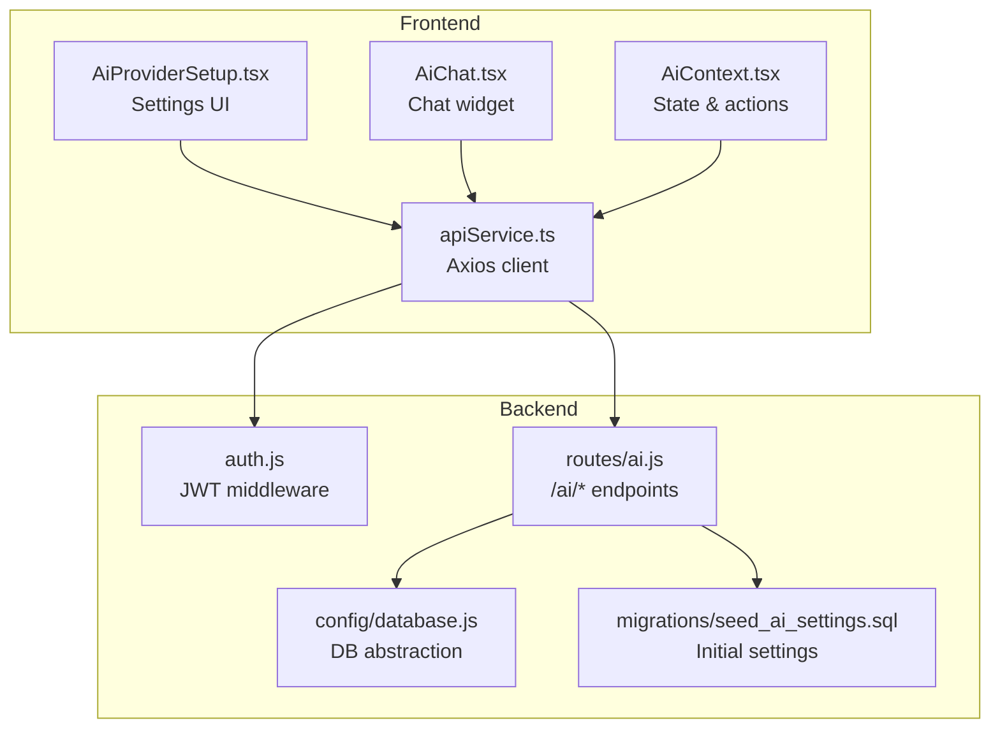
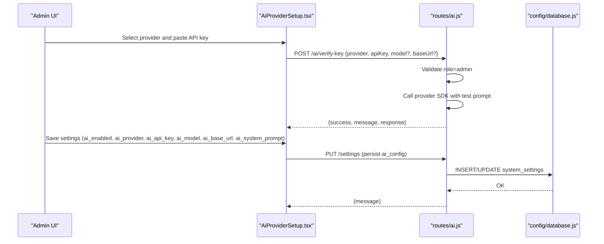
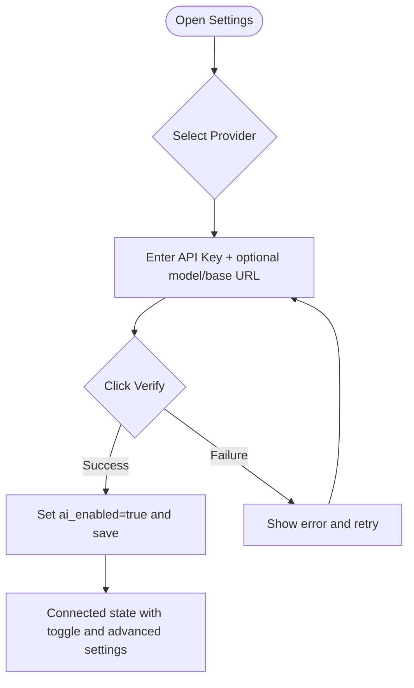
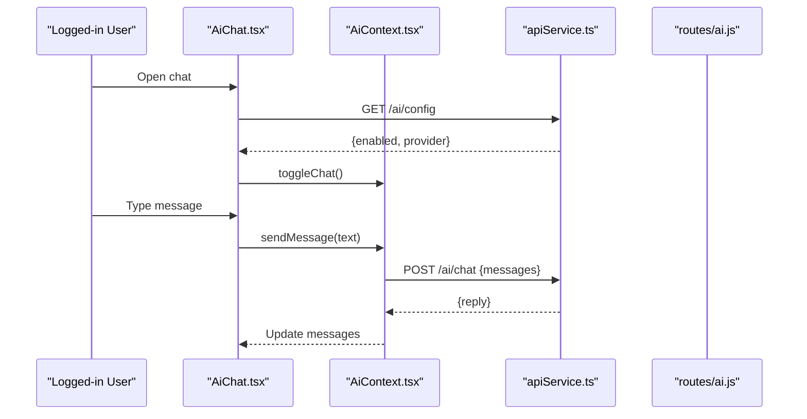
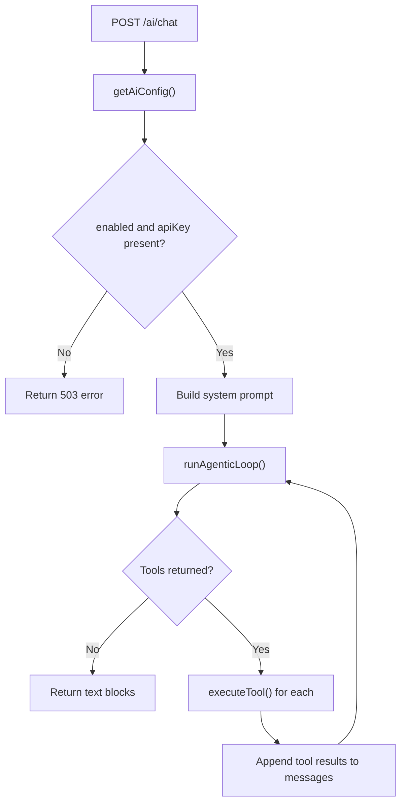
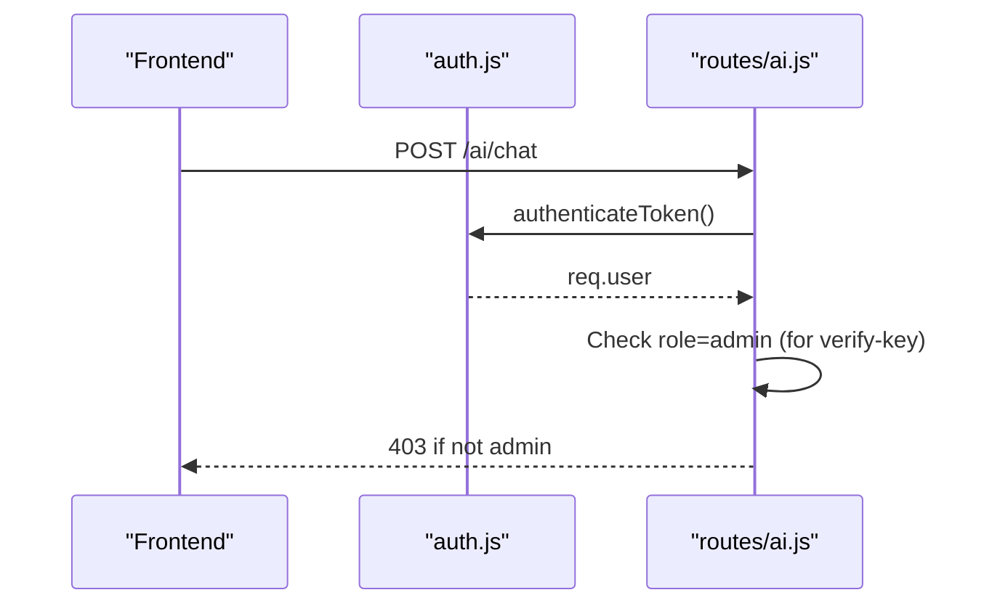
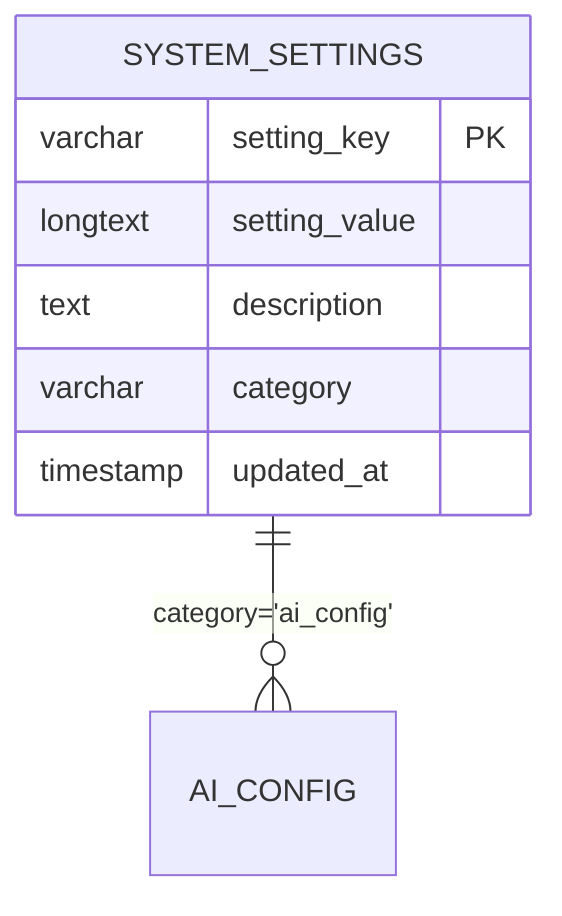
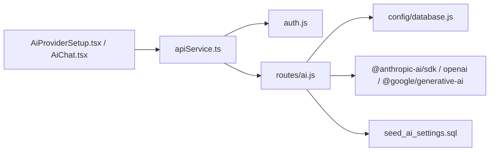

# AI Provider Configuration

## Table of Contents
1. [Introduction](#introduction)
2. [Project Structure](#project-structure)
3. [Core Components](#core-components)
4. [Architecture Overview](#architecture-overview)
5. [Detailed Component Analysis](#detailed-component-analysis)
6. [Dependency Analysis](#dependency-analysis)
7. [Performance Considerations](#performance-considerations)
8. [Troubleshooting Guide](#troubleshooting-guide)
9. [Conclusion](#conclusion)

## Introduction
This document explains how to configure and operate AI providers in the Assets Management System. It covers setup for OpenAI, Anthropic, and Google Gemini, plus custom/self-hosted OpenAI-compatible endpoints. You will learn how to manage credentials, switch providers, validate connections, tune models, and secure configuration. The guide also details the AI context provider, state management, and configuration validation flows.

## Project Structure
The AI configuration spans frontend and backend:
- Frontend: Settings UI for provider selection, key entry, verification, and advanced options; chat widget that consumes the backend AI service.
- Backend: Routes for chat, configuration retrieval, and key verification; middleware for authentication; database-backed system settings.

## Core Components
- Provider selection and verification UI: Guides administrators through obtaining API keys and verifying connectivity.
- AI context provider: Manages chat state, loading, and sends messages to the backend.
- Backend AI route: Validates configuration, executes tools against the database, and routes to provider SDKs.
- Authentication middleware: Enforces admin-only verification and protected chat access.
- System settings persistence: Stores provider, key, model, base URL, and custom system prompt.

## Architecture Overview
The AI assistant operates via a narrow, scoped system instruction and a set of tools that read/write system data. The frontend sends messages to the backend, which validates configuration, builds a system prompt, runs an agentic loop with tools, and returns a final response.

## Detailed Component Analysis

### Provider Selection and Verification UI
- Supports Anthropic, OpenAI, Google Gemini, and Custom/OpenAI-Compatible providers.
- Provides step-by-step instructions and links to provider consoles.
- Verifies keys via backend before enabling configuration.
- Allows toggling assistant activation and editing advanced settings.

### AI Context Provider and Chat Widget
- Maintains messages, loading state, and visibility.
- Sends user messages to backend and appends assistant replies.
- Fetches global AI enablement flag to decide whether to render.

### Backend AI Route and Tools
- Reads system settings from database and validates configuration.
- Builds a system prompt combining built-in narrow scope and optional custom prompt.
- Executes tools against the database and orchestrates provider SDK calls.
- Supports Anthropic, OpenAI, and Google Gemini with provider-specific adapters.

### Authentication and Authorization
- Chat endpoint requires a valid JWT; otherwise returns 401.
- Key verification endpoint additionally requires admin role.

### Configuration Storage and Validation
- Settings are persisted in the system_settings table under category ai_config.
- Initial seeding inserts default keys for ai_enabled, ai_provider, ai_api_key, ai_model, ai_base_url, ai_system_prompt.
- The frontend reads/writes settings via the settings API.

## Dependency Analysis
- Frontend depends on apiService for authenticated HTTP calls.
- Backend routes depend on database abstraction and provider SDKs.
- Provider verification and chat depend on middleware for authentication.
- Settings persistence depends on system_settings table.

## Performance Considerations
- Timeout: The frontend axios instance sets a 30-second timeout for all requests.
- Iteration limit: The backend enforces a maximum of five iterations in the agentic loop to prevent runaway processing.
- Payload size: Keep messages concise; the assistant is instructed to be concise and avoid excessive tokens.

## Troubleshooting Guide

### Common Configuration Issues
- Admin privileges required for verification:
  - Symptom: 403 when verifying key.
  - Resolution: Log in as admin and retry verification.
  - Section sources
    - `ai.js:532-534`

- Invalid API key:
  - Symptom: Verification fails with unauthorized or API key errors.
  - Resolution: Re-copy the key from the provider console and retry verification.
  - Section sources
    - `ai.js:576-588`

- Model not found:
  - Symptom: Verification indicates model not found.
  - Resolution: Leave model blank to use provider default, or select a valid model for the provider.
  - Section sources
    - `ai.js:582-583`

- Rate limit/quota exceeded:
  - Symptom: Verification indicates quota or rate limit exceeded.
  - Resolution: Wait and retry later or upgrade your plan.
  - Section sources
    - `ai.js:584-585`

- AI assistant disabled/not configured:
  - Symptom: Chat returns 503 indicating assistant is disabled or not configured.
  - Resolution: Enable the assistant in Settings and verify a key.
  - Section sources
    - `ai.js:444-449`

### Provider-Specific Setup Guides

#### Anthropic (Claude)
- Steps:
  - Obtain key from Anthropic console.
  - Paste into the API Key field and click Verify.
- Default model: Provided in provider metadata.
- Section sources
  - `AiProviderSetup.tsx:21-26`
  - `ai.js:27-32`

#### OpenAI (GPT)
- Steps:
  - Obtain key from OpenAI platform.
  - Paste into the API Key field and click Verify.
- Default model: Provided in provider metadata.
- Section sources
  - `AiProviderSetup.tsx:47-52`
  - `ai.js:27-32`

#### Google Gemini
- Steps:
  - Obtain key from Google AI Studio.
  - Paste into the API Key field and click Verify.
- Default model: Provided in provider metadata.
- Section sources
  - `AiProviderSetup.tsx:73-78`
  - `ai.js:27-32`

#### Custom / Self-hosted (OpenAI-compatible)
- Steps:
  - Enter base URL and model name appropriate for your provider.
  - Verify the connection.
- Section sources
  - `AiProviderSetup.tsx:105-110`

### Environment Variables and Security
- JWT secret and expiration are configured in environment variables.
- APP_NAME is used in the built-in system prompt.
- Section sources
  - `env.example:12-14`
  - `ai.js:461-499`

### Access Control and Credential Storage
- Key verification requires admin role.
- Chat endpoint requires a valid JWT.
- Credentials are stored in system_settings; ensure database access is restricted.
- Section sources
  - `auth.js:76-84`
  - `auth.js:5-73`
  - `ai.js:8-24`

## Conclusion
The Assets Management System provides a robust, secure, and flexible AI assistant configuration. Administrators can easily switch among Anthropic, OpenAI, Google Gemini, and custom OpenAI-compatible providers, verify keys, and tune behavior via advanced settings. The backend enforces strict validation and access controls, while the frontend offers a guided setup experience and a responsive chat interface.
