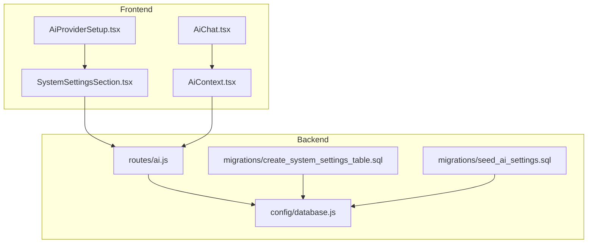
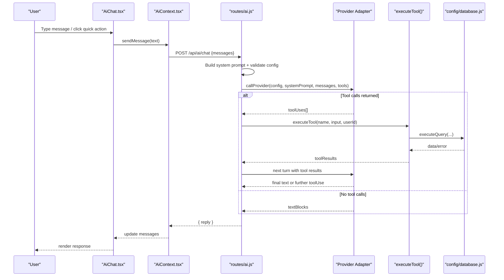
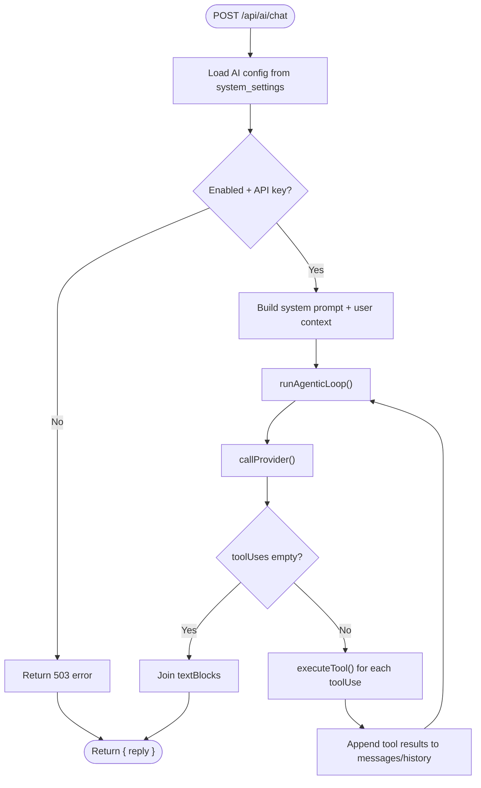
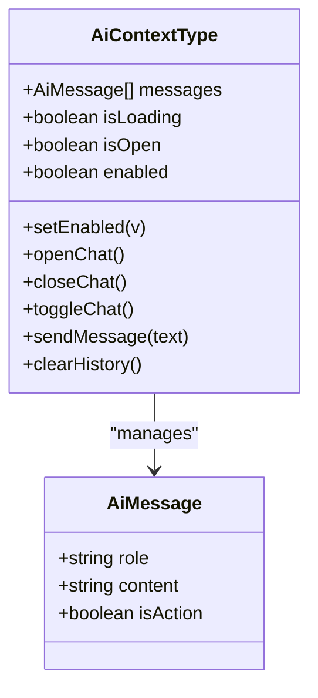
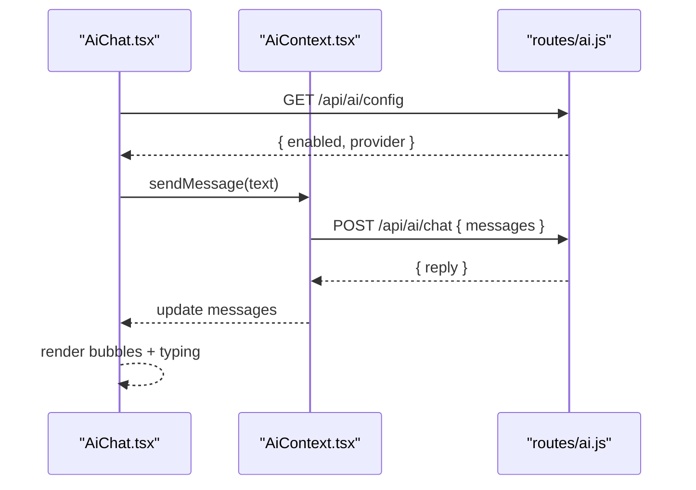
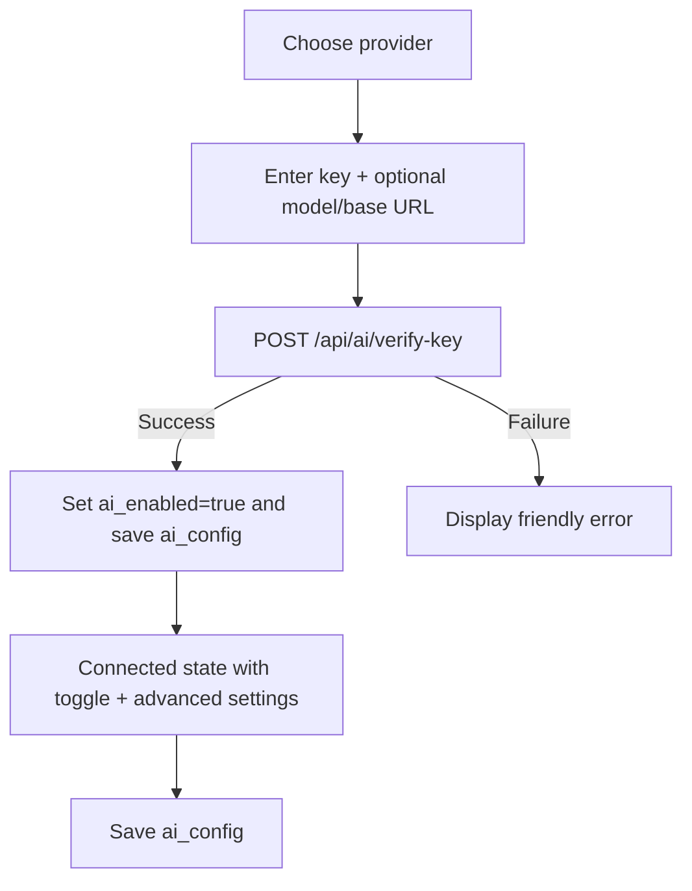
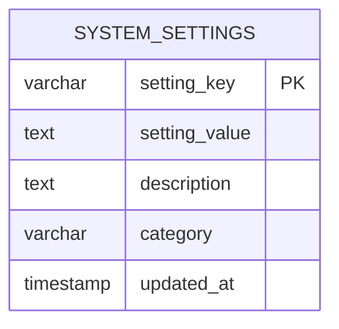
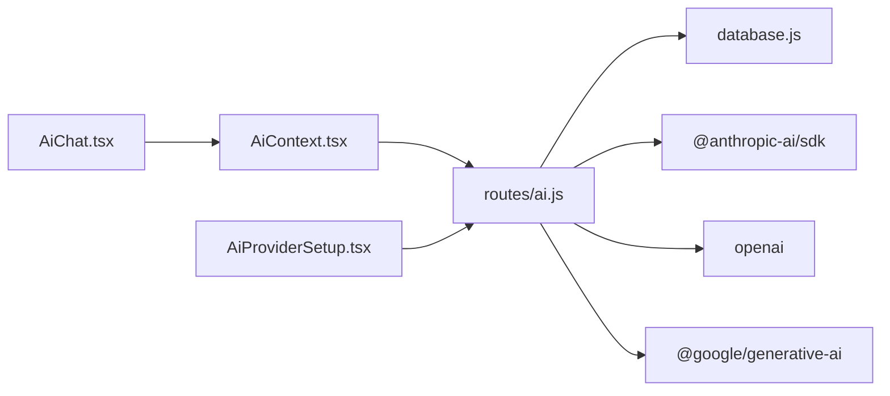

# AI Integration & Assistance

## Table of Contents
1. [Introduction](#introduction)
2. [Project Structure](#project-structure)
3. [Core Components](#core-components)
4. [Architecture Overview](#architecture-overview)
5. [Detailed Component Analysis](#detailed-component-analysis)
6. [Dependency Analysis](#dependency-analysis)
7. [Performance Considerations](#performance-considerations)
8. [Troubleshooting Guide](#troubleshooting-guide)
9. [Conclusion](#conclusion)
10. [Appendices](#appendices)

## Introduction
This document explains the AI Integration and Assistance features of the system. It covers provider configuration for OpenAI, Anthropic, and Gemini, the AI chat system architecture, conversation and context handling, assistant integration patterns, prompt engineering, response processing, settings management, provider switching, AI-powered workflows, and operational considerations such as cost management, usage tracking, and security.

## Project Structure
The AI integration spans backend and frontend components:
- Backend exposes REST endpoints for chat, configuration retrieval, and key verification, and orchestrates provider-specific LLM calls with tool-use.
- Frontend provides a chat widget, a settings UI for provider selection and configuration, and a React context to manage conversation state.

## Core Components
- Backend AI route: Provides chat, configuration retrieval, and key verification; implements provider adapters and an agentic loop with tool execution.
- Frontend AiContext: Manages conversation state, loading, and sends messages to the backend.
- AiChat: Renders the floating chat UI, quick actions, and message bubbles.
- AiProviderSetup: Guides administrators through selecting a provider, entering credentials, verifying connectivity, and saving settings.
- SystemSettingsSection: Declares AI settings keys and ensures their presence in the system settings store.

## Architecture Overview
The AI assistant is a narrow, tool-augmented agent scoped to asset and issue domains. It uses a shared system prompt plus user context, then decides whether to respond directly or execute tools to fetch or mutate data.

## Detailed Component Analysis

### Backend AI Route: Providers, Tools, and Agentic Loop
- Configuration retrieval reads system settings for provider, API key, model, base URL, and optional system prompt.
- Default models are provided per provider.
- Tool definitions enumerate capabilities scoped to the asset management domain.
- Tool executor maps tool names to database queries, enforcing user ownership and safety checks.
- Provider adapters normalize responses into a shared shape for the agentic loop:
  - Anthropic: uses messages with tool_use/tool_result blocks.
  - OpenAI: preserves tool_calls and tool_call_id semantics.
  - Gemini: reconstructs chat history and extracts functionCall/text.
- Agentic loop enforces a maximum iteration count, appending tool results appropriately per provider, and returns the final text response.

### Frontend AiContext: Conversation State and Message Flow
- Maintains messages, loading state, visibility, and enables/disables the assistant.
- Sends user messages to the backend and appends assistant replies.
- Exposes open/close/toggle/clear helpers and a setEnabled hook for settings updates.

### AiChat: UI, Quick Actions, and Rendering
- Renders a floating chat panel with message bubbles, typing indicators, and quick-action chips.
- Fetches AI availability via GET /api/ai/config and conditionally renders.
- Supports clearing conversation history and sending messages via the context.

### AiProviderSetup: Provider Selection, Verification, and Settings
- Guides administrators through choosing a provider (Anthropic, OpenAI, Gemini, or OpenAI-compatible), obtaining keys, and verifying connectivity.
- On successful verification, auto-enables the assistant and persists settings under category ai_config.
- Provides advanced settings: model override, base URL (for compatible providers), and custom system prompt.

### Settings Management and Persistence
- System settings are stored in a single table keyed by setting_key with category ai_config for AI-related keys.
- The settings section ensures AI keys exist and initializes defaults if missing.
- Seed migration inserts default AI settings with category ai_config.

## Dependency Analysis
- Backend depends on a unified database abstraction for executing queries inside tool execution.
- Provider adapters depend on official SDKs for Anthropic, OpenAI, and Gemini.
- Frontend depends on the backend API for chat, configuration, and key verification.

## Performance Considerations
- Iteration cap: The agentic loop limits tool-use iterations to prevent long-running cycles.
- Token limits: Provider adapters specify max tokens; tune model and system prompt length to fit provider constraints.
- Network latency: Provider calls are synchronous in the loop; consider caching frequent reads and minimizing tool calls when possible.
- Database queries: Tool execution runs per tool; ensure indexes on user-scoped lookup columns (e.g., assigned assets, reported issues).

## Troubleshooting Guide
- AI disabled or unconfigured: The backend returns a 503 when ai_enabled is false or when the API key is missing.
- Invalid API key or rate limits: The verification endpoint surfaces clear messages for unauthorized, model not found, and quota/rate limit errors.
- Tool execution failures: Tool executor logs errors and returns structured error payloads; the assistant responds with a friendly message.
- Provider mismatch: Ensure the selected provider matches the adapter path and that model/base URL align with the chosen provider.

## Conclusion
The AI Integration delivers a secure, configurable assistant that stays narrowly scoped to asset and issue workflows. Administrators can easily switch providers, customize prompts, and verify keys. Users benefit from a responsive chat interface with quick actions. The system’s modular design supports future expansion with additional tools and providers while maintaining strong separation of concerns between frontend UX and backend orchestration.

## Appendices

### AI Provider Configuration Options
- ai_enabled: Boolean toggle for assistant activation.
- ai_provider: One of anthropic, openai, gemini, openai_compatible.
- ai_api_key: Provider API key.
- ai_model: Optional model override; blank uses provider default.
- ai_base_url: Required for openai_compatible providers (e.g., self-hosted or third-party).
- ai_system_prompt: Optional prefix appended to the built-in system prompt.

### AI Tools and Capabilities
- get_my_assets: List assets assigned to the current user.
- get_my_issues: List issues reported by the user, with optional status filter.
- get_issue_detail: Retrieve a specific issue by ID.
- create_issue: File a new issue with title, description, priority, optional asset_id, and category.
- get_my_asset_requests: List asset requests submitted by the user.
- create_asset_request: Submit a new asset request with name, type, category, reason, priority, and notes.
- get_issue_categories: List active issue categories.

### AI Cost Management and Usage Tracking
- The system does not implement internal token or cost accounting. To monitor costs:
  - Use provider dashboards (Anthropic, OpenAI, Gemini) to review usage and billing.
  - Consider adding metering at the provider adapter level if precise tracking is required.
  - For self-hosted or compatible endpoints, configure quotas upstream and surface alerts.

### Security and Compliance Considerations
- Access control: All chat requests require authentication; tool execution filters by user ownership.
- Least privilege: Tool execution queries restrict data access to the requesting user.
- Secret handling: API keys are stored in system settings; avoid logging raw keys and sanitize UI displays.
- Content filtering: The assistant is narrowly scoped to asset/issue domains; consider adding explicit content policy checks if broader topics are introduced.
- Transport security: Enforce HTTPS for production deployments and secure key transmission.

### Example Workflows
- Issue filing flow:
  1. User asks to report a problem.
  2. Assistant collects device assignment, detailed description, and priority.
  3. Assistant confirms submission and calls create_issue.
  4. Assistant returns success with issue ID and status.
- Asset request flow:
  1. User requests a new device.
  2. Assistant collects name/type/category/reason/priority.
  3. Assistant confirms submission and calls create_asset_request.
  4. Assistant returns success with request ID and status.

- `backend/routes/ai.js:211-230`
