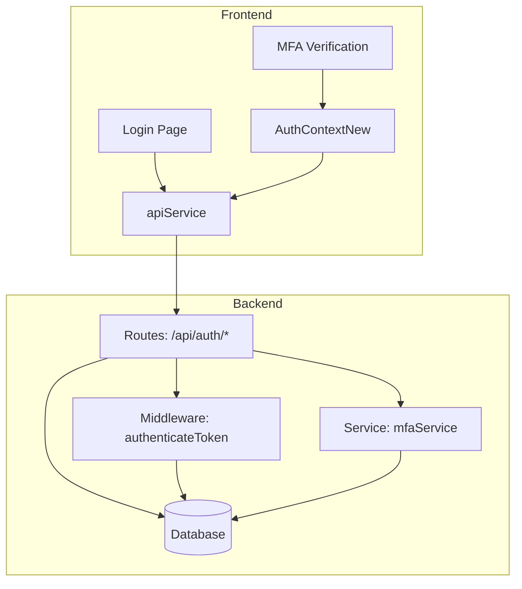
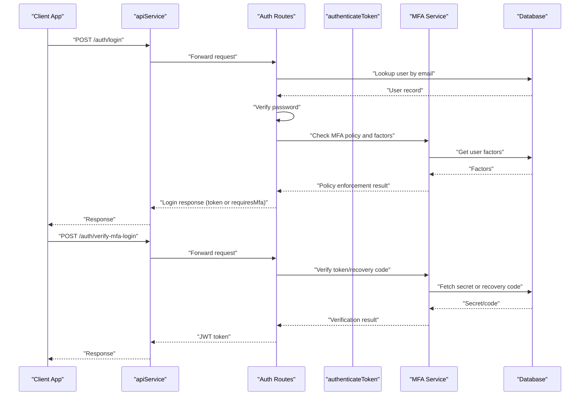
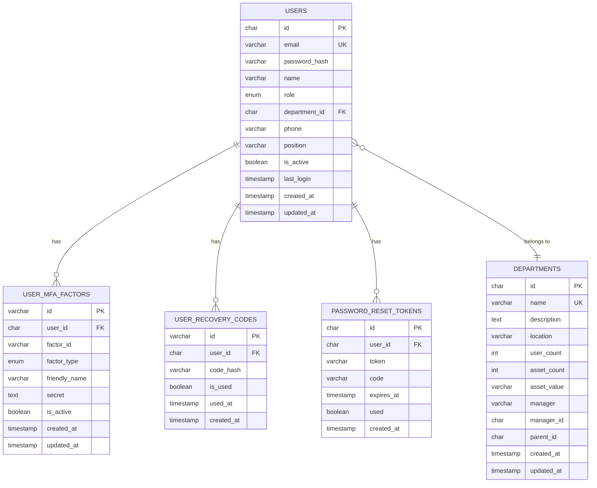
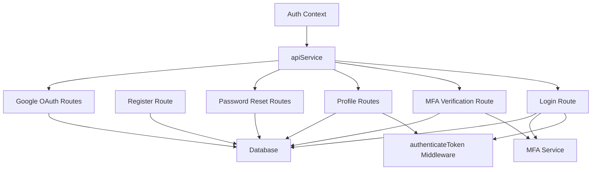

# Authentication Endpoints

## Table of Contents
1. [Introduction](#introduction)
2. [Project Structure](#project-structure)
3. [Core Components](#core-components)
4. [Architecture Overview](#architecture-overview)
5. [Detailed Component Analysis](#detailed-component-analysis)
6. [Dependency Analysis](#dependency-analysis)
7. [Performance Considerations](#performance-considerations)
8. [Troubleshooting Guide](#troubleshooting-guide)
9. [Conclusion](#conclusion)

## Introduction
This document provides comprehensive API documentation for authentication endpoints in the assets management system. It covers login, logout, registration, password reset, and MFA verification flows. The documentation includes HTTP methods, request/response schemas, JWT token handling, session management, error responses, authentication middleware requirements, token expiration, refresh token mechanisms, and security headers. It also provides examples of successful authentication flows, error scenarios, and client implementation patterns for token storage and renewal.

## Project Structure
The authentication system spans backend routes, middleware, services, and frontend components:
- Backend routes define the authentication endpoints and orchestrate business logic.
- Middleware enforces authentication and authorization.
- Services encapsulate reusable logic for MFA and password reset.
- Frontend context and API service manage client-side token storage, request interception, and error handling.

## Core Components
- Authentication Routes: Define endpoints for login, logout, registration, MFA verification, profile management, password reset, and Google OAuth.
- Authentication Middleware: Validates JWT tokens, supports temporary MFA setup tokens, and enforces account activation checks.
- MFA Service: Manages TOTP secrets, QR codes, factor activation, recovery codes, and verification.
- Frontend Auth Context: Handles token persistence, request interception, automatic redirection on token expiry, and MFA flows.
- Database Schema: Defines users, MFA factors, recovery codes, and password reset tokens.

## Architecture Overview
The authentication architecture integrates frontend and backend components:
- Frontend uses an Axios instance with interceptors to attach Authorization headers and handle token expiry.
- Backend routes enforce authentication via middleware and delegate MFA and password reset logic to services.
- Database stores user credentials, MFA factors, recovery codes, and password reset tokens.

## Detailed Component Analysis

### Authentication Endpoints

#### POST /api/auth/login
- Purpose: Authenticate users with email and password.
- Request Body:
  - email: string (required)
  - password: string (required)
- Response (Success):
  - message: string
  - user: object (includes id, email, name, role, department_id, phone, position, created_at, updated_at)
  - token: string (JWT)
  - requiresMfa: boolean (optional)
  - requiresMfaSetup: boolean (optional)
  - tempToken: string (optional)
  - userId: string (optional)
- Response (Errors):
  - 400: Validation failed
  - 401: Invalid credentials or account deactivated
  - 500: Login failed

Security and Behavior:
- Validates credentials against hashed passwords.
- Enforces MFA policy and checks user factors.
- Supports temporary MFA setup token for policy-driven setup.
- Updates last_login on successful login.

#### POST /api/auth/register
- Purpose: Self-register a new user with role forced to 'user'.
- Request Body:
  - email: string (required)
  - password: string (required)
  - name: string (required)
  - position: string (required)
  - department_id: string (required)
  - phone: string (optional)
  - role: string (ignored)
- Response (Success):
  - message: string
  - user: object (includes id, email, name, role, department_id, phone, position, created_at)
  - token: string (JWT)
- Response (Errors):
  - 400: Validation failed or user already exists
  - 500: Registration failed

Security and Behavior:
- Hashes password before storing.
- Generates UUID for user ID.
- Sends welcome notifications and emails.
- Logs registration events.

#### POST /api/auth/verify-mfa-login
- Purpose: Verify MFA token or recovery code during login.
- Request Body:
  - userId: string (required)
  - factorId: string (required)
  - token: string (required)
- Response (Success):
  - message: string
  - user: object (includes id, email, name, role, department_id, phone, position, created_at, updated_at)
  - token: string (JWT)
- Response (Errors):
  - 400: Validation failed or invalid MFA token
  - 404: User not found
  - 500: MFA verification failed

Security and Behavior:
- Supports recovery code verification via factorId='recovery-code'.
- Verifies TOTP tokens with time window tolerance.
- Generates JWT upon successful verification.

#### POST /api/auth/mfa-factors-for-login
- Purpose: Retrieve active MFA factors for a given user (no auth required).
- Request Body:
  - userId: string (required)
- Response (Success):
  - factors: array of objects (id, type, friendlyName, status)
- Response (Errors):
  - 500: Failed to get MFA factors

Security and Behavior:
- Used by frontend to pre-load available factors during login.

#### GET /api/auth/profile
- Purpose: Fetch current user profile.
- Authentication: Required (Bearer token).
- Response (Success):
  - user: object (includes id, email, name, role, department_id, phone, position, is_active, last_login, created_at, updated_at, department_name)
- Response (Errors):
  - 404: User not found
  - 500: Failed to fetch profile

Security and Behavior:
- Protected by authenticateToken middleware.

#### PUT /api/auth/profile
- Purpose: Update current user profile.
- Authentication: Required (Bearer token).
- Request Body:
  - name: string (optional)
  - phone: string (optional)
  - position: string (optional)
  - department_id: string (optional)
  - email: string (optional)
- Response (Success):
  - message: string
  - user: object (updated profile)
- Response (Errors):
  - 400: Validation failed or email already in use
  - 404: User not found
  - 500: Profile update failed

Security and Behavior:
- Validates uniqueness of email if changed.
- Logs profile updates.

#### PUT /api/auth/change-password
- Purpose: Change password with current password verification.
- Authentication: Required (Bearer token).
- Request Body:
  - currentPassword: string (required)
  - newPassword: string (required)
- Response (Success):
  - message: string
- Response (Errors):
  - 400: Invalid current password or validation failed
  - 404: User not found
  - 500: Password update failed

Security and Behavior:
- Compares hashed passwords.
- Updates password hash on success.

#### POST /api/auth/forgot-password
- Purpose: Initiate password reset by sending a 6-digit code and a unique token.
- Request Body:
  - email: string (required)
- Response (Success):
  - message: string
- Response (Errors):
  - 400: Validation failed
  - 500: Password reset request failed

Security and Behavior:
- Checks if user exists and is active.
- Stores unique token and 6-digit code with expiry.
- Sends password reset email with code.

#### POST /api/auth/reset-password
- Purpose: Reset password using a valid token.
- Request Body:
  - token: string (required)
  - password: string (required)
- Response (Success):
  - message: string
- Response (Errors):
  - 400: Invalid or expired token
  - 500: Password reset failed

Security and Behavior:
- Validates token and expiry.
- Marks token as used after successful reset.

#### GET /api/auth/validate-reset-token
- Purpose: Validate a reset token without changing password.
- Query Parameters:
  - token: string (required)
- Response (Success):
  - valid: boolean
  - user: object (email, name)
- Response (Errors):
  - 400: Invalid or expired token
  - 500: Token validation failed

Security and Behavior:
- Returns user info for token validation UI.

#### POST /api/auth/verify-reset-code
- Purpose: Verify a 6-digit reset code.
- Request Body:
  - email: string (required)
  - code: string (6 digits, required)
- Response (Success):
  - message: string
  - user: object (email, name)
- Response (Errors):
  - 400: Invalid or expired code
  - 500: Code verification failed

Security and Behavior:
- Validates code and expiry.

#### POST /api/auth/change-password-with-code
- Purpose: Change password using a valid code.
- Request Body:
  - email: string (required)
  - code: string (6 digits, required)
  - password: string (required)
- Response (Success):
  - message: string
- Response (Errors):
  - 400: Invalid or expired code
  - 500: Password change failed

Security and Behavior:
- Validates code and expiry.
- Marks token as used after successful reset.

#### POST /api/auth/logout
- Purpose: Client-side logout (clears local storage).
- Authentication: Required (Bearer token).
- Response (Success):
  - message: string
- Response (Errors):
  - 500: Logout failed

Security and Behavior:
- Logs logout event.
- Client clears authToken and user from localStorage.

#### POST /api/auth/google/token
- Purpose: Authenticate via Google OAuth using ID token.
- Request Body:
  - credential: string (required)
- Response (Success):
  - message: string
  - token: string (JWT)
  - profile_complete: boolean
  - user: object (id, email, name, role, department_id, phone, position, avatar_url, is_active, profile_complete)
- Response (Errors):
  - 400: Missing credential
  - 403: Domain not allowed
  - 401: Account deactivated
  - 500: Google authentication failed

Security and Behavior:
- Verifies ID token against Google client ID.
- Links existing accounts or creates new ones.
- Updates last_login and logs auth events.

#### POST /api/auth/google/complete-profile
- Purpose: Complete profile for new Google-only users.
- Authentication: Required (Bearer token).
- Request Body:
  - position: string (required)
  - department_id: string (required)
  - phone: string (optional)
- Response (Success):
  - message: string
  - user: object (updated profile)
- Response (Errors):
  - 400: Validation failed
  - 500: Failed to complete profile

Security and Behavior:
- Sets profile_complete flag to true.

### Authentication Middleware Requirements
- authenticateToken:
  - Extracts Authorization header and validates JWT.
  - Supports temporary MFA setup tokens with tempMfaSetup flag.
  - Fetches user details from database for regular tokens.
  - Rejects inactive accounts.
  - Returns 401 for missing/expired/invalid tokens.

- Additional helpers:
  - requireAdmin, requireManager, authorizeRoles, requireDepartmentAccess for role-based access control.

### JWT Token Handling and Expiration
- Token Generation:
  - Login, registration, Google OAuth, and MFA verification endpoints generate JWT tokens.
  - Token payload includes userId, email, role, and optionally tempMfaSetup for temporary tokens.
- Expiration:
  - Token expiration is controlled by JWT_EXPIRES_IN environment variable (default 7 days).
- Temporary MFA Setup Tokens:
  - Generated when MFA is policy-required but user has no factors enrolled.
  - Expires after 24 hours and allows MFA setup before full login.

### Session Management and Refresh Tokens
- Session Model:
  - Stateless JWT tokens stored in localStorage on the client.
  - No server-side sessions or cookie-based sessions are implemented.
- Refresh Token Mechanism:
  - Not implemented. Clients rely on JWT expiration and manual re-authentication.

### Security Headers and Best Practices
- Authorization Header:
  - All authenticated requests must include Authorization: Bearer <token>.
- CORS and Credentials:
  - Axios instance configured with withCredentials: true for cross-origin requests.
- Token Storage:
  - Client stores authToken and user in localStorage.
- Automatic Redirection:
  - On 401, client clears tokens and redirects to /login (except public auth routes).

### Client Implementation Patterns
- Frontend Authentication Flow:
  - Login: Calls authAPI.login, stores token and user, handles requiresMfa and requiresMfaSetup.
  - MFA Verification: Uses verifyMfaLogin endpoint and stores resulting token.
  - Profile Management: Uses authAPI.getProfile and authAPI.updateProfile.
  - Password Reset: Uses forgotPassword, verifyResetCode, and changePasswordWithCode endpoints.
  - Google OAuth: Uses googleLogin and completeGoogleProfile endpoints.
- Token Interception:
  - Axios interceptor automatically attaches Authorization header.
  - On 401, interceptor clears tokens and redirects to /login.

### Database Models and Relationships

## Dependency Analysis

## Performance Considerations
- Token Expiration: Configure JWT_EXPIRES_IN appropriately to balance security and user experience.
- MFA Verification: TOTP verification includes a time window to mitigate clock skew.
- Database Indexes: Ensure proper indexing on users, MFA factors, and reset tokens for fast lookups.
- Email Delivery: Asynchronous notifications and emails prevent blocking authentication requests.

## Troubleshooting Guide
Common Error Scenarios and Resolutions:
- Invalid Credentials:
  - Symptom: 401 Unauthorized on login.
  - Resolution: Verify email/password; ensure account is active.
- Expired Tokens:
  - Symptom: 401 Unauthorized on protected routes.
  - Resolution: Re-authenticate; client automatically clears tokens and redirects.
- MFA Failures:
  - Symptom: 400 Invalid MFA token.
  - Resolution: Regenerate TOTP, ensure device time synchronization, or use recovery code.
- MFA Setup Required:
  - Symptom: requiresMfaSetup flag with tempToken.
  - Resolution: Complete MFA setup within 24 hours using tempToken.
- Password Reset Issues:
  - Symptom: 400 Invalid or expired token/code.
  - Resolution: Request a new reset link/code; verify expiry times.

## Conclusion
The authentication system provides robust endpoints for login, registration, MFA verification, and password reset, integrated with JWT-based stateless sessions and comprehensive frontend client handling. The design emphasizes security through token expiration, MFA enforcement, and secure password handling while maintaining a smooth user experience through temporary MFA setup tokens and seamless client-side token management.
