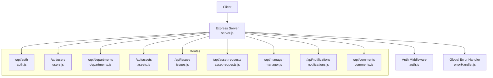
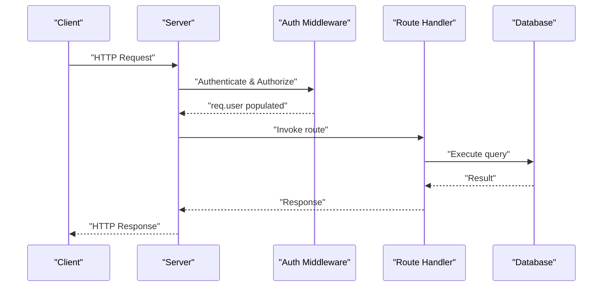
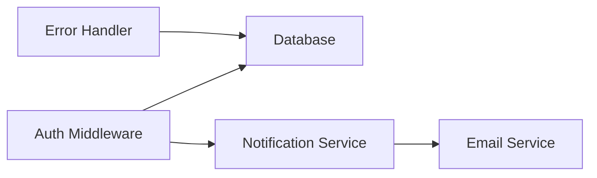

# API Reference & Endpoints

## Table of Contents
1. [Introduction](#introduction)
2. [Project Structure](#project-structure)
3. [Core Components](#core-components)
4. [Architecture Overview](#architecture-overview)
5. [Detailed Component Analysis](#detailed-component-analysis)
6. [Dependency Analysis](#dependency-analysis)
7. [Performance Considerations](#performance-considerations)
8. [Troubleshooting Guide](#troubleshooting-guide)
9. [Conclusion](#conclusion)
10. [Appendices](#appendices)

## Introduction
This document provides comprehensive API documentation for the Assets Management System backend. It covers all REST endpoints, including HTTP methods, URL patterns, request/response schemas, authentication, authorization, validation rules, error handling, and operational characteristics such as rate limiting and security. The API is organized into logical categories: Authentication, User Management, Department Management, Asset Management, Issue Tracking, Asset Requests, Manager Functions, Notifications, Comments, and Administrative functions.

## Project Structure
The backend is implemented as an Express.js server with modular route handlers grouped by domain. Middleware enforces authentication, authorization, and global error handling. Routes are mounted under `/api/*` with a health check exposed at `/health`. Public endpoints include a departments listing and a manual admin-triggered weekly summary.

## Core Components
- Authentication and Authorization
  - JWT-based bearer tokens validated by middleware.
  - Role-based access control: admin, manager, user.
  - Temporary MFA setup token support for policy-compliant users.
- Rate Limiting
  - Configurable window and max requests via environment variables.
- Security
  - Helmet protection, CORS configuration, body size limits, Morgan logging.
- Error Handling
  - Centralized error handler normalizes database and validation errors.
- Pagination
  - Consistent pagination utilities applied across list endpoints.

## Architecture Overview
The API follows a layered architecture:
- Entry points: server mounts routes and middleware.
- Authentication: middleware validates JWT and enriches requests with user context.
- Authorization: route-level guards enforce roles and department-scoped access.
- Persistence: route handlers execute queries against the database.
- Notifications: services emit in-app and email notifications for lifecycle events.

## Detailed Component Analysis

### Authentication Endpoints
- Base Path: `/api/auth`
- Methods and Paths
  - POST /api/auth/register
    - Purpose: Self-registration for new users.
    - Auth: None.
    - Validation: email, password (min length), name, position, department_id.
    - Response: user object and JWT token.
    - Notes: Role is forced to 'user'; duplicate email prevented.
  - POST /api/auth/login
    - Purpose: Standard login with optional MFA enforcement.
    - Auth: None.
    - Validation: email, password.
    - Response: user object and token; may require MFA verification.
    - MFA: Policy-driven; may return requiresMfa flag or temporary token for setup.
  - POST /api/auth/verify-mfa-login
    - Purpose: Finalize login with MFA token.
    - Auth: None.
    - Validation: userId, factorId, token.
    - Response: user object and JWT token.
  - POST /api/auth/mfa-factors-for-login
    - Purpose: Retrieve active MFA factors for a given user.
    - Auth: None.
    - Validation: userId.
    - Response: factors list.
  - GET /api/auth/profile
    - Purpose: Fetch current user profile.
    - Auth: Bearer token required.
    - Response: user object with department name.
  - PUT /api/auth/profile
    - Purpose: Update current user profile.
    - Auth: Bearer token required.
    - Validation: Optional fields with sanitization; email uniqueness enforced.
    - Response: Updated user object.
  - PUT /api/auth/change-password
    - Purpose: Change current password.
    - Auth: Bearer token required.
    - Validation: currentPassword, newPassword (min length).
    - Response: Success message.
  - POST /api/auth/forgot-password
    - Purpose: Initiate password reset workflow.
    - Auth: None.
    - Validation: email.
    - Response: Generic success message (security-focused).
  - POST /api/auth/reset-password
    - Purpose: Submit reset code/token to finalize password reset.
    - Auth: None.
    - Validation: email, reset code, new password.
    - Response: Success message.

- Request/Response Examples
  - Login (success):
    - Request: { email, password }
    - Response: { message, user, token }
  - Register (success):
    - Request: { email, password, name, position, department_id }
    - Response: { message, user, token }
  - Profile update (success):
    - Request: { name?, email?, phone?, position?, department_id? }
    - Response: { message, user }

- Validation Rules
  - Email format enforced.
  - Password minimum lengths enforced.
  - Unique constraints checked (email, serial number).
  - Role and department ID UUID validation for admin operations.

- Error Handling
  - Validation failures return 400 with details.
  - Authentication failures return 401 with explicit messages.
  - Duplicate entries return 400 with duplicate message.
  - Token expiration returns 401.

### User Management Endpoints
- Base Path: `/api/users`
- Methods and Paths
  - GET /api/users/
    - Purpose: List users with filters and pagination.
    - Auth: Bearer token required.
    - Filters: search, role, roles (comma-separated), department_id, notInDepartment.
    - Response: Array of users with pagination metadata.
  - GET /api/users/history
    - Purpose: Admin-only user activity summary.
    - Auth: Bearer token + admin required.
    - Filters: search, role, department_id.
    - Response: Array of users with counts and last activity timestamps.
  - GET /api/users/:id/history
    - Purpose: Admin-only detailed user history.
    - Auth: Bearer token + admin required.
    - Response: User plus arrays of assignments, reported issues, assigned issues, asset requests, issue events.
  - GET /api/users/:id
    - Purpose: Get user by ID.
    - Auth: Bearer token required.
    - Response: User object with department name.
  - POST /api/users/
    - Purpose: Create user (admin only).
    - Auth: Bearer token + admin required.
    - Validation: email, password, name, role (admin/manager/user), optional department_id UUID.
    - Response: Created user object.
  - PUT /api/users/:id
    - Purpose: Update user (admin or self with restrictions).
    - Auth: Bearer token + admin or self.
    - Restrictions: Non-admins cannot change role or department.
    - Response: Updated user object.
  - DELETE /api/users/:id
    - Purpose: Delete user (admin only).
    - Auth: Bearer token + admin required.
    - Restrictions: Cannot delete self.
    - Response: Success message.
  - PUT /api/users/:id/password
    - Purpose: Admin sets new password for a user.
    - Auth: Bearer token + admin required.
    - Validation: newPassword.
    - Response: Success message.

- Request/Response Examples
  - List users:
    - Query: page, limit, search, role, roles, department_id, notInDepartment
    - Response: { users[], pagination }
  - Create user (success):
    - Request: { email, password, name, role, department_id?, phone?, position? }
    - Response: { message, user }

- Validation Rules
  - Role must be one of admin/manager/user for admin-managed updates.
  - Department ID must be a valid UUID when provided.
  - Email uniqueness enforced.

- Error Handling
  - 403 for insufficient permissions.
  - 400 for invalid updates or duplicates.
  - 404 for not found.

### Department Management Endpoints
- Base Path: `/api/departments`
- Methods and Paths
  - GET /api/departments/
    - Purpose: List departments with filters and pagination.
    - Auth: Public (no token).
    - Filters: search.
    - Response: Array of departments with manager, user_count, asset_count, asset_value.
  - GET /api/departments/:id
    - Purpose: Get department by ID.
    - Auth: Public (no token).
    - Response: Department object with computed metrics.
  - POST /api/departments/
    - Purpose: Create department (manager/admin only).
    - Auth: Bearer token + manager required.
    - Validation: name (min length), optional description/location/manager_id (UUID), optional parent_id (UUID).
    - Response: Created department object.
  - PUT /api/departments/:id
    - Purpose: Update department (manager/admin only).
    - Auth: Bearer token + manager required.
    - Validation: Optional fields with UUID checks.
    - Response: Updated department object.
  - DELETE /api/departments/:id
    - Purpose: Delete department (admin only).
    - Auth: Bearer token + admin required.
    - Response: Success message.

- Request/Response Examples
  - List departments:
    - Query: page, limit, search
    - Response: { departments[], pagination }

- Validation Rules
  - Name uniqueness enforced.
  - UUID format enforced for manager_id and parent_id.

- Error Handling
  - 403 for insufficient permissions.
  - 400 for invalid UUIDs or duplicates.
  - 404 for not found.

### Asset Management Endpoints
- Base Path: `/api/assets`
- Methods and Paths
  - GET /api/assets/
    - Purpose: List assets with filters and pagination.
    - Auth: Bearer token required.
    - Filters: search, status, type, department_id, assigned_to, notInDepartment.
    - Response: Array of assets with assigned user and department name.
  - GET /api/assets/history/summary
    - Purpose: Asset activity summary with counts and last activity.
    - Auth: Bearer token required.
    - Filters: search, status, type, department_id.
    - Response: Array of assets with counts and last activity timestamps.
  - GET /api/assets/history
    - Purpose: Unified asset history across assignments and issues.
    - Auth: Bearer token required.
    - Filters: asset_id, owner_id, entry_type, event_type (comma-separated), search, start_date, end_date.
    - Response: Array of history entries with pagination.
  - GET /api/assets/:id/history
    - Purpose: Detailed asset history (assignments and issues).
    - Auth: Bearer token required.
    - Response: Asset plus arrays of assignments and issue events.
  - GET /api/assets/:id
    - Purpose: Get asset by ID.
    - Auth: Bearer token required.
    - Response: Asset object with related names.
  - POST /api/assets/
    - Purpose: Create asset with optional image upload.
    - Auth: Bearer token required.
    - Validation: name/type/serial_number (min length), purchase_price/current_value (>=0), status, condition, optional dates.
    - Response: Created asset object.
  - PUT /api/assets/:id
    - Purpose: Update asset (limited fields).
    - Auth: Bearer token required.
    - Validation: Optional fields with enums.
    - Response: Updated asset object.
  - DELETE /api/assets/:id
    - Purpose: Delete asset (admin only).
    - Auth: Bearer token + admin required.
    - Response: Success message.

- Request/Response Examples
  - List assets:
    - Query: page, limit, search, status, type, department_id, assigned_to
    - Response: { assets[], pagination }

- Validation Rules
  - Serial number uniqueness enforced.
  - Status and condition enums enforced.
  - Date conversion to YYYY-MM-DD performed.

- Error Handling
  - 403 for insufficient permissions.
  - 400 for validation or duplicates.
  - 404 for not found.

### Issue Tracking Endpoints
- Base Path: `/api/issues`
- Methods and Paths
  - GET /api/issues/
    - Purpose: List issues with filters and pagination.
    - Auth: Bearer token required.
    - Filters: search, status, priority, department_id, assigned_to, asset_id, reported_by, includeCostSummary (admin-only).
    - Response: Array of issues with pagination; optionally includes cost summary for admins.
  - GET /api/issues/:id
    - Purpose: Get issue by ID with comments and attachments metadata.
    - Auth: Bearer token required.
    - Response: Issue object with related names and metadata lists.
  - POST /api/issues/
    - Purpose: Create issue (user only).
    - Auth: Bearer token required.
    - Validation: title, description, asset_id (optional), category, priority, estimated_cost (admin-only).
    - Response: Created issue object.
  - PUT /api/issues/:id
    - Purpose: Update issue (user or admin depending on field).
    - Auth: Bearer token required.
    - Validation: Depends on field updates; admin can modify cost and status.
    - Response: Updated issue object.
  - DELETE /api/issues/:id
    - Purpose: Delete issue (admin only).
    - Auth: Bearer token + admin required.
    - Response: Success message.

- Request/Response Examples
  - List issues:
    - Query: page, limit, search, status, priority, department_id, assigned_to, asset_id, reported_by, includeCostSummary
    - Response: { issues[], pagination, cost_summary? }

- Validation Rules
  - Priority and status enums enforced.
  - Estimated cost admin-only for creation/update.
  - Cost parsing supports null/empty/number.

- Error Handling
  - 403 for insufficient permissions.
  - 400 for invalid cost or validation.
  - 404 for not found.

### Asset Requests Endpoints
- Base Path: `/api/asset-requests`
- Methods and Paths
  - GET /api/asset-requests/
    - Purpose: List asset requests with filters and pagination.
    - Auth: Bearer token required.
    - Filters: search, status, priority, userId, includeCostSummary (admin-only).
    - Response: Array of requests with pagination; optionally includes cost summary for admins.
  - GET /api/asset-requests/:id
    - Purpose: Get asset request by ID.
    - Auth: Bearer token required.
    - Response: Asset request object with related names.
  - POST /api/asset-requests/
    - Purpose: Create asset request (user only).
    - Auth: Bearer token required.
    - Validation: asset_name, asset_type, category, reason (min length), priority, optional estimated_cost (admin-only).
    - Response: Created request object.
  - PUT /api/asset-requests/:id/user
    - Purpose: Update request by requester (pending only).
    - Auth: Bearer token required.
    - Restrictions: Only pending requests editable by requester.
    - Response: Updated request object.
  - PUT /api/asset-requests/:id
    - Purpose: Admin update (status, priority, notes, approved_by, estimated_cost).
    - Auth: Bearer token + admin required.
    - Response: Updated request object.
  - DELETE /api/asset-requests/:id/user
    - Purpose: Delete request by requester (pending only).
    - Auth: Bearer token required.
    - Restrictions: Only pending requests deletable by requester.
    - Response: Success message.
  - DELETE /api/asset-requests/:id
    - Purpose: Admin delete.
    - Auth: Bearer token + admin required.
    - Response: Success message.

- Request/Response Examples
  - List asset requests:
    - Query: page, limit, search, status, priority, userId, includeCostSummary
    - Response: { asset_requests[], pagination, cost_summary? }

- Validation Rules
  - Priority enum enforced.
  - Estimated cost admin-only for creation/update.
  - Status transitions and dates managed on approval/rejection.

- Error Handling
  - 403 for insufficient permissions.
  - 400 for invalid edits or cost.
  - 404 for not found.

### Manager Functions Endpoints
- Base Path: `/api/manager`
- Methods and Paths
  - GET /api/manager/dashboard
    - Purpose: Department dashboard metrics.
    - Auth: Bearer token + manager required.
    - Response: { department, stats: { teamMembers, assets, openIssues, pendingRequests } }
  - GET /api/manager/team
    - Purpose: Department team members with filters.
    - Auth: Bearer token + manager required.
    - Filters: search, role.
    - Response: { teamMembers[] }
  - GET /api/manager/issues
    - Purpose: Department issues with filters.
    - Auth: Bearer token + manager required.
    - Filters: search, status, priority.
    - Response: { issues[] }
  - GET /api/manager/assets
    - Purpose: Department assets with filters.
    - Auth: Bearer token + manager required.
    - Filters: search, status, type.
    - Response: { assets[] }
  - GET /api/manager/asset-requests
    - Purpose: Department asset requests with filters.
    - Auth: Bearer token + manager required.
    - Filters: search, status, priority.
    - Response: { asset_requests[] }
  - POST /api/manager/send-message
    - Purpose: Send prioritized message to a team member.
    - Auth: Bearer token + manager required.
    - Validation: receiver_id, subject, content, optional priority.
    - Response: Success with receiver info.
  - POST /api/manager/send-announcement
    - Purpose: Broadcast announcement to entire team.
    - Auth: Bearer token + manager required.
    - Validation: subject, content, optional priority.
    - Response: Success with recipient count.

- Request/Response Examples
  - Dashboard:
    - Response: { department, stats }

- Validation Rules
  - Receiver must belong to the same department.
  - Priority enum enforced.

- Error Handling
  - 403 for insufficient permissions.
  - 400 for invalid receiver or missing department.

### Notifications Endpoints
- Base Path: `/api/notifications`
- Methods and Paths
  - GET /api/notifications/
    - Purpose: Fetch user notifications with pagination and unread count.
    - Auth: Bearer token required.
    - Response: { notifications[], unreadCount, pagination }
  - PUT /api/notifications/:id/read
    - Purpose: Mark a notification as read.
    - Auth: Bearer token required.
    - Response: Success message.
  - PUT /api/notifications/mark-all-read
    - Purpose: Mark all notifications as read.
    - Auth: Bearer token required.
    - Response: Success message.
  - GET /api/notifications/unread-count
    - Purpose: Get unread notifications count.
    - Auth: Bearer token required.
    - Response: { unreadCount }
  - DELETE /api/notifications/:id
    - Purpose: Delete a notification.
    - Auth: Bearer token required.
    - Response: Success message.

- Request/Response Examples
  - Unread count:
    - Response: { unreadCount }

- Error Handling
  - 500 for internal errors.

### Comments Endpoints
- Base Path: `/api/comments`
- Methods and Paths
  - POST /api/comments/asset-requests/:assetRequestId/comments
    - Purpose: Add a comment to an asset request.
    - Auth: Bearer token required.
    - Validation: comment (required), optional parentCommentId.
    - Response: { commentId }
  - GET /api/comments/asset-requests/:assetRequestId/comments
    - Purpose: List comments for an asset request.
    - Auth: Bearer token required.
    - Response: { comments[] }
  - PUT /api/comments/asset-requests/:assetRequestId/comments/:id
    - Purpose: Update a comment.
    - Auth: Bearer token required.
    - Validation: comment (required).
    - Response: Success message.
  - DELETE /api/comments/asset-requests/:assetRequestId/comments/:id
    - Purpose: Delete a comment (admin or author).
    - Auth: Bearer token required.
    - Response: Success message.
  - GET /api/comments/comments/:id
    - Purpose: Get a single comment by ID.
    - Auth: Bearer token required.
    - Response: { comment }
  - GET /api/comments/asset-requests/:assetRequestId/comments/count
    - Purpose: Get comment count for an asset request.
    - Auth: Bearer token required.
    - Response: { count }

- Request/Response Examples
  - Add comment:
    - Request: { comment, parentCommentId? }
    - Response: { commentId }

- Error Handling
  - 403 Unauthorized for non-owners.
  - 404 for not found.

### Administrative Endpoints
- Base Path: `/api/admin`
- Methods and Paths
  - POST /api/admin/weekly-summary
    - Purpose: Manually trigger weekly summary notifications (admin only).
    - Auth: Bearer token + admin required.
    - Response: Results and stats.

- Request/Response Examples
  - Manual trigger:
    - Response: { success, message, stats?, results? }

- Error Handling
  - 403 for non-admins.
  - 500 for internal errors.

### Additional Public Endpoints
- GET /health
  - Purpose: Health check.
  - Auth: None.
  - Response: { status, timestamp, uptime, environment }

## Dependency Analysis
- Route Dependencies
  - All protected routes depend on authentication middleware.
  - Many routes depend on database query execution utilities.
  - Notifications and email services are invoked from several routes for lifecycle events.
- Middleware Coupling
  - Auth middleware centralizes token verification and user enrichment.
  - Error handler normalizes responses across routes.
- External Integrations
  - Email notifications via external services.
  - Cron-based scheduled tasks for backups and weekly summaries.

## Performance Considerations
- Pagination
  - Default and maximum limits applied consistently to prevent heavy queries.
- Query Optimization
  - Aggregated counts and computed metrics included in listings to reduce client-side computation.
- Upload Handling
  - Image uploads use memory storage with size limits; consider streaming for very large files.
- Rate Limiting
  - Configurable window and max requests to protect endpoints from abuse.

## Troubleshooting Guide
- Common Errors
  - 400 Bad Request: Validation failures or duplicate entries.
  - 401 Unauthorized: Missing/expired token or invalid credentials.
  - 403 Forbidden: Insufficient permissions or role restrictions.
  - 404 Not Found: Resource does not exist.
  - 429 Too Many Requests: Rate limit exceeded.
  - 500 Internal Server Error: Unexpected server errors.
- Logging
  - Development logs via Morgan; production logs also supported.
  - Audit logs for auth and CRUD actions.
- Monitoring
  - Health endpoint for uptime checks.
  - Cron jobs for scheduled tasks; verify logs for failures.

## Conclusion
The Assets Management System exposes a comprehensive REST API organized by functional domains with strong authentication, authorization, and validation. The API supports robust workflows for user, asset, issue, and request management, along with notifications and administrative controls. Adhering to the documented patterns ensures reliable integrations and maintainable client implementations.

## Appendices

### API Versioning
- No explicit versioning scheme is present in the server configuration or route definitions. Clients should pin to a specific base URL and treat changes as breaking until otherwise documented.

### Rate Limiting
- Configured via environment variables:
  - RATE_LIMIT_WINDOW_MS
  - RATE_LIMIT_MAX_REQUESTS
- Default behavior applies to all routes except public ones.

### Security Considerations
- Transport security: HTTPS recommended in production.
- Token storage: Store JWT securely on clients; avoid localStorage for sensitive apps.
- CORS origins: Managed via environment variables; ensure only trusted origins are whitelisted.
- Helmet: Basic protections enabled; review headers for environment-specific needs.

### Client Implementation Guidelines
- Authentication
  - Include Authorization header with Bearer token for protected routes.
  - Handle MFA login flow when required by login response.
- Pagination
  - Respect pagination fields and adjust page/limit accordingly.
- Validation
  - Validate inputs client-side to reduce server errors.
- Error Handling
  - Parse standardized error responses and surface actionable messages to users.
- Notifications
  - Poll or integrate with real-time channels for notification updates.

### Example Workflows
- User Registration
  - POST /api/auth/register with { email, password, name, position, department_id }
  - On success: receive token and user profile
- Asset Request Creation
  - POST /api/asset-requests with { asset_name, asset_type, category, reason, priority, estimated_cost? }
  - On success: receive created request; admins receive notifications
- Manager Announcement
  - POST /api/manager/send-announcement with { subject, content, priority? }
  - On success: recipients receive notifications and emails
