# Backend Architecture

## Table of Contents
1. [Introduction](#introduction)
2. [Project Structure](#project-structure)
3. [Core Components](#core-components)
4. [Architecture Overview](#architecture-overview)
5. [Detailed Component Analysis](#detailed-component-analysis)
6. [Dependency Analysis](#dependency-analysis)
7. [Performance Considerations](#performance-considerations)
8. [Troubleshooting Guide](#troubleshooting-guide)
9. [Conclusion](#conclusion)

## Introduction
This document describes the backend architecture of the Express.js server for the Assets Management System. It focuses on the MVC-like structure, middleware stack, routing organization, database abstraction, service layer patterns, error handling, authentication and authorization, request validation, security measures, and operational scalability patterns. The backend supports both MySQL/MariaDB and PostgreSQL via a unified database abstraction layer and integrates robust auditing, notifications, and MFA capabilities.

## Project Structure
The backend follows a modular, feature-based organization:
- Entry point initializes middleware, routes, and background tasks.
- Routes define API endpoints grouped by domain (authentication, users, assets, issues, notifications, etc.).
- Middleware enforces security, rate limiting, validation, and authentication.
- Services encapsulate business logic and integrate with external systems (email, notifications).
- Utilities provide reusable helpers (pagination, audit logging).
- Config defines database connection pools and environment-driven behavior.
- Database schema and migrations define the persistent model.

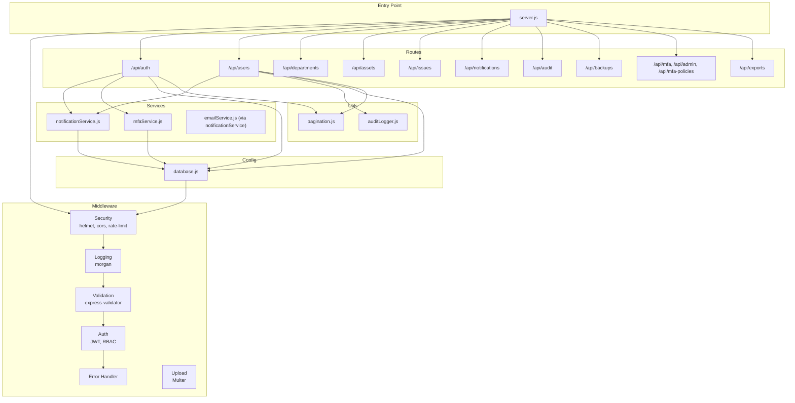

## Core Components
- Express server bootstrap and middleware pipeline
- Unified database abstraction supporting MySQL/MariaDB and PostgreSQL
- Authentication middleware with JWT and role-based access control
- Route modules organized by domain
- Service layer for notifications, MFA, and email
- Utility modules for pagination and audit logging
- Error handling middleware with environment-aware responses

Key implementation highlights:
- Security-first middleware stack: helmet, CORS, rate limiting, body parsing, logging.
- Centralized database client selection and connection pooling.
- JWT-based authentication with temporary MFA setup tokens.
- Express validators for request validation.
- Audit logging for auth, CRUD, config, and backup operations.
- Pagination sanitizer for safe cursor-based queries.

## Architecture Overview
The backend employs a layered architecture:
- Presentation Layer: Express routes define API endpoints.
- Application Layer: Middleware orchestrates security, validation, and auth.
- Domain Layer: Route handlers coordinate service calls.
- Service Layer: Encapsulates business logic and integrations.
- Persistence Layer: Unified database abstraction with connection pooling.
- Infrastructure: Email notifications, cron-based tasks, and audit logging.

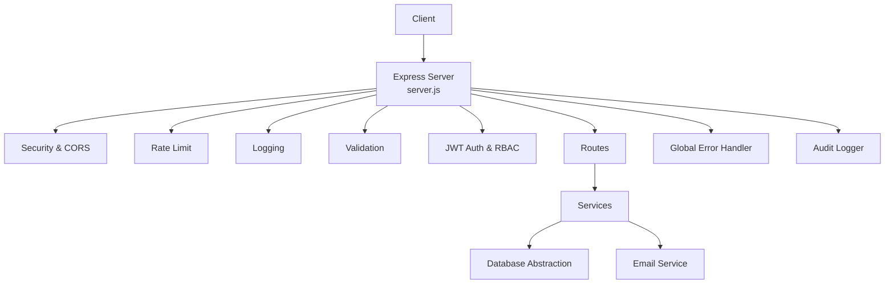

## Detailed Component Analysis

### Database Abstraction Layer
The database layer provides a unified interface for MySQL/MariaDB and PostgreSQL:
- Client selection via environment variable.
- Connection pooling with configurable limits and timeouts.
- Parameter normalization for Postgres placeholder compatibility.
- Transaction support with rollback semantics.
- Consistent result shape across clients.

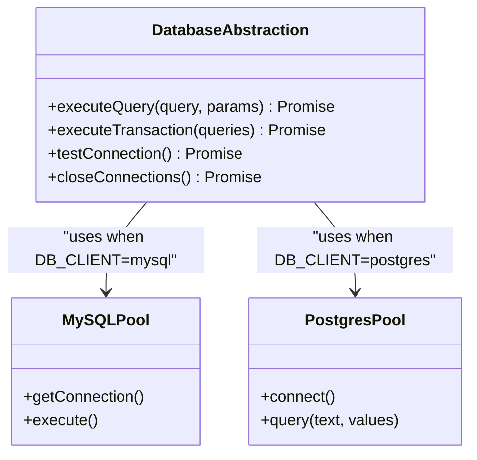

### Authentication and Authorization Middleware
Authentication middleware validates JWT tokens and enriches requests with user context. Authorization helpers enforce roles and department-level access controls. Temporary MFA setup tokens enable policy-compliant onboarding.

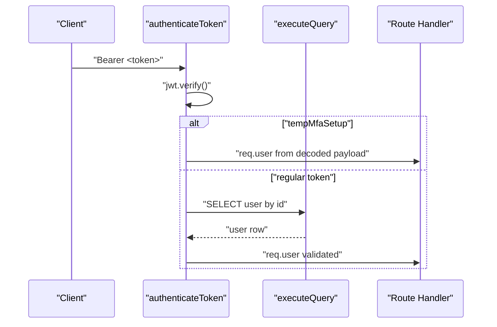

### Route Organization and Controllers
Routes are grouped by domain and mounted under protected or public prefixes. Controllers delegate to services and utilities, returning structured JSON responses. Public endpoints (e.g., departments listing) bypass auth middleware.

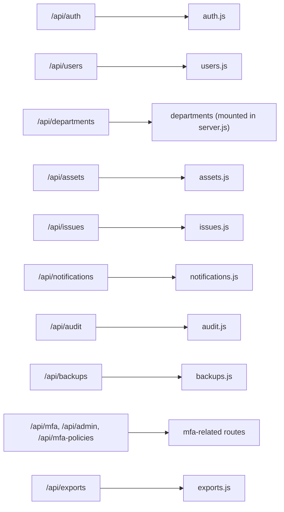

### Service Layer Patterns
- Notification service encapsulates in-app and email notifications, with HTML/text templates and parallel dispatch.
- MFA service manages TOTP secrets, QR generation, token verification, factor activation, and recovery codes.
- Both services rely on the database abstraction for persistence.

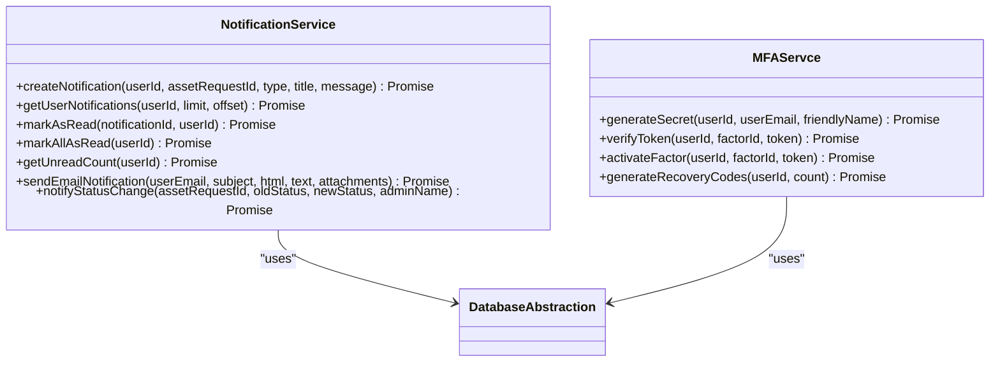

### Error Handling Strategy
A centralized error handler normalizes responses, maps database and JWT errors, and avoids leaking internal details in production. Validation errors are surfaced with structured details.

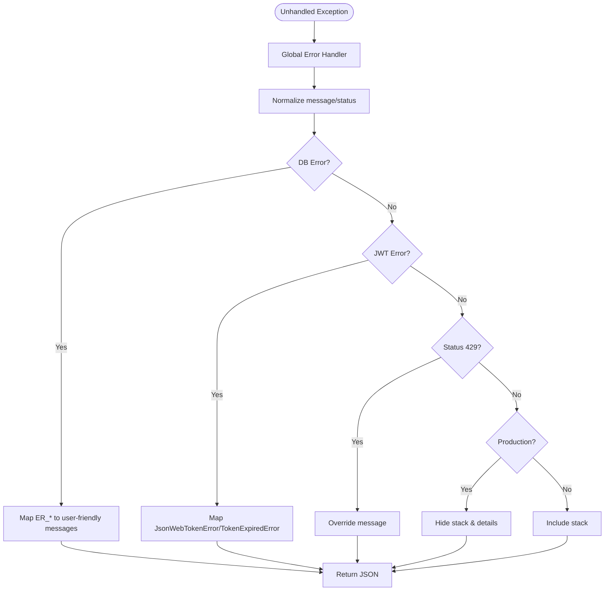

### Request Validation and Sanitization
Validation is enforced via express-validator on route handlers. Pagination sanitization ensures safe limit/page/offset computation.

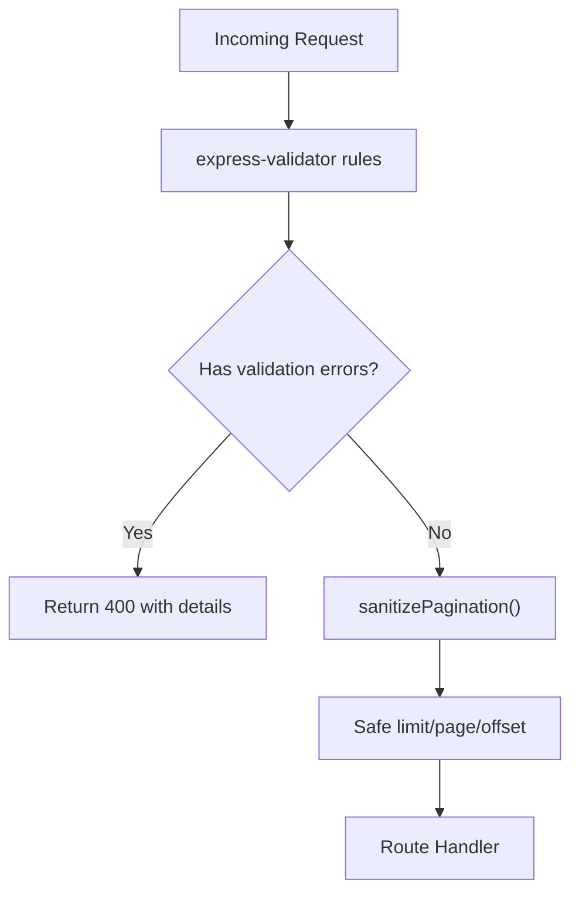

### Security Middleware Stack
Security measures include:
- Helmet for secure headers.
- CORS configured with dynamic origins and credentials support.
- Rate limiting with environment-configurable window and max requests.
- Morgan for structured logging.
- Body parsing with size limits.

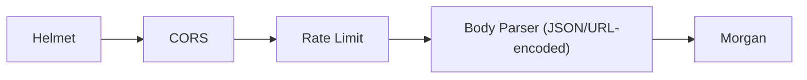

### Upload and File Handling
Multer stores files in memory with type filtering and size limits. This enables streaming to external services or local storage.

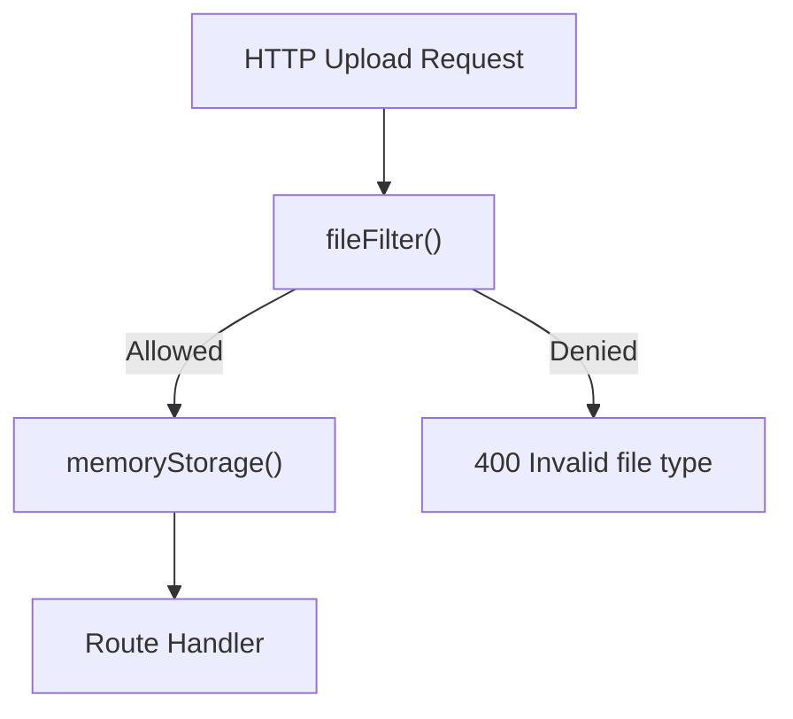

### Audit Logging
Centralized audit logger writes structured entries to the audit_logs table, supporting auth, CRUD, config, and backup events. It tolerates failures to avoid breaking the main flow.

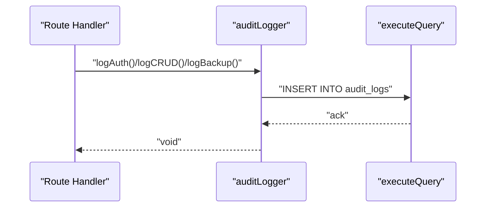

### Data Model Overview
The schema defines core entities and relationships:
- Users, Departments, Assets, Issues, Notifications, Audit Logs, Asset Requests, and related lookup tables.

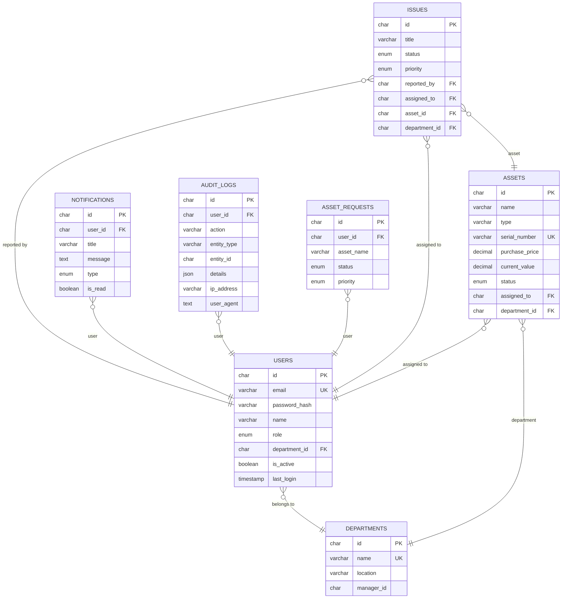

## Dependency Analysis
External dependencies include Express, helmet, cors, rate-limit, bcrypt, JWT, Morgan, Multer, mysql2/pg, node-cron, nodemailer, and others. These enable routing, security, persistence, scheduling, and communications.

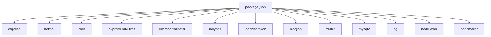

## Performance Considerations
```bash
# Connection pooling
MySQL pool defaults to 10 concurrent connections; PostgreSQL pool mirrors with similar concurrency and timeouts. Adjust via environment variables for workload characteristics.
```
- Query normalization: Postgres placeholder conversion and RETURNING id emulation reduce adapter differences.
- Pagination: sanitizePagination caps limits and computes offsets safely to prevent heavy queries.
- Logging overhead: Morgan logging is environment-aware; disable verbose logging in production if needed.
- Upload buffering: Multer memory storage avoids disk I/O for small files; consider streaming to external storage for large payloads.
- Background tasks: node-cron schedules periodic notifications and backups; ensure adequate worker resources.

## Troubleshooting Guide
Common issues and resolutions:
- Database connectivity: Use testConnection to verify pool health; check DB_CLIENT, host, port, user, password, and SSL settings.
- JWT errors: Invalid/expired tokens return 401; confirm JWT_SECRET and expiration alignment.
- Validation failures: express-validator returns structured details; review route-specific rules.
- Rate limiting: Excessive requests yield 429; adjust RATE_LIMIT_WINDOW_MS and RATE_LIMIT_MAX_REQUESTS.
- CORS errors: Confirm FRONTEND_URL(s) and credentials flag; ensure origin matches client.
- Audit logging failures: The audit logger is resilient and does not throw; check console for suppressed errors.

## Conclusion
The backend implements a clean, layered architecture with strong emphasis on security, maintainability, and scalability. The unified database abstraction, robust middleware stack, modular routes, and dedicated service layer collectively support a reliable API. Operational excellence is reinforced by comprehensive audit logging, structured error handling, and environment-driven configuration.
