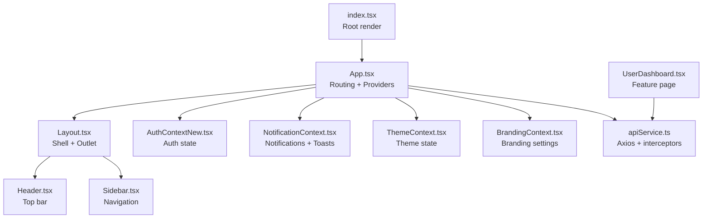
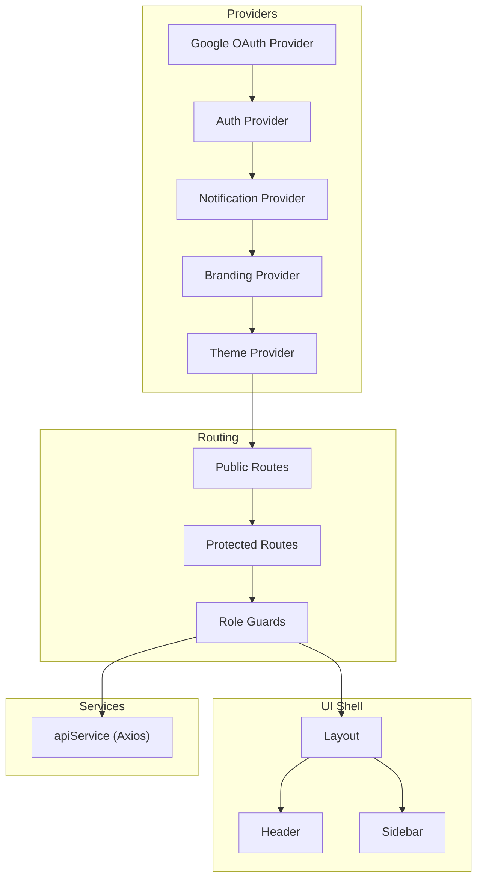
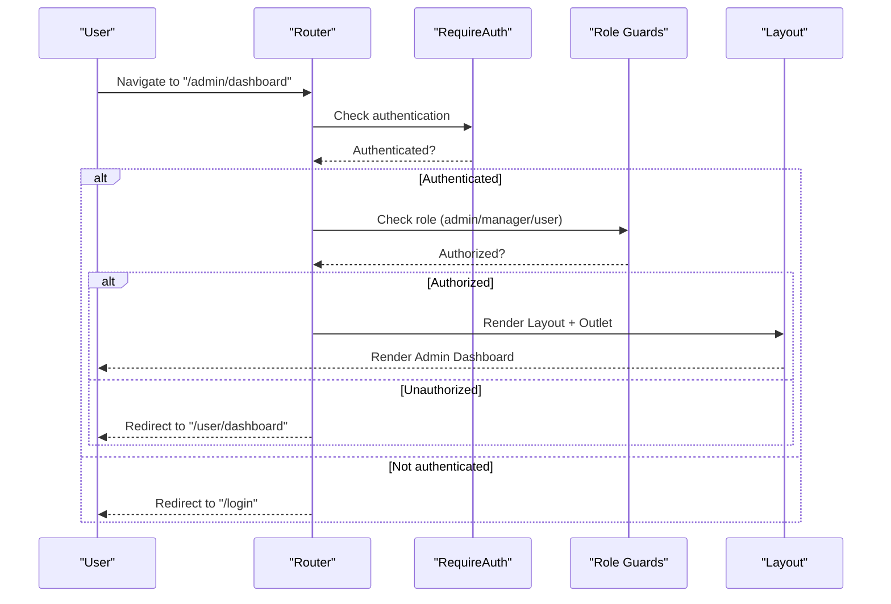
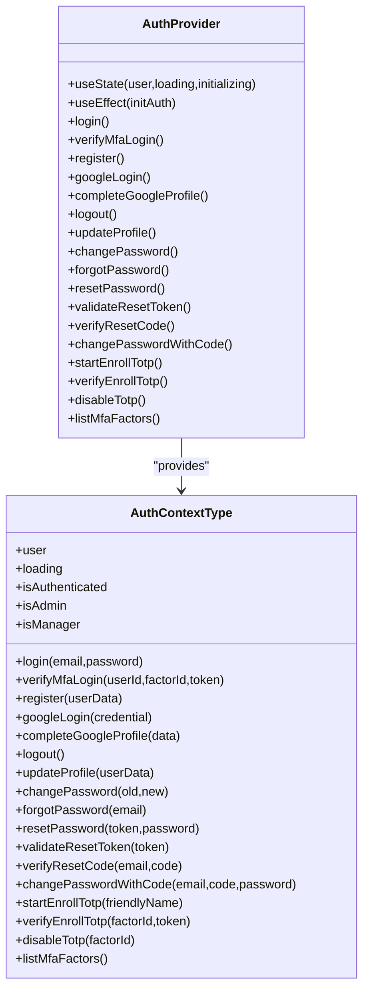
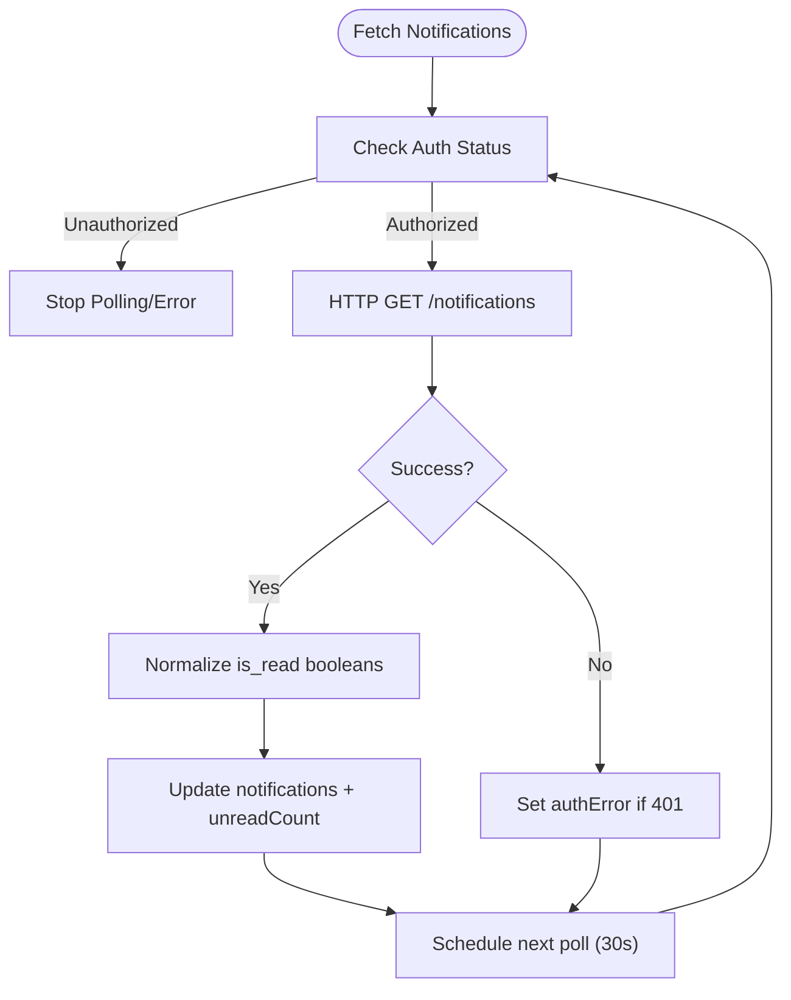
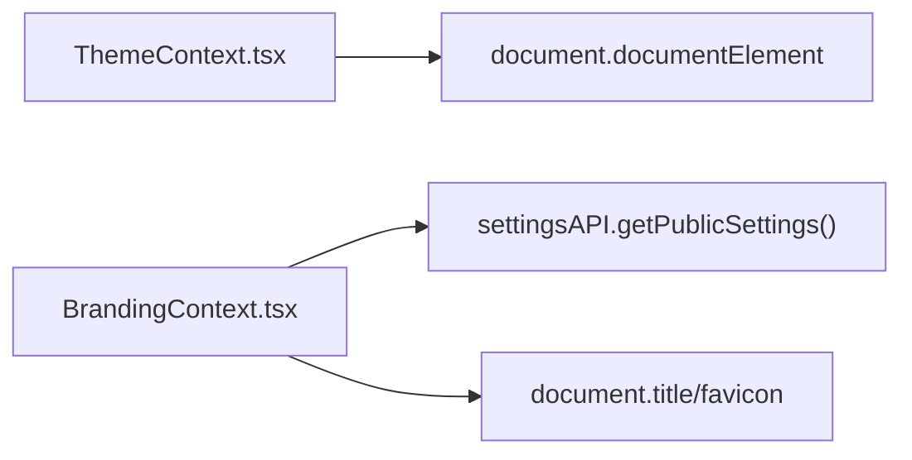
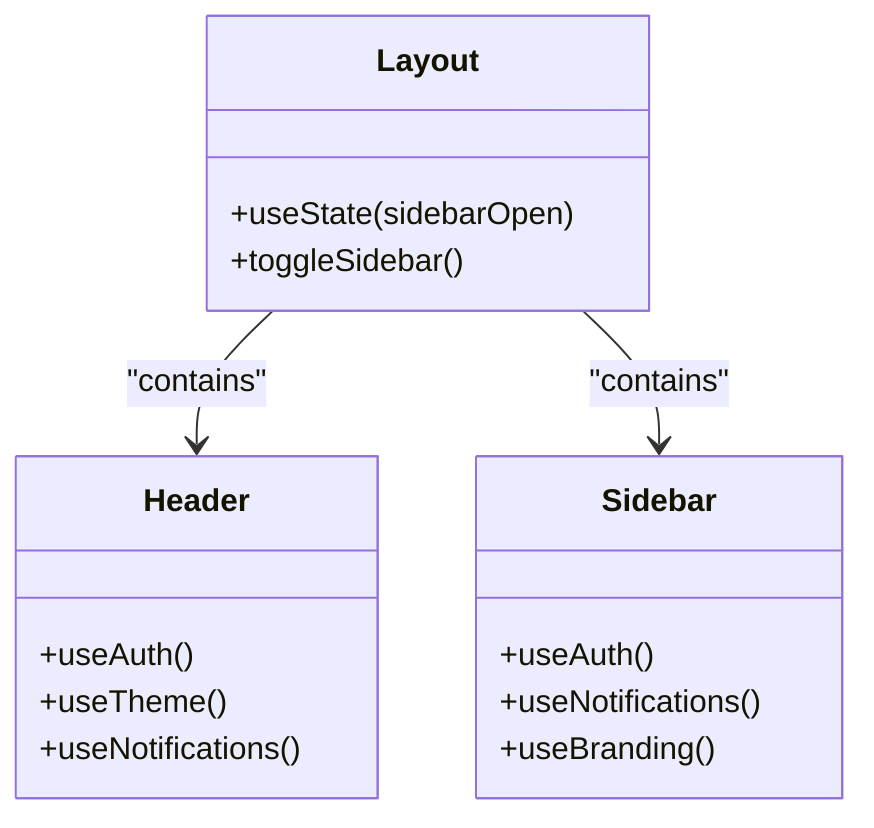
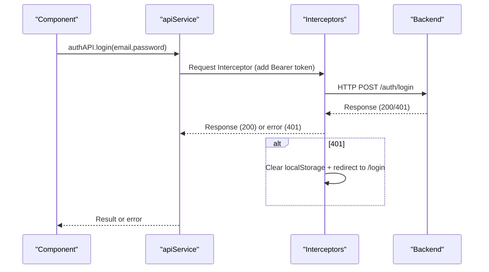
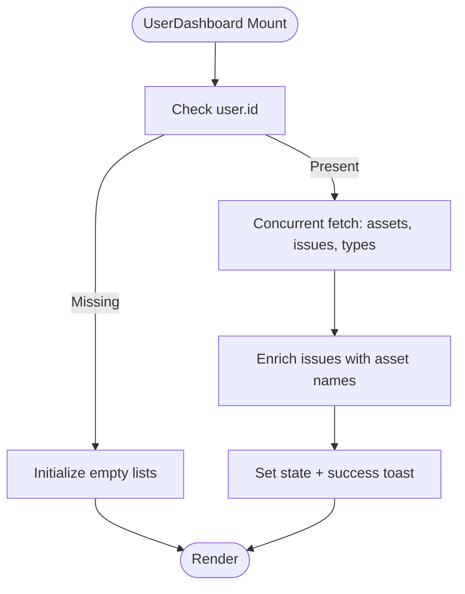
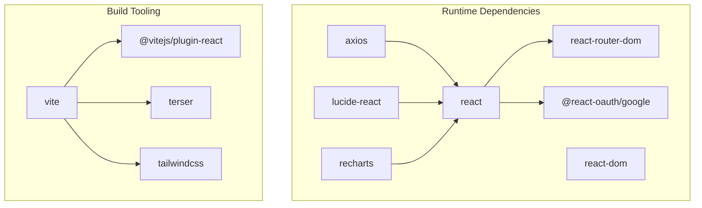

# Frontend Architecture

## Table of Contents
1. [Introduction](#introduction)
2. [Project Structure](#project-structure)
3. [Core Components](#core-components)
4. [Architecture Overview](#architecture-overview)
5. [Detailed Component Analysis](#detailed-component-analysis)
6. [Dependency Analysis](#dependency-analysis)
7. [Performance Considerations](#performance-considerations)
8. [Troubleshooting Guide](#troubleshooting-guide)
9. [Conclusion](#conclusion)
10. [Appendices](#appendices)

## Introduction
This document describes the frontend architecture of the React application, focusing on component hierarchy, context-based state management, routing architecture, role-based access control, global state patterns, reusable UI components, external library integrations, build system configuration, development workflow, deployment pipeline, performance optimization strategies, and code-splitting techniques.

## Project Structure
The frontend is organized around a layered structure:
- Root entry renders the application shell and providers
- Routing defines protected and public routes with role-based guards
- Providers encapsulate cross-cutting concerns (authentication, notifications, theming, branding)
- Pages represent feature areas grouped by roles
- Components encapsulate UI and layout
- Services abstract API communication and interceptors
- Build tooling configured via Vite

## Core Components
- Application shell and routing: Centralized in App.tsx with nested routes, role redirects, and guards
- Providers: Auth, Notifications, Theme, Branding, and Google OAuth provider
- Layout: Responsive shell with Header and Sidebar
- UI: ToastContainer and reusable UI components
- Services: Axios-based API client with request/response interceptors
- Pages: Feature-specific pages grouped by role

Key responsibilities:
- App.tsx orchestrates routing, guards, and provider composition
- AuthContextNew manages authentication state, MFA flows, and user metadata
- NotificationContext centralizes notifications and toast lifecycle
- ThemeContext persists and applies theme preferences
- BrandingContext loads and applies branding settings
- apiService centralizes HTTP calls and error handling
- Layout composes Header and Sidebar and exposes outlet for routed content

## Architecture Overview
The frontend follows a provider-centric architecture:
- Providers wrap the routing tree to supply global state and services
- Routing enforces authentication and role-based access
- Layout composes navigation and content area
- Services abstract HTTP communication and error handling

## Detailed Component Analysis

### Routing and Role-Based Access Control
- Public routes: Login, registration, password reset, MFA setup, and legal pages
- Protected routes: Wrapped with RequireAuth to enforce authentication
- Role guards: RequireAdmin and RequireManager restrict access by role
- Index redirect: RoleIndexRedirect navigates users to role-specific dashboards
- Nested routes: Admin, Manager, and User route groups encapsulate feature areas

### Authentication Context Pattern
AuthContextNew encapsulates:
- User state, loading flags, and role flags
- Authentication actions: login, register, logout, MFA flows
- Profile updates, password management, and OAuth login
- Local storage persistence and token verification on startup
- Memoized value object to prevent unnecessary re-renders

### Notification and Toast Management
NotificationContext provides:
- Fetching, marking as read, and deleting notifications
- Unread count tracking and polling
- Toast queue management with auto-dismiss
- Integration with authentication state to avoid retries on auth errors

### Theme and Branding Contexts
- ThemeContext persists and applies theme preference, supporting system theme detection
- BrandingContext loads public settings (site name, browser title, logos, favicon) and synchronizes with DOM

### Layout Composition Patterns
- Layout composes Header and Sidebar and exposes Outlet for routed content
- Header integrates with Auth, Theme, and Notification contexts
- Sidebar adapts navigation based on user role and maintains active state

### API Client and Interceptors
- Axios instance configured with base URL, credentials, and timeouts
- Request interceptor adds Authorization header from localStorage
- Response interceptor handles 401 by clearing auth and redirecting to login
- Strongly typed APIs for auth, users, departments, assets, issues, notifications, budget, and settings

### Example Page: UserDashboard
- Demonstrates composition of contexts (Auth, Notifications), services, and UI
- Concurrent data fetching and enrichment
- Form handling with validation and submission
- Toast and notification integration

## Dependency Analysis
External dependencies include React, React Router, Axios, Lucide icons, Recharts, Tailwind CSS, and Vite. The build system splits bundles by feature and vendor libraries.

## Performance Considerations
- Code splitting and chunking:
  - Manual chunks separate vendor, router, UI, and utils libraries
  - Dynamic chunk names with hashed filenames
- Minification and source maps:
  - Terser minification with console/debugger removal
  - Production disables source maps
- Build targets and CSS splitting:
  - ES2015 target, CSS code splitting
- Bundle size monitoring:
  - Increased chunk size warning threshold
- Development proxy:
  - Configured proxy for API traffic with logging

Recommendations:
- Lazy-load heavy pages and modals using dynamic imports
- Defer non-critical resources
- Use React.memo and useMemo for expensive computations
- Virtualize long lists in pages

## Troubleshooting Guide
Common issues and resolutions:
- Authentication errors:
  - 401 responses trigger automatic logout and redirect to login
  - Verify localStorage tokens and network connectivity
- Notification polling:
  - Auth errors halt polling; ensure authentication state is valid
  - Use custom event refresh to force reload
- Theme and branding:
  - Confirm theme preference persistence and system theme changes
  - Validate favicon and browser title updates
- Build and preview:
  - Use dev script for local development
  - Preview builds locally to validate production behavior

## Conclusion
The frontend employs a robust, provider-driven architecture with clear separation of concerns. Routing and guards enforce role-based access, while contexts manage global state for authentication, notifications, theme, and branding. The API client centralizes HTTP operations with interceptors for resilience. The build system emphasizes performance via code splitting, minification, and optimized chunking. Pages demonstrate composition patterns and integration with services and UI components.

## Appendices
- TypeScript configuration supports bundler mode and strict linting
- Development workflow includes scripts for dev, build, preview, and backend coordination

- `package.json:6-16`
