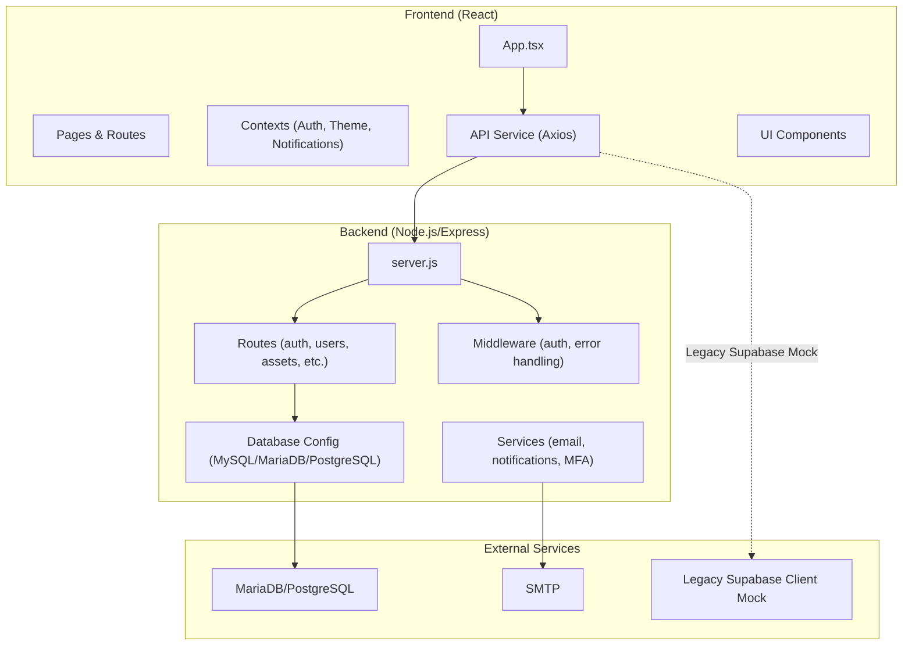
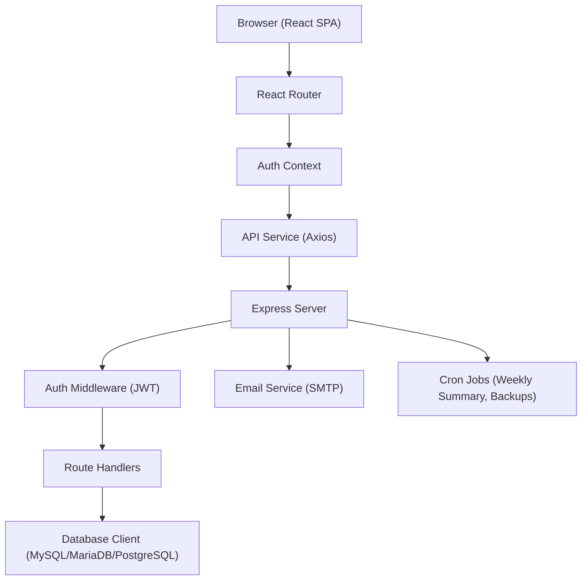
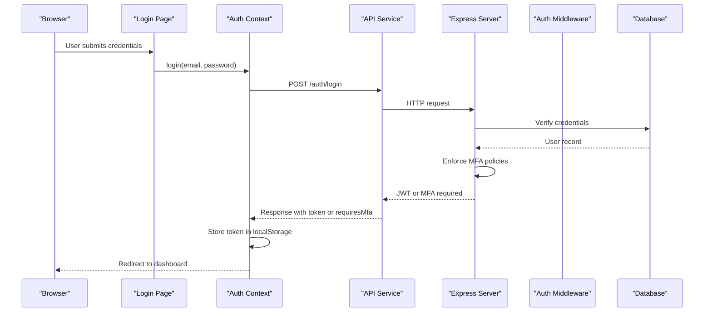
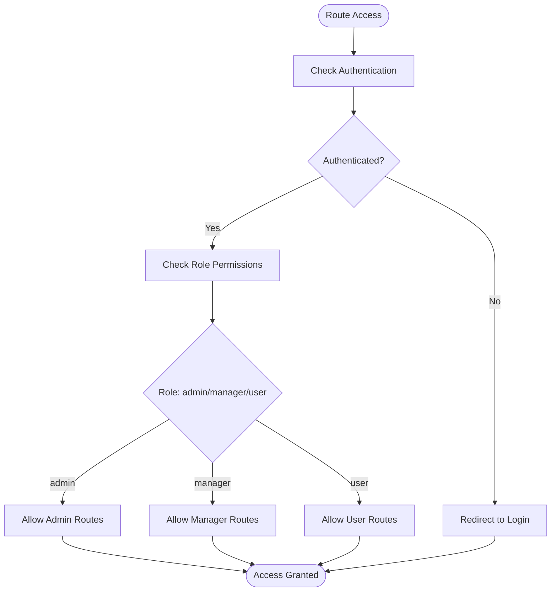
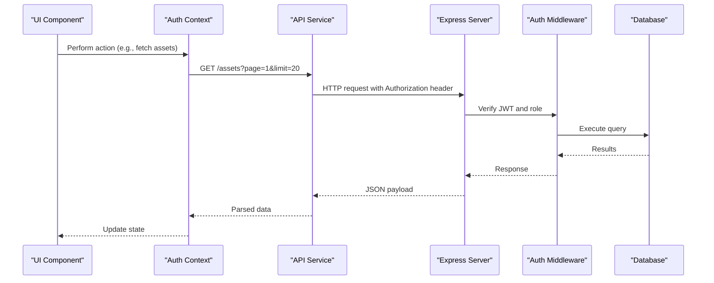
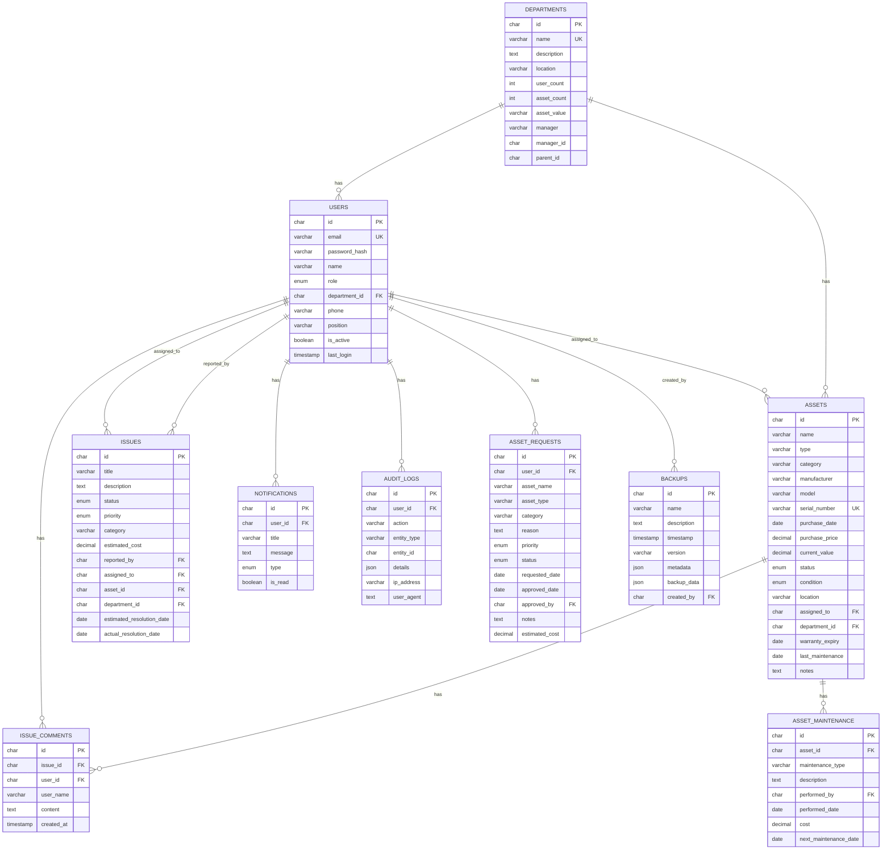
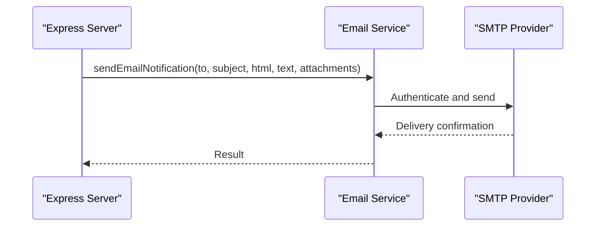
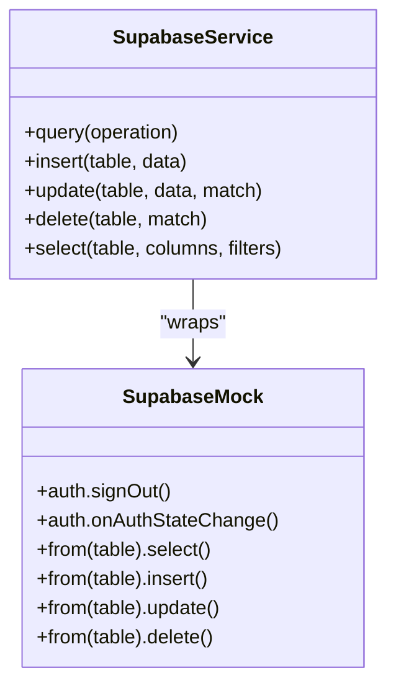
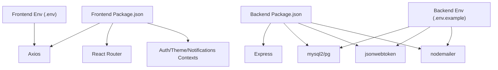

# Architecture Overview

## Table of Contents
1. [Introduction](#introduction)
2. [Project Structure](#project-structure)
3. [Core Components](#core-components)
4. [Architecture Overview](#architecture-overview)
5. [Detailed Component Analysis](#detailed-component-analysis)
6. [Dependency Analysis](#dependency-analysis)
7. [Performance Considerations](#performance-considerations)
8. [Troubleshooting Guide](#troubleshooting-guide)
9. [Conclusion](#conclusion)

## Introduction
This document presents the end-to-end architecture of the Assets Management System, detailing the integration between a React frontend and a Node.js/Express backend. It explains the authentication and authorization mechanisms, role-based access control, state management, data flow, and operational concerns such as security, scalability, and deployment topology. The system currently includes a legacy Supabase client mock and related services, indicating a migration path toward a cloud-native backend while maintaining compatibility.

## Project Structure
The repository follows a dual-package structure:
- Frontend (React + TypeScript/Vite) under the repository root, organized by pages, components, services, and contexts.
- Backend (Node.js/Express) under the backend directory, containing routes, middleware, services, database configuration, and migrations.

Key characteristics:
- Frontend uses Vite for development and build, React Router for navigation, and a centralized API service for backend communication.
- Backend uses Express with middleware for security and rate limiting, a configurable database client supporting MySQL/MariaDB and PostgreSQL, and modular route handlers.
- Environment configuration is split between frontend and backend, with explicit examples for database and JWT settings.

## Core Components
- Frontend Application
  - App shell with routing, protected routes, and role-based navigation.
  - Centralized authentication context managing login, MFA, profile updates, and logout.
  - API service abstraction for backend communication with interceptors for auth tokens and error handling.
  - UI components and pages organized by role (admin, manager, user).
- Backend Server
  - Express server with security middleware (Helmet, CORS, rate limiting), health checks, and cron-based automation.
  - Modular routes for authentication, assets, issues, notifications, backups, and administrative functions.
  - Database abstraction supporting MySQL/MariaDB and PostgreSQL with connection pooling and transactions.
  - Middleware for JWT-based authentication, role enforcement, and department-scoped access control.
- Legacy Supabase Integration
  - Legacy client mock and typed interfaces for compatibility.
  - Supabase service wrapper with retry logic for database-like operations.

## Architecture Overview
High-level architecture combines:
- React SPA frontend communicating via REST APIs to a Node.js/Express backend.
- Database layer supporting MySQL/MariaDB and PostgreSQL with automatic triggers for department metrics.
- Email notifications integrated through SMTP configuration.
- Optional legacy Supabase client mock present for compatibility.

## Detailed Component Analysis

### Authentication and Authorization Flow
The system implements a multi-factor authentication strategy with JWT-based sessions and role-based access control:
- Frontend login invokes the authentication API, which validates credentials and enforces MFA policies.
- On successful login, a JWT is issued and stored in local storage; subsequent requests include an Authorization header.
- The backend middleware verifies tokens, handles temporary MFA setup tokens, and enforces role-based restrictions.
- Protected routes in the frontend enforce authentication and role checks before rendering.

### Role-Based Access Control (RBAC)
RBAC is enforced at two levels:
- Frontend: Route guards determine visibility and access based on user roles (admin, manager, user).
- Backend: Middleware checks roles and department-level access for sensitive resources.

### Data Flow Between Frontend and Backend
The frontend communicates with the backend through a centralized API service that:
- Adds Authorization headers with JWT tokens.
- Handles 401 responses by clearing session state and redirecting to login.
- Exposes typed endpoints for users, departments, assets, issues, notifications, budgets, and settings.

### Database Schema and Storage
The backend defines a comprehensive relational schema with:
- Departments, Users, Assets, Issues, Issue Comments, Asset Maintenance, Notifications, Audit Logs, Asset Requests, and Backups.
- Triggers to maintain department-level aggregates (user count, asset count, asset value).
- Support for both MySQL/MariaDB and PostgreSQL with a unified query abstraction.

### Email and Notification Integration
Email notifications are configured via environment variables and used for:
- Welcome notifications upon user registration.
- Administrative alerts for new registrations.
- Scheduled backup notifications with JSON attachments.

### Legacy Supabase Client Mock
The frontend includes a legacy Supabase client mock and typed interfaces for compatibility. The mock provides basic auth and database-like operations, enabling frontend components to function without a live Supabase backend.

## Dependency Analysis
The system exhibits clear separation of concerns:
- Frontend depends on React, React Router, Axios, and internal contexts/services.
- Backend depends on Express, database drivers, JWT libraries, and external services (email).
- Both layers rely on environment configuration for runtime behavior.

## Performance Considerations
- Database Abstraction: Unified query execution with optional RETURNING id emulation and transaction support ensures efficient operations across MySQL/MariaDB and PostgreSQL.
- Connection Pooling: Configurable pools improve throughput and reduce connection overhead.
- Pagination Utilities: Sanitized pagination parameters prevent excessive memory usage and optimize query performance.
- Retry Logic: Supabase service wrapper implements exponential backoff for transient failures.
- Rate Limiting: Express rate limiter protects endpoints from abuse.
- Cron Jobs: Scheduled tasks for weekly summaries and backups are timezone-aware and configurable.

## Troubleshooting Guide
Common issues and resolutions:
- Authentication Failures
  - Verify JWT secret and expiration settings in environment variables.
  - Ensure the Authorization header is present for protected routes.
- Database Connectivity
  - Confirm DB client selection and credentials; test connection using provided helpers.
  - Check SSL settings for PostgreSQL providers.
- Email Delivery
  - Validate SMTP configuration and sender details; confirm credentials and port/security settings.
- CORS Errors
  - Add frontend origins to the configured origins list in the backend.
- MFA Setup
  - Temporary MFA setup tokens allow enrollment; ensure proper handling and redirection.

## Conclusion
The Assets Management System employs a clean separation between a React frontend and a Node.js/Express backend, secured by JWT-based authentication and robust RBAC. The backend’s database abstraction supports multiple engines, while cron-based automation streamlines administrative tasks. The presence of a legacy Supabase client mock indicates a migration-ready frontend architecture. The documented patterns enable scalable deployments, strong security controls, and maintainable development practices.
