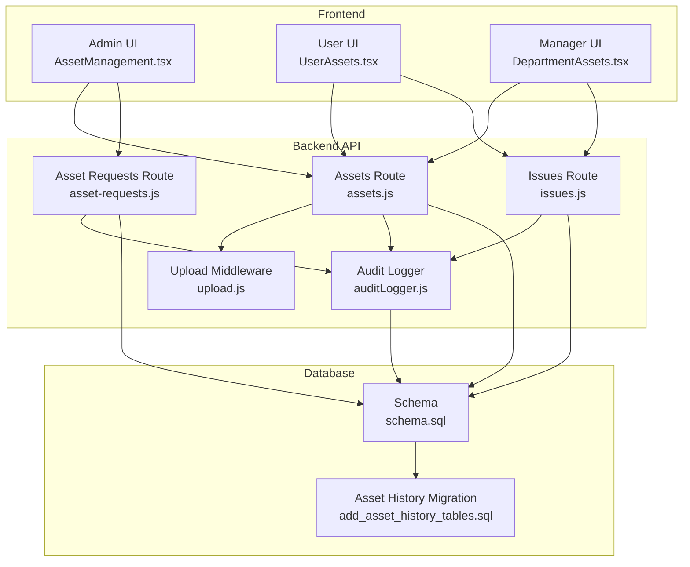
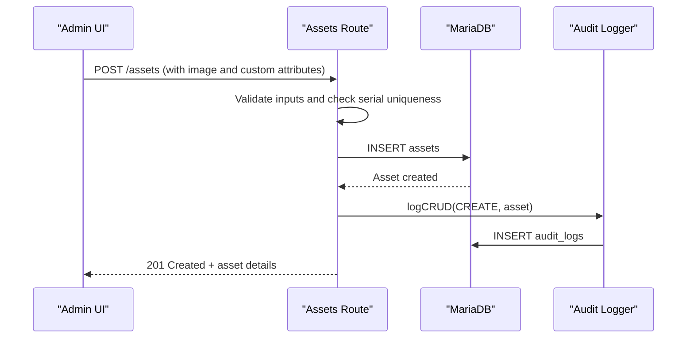
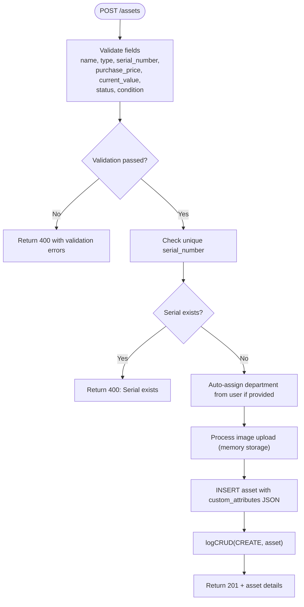
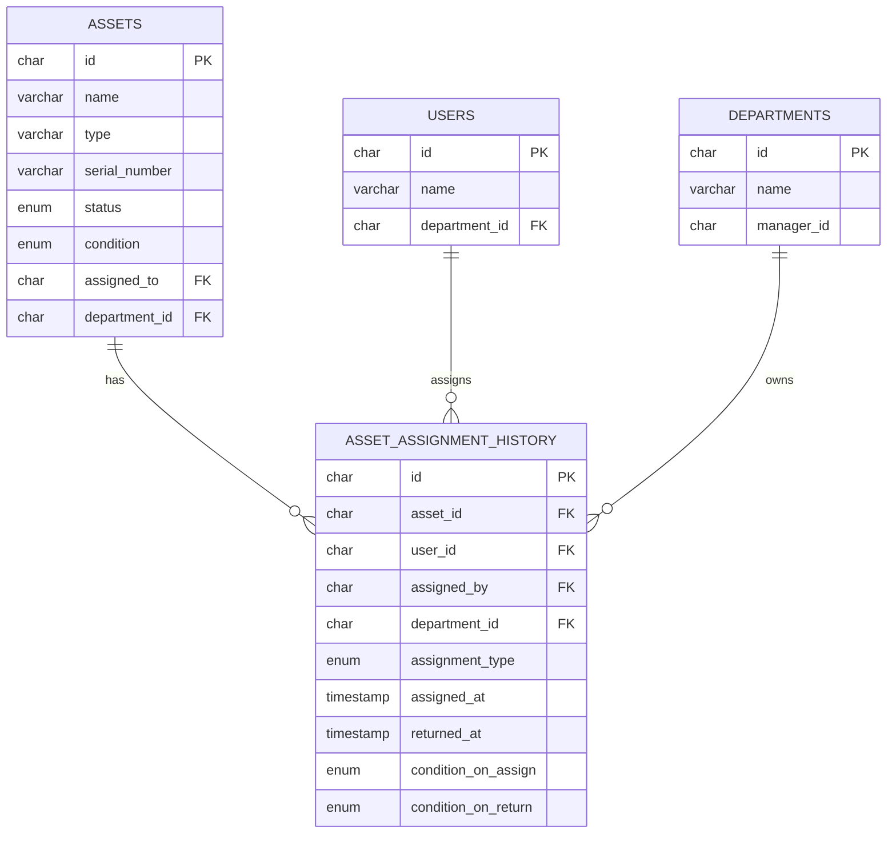
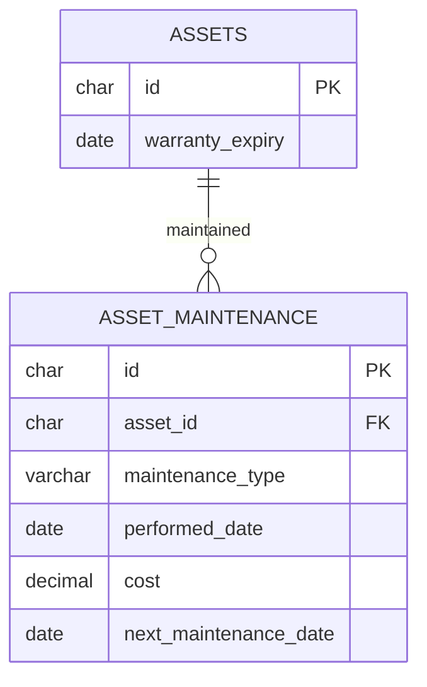
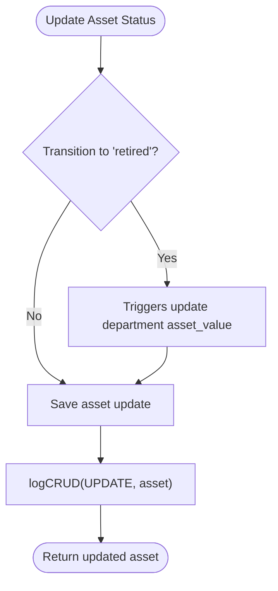
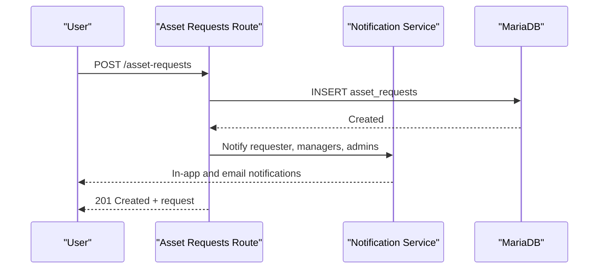
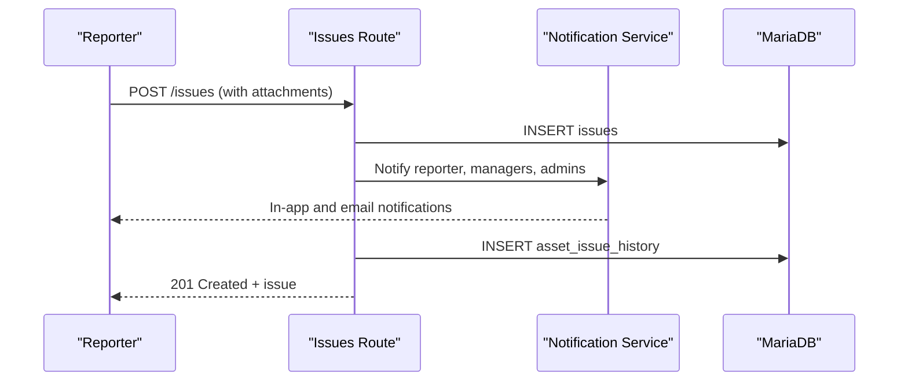
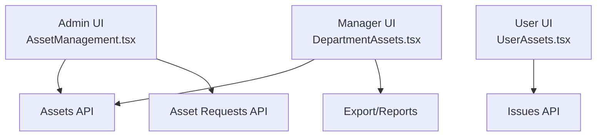
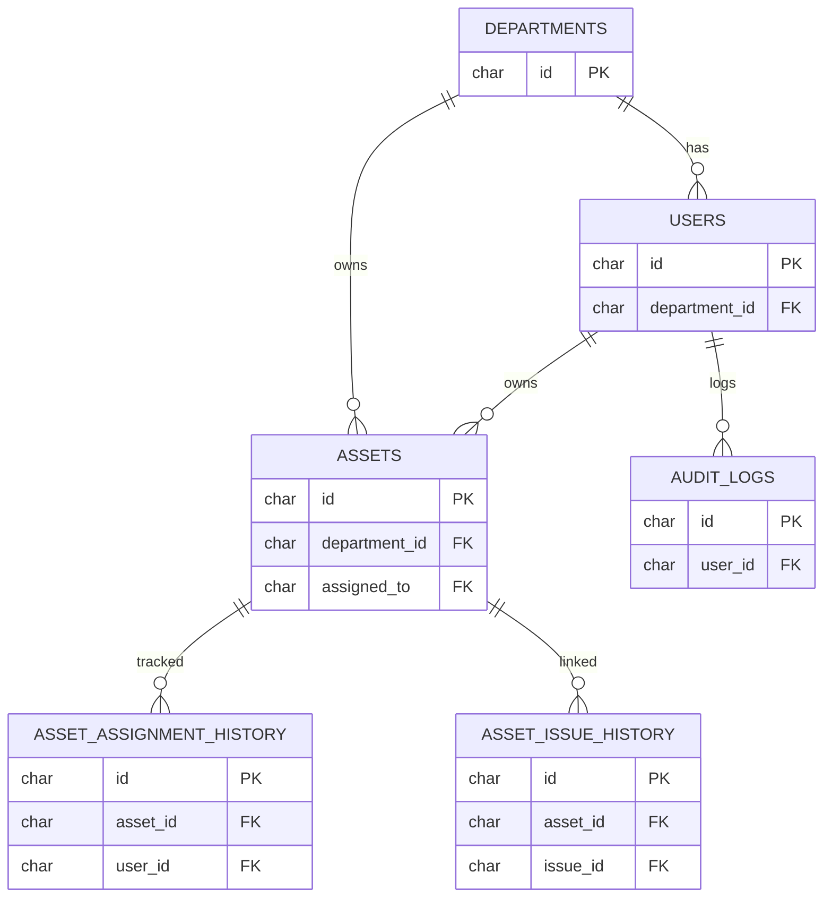

# Asset Lifecycle Management

## Table of Contents
1. [Introduction](#introduction)
2. [Project Structure](#project-structure)
3. [Core Components](#core-components)
4. [Architecture Overview](#architecture-overview)
5. [Detailed Component Analysis](#detailed-component-analysis)
6. [Dependency Analysis](#dependency-analysis)
7. [Performance Considerations](#performance-considerations)
8. [Troubleshooting Guide](#troubleshooting-guide)
9. [Conclusion](#conclusion)

## Introduction
This document provides comprehensive documentation for asset lifecycle management, covering the complete journey from procurement to retirement. It explains asset creation workflows (validation, image uploads, custom attributes), assignment and transfer processes, department hierarchies, user assignments, maintenance tracking, warranty management, condition monitoring, retirement and disposal procedures, valuation calculations, and audit trails. It also includes practical examples of workflows, bulk operations, and integrations with procurement systems, along with status transitions, approval workflows, and compliance requirements.

## Project Structure
The system comprises:
- Backend API with Express routes for assets, asset requests, issues, and supporting utilities
- Database schema with departments, users, assets, issues, audit logs, and asset history tables
- Frontend pages for administrators, users, and managers with CRUD, filtering, exporting, and notifications
- Middleware for file uploads and authentication
- Services for notifications, comments, and audit logging

## Core Components
- Assets API: CRUD operations, filtering, pagination, history retrieval, and audit logging
- Asset Requests API: Procurement workflow with approvals, cost estimation, and notifications
- Issues API: Problem reporting, assignment, resolution tracking, and notifications
- Asset History: Assignment and issue linkage tracking for audit and reporting
- Audit Logging: Centralized logging for compliance and security monitoring
- Frontend Pages: Admin, user, and manager dashboards with search, filters, exports, and notifications

Key capabilities:
- Validation and sanitization for asset creation and updates
- Image upload handling with size/type restrictions
- Custom attributes support via JSON fields
- Department hierarchy and automatic statistics updates
- Comprehensive audit trail for all CRUD and workflow actions

## Architecture Overview
The system follows a layered architecture:
- Presentation Layer: React pages for admin, user, and manager views
- Application Layer: Express routes implementing business logic
- Persistence Layer: MariaDB with triggers for department statistics
- Utility Layer: Audit logging, notifications, and file upload middleware

## Detailed Component Analysis

### Asset Creation Workflow
Asset creation enforces validation, checks serial uniqueness, supports image uploads, and records audit logs.

### Asset Assignment and Transfer
The system tracks assignments and transfers with conditions, timestamps, and department associations. History tables capture ownership changes and issue events linked to assets.

### Asset Maintenance Tracking and Warranty Management
Maintenance records track performed dates, costs, and next maintenance schedules. Warranty expiry is stored per asset for lifecycle planning.

### Asset Retirement and Disposal
Retirement status transitions are supported via asset updates. Department statistics are automatically recalculated via triggers to reflect asset value changes.

### Procurement Integration and Approval Workflows
Asset requests integrate with procurement by capturing reasons, priorities, and optional estimated costs. Approvals trigger notifications to requesters, managers, and admins.

### Issue Reporting and Resolution Tracking
Issues capture status, priority, and estimated costs. Notifications are sent to reporters, assignees, managers, and admins. Asset-issue events are recorded for auditability.

### Frontend Dashboards and Workflows
- Admin dashboard: Full asset CRUD, history, export/import, and department management
- User dashboard: Personal assets, issue reporting, and self-service additions
- Manager dashboard: Department-wide assets, issue tracking, and bulk exports

## Dependency Analysis
- Assets depend on users and departments for ownership and hierarchy
- Asset history depends on assets, users, and issues for auditability
- Triggers maintain department statistics for asset count and value
- Audit logs centralize compliance data across CRUD and workflow actions

## Performance Considerations
- Pagination and filtering: Use sanitized pagination and indexed columns for efficient queries
- Image uploads: Memory storage with size limits; consider streaming for large files
- Triggers: Automatic department statistics reduce application logic but add write overhead
- Audit logging: Non-blocking writes to avoid impacting transaction performance
- Frontend exports: Client-side PDF generation; consider server-side for very large datasets

## Troubleshooting Guide
Common issues and resolutions:
- Validation failures during asset creation: Review field constraints and ensure unique serial numbers
- Upload errors: Verify file types and sizes; check middleware configuration
- Audit logging failures: Confirm database connectivity and table existence
- Department statistics not updating: Verify trigger installation and permissions
- Asset history missing: Ensure migration tables exist and foreign keys are intact

## Conclusion
The asset lifecycle management system provides a robust foundation for end-to-end asset management, integrating procurement workflows, assignment tracking, maintenance scheduling, warranty monitoring, and comprehensive audit trails. Its modular architecture supports scalability, compliance, and operational efficiency across administrative, user, and manager roles.
