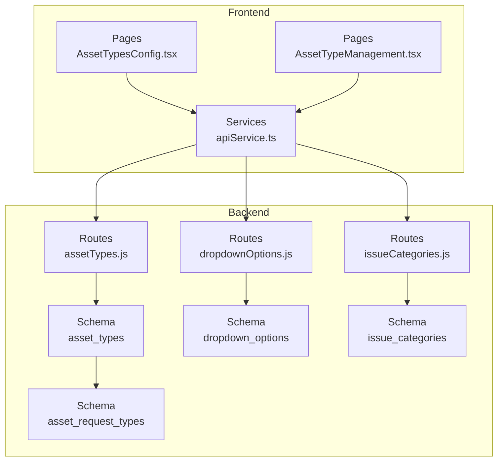
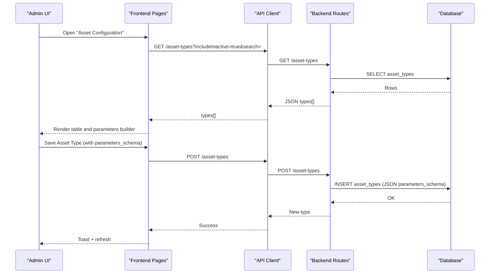
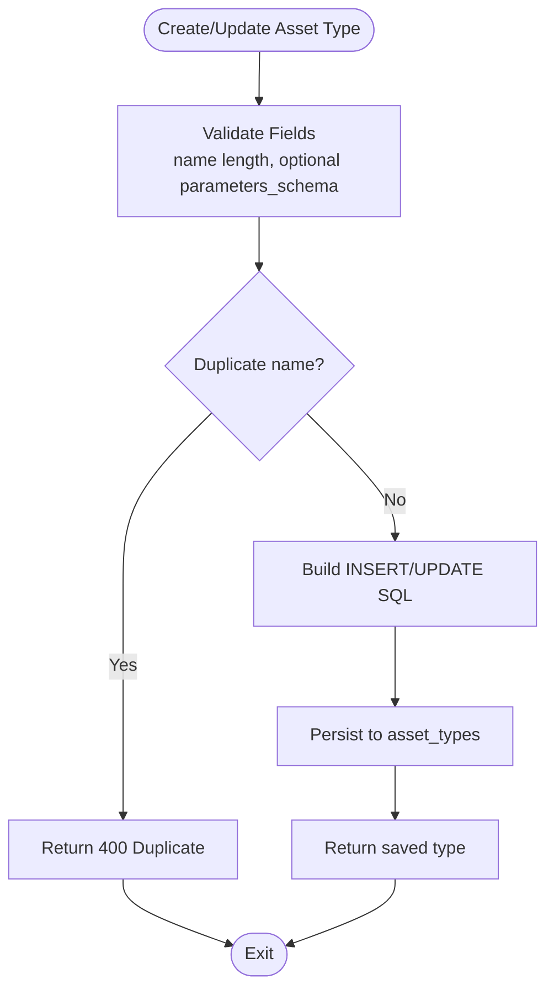
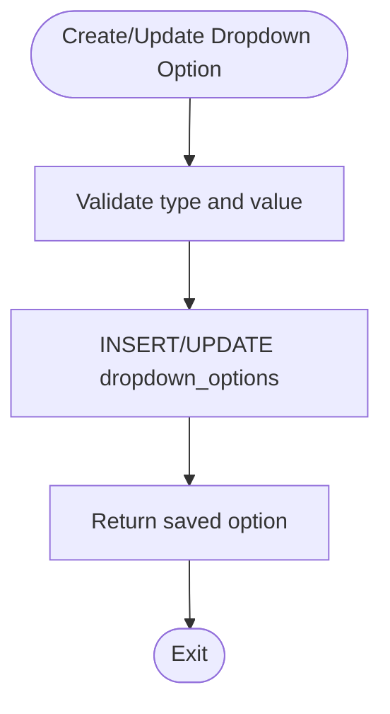
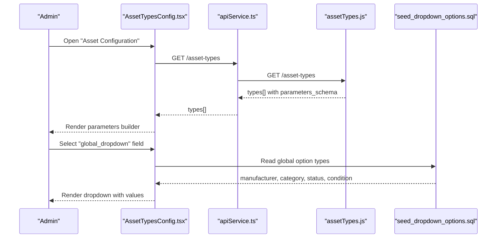
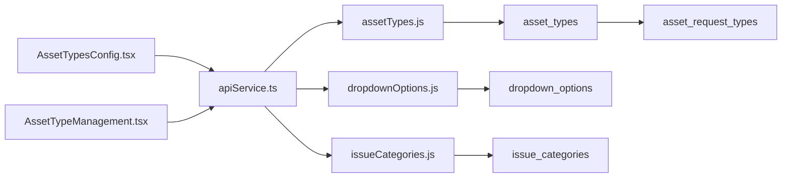

# Asset Types & Categories

## Table of Contents
1. [Introduction](#introduction)
2. [Project Structure](#project-structure)
3. [Core Components](#core-components)
4. [Architecture Overview](#architecture-overview)
5. [Detailed Component Analysis](#detailed-component-analysis)
6. [Dependency Analysis](#dependency-analysis)
7. [Performance Considerations](#performance-considerations)
8. [Troubleshooting Guide](#troubleshooting-guide)
9. [Conclusion](#conclusion)
10. [Appendices](#appendices)

## Introduction
This document explains the asset types and categories management system. It covers how asset types are configured with dynamic custom attributes, how dropdown options support global and custom field choices, and how categories enable classification. It also documents request types, dynamic form generation, validation rules, and business logic enforcement. Finally, it outlines relationships among asset types, categories, and custom attributes, and addresses permissions, department-specific configurations, and audit requirements for type changes.

## Project Structure
The system spans backend routes and migrations, and frontend pages and services:
- Backend routes expose CRUD APIs for asset types, dropdown options, and issue categories.
- Migrations define database schemas and seed initial data.
- Frontend pages manage configuration and present forms for administrators.

## Core Components
- Asset Types: Define categories of assets with a dynamic parameters schema stored as JSON. Includes name, description, activation flag, and search/filtering.
- Dropdown Options: Provide reusable lists for fields such as manufacturer, category, status, and condition. Supports active/inactive toggles and uniqueness constraints.
- Issue Categories: Separate classification system for issues, with similar CRUD and filtering capabilities.
- Frontend Configuration: Administrators configure asset types and dropdown options via dedicated pages with live previews and validation.

Key behaviors:
- Validation enforces minimum lengths and required fields.
- Unique constraints prevent duplicates for names and type/value combinations.
- Soft-deletion safety checks prevent removal of asset types still referenced by assets.

## Architecture Overview
The system follows a layered architecture:
- Presentation: React pages render configuration UIs and collect user input.
- Services: API client encapsulates HTTP communication and interceptors.
- Routes: Express endpoints validate, authorize, and persist changes.
- Persistence: SQL schemas define typed storage for asset types, dropdown options, and categories.

## Detailed Component Analysis

### Asset Types Management
Asset types define categories of assets and carry a dynamic parameters schema as JSON. The backend enforces:
- Uniqueness of names.
- Optional parameters_schema array persisted as JSON.
- Activation/deactivation and soft-delete safeguards.

### Dropdown Options Management
Dropdown options provide controlled vocabularies for fields. The backend enforces:
- Required type and value.
- Unique type+value pairs.
- Optional activation toggle.

### Issue Categories Management
Issue categories mirror asset type patterns for categorizing issues, with similar validations and lifecycle controls.

### Dynamic Form Generation and Attribute Mapping
The frontend constructs dynamic forms from asset type parameters_schema:
- Parameters builder supports reordering, adding/removing fields.
- Field types include text, number, date, boolean, dropdown (custom), and global_dropdown.
- Global dropdowns source values from seeded dropdown_options.

### Asset Request Types
Asset request types are separate from asset types but share a similar schema and lifecycle. They are managed via a dedicated route and table.

### Asset Type Inheritance and Business Logic
- Asset types do not inherit from each other; each defines its own parameters_schema.
- Business logic enforced:
  - Unique names for asset types and dropdown options.
  - Prevent deletion of asset types still referenced by assets.
  - Activation flags control visibility and availability.
  - Search and filter support for admin views.

### Permissions and Authorization
- Admin-only endpoints require authentication and admin role.
- Frontend uses bearer tokens injected via interceptors.

### Department-Specific Configurations and Audit Requirements
- Department hierarchy exists in the system, enabling department-scoped views and assignments elsewhere.
- Audit logs table exists for broader auditing; while not directly tied to asset type changes here, it supports organizational compliance needs.

## Dependency Analysis
- Frontend depends on API client for all backend interactions.
- Routes depend on database queries and enforce validation.
- Asset types schema references asset request types table conceptually for request workflows.

## Performance Considerations
- Prefer filtering via query parameters (search, includeInactive) to reduce payload sizes.
- Batch updates for dropdown options leverage upsert semantics to avoid duplicate inserts.
- Keep parameters_schema concise to minimize JSON parsing overhead on the client.

## Troubleshooting Guide
Common issues and resolutions:
- Duplicate asset type name: Ensure uniqueness before creation/update.
- Attempted deletion of in-use asset type: Remove or reassign assets before deleting.
- Validation failures: Confirm required fields meet minimum length and type constraints.
- Dropdown option conflicts: Respect unique type+value constraint.

## Conclusion
The asset types and categories management system provides a flexible, admin-controlled framework for defining asset categories, custom attributes, and controlled vocabularies. With robust validation, authorization, and dynamic form generation, it supports scalable asset and request workflows while maintaining compliance and usability.

## Appendices

### Example Asset Type Configuration
- Name: “Laptop”
- Description: “Laptop computers”
- Parameters Schema includes fields such as Manufacturer (global_dropdown), Category (global_dropdown), Model (text), Serial Number (text), Status (global_dropdown), Condition (global_dropdown), Purchase Date (date), Warranty End Date (date), Purchase Price (number), Current Value (number), RAM (dropdown), Storage (text), Processor (text), OS (text).

### Attribute Mapping Examples
- Global dropdown mapping:
  - Manufacturer → values seeded under type “manufacturer”.
  - Category → values seeded under type “category”.
  - Status → values seeded under type “status”.
  - Condition → values seeded under type “condition”.

### Form Customization Notes
- Administrators can reorder parameters, add/remove fields, and choose between custom and global dropdown sources.
- Required flags can be set per parameter to enforce data capture.

- `AssetTypesConfig.tsx:394-490`
