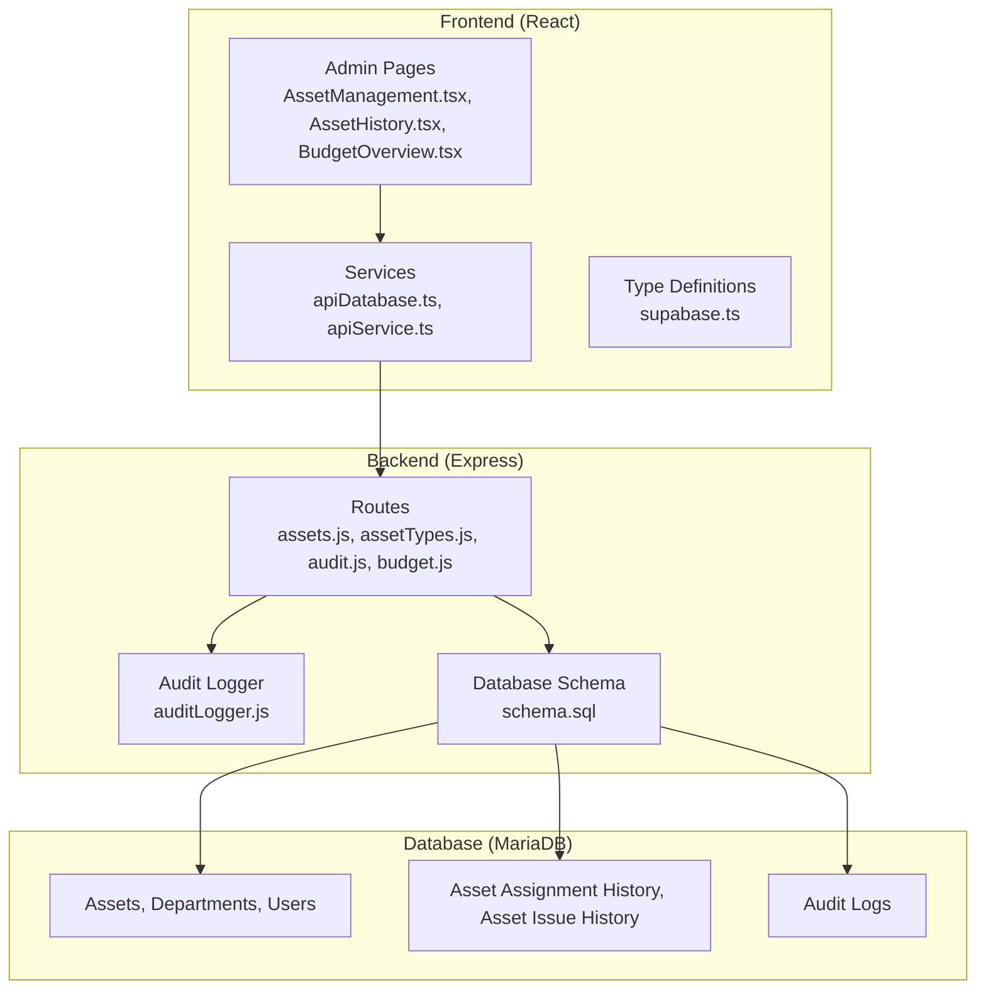
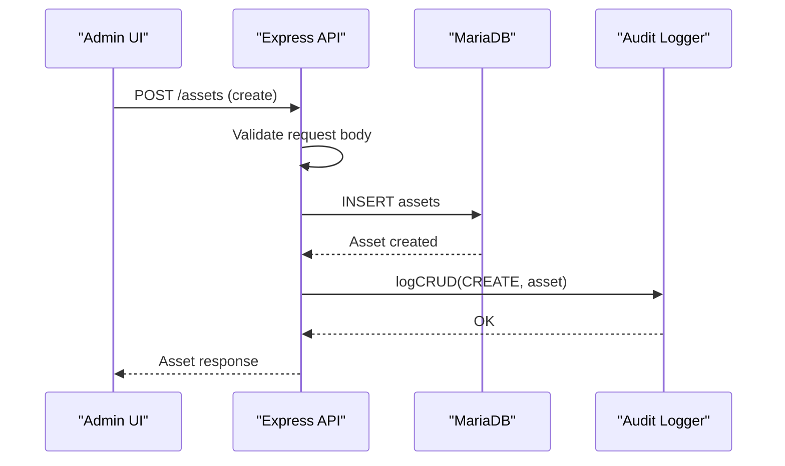
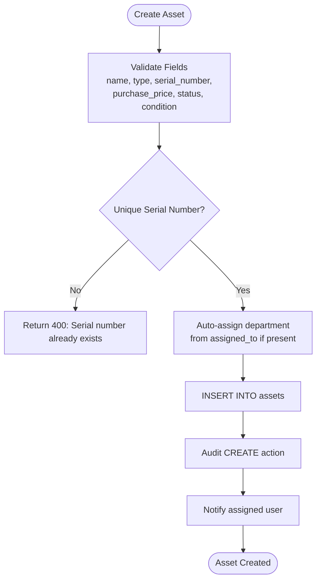
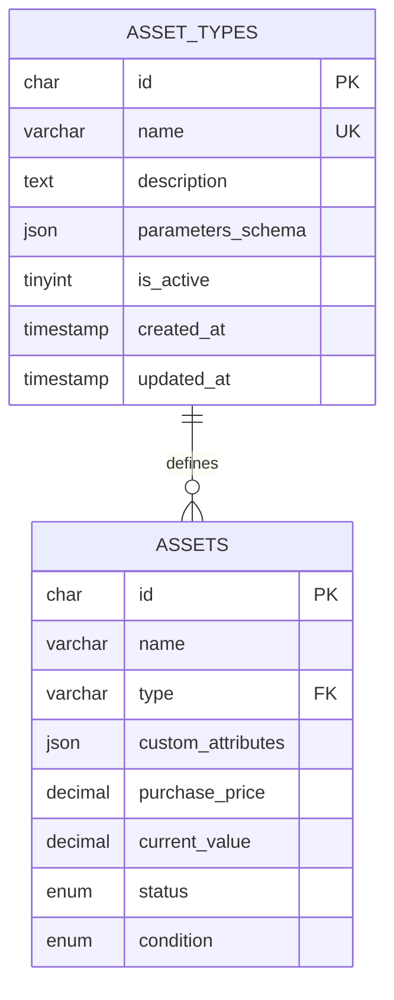
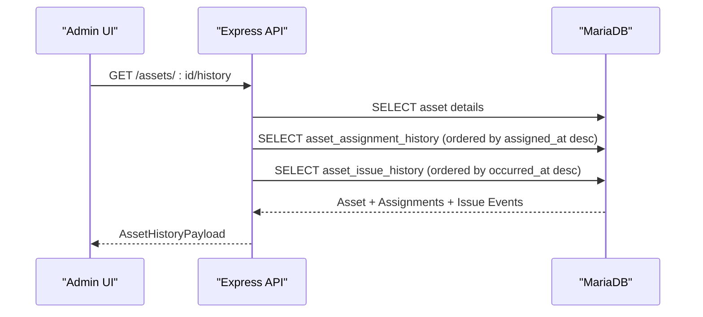
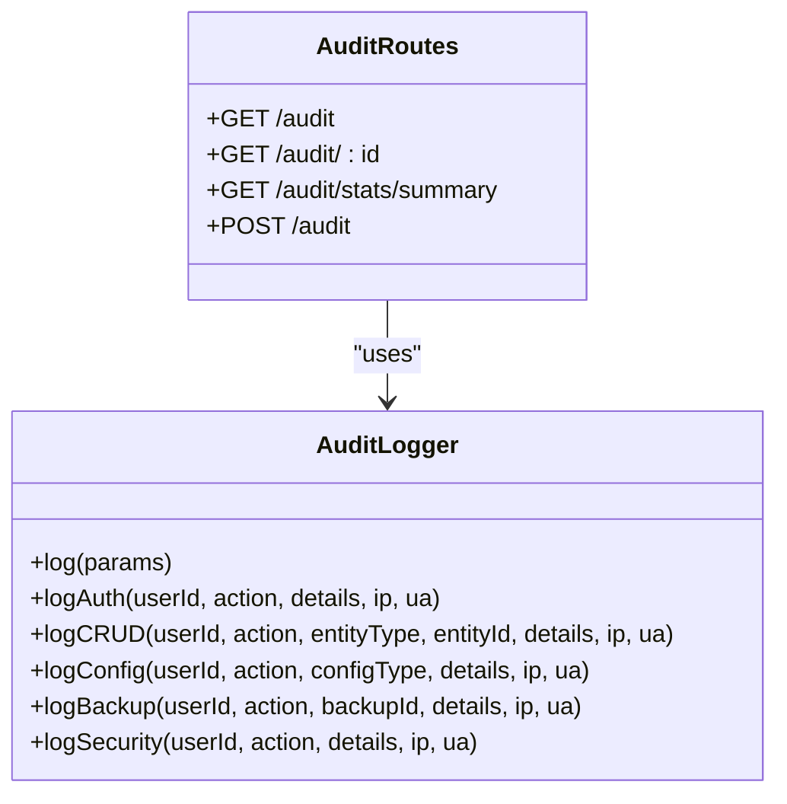
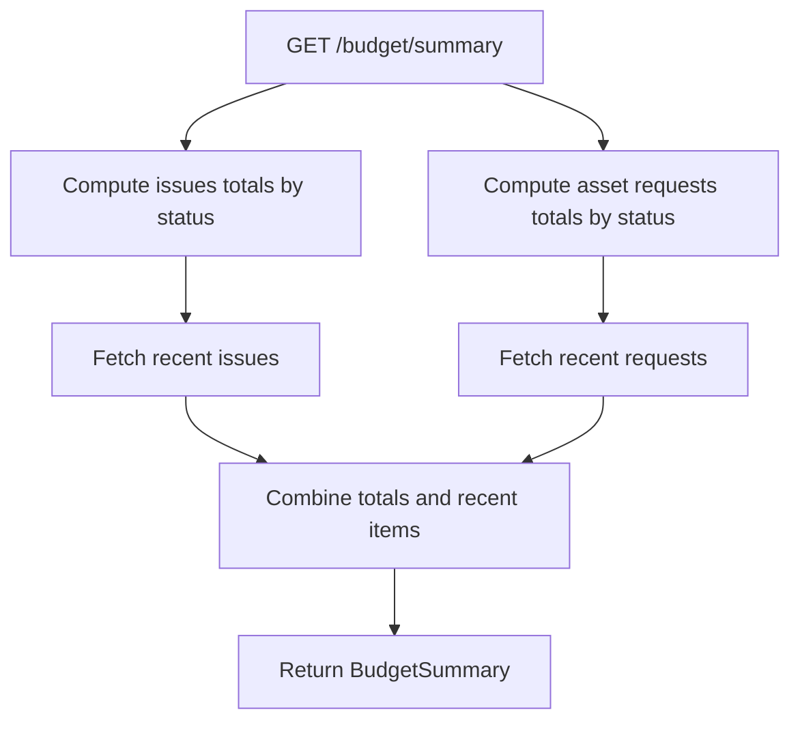
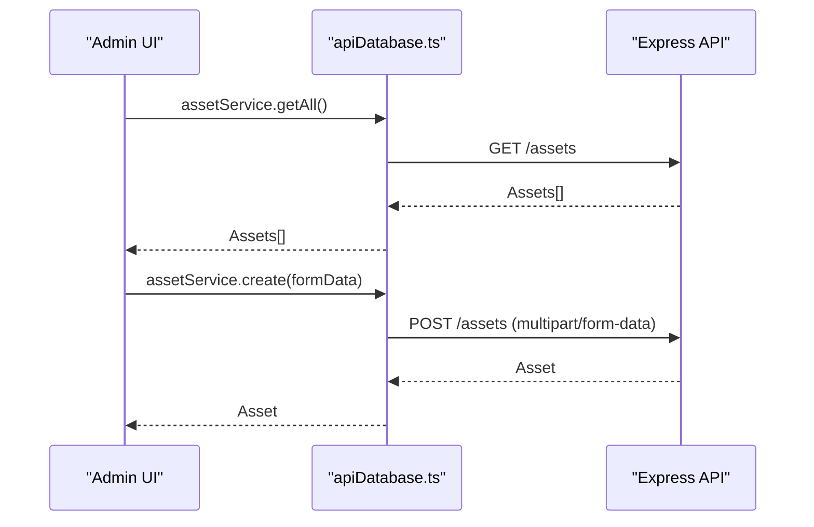
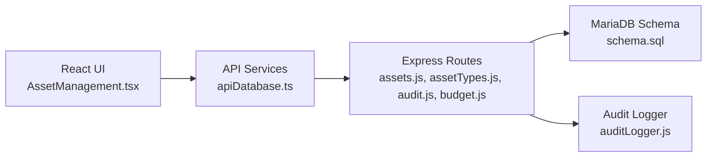

# Asset Management System

## Table of Contents
1. [Introduction](#introduction)
2. [Project Structure](#project-structure)
3. [Core Components](#core-components)
4. [Architecture Overview](#architecture-overview)
5. [Detailed Component Analysis](#detailed-component-analysis)
6. [Dependency Analysis](#dependency-analysis)
7. [Performance Considerations](#performance-considerations)
8. [Troubleshooting Guide](#troubleshooting-guide)
9. [Conclusion](#conclusion)
10. [Appendices](#appendices)

## Introduction
This document provides comprehensive documentation for the Asset Management System, covering the complete asset lifecycle from creation to retirement. It explains asset types, custom attributes, valuation tracking, budget management, and the asset history system with audit trails. It also details the user interface components for asset management, search and filtering capabilities, bulk operations, API endpoints for CRUD operations, validation rules, and business logic. Finally, it covers reporting, inventory workflows, and integration with procurement systems.

## Project Structure
The system follows a modern full-stack architecture:
- Frontend built with React and TypeScript, hosted under the `src` directory
- Backend API built with Node.js, Express, and MariaDB, located under the `backend` directory
- Database schema and migrations define asset, department, user, audit, and history tables
- Services abstract API communication between frontend and backend
- UI pages implement admin, manager, and user dashboards for asset lifecycle management

## Core Components
- Asset lifecycle management: creation, categorization, assignment, transfer, maintenance, retirement
- Asset types with dynamic schemas and custom attributes
- Valuation tracking and budget management
- Comprehensive asset history with ownership and issue timelines
- Audit trail and change tracking
- Search, filtering, and bulk operations in the admin UI
- API endpoints for CRUD operations with validation and business logic
- Reporting and export capabilities for budget summaries

## Architecture Overview
The system separates concerns across layers:
- Presentation Layer: React pages for admin, manager, and user views
- Service Layer: API services abstract HTTP calls and normalize responses
- Business Logic Layer: Express routes implement validation, business rules, and data transformations
- Persistence Layer: MariaDB schema with triggers for department statistics and dedicated history tables

## Detailed Component Analysis

### Asset Lifecycle Management
The asset lifecycle spans creation, categorization, assignment, transfer, maintenance, and retirement. The backend enforces validation and business rules, while the frontend provides intuitive UI controls.

Key behaviors:
- Validation ensures required fields meet criteria and prevents duplicate serial numbers
- Automatic department assignment based on user's department when assigning assets
- Audit logging captures all CRUD actions with IP and user agent
- Notifications are sent upon successful creation or assignment

### Asset Types and Custom Attributes
Asset types define categories with dynamic schemas and custom attributes stored as JSON. This enables flexible asset configurations per type.

Implementation highlights:
- Asset types endpoint supports listing, creation, updates, and deletion with validation
- Custom attributes are stored as JSON and normalized on retrieval
- Dynamic dropdown options support configurable lists for manufacturers, categories, statuses, and conditions

### Asset History, Ownership Timeline, and Issue Tracking
The system maintains comprehensive history for ownership transfers and issue events linked to assets.

Additional history features:
- Global history summary endpoint aggregates assignment counts, open issues, and last activity timestamps
- Unified history list combines assignment and issue events across assets with pagination and filtering

### Audit Trails and Change Tracking
All significant operations are logged in the audit system for compliance and traceability.

### Valuation Tracking and Budget Management
Valuation tracking and budget management provide insights into projected spending for issues and asset requests.

Export capabilities:
- PDF, Word (DOCX), and Excel (XLSX) exports with customizable filters
- General export mode excludes resolved/closed issues and rejected/approved/fulfilled requests

### User Interface Components and Workflows
The admin UI provides comprehensive asset management capabilities:
- Asset listing with search, filtering, and bulk operations
- Creation and editing forms with image upload and custom attributes
- Asset history modal with ownership and issue timelines
- Department management with inline creation for hierarchical org charts
- Export/import functionality supporting CSV, JSON, TXT, Excel, and PDF

### API Endpoints and Validation Rules
Core asset endpoints:
- GET /assets: List with pagination, search, and filters (status, type, department_id, assigned_to)
- GET /assets/:id: Retrieve single asset
- POST /assets: Create asset with validation and uniqueness checks
- PUT /assets/:id: Update asset with optional validations
- GET /assets/:id/history: Comprehensive asset history
- GET /assets/history/summary: Aggregated history metrics
- GET /assets/history: Unified history list with filters

Validation rules enforced by express-validator:
- Required fields: name, type, serial_number
- Numeric constraints: purchase_price, current_value >= 0
- Enum constraints: status, condition
- Uniqueness: serial_number must be unique

## Dependency Analysis
The system exhibits clear separation of concerns with minimal coupling between layers.

## Performance Considerations
- Pagination and limits: Default page sizes and maximum limits prevent excessive memory usage
- Indexes: Strategic indexes on frequently queried columns (serial_number, department_id, status, type) improve query performance
- Triggers: Department asset counts and values are maintained via triggers to avoid expensive joins
- Export optimization: PDF, DOCX, and Excel generation stream content to reduce memory footprint
- Bulk operations: Frontend supports bulk selection and deletion to minimize API calls

## Troubleshooting Guide
Common issues and resolutions:
- Duplicate serial number: Creation fails with a 400 error; verify uniqueness before submitting
- Validation failures: Review field constraints and required values; backend returns detailed validation errors
- History queries: Ensure asset exists; otherwise, 404 is returned
- Audit logs: Verify admin permissions; audit endpoints are protected
- Export failures: Check supported formats and filter combinations; backend returns descriptive errors

## Conclusion
The Asset Management System provides a robust, extensible platform for managing the complete asset lifecycle. Its modular architecture, comprehensive audit trails, dynamic asset types with custom attributes, and integrated budget reporting enable efficient operations across departments. The combination of frontend UI components and well-defined APIs ensures maintainability and scalability for future enhancements.

## Appendices

### Practical Examples and Common Use Cases
- Creating a laptop asset with initial valuation and assigning it to a user automatically sets the department
- Generating a budget export excluding resolved/closed issues for focused planning
- Viewing asset history to track ownership transitions and related issue events during a specific period
- Managing asset types to define category-specific custom attributes for hardware or software assets

### API Reference Summary
- Assets: GET/POST/PUT/DELETE with validation and history endpoints
- Asset Types: GET/POST/PUT/DELETE with schema validation
- Audit: GET/POST with filtering and statistics
- Budget: GET summary and export endpoints with multiple formats

- `budget.js:154-165`
