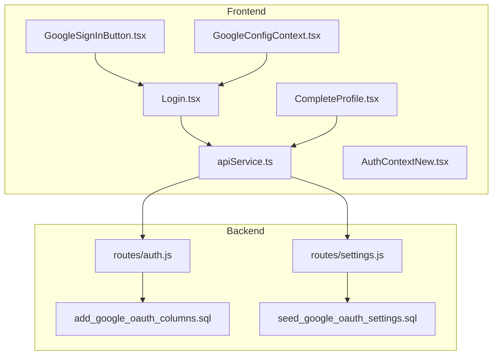
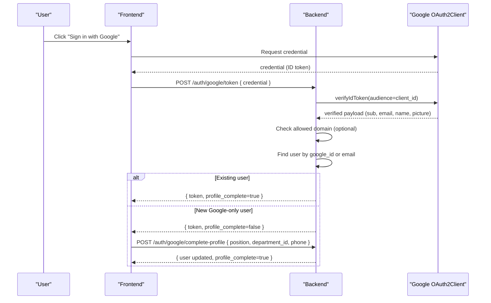
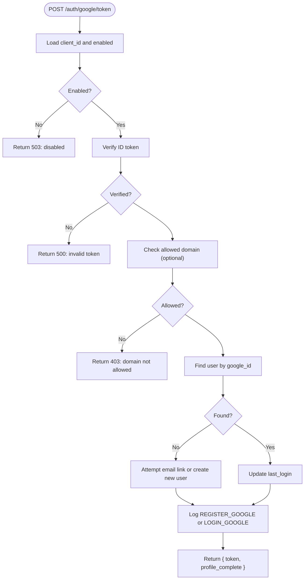
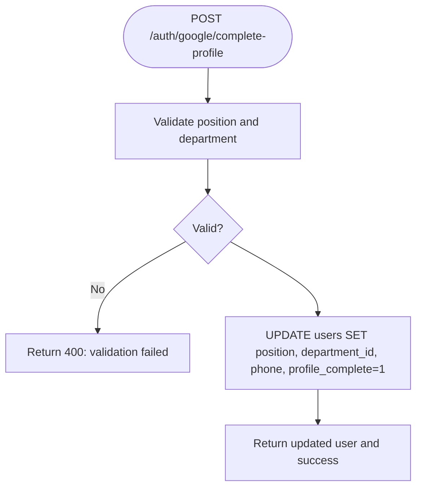
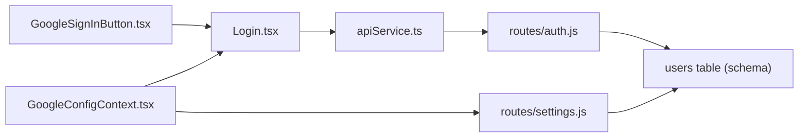

# Google OAuth Integration

## Table of Contents
1. [Introduction](#introduction)
2. [Project Structure](#project-structure)
3. [Core Components](#core-components)
4. [Architecture Overview](#architecture-overview)
5. [Detailed Component Analysis](#detailed-component-analysis)
6. [Dependency Analysis](#dependency-analysis)
7. [Performance Considerations](#performance-considerations)
8. [Troubleshooting Guide](#troubleshooting-guide)
9. [Conclusion](#conclusion)

## Introduction
This document explains the Google OAuth integration in the authentication system. It covers the end-to-end flow from initiating Google sign-in to completing user profiles, including credential verification, domain restrictions, and profile completion for new Google-only accounts. It also documents configuration, client ID setup, callback handling, error management, and security considerations for OAuth tokens.

## Project Structure
The Google OAuth implementation spans frontend React components and backend Express routes:
- Frontend: Google button component, configuration provider, login page, profile completion page, API service, and authentication context.
- Backend: Google OAuth routes, settings endpoint for public configuration, and database schema supporting Google accounts.

## Core Components
- GoogleSignInButton: Renders a styled Google sign-in button using the official Google SDK and passes the credential to the app.
- GoogleConfigContext: Loads public Google OAuth settings (enabled, client ID, allowed domain) from the backend.
- Login page: Integrates Google button, handles success/error callbacks, and redirects based on profile completeness.
- CompleteProfile page: Collects required fields for new Google-only users and completes their profiles.
- API service: Provides typed endpoints for Google login and profile completion.
- Authentication context: Wraps API calls and manages user state.
- Backend routes: Verify Google ID tokens, enforce domain restrictions, manage user linking/creation, and handle profile completion.

## Architecture Overview
The Google OAuth flow is initiated by the frontend, validated by the backend, and followed by either immediate login or profile completion for new users.

## Detailed Component Analysis

### GoogleSignInButton
- Purpose: Renders a styled Google sign-in button and forwards the credential to the parent component.
- Behavior: Observes theme changes and applies appropriate Google button theme; passes through click events to the invisible underlying button.
- Integration: Used on the login page to trigger Google OAuth.

### GoogleConfigContext
- Purpose: Fetches public Google OAuth configuration (enabled, client ID, allowed domain) from the backend and exposes it to the app.
- Data exposure: Never leaks secrets; only exposes client ID and flags.

### Login Page Integration
- Purpose: Displays the Google button when enabled and configured, handles success and error callbacks, and navigates based on profile completeness.
- Success flow: Calls the Google login API, checks profile completeness, and navigates accordingly.
- Error handling: Displays toast messages and clears state on failure.

### Backend Google OAuth Route
- Endpoint: POST /auth/google/token
- Steps:
  - Load client ID and enabled flag from settings.
  - Verify the ID token against the configured client ID.
  - Enforce allowed domain if configured.
  - Lookup user by google_id; if not found, attempt to link by email; otherwise create a new user with profile_complete=false.
  - Update last login and audit logs.
  - Return JWT token and profile completeness.

### Profile Completion Workflow
- Endpoint: POST /auth/google/complete-profile
- Purpose: Finalize onboarding for new Google-only users by adding position, department, and optional phone.
- Validation: Requires position and department; phone is optional.
- Post-success: Marks profile as complete and returns updated user data.

### Database Schema and Settings
- Columns added to users:
  - google_id: unique identifier from Google.
  - profile_complete: boolean indicating if basic info is filled.
  - avatar_url: optional profile image URL.
- Seed settings for Google OAuth:
  - google_client_id
  - google_client_secret
  - google_allowed_domain
  - google_oauth_enabled

## Dependency Analysis
- Frontend depends on:
  - Google SDK for credential acquisition.
  - API service for Google login and profile completion.
  - Settings route for public configuration.
- Backend depends on:
  - Google OAuth2Client for token verification.
  - Database for user lookup/creation/linking.
  - Audit logging and notifications for activity.

## Performance Considerations
- Minimize round-trips: The frontend calls the Google SDK locally and then posts the credential to the backend once.
- Caching: Public Google OAuth settings are fetched once and cached in context.
- Database indexing: An index on google_id supports fast lookups.

## Troubleshooting Guide
Common issues and resolutions:
- Google sign-in disabled or misconfigured:
  - Symptom: 503 response indicating Google sign-in is disabled.
  - Resolution: Enable the feature and set client ID in settings.
  - Section sources
    - `auth.js`
    - `settings.js:29-47`
- Domain not allowed:
  - Symptom: 403 response stating the domain is not authorized.
  - Resolution: Set google_allowed_domain to permit the user’s domain or leave empty to allow any domain.
  - Section sources
    - `auth.js`
- Invalid ID token:
  - Symptom: 500 response indicating authentication failure.
  - Resolution: Verify client ID matches Google Console, ensure HTTPS origin is configured, and retry.
  - Section sources
    - `auth.js`
- Account deactivated:
  - Symptom: 401 response indicating the account is deactivated.
  - Resolution: Contact administrator to reactivate.
  - Section sources
    - `auth.js`
- Profile completion required:
  - Symptom: After Google login, user is redirected to profile completion.
  - Resolution: Submit position and department on the completion page.
  - Section sources
    - `auth.js`
    - `CompleteProfile.tsx:1-214`

## Conclusion
The Google OAuth integration provides a secure, configurable sign-in option with robust domain enforcement and a streamlined profile completion flow for new users. By separating public configuration retrieval from sensitive secrets, the system maintains strong security posture while offering a smooth user experience.
