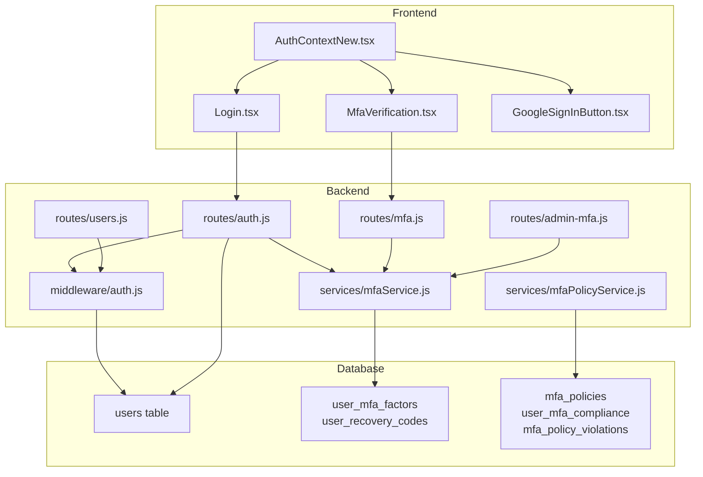
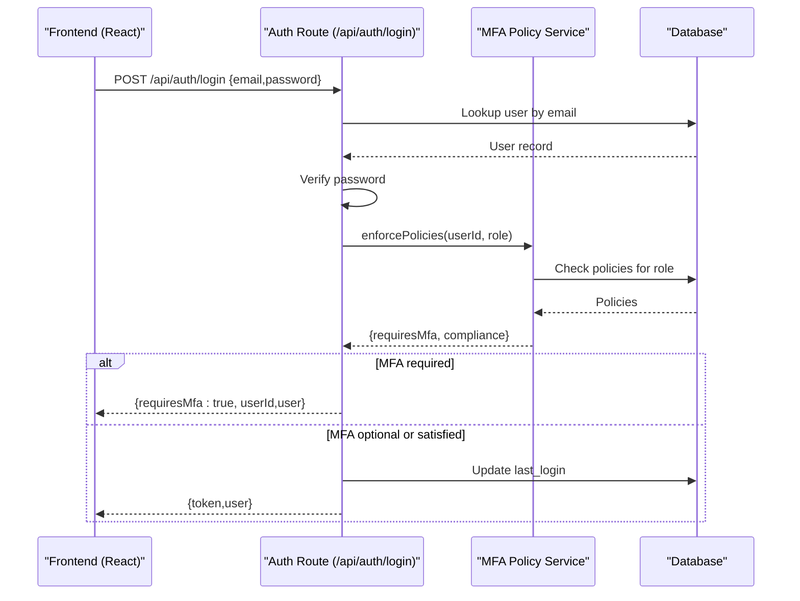
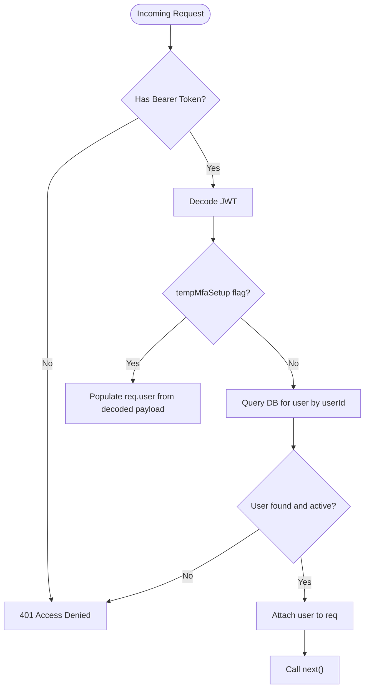
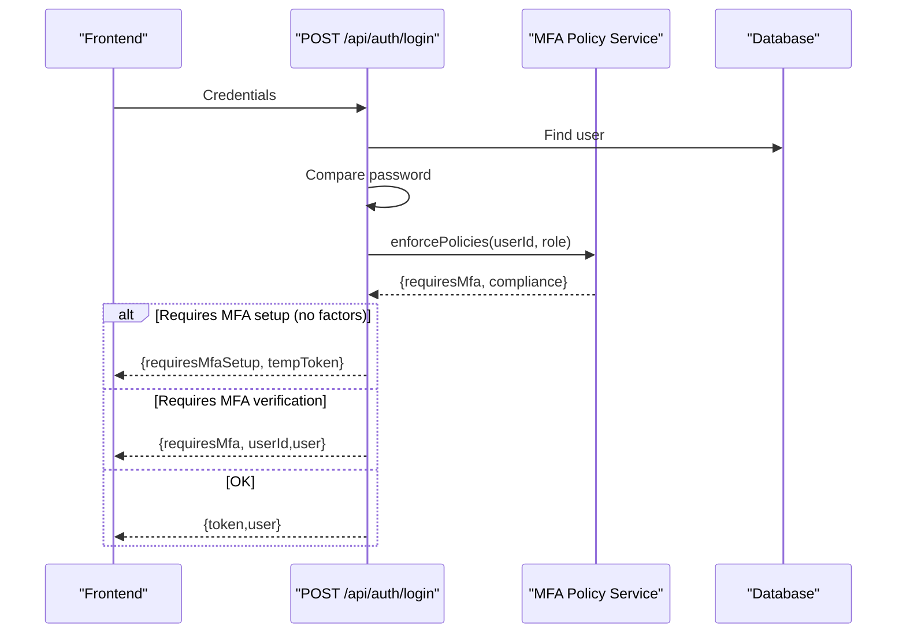
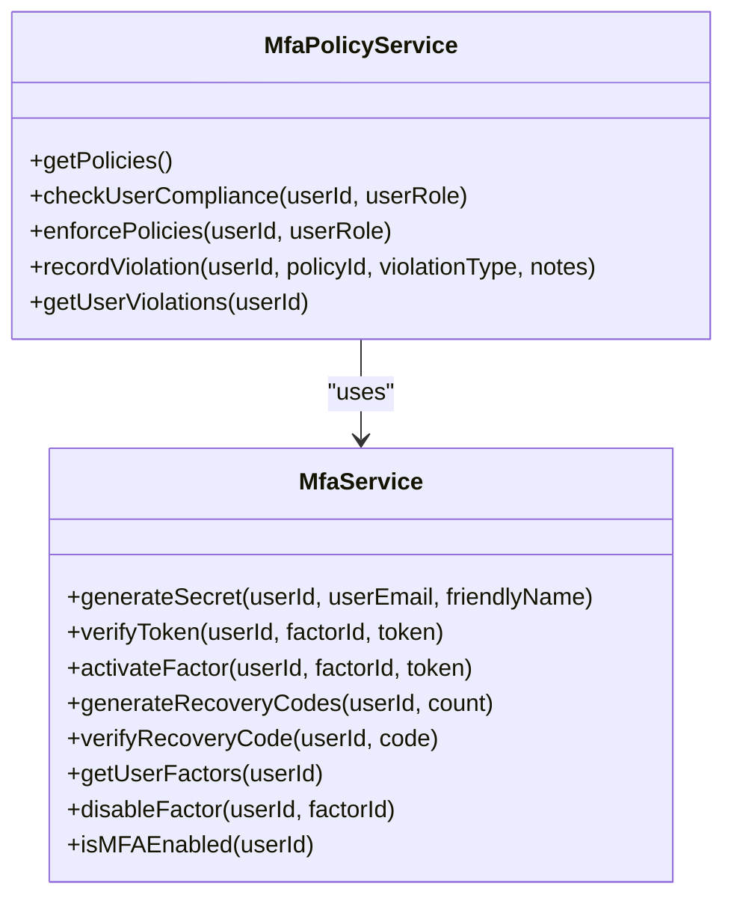
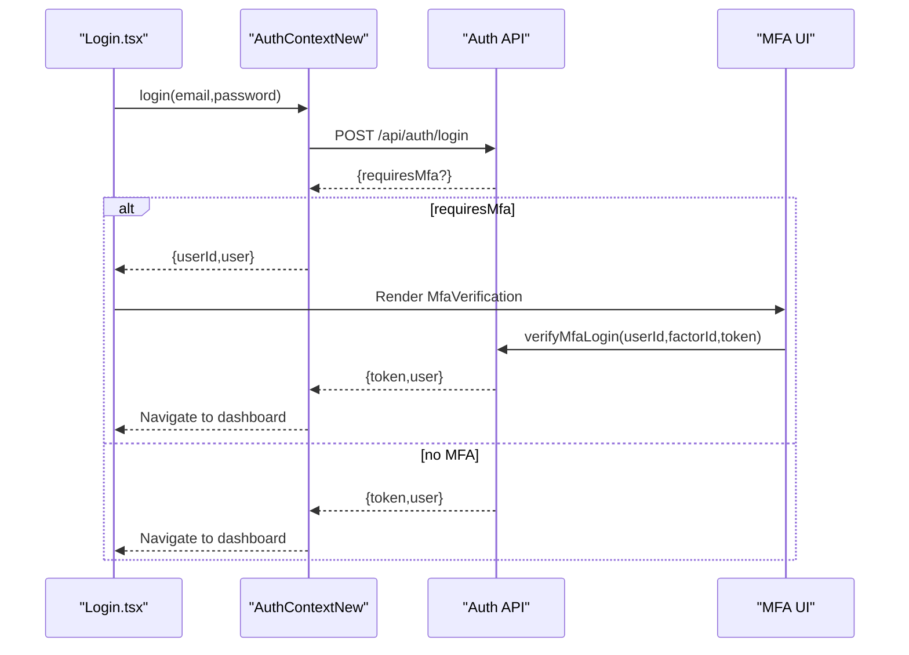
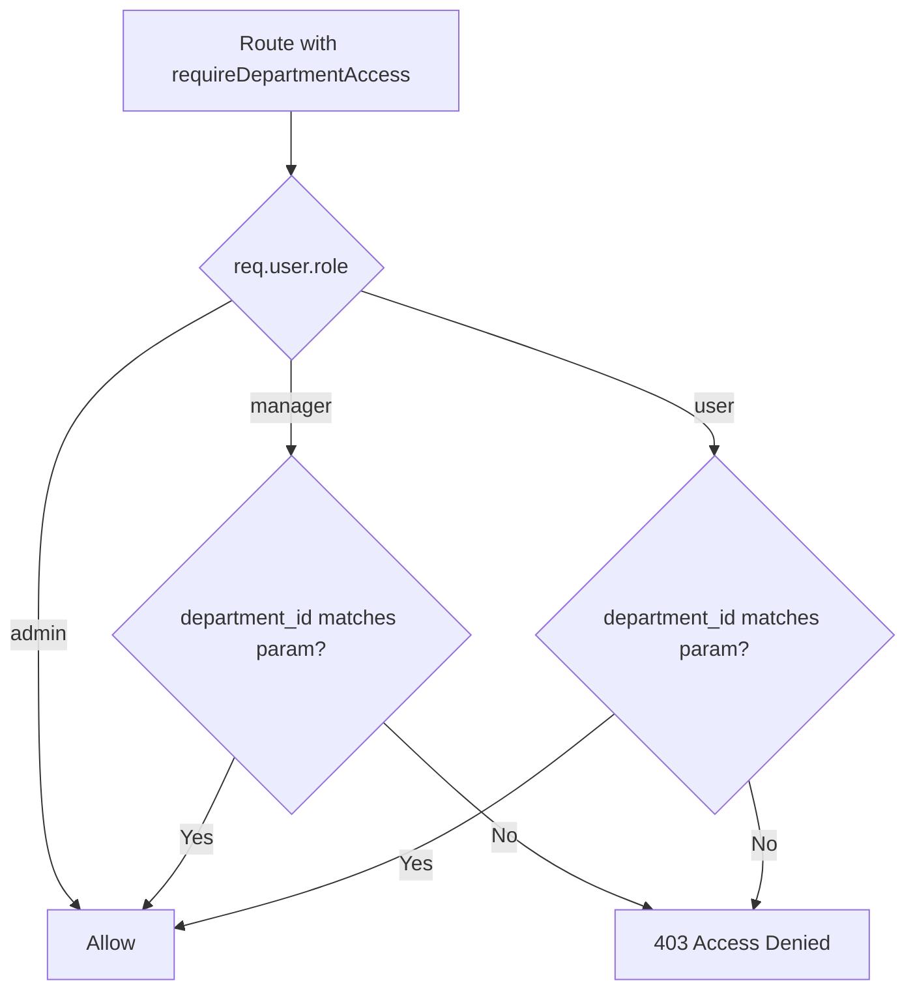
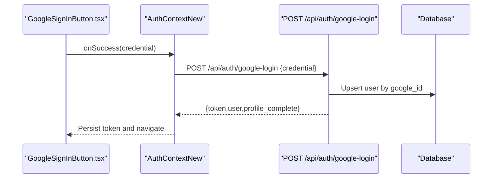
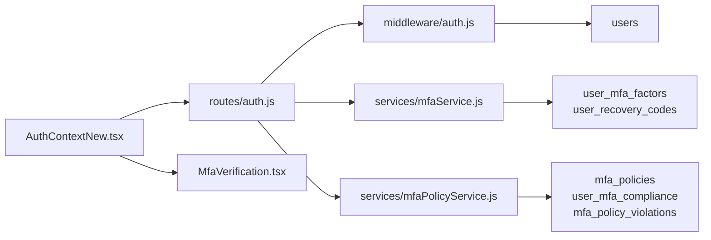

# Authentication & Authorization

## Table of Contents
1. [Introduction](#introduction)
2. [Project Structure](#project-structure)
3. [Core Components](#core-components)
4. [Architecture Overview](#architecture-overview)
5. [Detailed Component Analysis](#detailed-component-analysis)
6. [Dependency Analysis](#dependency-analysis)
7. [Performance Considerations](#performance-considerations)
8. [Troubleshooting Guide](#troubleshooting-guide)
9. [Conclusion](#conclusion)

## Introduction
This document explains the Assets Management System’s authentication and authorization model. It covers:
- Multi-layered authentication: JWT-based sessions, Google OAuth, and MFA enforcement
- Role-based access control (RBAC) with admin, manager, and user roles
- Department-aware access controls and position-based attributes
- Session lifecycle, token generation, and MFA flows
- Practical guard usage, protected route configuration, and session handling
- Security best practices and troubleshooting guidance

## Project Structure
Authentication spans three layers:
- Backend (Express): JWT middleware, login/register flows, MFA services, and RBAC guards
- Frontend (React): Auth context managing tokens and user state, MFA UI, and Google OAuth integration
- Database: Users, departments, MFA factors, and policy tables

## Core Components
- JWT Middleware: Validates bearer tokens, supports temporary MFA setup tokens, and enforces role checks
- Auth Routes: Registration, login, profile, password change, and Google OAuth callbacks
- MFA Services: TOTP secret generation, factor activation, recovery codes, and verification
- MFA Policies: Enforce MFA by role, track compliance, and record violations
- Frontend Auth Context: Stores tokens, orchestrates login/MFA flows, and exposes guards via helpers
- RBAC Guards: Admin-only, manager-or-admin, and department-scoped access

## Architecture Overview
The system uses bearer JWT tokens for session management. On login, the backend verifies credentials, optionally enforces MFA policies, and issues a signed JWT. The frontend stores the token and attaches it to subsequent requests. MFA adds an extra verification step either during login or as a policy requirement.

## Detailed Component Analysis

### JWT Middleware and RBAC Guards
- authenticateToken validates Authorization header, decodes JWT, and loads user details from DB
- Temporary MFA setup tokens bypass DB lookup and populate req.user directly
- Role guards: requireAdmin, requireManager, authorizeRoles
- Department-scoped access: requireDepartmentAccess restricts access by departmentId

### Login and MFA Enforcement Flow
- Login validates credentials, updates last_login, logs activity, and checks MFA policies
- If MFA is required or enabled, responds with requiresMfa or requiresMfaSetup (temporary token)
- MFA verification endpoint accepts factorId/token or recovery code

### MFA Enrollment and Verification
- Enrollment: Generate TOTP secret, QR code, and factor record (inactive)
- Activation: Verify token and mark factor active; enable MFA on user; generate recovery codes
- Verification: Accept factorId+token or recovery code during login
- Admin tools: View MFA status, disable user MFA, regenerate recovery codes

### Frontend Authentication Context and Guards
- AuthContextNew manages:
  - login, verifyMfaLogin, register, googleLogin, logout, updateProfile, changePassword
  - MFA enrollment and verification helpers
  - Initialization with persisted token/profile, including temporary MFA setup tokens
- Guards exposed via helpers: isAuthenticated, isAdmin, isManager
- Login page integrates MFA verification UI and Google OAuth button

### RBAC and Department Access Controls
- Roles: admin, manager, user
- requireAdmin and requireManager guards enforce role-based access
- requireDepartmentAccess ensures users can only access resources in their department (or all for admin/manager)
- Users endpoint demonstrates role-based filtering and manager/admin capabilities

### Google OAuth Integration
- Frontend: GoogleSignInButton renders a styled button and passes credential to googleLogin
- Backend: Adds google_id, profile_complete, avatar_url to users; migration seeds indexes
- Login flow supports Google credentials and redirects to profile completion if needed

## Dependency Analysis
- Frontend depends on AuthContextNew for token/session management and on MFA UI for verification
- Backend routes depend on middleware for auth and on services for MFA and policy logic
- Database schema supports users, MFA factors, recovery codes, and MFA policy records

## Performance Considerations
- Token verification is CPU-light; cache decoded user claims per request if needed
- MFA verification uses cryptographic libraries; avoid excessive retries
- Use pagination and selective field queries for user listings and history
- Indexes on users (e.g., google_id, mfa_enabled) improve lookup performance

## Troubleshooting Guide
Common issues and resolutions:
- 401 Access Denied (No token or invalid/expired token)
  - Ensure Authorization header includes Bearer token
  - Regenerate token after expiration
- 403 Access Denied (Insufficient role/department)
  - Verify user role and department association
  - Use requireAdmin or requireManager appropriately
- MFA Required or Setup Required
  - If requiresMfaSetup, store temporary token and guide user to MFA setup
  - If requiresMfa, render MfaVerification and accept factorId/token or recovery code
- Google OAuth failures
  - Confirm client configuration and credential delivery
  - Check profile_complete flag and redirect to profile completion if needed
- Password reset flow
  - Ensure reset code and token are validated before allowing password change

## Conclusion
The Assets Management System implements a robust, layered authentication and authorization framework:
- JWT-based sessions with strong middleware guards
- Google OAuth for streamlined sign-in
- MFA enforcement driven by configurable policies
- Role-based access control with department-aware boundaries
- Comprehensive frontend context and UI components for seamless user experience

Adhering to the guards and flows outlined here ensures secure, predictable access control across the application.
