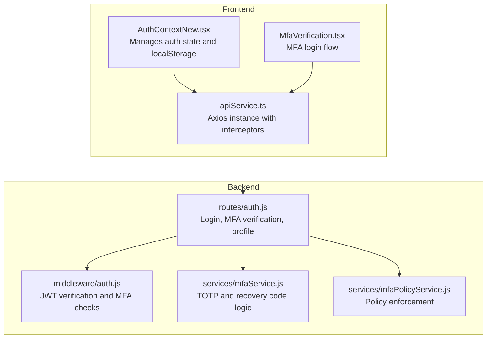
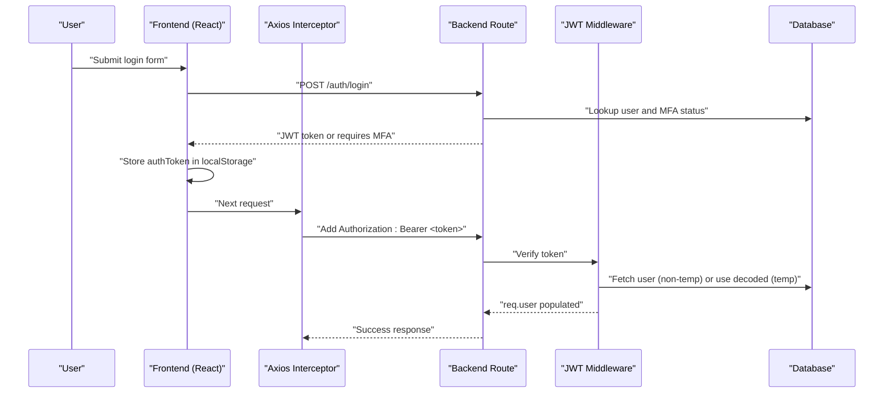
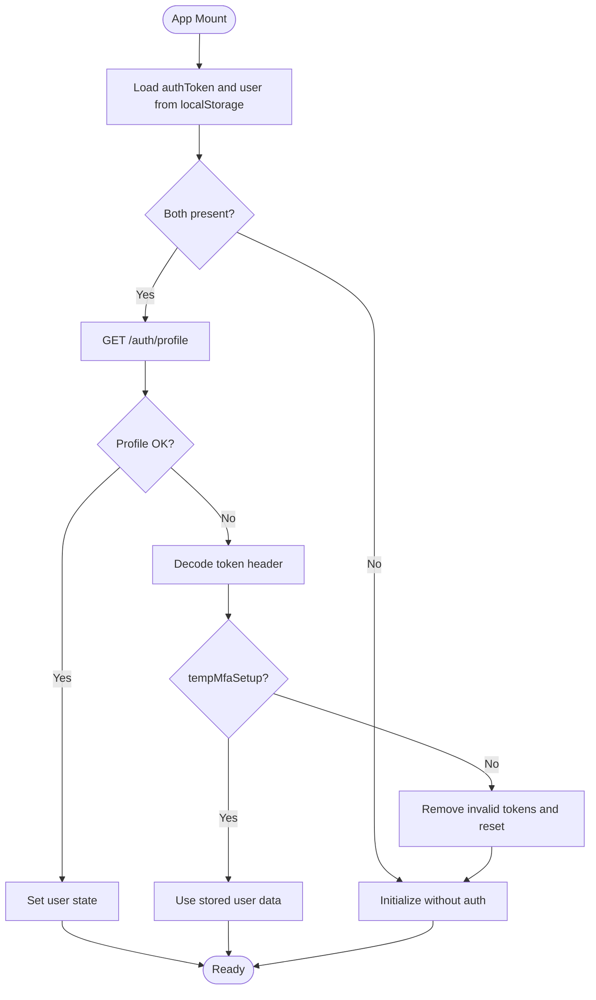
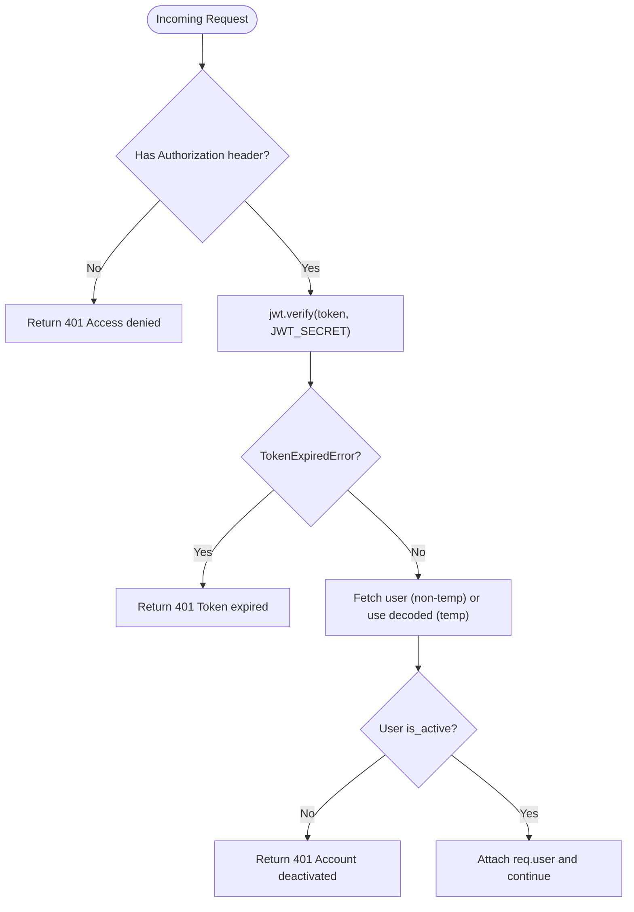
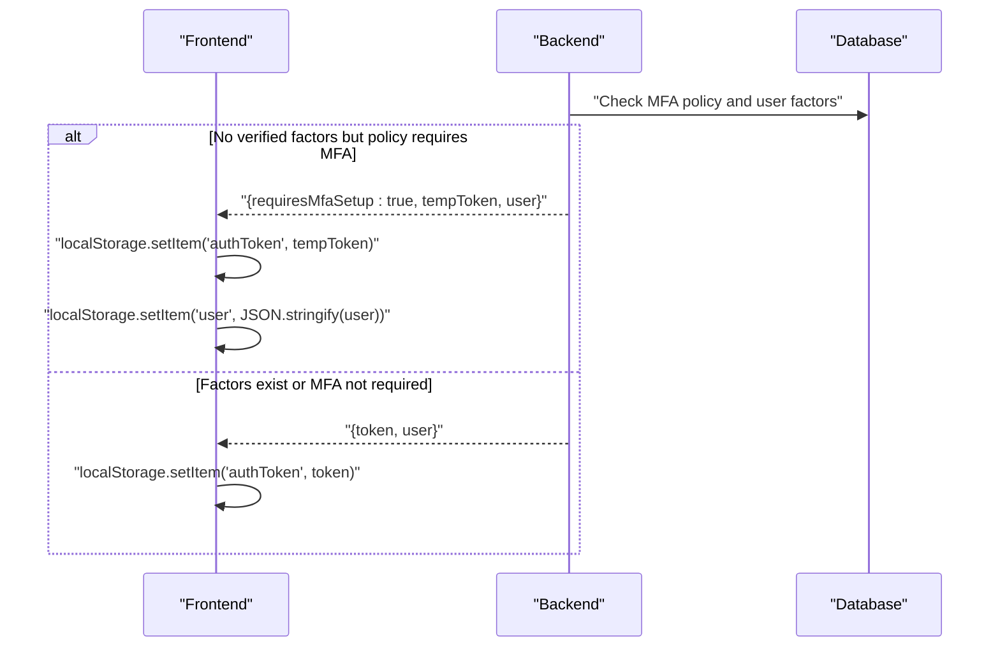
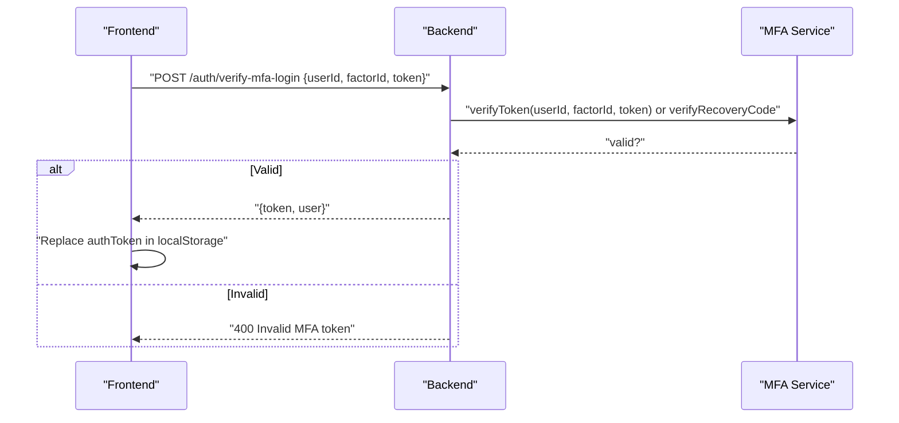
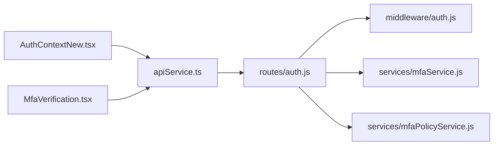

# JWT Token Management

## Table of Contents
1. [Introduction](#introduction)
2. [Project Structure](#project-structure)
3. [Core Components](#core-components)
4. [Architecture Overview](#architecture-overview)
5. [Detailed Component Analysis](#detailed-component-analysis)
6. [Dependency Analysis](#dependency-analysis)
7. [Performance Considerations](#performance-considerations)
8. [Troubleshooting Guide](#troubleshooting-guide)
9. [Conclusion](#conclusion)

## Introduction
This document explains JWT token management in the Assets Management System, covering the complete lifecycle from creation to expiration, secure storage in localStorage, token verification, and special handling for temporary MFA setup tokens. It also documents automatic error handling for expired tokens, practical examples of token usage in API requests, and security best practices to prevent token theft.

## Project Structure
The token management spans frontend and backend components:
- Frontend: React context manages authentication state, stores tokens in localStorage, and attaches Authorization headers to outgoing requests.
- Backend: Express middleware verifies JWT tokens, enforces MFA policies, and issues JWT tokens with appropriate claims and expiration.

## Core Components
- Frontend Auth Context: Initializes auth state from localStorage, handles login and MFA flows, stores tokens and user data, and clears invalid tokens.
- Axios Interceptors: Automatically attach Authorization headers to all requests and handle 401 responses by clearing localStorage and redirecting to login.
- Backend Middleware: Validates JWT tokens, supports temporary MFA setup tokens, and rejects expired or invalid tokens.
- Routes: Issue JWT tokens on login, support MFA verification, and enforce MFA policies including temporary access for setup.
- MFA Services: Provide TOTP verification, recovery code validation, and policy-driven enforcement.

## Architecture Overview
The system uses bearer tokens with Authorization headers. Tokens are signed by the backend and verified by the middleware. Temporary MFA setup tokens are supported for policy-driven MFA enrollment.

## Detailed Component Analysis

### Token Lifecycle and Storage
- Creation: Backend signs JWT with userId, email, role, and optional tempMfaSetup claim. Expiration is controlled via environment configuration.
- Storage: Frontend stores the token and user data in localStorage upon successful login or MFA verification.
- Retrieval: On app initialization, frontend reads localStorage, validates the token via a profile call, and sets the auth state. For temporary MFA setup tokens, it decodes the token header and uses stored user data.

### Token Verification and Expiration Handling
- Backend verification: Uses jsonwebtoken to verify the signature and handle TokenExpiredError. For temporary MFA setup tokens, it avoids DB lookup and constructs req.user from decoded claims.
- Frontend error handling: On 401 responses, interceptors remove tokens and redirect to login (except on public auth routes).

### Temporary MFA Setup Tokens
- Generation: During login, if MFA is required by policy but the user has no verified factors, the backend issues a temporary token with tempMfaSetup flag and 24-hour expiry.
- Frontend handling: After login, if requiresMfaSetup is returned, the frontend stores the temp token and redirects to MFA setup. On subsequent loads, it detects the temp token and uses stored user data.

### MFA Login Flow and Token Issuance
- The frontend triggers MFA verification with either a TOTP factor or a recovery code. On success, the backend issues a new JWT token and returns it to the frontend, which replaces the stored token.

### Token Usage in API Requests
- Authorization header: Axios interceptor automatically adds Authorization: Bearer <token> when authToken exists in localStorage.
- Cookies: withCredentials is enabled to support session-like behavior if needed by the backend.

### Payload Structure and Claims
- Standard JWT: userId, email, role, department_id (when applicable).
- Temporary MFA setup token: Includes tempMfaSetup flag and extended expiry window for setup completion.

## Dependency Analysis
- Frontend depends on:
  - AuthContextNew for state and token storage.
  - apiService for HTTP requests and interceptors.
  - MfaVerification for MFA login UX.
- Backend depends on:
  - jsonwebtoken for signing and verifying tokens.
  - bcrypt for password hashing.
  - MFA service for TOTP and recovery code verification.
  - MFA policy service for policy-driven enforcement.

## Performance Considerations
- Token verification occurs per request; keep JWT_SECRET secure and avoid excessive middleware overhead.
- Minimize DB queries by relying on decoded claims for temporary tokens and caching user roles/departments where appropriate.
- Use short-lived tokens for sensitive operations and rely on refresh mechanisms if introduced later.

## Troubleshooting Guide
Common issues and resolutions:
- 401 Unauthorized on API calls:
  - Cause: Missing or invalid Authorization header.
  - Resolution: Ensure localStorage contains a valid authToken; the interceptor adds the header automatically. If a 401 occurs, the interceptor clears localStorage and redirects to login.
- Token expired:
  - Cause: JWT expired according to backend configuration.
  - Resolution: Trigger re-authentication; temporary MFA setup tokens expire after 24 hours.
- Temporary MFA setup token not recognized:
  - Cause: Attempting to use a temp token for protected routes without proper handling.
  - Resolution: Use the dedicated MFA setup flow; the frontend recognizes tempMfaSetup and uses stored user data.
- MFA verification failure:
  - Cause: Incorrect TOTP code or recovery code misuse.
  - Resolution: Regenerate codes or confirm authenticator time sync; ensure recovery codes are used only once.

## Conclusion
The Assets Management System implements robust JWT-based authentication with secure token storage, automatic error handling for expired tokens, and special handling for temporary MFA setup tokens. The frontend and backend collaborate to ensure seamless user experiences while maintaining strong security posture. Adopt the documented best practices to further harden token handling and reduce theft risks.
