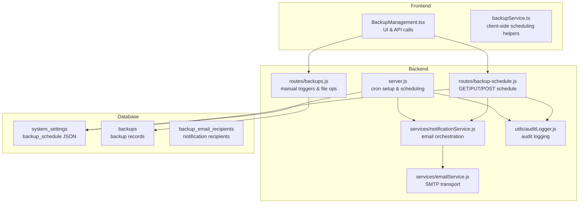
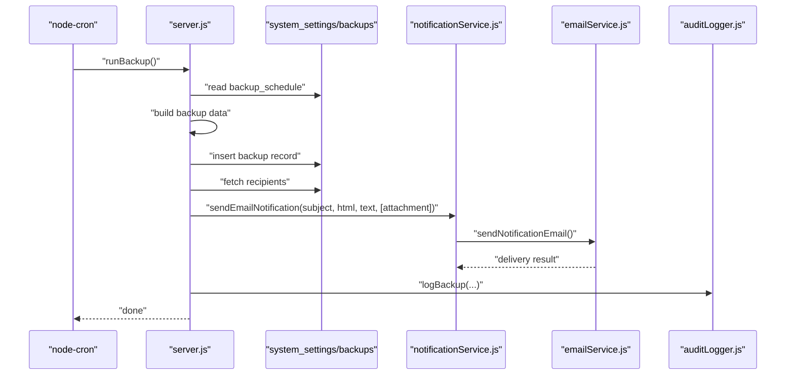
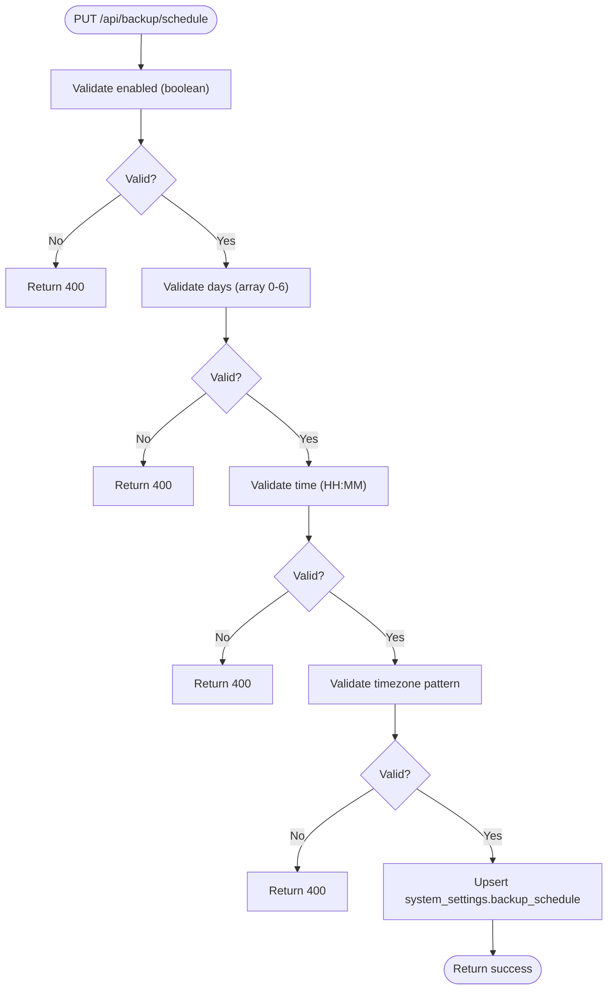
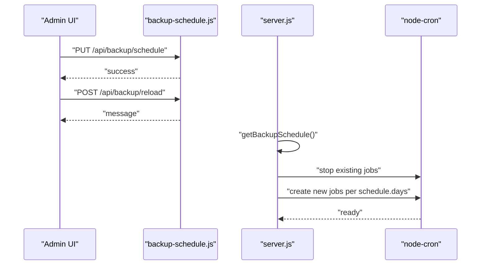
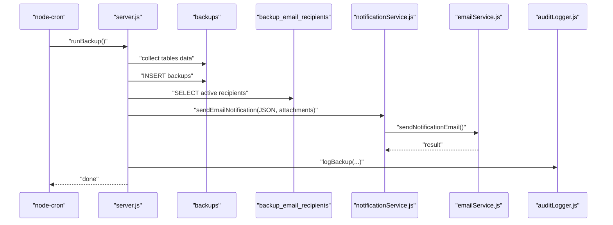
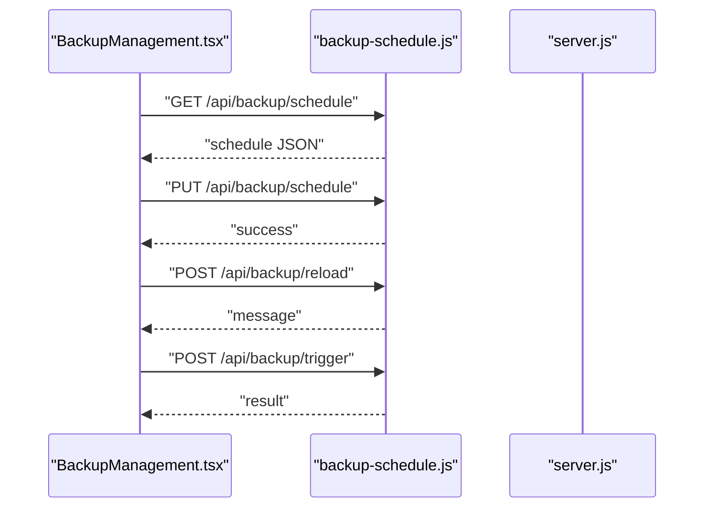
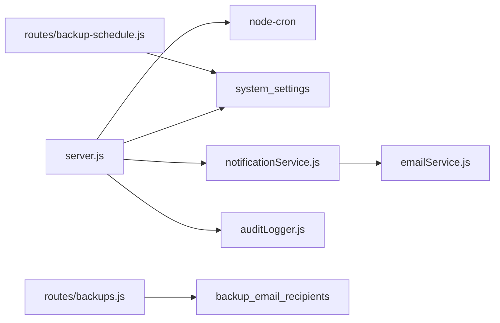

# Automated Backup Scheduling

## Table of Contents
1. [Introduction](#introduction)
2. [Project Structure](#project-structure)
3. [Core Components](#core-components)
4. [Architecture Overview](#architecture-overview)
5. [Detailed Component Analysis](#detailed-component-analysis)
6. [Dependency Analysis](#dependency-analysis)
7. [Performance Considerations](#performance-considerations)
8. [Troubleshooting Guide](#troubleshooting-guide)
9. [Conclusion](#conclusion)

## Introduction
This document explains the Automated Backup Scheduling system, focusing on cron-based scheduling, configuration of backup frequency and timezone, and integration with backup creation and notifications. It covers how to configure backup days of week, specific times, and timezone settings; schedule validation and testing; cron job reloading; enable/disable functionality; schedule persistence; and real-time schedule updates. It also documents examples of scheduling patterns, backup window management, conflict resolution, and notification triggers for scheduled backups.

## Project Structure
The backup scheduling system spans backend and frontend components:
- Backend server initializes cron jobs and persists schedule settings in the database.
- Routes expose endpoints to fetch/update schedule, reload cron jobs, and trigger backups.
- Frontend provides a UI to configure schedule, test backups, and manage recipients.
- Database tables store backups and backup email recipients.
- Services handle email delivery and audit logging.

## Core Components
- Schedule persistence: stored in system_settings under key backup_schedule as JSON with fields enabled, days, time, timezone, updated_at.
- Cron setup: reads schedule and creates node-cron jobs for each selected day-of-week at the configured time and timezone.
- Validation: backend validates enabled (boolean), days (non-empty array of integers 0–6), time (HH:MM 24-hour), and timezone (basic pattern).
- Testing: manual trigger endpoints create backups and email recipients.
- Recipients: backup_email_recipients table stores active recipients; fallback to admin emails if none configured.
- Audit logging: backup operations logged centrally for compliance.

## Architecture Overview
The system uses a cron-based scheduler that:
- Loads schedule from system_settings.
- Creates a cron job per selected day-of-week with the configured time and timezone.
- On schedule match, executes a backup routine that:
  - Collects data from relevant tables.
  - Stores a backup record in the backups table.
  - Emails JSON backup to recipients (or admins if no recipients).
  - Logs the operation in audit_logs.

## Detailed Component Analysis

### Schedule Persistence and Validation
- Storage: system_settings table holds backup_schedule as JSON. Upsert ensures idempotent updates.
- Validation rules:
  - enabled: boolean
  - days: non-empty array of integers 0–6 (Sunday–Saturday)
  - time: HH:MM 24-hour format
  - timezone: basic pattern check; defaults to process.env.TZ or UTC
- Defaults: if no persisted schedule, server returns enabled: true, days: [1], time: '02:00', timezone: process.env.TZ or UTC.

### Cron Job Setup and Real-time Updates
- The server loads the schedule and creates a cron job for each selected day-of-week.
- Cron expression: minutes hours * * day-of-week.
- Timezone: uses schedule.timezone or process.env.TZ; jobs scheduled with timezone option.
- Reloading: POST /api/backup/reload endpoint signals that changes will take effect after restart; cron jobs are updated on the next cycle.

### Backup Creation and Notification Triggers
- Scheduled backups:
  - Collect data from relevant tables.
  - Insert a record into backups with metadata and backup_data.
  - Email JSON attachment to backup_email_recipients; fallback to admin emails if empty.
  - Log backup creation in audit_logs.
- Manual testing:
  - POST /api/backup/trigger creates a backup and emails recipients.
  - Uses mysqldump to generate SQL backups and gzip compression for .sql.gz files.

### Frontend Configuration and Testing
- UI loads current schedule, allows toggling enable/disable, selecting days, setting time, and choosing timezone.
- Saving persists schedule via PUT /api/backup/schedule and triggers POST /api/backup/reload.
- Test backup button triggers POST /api/backup/trigger and refreshes file list.

### Examples of Scheduling Patterns
- Daily at 02:00 on weekdays: enabled true, days [1,2,3,4,5], time '02:00', timezone 'Africa/Nairobi'.
- Weekly on Sundays at 03:30: enabled true, days [0], time '03:30', timezone 'UTC'.
- Weekend backups on Saturdays at 22:00: enabled true, days [6], time '22:00', timezone 'America/New_York'.

Notes:
- Days are 0–6 (Sunday–Saturday).
- Time uses 24-hour HH:MM format.
- Timezone should be a valid IANA identifier; defaults applied if missing.

### Backup Window Management and Conflict Resolution
- Window management:
  - Cron jobs are scheduled per selected day-of-week at the configured time and timezone.
  - Multiple days can be selected; one cron job runs per selected day.
- Conflict resolution:
  - Duplicate days are normalized by deduplication and sorting before persistence.
  - If no recipients configured, system falls back to admin emails.
  - If schedule disabled, no cron jobs are created.

### Integration with Backup Creation Process
- Scheduled backups:
  - Data collection from tables.
  - Insert into backups with metadata and backup_data.
  - Email JSON attachment to recipients.
- Manual backups:
  - JSON backup creation and email.
  - SQL dump generation with gzip compression and email attachment.

## Dependency Analysis
- server.js depends on:
  - node-cron for scheduling.
  - system_settings for schedule persistence.
  - notificationService and emailService for notifications.
  - auditLogger for audit trails.
- backup-schedule.js depends on:
  - system_settings for schedule storage.
  - database configuration for upsert.
- backups.js depends on:
  - mysqldump for SQL dumps.
  - backup_email_recipients for recipients.
  - auditLogger for backup logs.

## Performance Considerations
- Cron job overhead: one job per selected day-of-week; minimal overhead for typical weekday selections.
- Backup size: JSON backups can be large; consider retention and cleanup strategies.
- Email throughput: batch sending to multiple recipients; ensure SMTP configuration is optimized.
- Database writes: backups table inserts with JSON payloads; ensure indexes and storage capacity.

## Troubleshooting Guide
Common issues and resolutions:
- Schedule not taking effect:
  - Confirm PUT /api/backup/schedule succeeded and POST /api/backup/reload was called.
  - Restart server to apply changes immediately if needed.
- No backups created:
  - Verify schedule.enabled is true and days include today’s day-of-week.
  - Check cron timezone matches expected local time.
- Recipients not receiving emails:
  - Ensure backup_email_recipients entries exist and is_active is true.
  - Verify SMTP settings in system_settings and environment variables.
- Audit logs not recorded:
  - Confirm audit_logger initialization and database connectivity.

## Conclusion
The Automated Backup Scheduling system provides a robust, configurable solution for periodic backups with timezone-aware scheduling, recipient-driven notifications, and comprehensive audit logging. Administrators can easily define backup windows, validate configurations, test backups, and monitor outcomes through centralized logging and email notifications.
