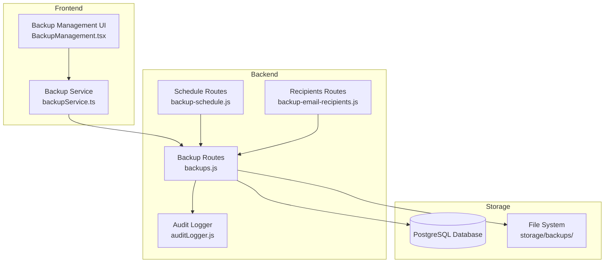
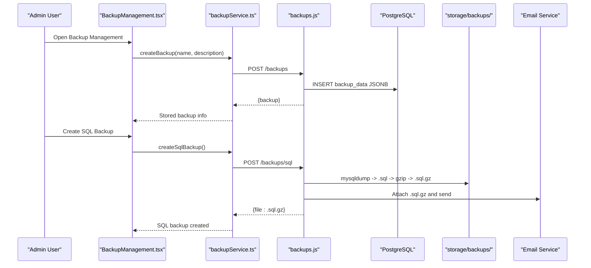
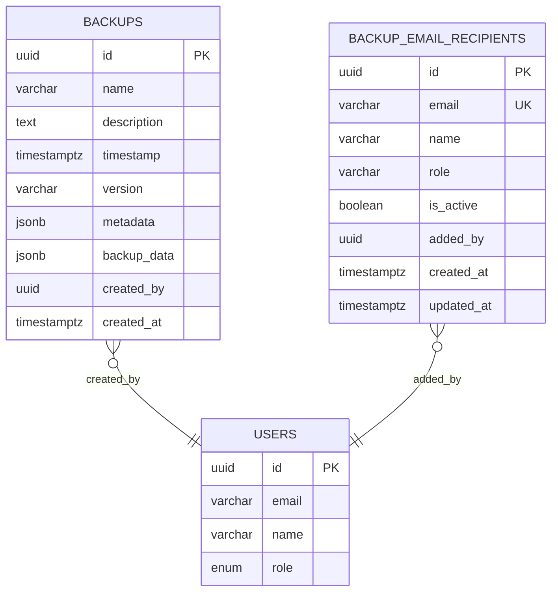
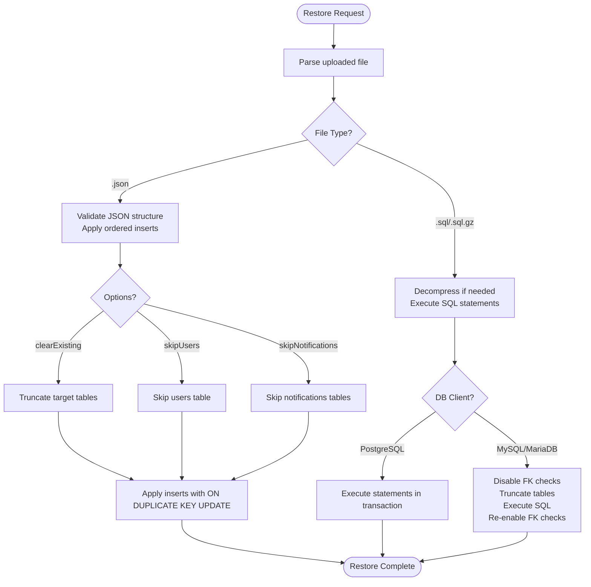
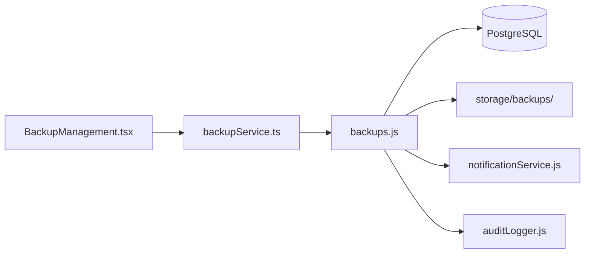

# Backup Types & Storage Management

## Table of Contents
1. [Introduction](#introduction)
2. [Project Structure](#project-structure)
3. [Core Components](#core-components)
4. [Architecture Overview](#architecture-overview)
5. [Detailed Component Analysis](#detailed-component-analysis)
6. [Dependency Analysis](#dependency-analysis)
7. [Performance Considerations](#performance-considerations)
8. [Troubleshooting Guide](#troubleshooting-guide)
9. [Conclusion](#conclusion)

## Introduction
This document explains the backup system architecture, supported backup formats, storage management, and operational workflows. It covers JSON backups (stored in the database), SQL backups (generated as .sql and compressed .sql.gz files), and the administrative capabilities to list, download, delete, and restore from stored files. It also documents storage locations, naming conventions, metadata management, capacity considerations, integrity checks, and security controls.

## Project Structure
The backup system spans three layers:
- Backend Express routes for backup orchestration, file storage, and restoration
- Frontend service layer for user interactions and API communication
- Database schema for storing JSON backups and managing recipients

## Core Components
- Backup formats:
  - JSON backups: Full system snapshots stored in the database as JSONB fields
  - SQL backups: Generated dumps exported to .sql files and compressed to .sql.gz for transport and archival
- Storage locations:
  - Database: JSON backups stored in the backups table
  - File system: .sql and .sql.gz files stored under backend/storage/backups/
- Metadata management:
  - JSON backups include metadata such as counts and sizes
  - SQL files expose name, size, and modification time
- Access control:
  - Admin-only endpoints and RLS policies restrict access to backups and recipients

## Architecture Overview
The backup system supports two primary workflows:
- Database-centric JSON backups stored in Postgres
- File-based SQL backups generated on-demand and optionally emailed to recipients

## Detailed Component Analysis

### Backup Formats and Storage Locations
- JSON backups
  - Stored in the backups table with metadata and backup_data as JSONB
  - Admin-only creation and restoration endpoints
  - Optional email delivery for manual triggers
- SQL backups
  - Generated via mysqldump and compressed to .sql.gz
  - Stored on the server filesystem under backend/storage/backups/
  - Available for download, deletion, and server-side restoration

### Backup File Organization and Naming Conventions
- SQL backup naming pattern:
  - Base name: backup_<YYYY-MM-DD_HH-MM-SS>
  - Extensions: .sql (uncompressed), .sql.gz (compressed)
- JSON backup naming:
  - Stored in database; filenames are derived from the generated .sql.gz or used for download attachments
- File listing:
  - Filters by .sql.gz, .sql, and .json extensions
  - Returns name, size, and modified timestamp

### Backup File Listing, Filtering, and Metadata
- Endpoint: GET /backups/files
- Behavior:
  - Reads storage directory
  - Filters supported backup files
  - Returns array with name, size (bytes), and modified (timestamp)
  - Sorted by modification time (newest first)

### Backup Operations: Download, Deletion, Restoration
- Download
  - GET /backups/files/:name streams the file with appropriate Content-Type
  - Supports .sql.gz, .sql, and .json
- Delete
  - DELETE /backups/files/:name removes the file after validating type and existence
- Restore from server file
  - POST /backups/restore-file accepts a filename and restores the database
  - Handles both .sql and .sql.gz by decompression when needed
- Restore from uploaded file
  - POST /backups/restore accepts multipart/form-data with .json, .sql, or .sql.gz
  - Validates JSON structure and applies data to tables in a defined order
  - Supports options: clearExisting, skipUsers, skipNotifications

### JSON Backup Management
- Creation
  - POST /backups creates a JSON backup and stores it in the database
- Retrieval
  - GET /backups lists backups with pagination and optional search
  - GET /backups/:id retrieves a specific backup
- Restoration
  - POST /backups/:id/restore-json restores from stored JSON backup
  - Supports clearExisting option

### SQL Backup Generation and Email Delivery
- Endpoint: POST /backups/sql
- Process:
  - Generate .sql using mysqldump
  - Compress to .sql.gz
  - Remove uncompressed .sql
  - Email recipients with attachment
- Manual trigger for testing:
  - POST /backup/trigger generates a .sql.gz and emails recipients

### Backup Email Recipients Management
- Endpoints:
  - GET /backup-email-recipients: list recipients
  - POST /backup-email-recipients: add recipient
  - PUT /backup-email-recipients/:id: update email/is_active
  - DELETE /backup-email-recipients/:id: remove recipient
- Validation and deduplication enforced
- RLS policies restrict access to admins

### Backup Scheduling
- Endpoints:
  - GET /backup/schedule: retrieve schedule
  - PUT /backup/schedule: update schedule (enabled, days, time, timezone)
  - POST /backup/reload: signal schedule reload
- Frontend integrates with backupService to compute next backup times and trigger backups

### Frontend Backup Management UI
- Capabilities:
  - Create JSON backups
  - List, download, and delete SQL backup files
  - Restore from uploaded or previously downloaded files
  - Configure backup schedule and recipients
- Uses backupService for API interactions

## Dependency Analysis
- Backend dependencies
  - Express routes depend on database configuration and filesystem utilities
  - mysqldump for SQL generation
  - zlib for compression/decompression
  - notificationService for email delivery
- Frontend dependencies
  - axios for API calls
  - react-router-dom for navigation
  - lucide-react for icons

## Performance Considerations
- SQL backup generation
  - Large databases may produce substantial .sql files; compression reduces transfer and storage costs
  - Disabling foreign key checks during restore minimizes constraint overhead
- JSON backup storage
  - JSONB fields enable fast retrieval and indexing on timestamp and created_by
  - Pagination recommended for listing backups to avoid large payloads
- File listing
  - Filtered reads and sorting by modified time optimize UI responsiveness

## Troubleshooting Guide
- Common issues and resolutions
  - File not found when downloading or deleting: verify filename and extension; ensure it matches supported types
  - Restore failures: check database connectivity, permissions, and whether FK checks were properly toggled
  - JSON restore validation errors: ensure uploaded JSON contains required tables and structure
  - Email delivery failures: verify SMTP configuration and recipient list
- Logging and auditing
  - Backup operations are logged via auditLogger with action types BACKUP_CREATE, BACKUP_RESTORE, etc.
  - Use audit logs to track who performed actions, timestamps, and details

## Conclusion
The backup system provides robust support for both database-centric JSON backups and file-based SQL backups with comprehensive administrative controls. It offers secure, audited operations, flexible restoration options, and integrations for scheduling and email delivery. Administrators can manage storage, monitor backups, and maintain data integrity with built-in validations and logging.
