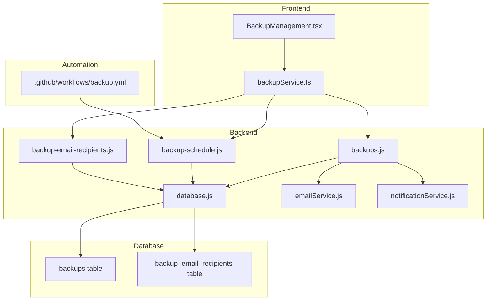
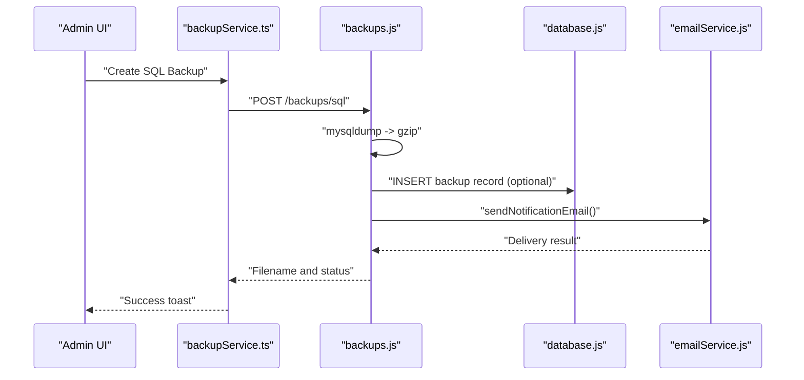
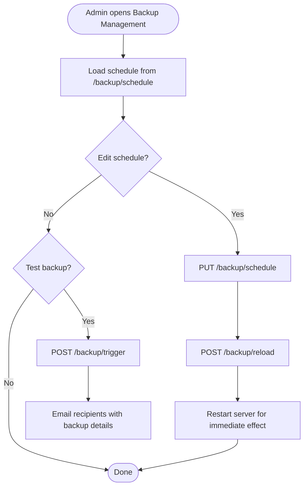
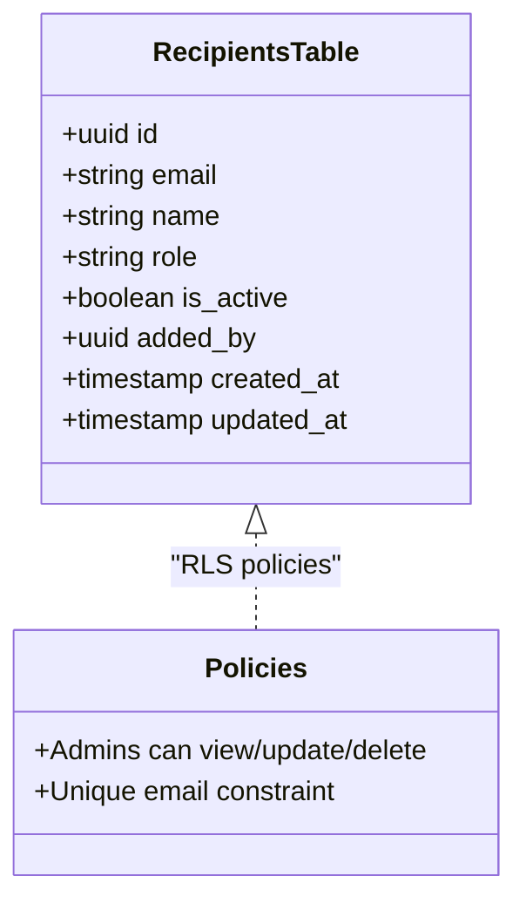
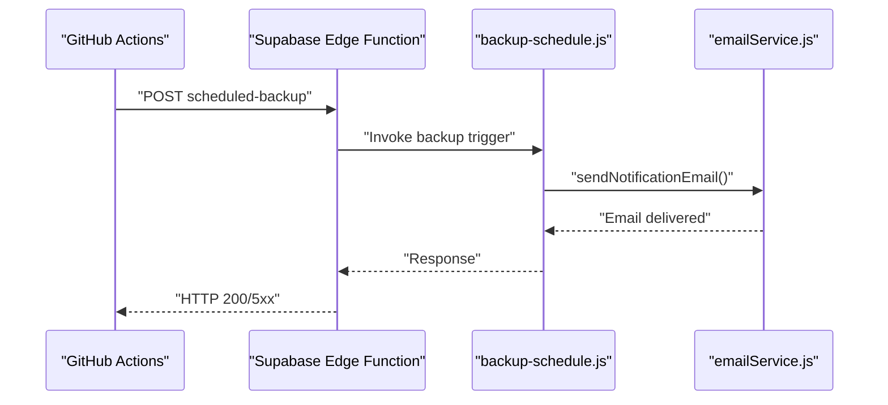
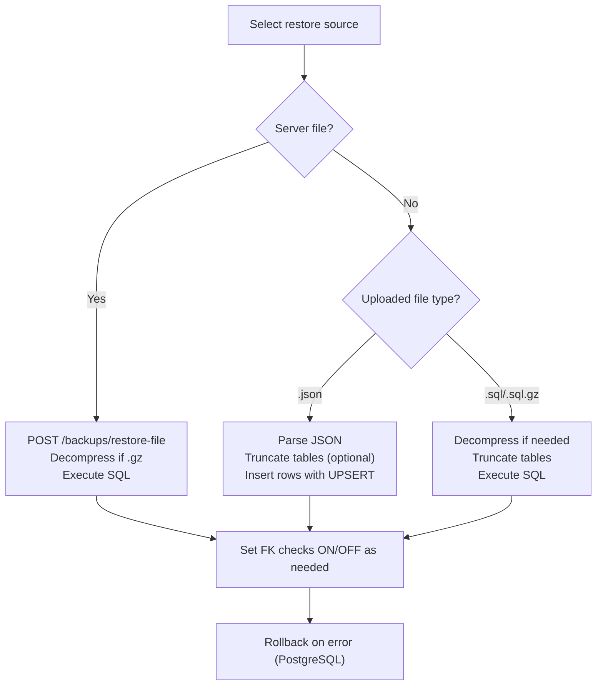
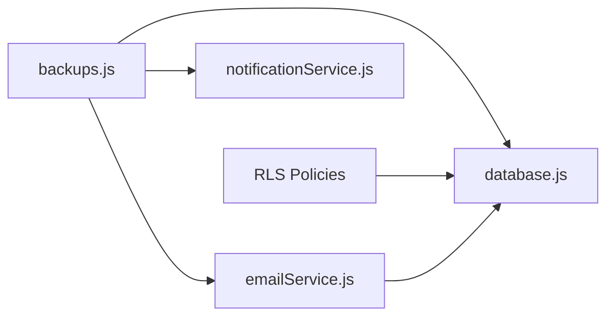

# Backup & Recovery System

## Table of Contents
1. [Introduction](#introduction)
2. [Project Structure](#project-structure)
3. [Core Components](#core-components)
4. [Architecture Overview](#architecture-overview)
5. [Detailed Component Analysis](#detailed-component-analysis)
6. [Dependency Analysis](#dependency-analysis)
7. [Performance Considerations](#performance-considerations)
8. [Troubleshooting Guide](#troubleshooting-guide)
9. [Conclusion](#conclusion)
10. [Appendices](#appendices)

## Introduction
This document describes the Backup and Recovery System for the Assets Management application. It covers the automated backup architecture, scheduling mechanisms, storage options, backup types, email recipient system, notification triggers, failure alerts, restoration workflows, data integrity verification, rollback procedures, compression and encryption considerations, monitoring, retention policies, and operational procedures for testing and disaster recovery.

## Project Structure
The backup system spans backend API routes, frontend administration pages, services, database migrations, and CI/CD automation:
- Backend routes expose endpoints for creating, listing, downloading, deleting, restoring backups, and managing backup schedules and recipients.
- Frontend pages provide administrative controls for configuring schedules, managing recipients, and performing manual backups/restores.
- Services encapsulate backup operations and integrate with the database and email systems.
- Database migrations define the backups and recipients tables with Row Level Security (RLS) policies.
- GitHub Actions automates periodic backups via a Supabase Edge Function.

## Core Components
- Backup API Routes: Full CRUD and restore operations for backups, including JSON and SQL formats, and server-side file management.
- Backup Schedule Management: Configure days, time, timezone, and enable/disable automatic backups; supports manual trigger and reload.
- Backup Email Recipients: Manage recipients with activation/deactivation and deduplication.
- Backup Service: Frontend wrapper around API endpoints for creating, listing, downloading, restoring, and managing backups.
- Email Service: SMTP-backed email delivery for backup notifications with branded templates.
- Database Schema: Backups and recipients tables with RLS policies and indexes.
- Automation: GitHub Actions workflow invoking a Supabase Edge Function for scheduled backups.

## Architecture Overview
The system integrates frontend, backend, database, and external automation:
- Admins configure schedules and recipients in the UI.
- Backend routes validate permissions, build backups, and optionally email recipients.
- Database stores backup records and maintains RLS policies.
- GitHub Actions invokes a Supabase Edge Function to trigger backups periodically.

## Detailed Component Analysis

### Backup Types and Storage Options
- JSON backups: Full system snapshot stored in the database as structured JSON with metadata and table rows.
- SQL backups: Server-side SQL dumps compressed to .sql.gz and optionally emailed to recipients.
- Server-side files: Backups are stored under a dedicated storage directory and can be listed, downloaded, and deleted.

Key behaviors:
- JSON backup creation persists a complete dataset to the backups table with JSONB fields.
- SQL backup creation uses mysqldump, compresses to .sql.gz, and emails the file to configured recipients.
- Server-side file management supports listing, downloading, and deleting backup files.

### Automated Backup Scheduling
- Schedule configuration includes enabled flag, days of week, time, and timezone.
- Validation ensures days are integers 0–6, time is HH:MM, and timezone matches expected pattern.
- Manual trigger endpoint generates a backup and emails recipients.
- Frontend loads and saves schedule, with a reload note advising server restart for immediate effect.

### Backup Email Recipient System
- Recipients table with unique email, activation flag, and audit timestamps.
- RLS policies restrict access to admins.
- Frontend supports adding, updating (including activation toggle), and deleting recipients.
- Backup creation emails recipients either from the recipients table or falls back to admin emails.

### Notification Triggers and Failure Alerts
- Backup creation endpoints send email notifications to recipients with detailed metadata.
- Email service initializes from database SMTP settings and renders branded HTML.
- GitHub Actions workflow triggers a Supabase Edge Function and reports success/failure.

### Restoration Workflows and Rollback Procedures
- Restore from server file: Decompresses .sql.gz if needed and executes SQL against the target database client (MySQL/MariaDB or PostgreSQL).
- Restore from uploaded file: Supports JSON and SQL formats with ordered table restoration and foreign key handling.
- Restore from DB-stored JSON backup: Uses pre-indexed table order and UPSERT logic to rebuild data.

### Compression, Encryption, and Security Measures
- Compression: SQL backups are compressed to .sql.gz prior to emailing.
- Encryption: No native encryption is implemented in the backup pipeline; sensitive data should be protected at rest and in transit per organizational policy.
- Security: RLS policies protect backups and recipients; admin-only endpoints enforce access control; SMTP credentials are loaded from database/environment.

### Monitoring, Retention, and Storage Management
- Monitoring: Frontend lists server-side backup files with size and modification time; SQL backup creation returns file metadata for logging.
- Retention: No built-in retention policy is enforced in the code; administrators can delete files via the API.
- Storage: Backups are stored on disk under a designated directory and can be listed, downloaded, and deleted.

### Backup Testing and Disaster Recovery Planning
- Testing: Manual backup trigger via admin UI and API; GitHub Actions workflow provides automated daily execution.
- DR Planning: Use JSON backups for cross-platform portability and SQL backups for quick restoration; maintain multiple recipients and verify email delivery.

## Dependency Analysis
The backup system relies on several backend services and database configurations:
- database.js abstracts MySQL/MariaDB and PostgreSQL clients and provides unified query execution.
- emailService.js centralizes SMTP initialization and branded email rendering.
- notificationService.js orchestrates email delivery and related notifications.

## Performance Considerations
- Large JSON backups: Consider chunking or streaming for very large datasets to reduce memory usage.
- SQL dumps: Compression reduces I/O and network overhead; ensure sufficient disk space before generating dumps.
- Email throughput: Batch recipient emails and monitor SMTP limits; consider rate limiting.
- Database operations: Use transactions and disable foreign key checks temporarily during restores for speed; re-enable after completion.

## Troubleshooting Guide
Common issues and resolutions:
- Access denied: Ensure the authenticated user has admin role; verify user exists in the users table.
- Missing SMTP configuration: Confirm SMTP settings exist in the database or environment variables.
- Backup file not found: Verify file path and extension; check server-side file listing endpoint.
- Restore failures: Validate uploaded file format, ensure table truncation succeeds, and check foreign key constraints.

Diagnostic utilities:
- Debug backup creation validates table existence, user authentication, role, and data accessibility.
- User mismatch checks help identify discrepancies between auth and users table.

## Conclusion
The Backup and Recovery System provides robust capabilities for creating, storing, and restoring backups in multiple formats, with configurable schedules and recipient management. While compression is supported, encryption is not implemented in the current pipeline. Administrators should complement these features with organizational encryption and retention policies, and leverage the provided troubleshooting utilities for reliable operations.

## Appendices

### Step-by-Step: Manual Backup Creation
1. Navigate to Backup Management in the admin UI.
2. Click “Create SQL Backup” to generate a .sql.gz file and email it to recipients.
3. Optionally, click “Test Backup” to validate the schedule and email delivery.

### Step-by-Step: Restoration Workflow
1. From Backup Management, choose “Restore.”
2. Select “Upload” and pick a .json or .sql(.gz) file, or choose “Downloaded” and select a server-side file.
3. Confirm restore; the system truncates tables (as applicable) and replays SQL or inserts JSON rows.
4. Monitor logs for completion or errors.

### Step-by-Step: Managing Backup Recipients
1. Open Backup Management and locate the recipients section.
2. Add or edit recipients; toggle activation status.
3. Save changes; verify recipients appear in backup notifications.

### Step-by-Step: Configuring Backup Schedule
1. In Backup Management, enable/disable automatic backups.
2. Select days of the week and set time and timezone.
3. Save the schedule; optionally trigger a manual backup to validate.

- `backup-schedule.js:31-107`
