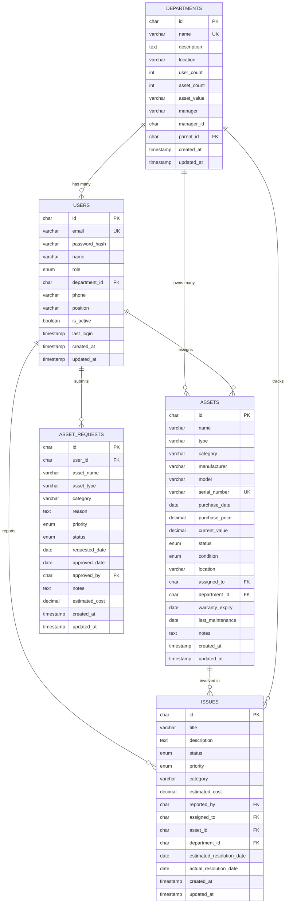
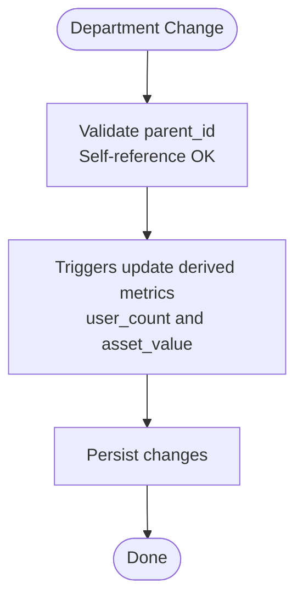
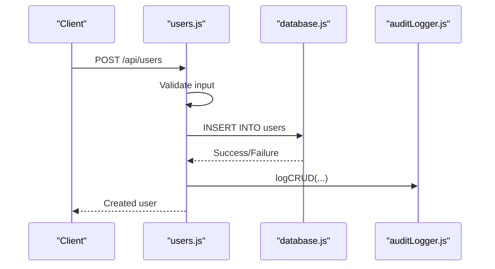
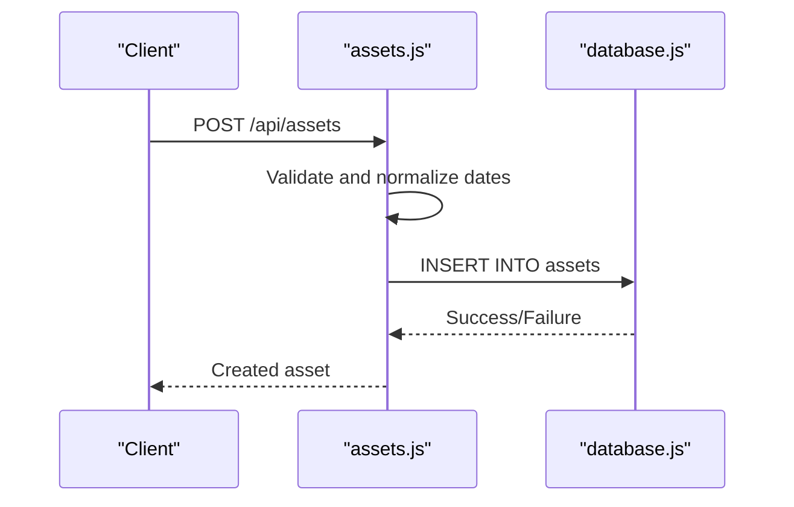
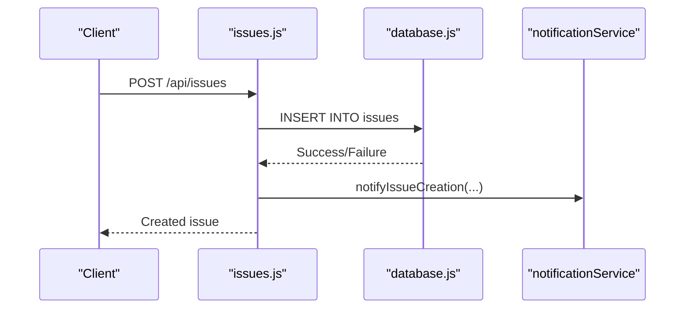
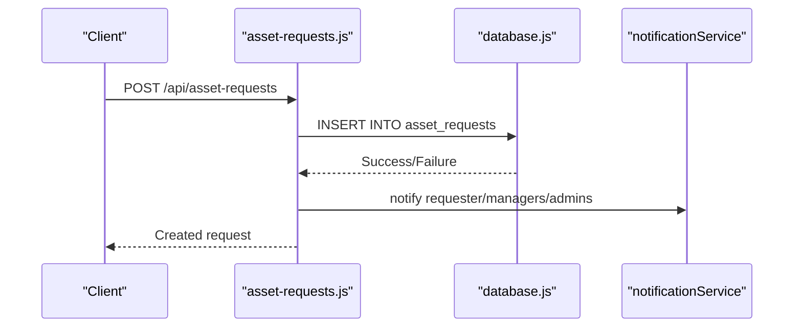
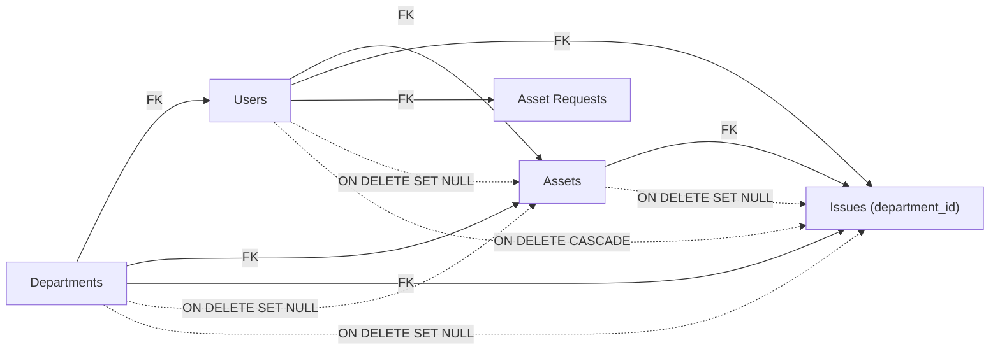

# Core Entities & Relationships

## Table of Contents
1. [Introduction](#introduction)
2. [Project Structure](#project-structure)
3. [Core Components](#core-components)
4. [Architecture Overview](#architecture-overview)
5. [Detailed Component Analysis](#detailed-component-analysis)
6. [Dependency Analysis](#dependency-analysis)
7. [Performance Considerations](#performance-considerations)
8. [Troubleshooting Guide](#troubleshooting-guide)
9. [Conclusion](#conclusion)

## Introduction
This document provides comprehensive data model documentation for the core database entities in the Assets Management System. It focuses on the primary tables: departments, users, assets, issues, and asset_requests, detailing field definitions, data types, constraints, primary and foreign key relationships, and referential integrity rules. It also explains the hierarchical department structure with parent-child relationships, the role-based user system, and the cascading behaviors implemented via triggers and foreign keys. Finally, it outlines common entity relationships and join patterns used across the application.

## Project Structure
The data model is defined in SQL schema files and enforced by application routes and database utilities. The schema supports both MySQL/MariaDB and PostgreSQL through a unified query interface.

```mermaid
graph TB
subgraph "Database Layer"
D1["schema.sql<br/>Core entities and constraints"]
D2["schema-simple.sql<br/>Simplified core entities"]
D3["2024-09-08_departments_hierarchy.sql<br/>Parent-child hierarchy"]
D4["add_asset_request_estimated_cost.sql<br/>Cost column migration"]
D5["add_issue_estimated_cost.sql<br/>Cost column migration"]
D6["create_asset_types_table.sql<br/>Asset categories"]
D7["create_issue_categories_table.sql<br/>Issue categories"]
end
subgraph "Application Layer"
C1["database.js<br/>DB client abstraction"]
R1["routes/departments.js<br/>Department CRUD"]
R2["routes/users.js<br/>User CRUD and joins"]
R3["routes/assets.js<br/>Asset CRUD and joins"]
R4["routes/issues.js<br/>Issue CRUD and notifications"]
R5["routes/asset-requests.js<br/>Asset request CRUD"]
U1["utils/auditLogger.js<br/>Audit logging"]
end
D1 --> C1
D2 --> C1
D3 --> C1
D4 --> C1
D5 --> C1
D6 --> C1
D7 --> C1
R1 --> C1
R2 --> C1
R3 --> C1
R4 --> C1
R5 --> C1
U1 --> C1
```

## Core Components
This section documents the five core relational entities and their constraints.

- Departments
  - Purpose: Organizational units with optional hierarchical parent-child relationships.
  - Primary key: id (CHAR(36) UUID).
  - Notable fields: name (unique), location, manager and manager_id, parent_id (self-referencing), counters for user_count, asset_count, and asset_value.
  - Constraints: Unique name; parent_id references departments(id) with ON DELETE SET NULL; indexes on name, location, manager_id, parent_id.
  - Triggers: Automatic updates to user_count and asset statistics on user and asset changes.

- Users
  - Purpose: System actors with role-based access control.
  - Primary key: id (CHAR(36) UUID).
  - Notable fields: email (unique), password_hash, name, role ('admin' | 'manager' | 'user'), department_id (FK), phone, position, is_active, last_login.
  - Constraints: role enum; department_id references departments(id) with ON DELETE SET NULL; indexes on email, department_id, role, is_active.

- Assets
  - Purpose: Physical or digital resources tracked across departments and users.
  - Primary key: id (CHAR(36) UUID).
  - Notable fields: name, type, category, manufacturer, model, serial_number (unique), purchase_date, purchase_price, current_value, status ('active' | 'inactive' | 'maintenance' | 'retired'), condition ('excellent' | 'good' | 'fair' | 'poor'), location, assigned_to (user), department_id (FK), warranty_expiry, last_maintenance, notes.
  - Constraints: serial_number unique; assigned_to and department_id FK with ON DELETE SET NULL; indexes on serial_number, department_id, assigned_to, status, type, category.

- Issues
  - Purpose: Problems or requests associated with assets, users, and departments.
  - Primary key: id (CHAR(36) UUID).
  - Notable fields: title, description, status ('open' | 'in_progress' | 'resolved' | 'closed' | 'scheduled'), priority ('low' | 'medium' | 'high' | 'critical'), category, estimated_cost, reported_by (user), assigned_to (user), asset_id (FK), department_id (FK), estimated_resolution_date, actual_resolution_date.
  - Constraints: reported_by FK with ON DELETE CASCADE; assigned_to, asset_id, department_id FK with ON DELETE SET NULL; indexes on status, priority, reported_by, assigned_to, asset_id, department_id.

- Asset Requests
  - Purpose: Requests for new assets by users, tracked with status and priority.
  - Primary key: id (CHAR(36) UUID).
  - Notable fields: user_id (FK), asset_name, asset_type, category, reason, priority ('low' | 'medium' | 'high' | 'urgent'), status ('pending' | 'approved' | 'rejected' | 'fulfilled'), requested_date, approved_date, approved_by (user), notes, estimated_cost.
  - Constraints: user_id FK with ON DELETE CASCADE; approved_by FK with ON DELETE SET NULL; indexes on user_id, status, priority, requested_date.

## Architecture Overview
The system enforces referential integrity at the database level and augments behavior with triggers for derived metrics. Application routes orchestrate CRUD operations and join-heavy queries to present denormalized views.

## Detailed Component Analysis

### Departments
- Hierarchical structure: parent_id references departments(id) with ON DELETE SET NULL, enabling tree-like organization. A migration seeds root departments for organizational domains.
- Derived metrics: Triggers maintain user_count and computed asset_value for departments based on user and asset changes.
- Application behavior: Routes support CRUD operations, uniqueness checks, manager synchronization, and cleanup on deletion (unassociating users and assets).

### Users
- Role-based access: role enum controls visibility and capabilities across routes.
- Department membership: department_id links users to departments; ON DELETE SET NULL preserves user records while removing affiliation.
- Application behavior: Routes enforce validation, uniqueness checks, permission gates, and audit logging for all operations.

### Assets
- Assignment lifecycle: assigned_to links assets to users; ON DELETE SET NULL allows asset removal without deleting the user.
- Department ownership: department_id ties assets to departments; ON DELETE SET NULL maintains asset records when departments are removed.
- Application behavior: Routes implement validation, uniqueness checks (serial_number), automatic department inference from assigned user, and comprehensive joins for reporting.

### Issues
- Multi-entity linkage: reported_by (user), assigned_to (user), asset_id (asset), department_id (department) enable cross-domain tracking.
- Cascading behavior: reported_by CASCADE ensures issue deletion when reporters are removed; other FKs SET NULL preserve issues when linked entities are removed.
- Application behavior: Routes implement extensive filtering, cost visibility controls, and robust notification workflows across reporters, assignees, managers, and admins.

### Asset Requests
- Lifecycle tracking: status and priority enums govern request progression; approved_by and approved_date capture administrative actions.
- Cost estimation: estimated_cost column introduced via migration; visibility controlled by role.
- Application behavior: Routes implement user-only edits for pending requests, admin-only updates for status and cost, and comprehensive notifications to requester, managers, and admins.

## Dependency Analysis
This section maps the relationships among core entities and highlights referential integrity rules.

## Performance Considerations
- Indexes: Strategic indexes on frequently filtered and joined columns (e.g., departments(name, location, manager_id, parent_id), users(email, department_id, role, is_active), assets(serial_number, department_id, assigned_to, status, type, category), issues(status, priority, reported_by, assigned_to, asset_id, department_id), asset_requests(user_id, status, priority, requested_date)) improve query performance.
- Denormalization: Application routes often join entities to provide summarized views (e.g., departments with user and asset counts; assets with assigned user and department names; issues with reporter, assignee, asset, and department details).
- Triggers: Derived metrics (user_count, asset_count, asset_value) are maintained via triggers to reduce runtime computation costs.

## Troubleshooting Guide
- Foreign key constraint violations: Ensure referenced IDs exist before inserts/updates. For example, inserting an asset requires a valid department_id and/or assigned_to user_id.
- Unique constraint conflicts: Attempts to create users with duplicate emails or assets with duplicate serial_numbers will fail; validate inputs before persistence.
- Deletion side effects: Deleting users with reported issues will cascade due to reported_by CASCADE; deleting departments will SET NULL department_id on users and assets.
- Role and permission checks: Certain routes enforce role-based access (admin/manager/user), and self-modification restrictions apply.

## Conclusion
The Assets Management System’s core data model centers on five relational tables with carefully defined constraints and cascading behaviors. The department hierarchy enables scalable organizational structuring, while role-based access and trigger-driven metrics enhance operational efficiency. Application routes consistently leverage joins and validations to deliver robust, secure, and observable workflows across departments, users, assets, issues, and asset requests.
