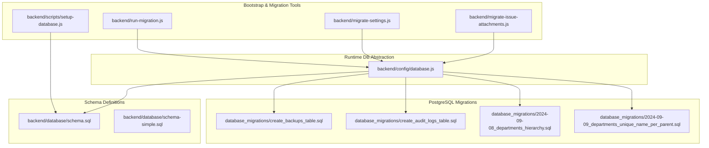
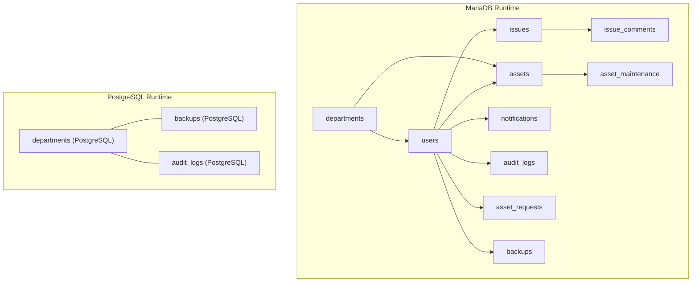
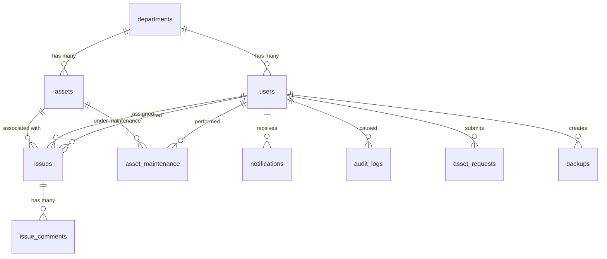
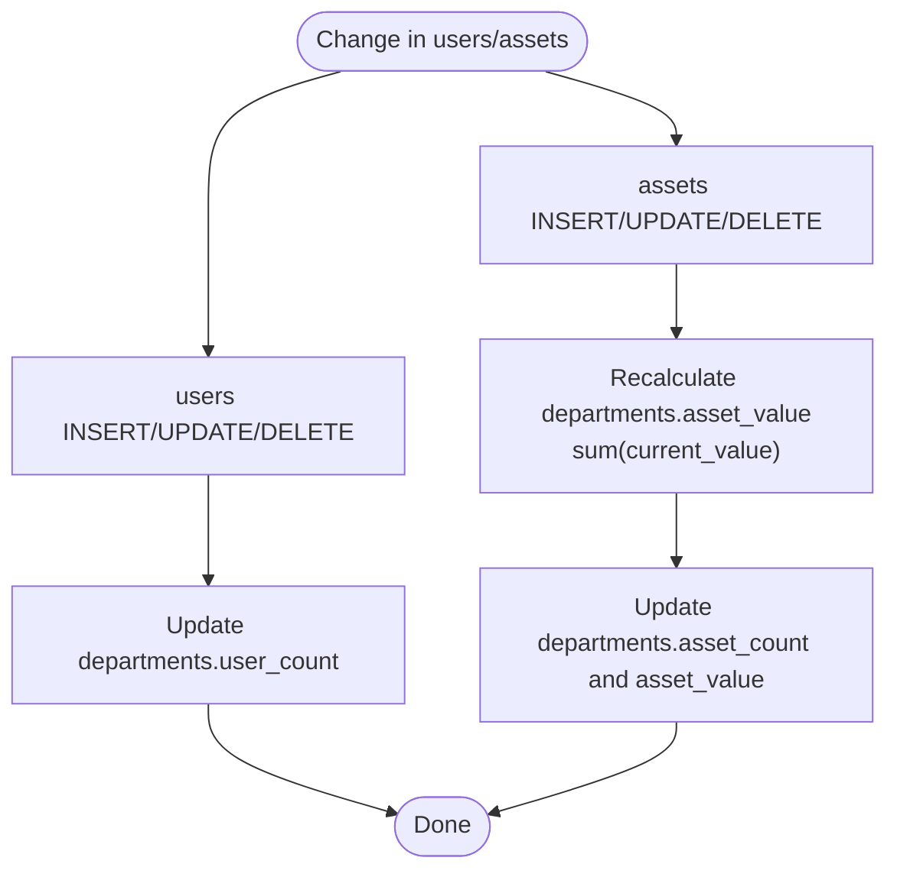
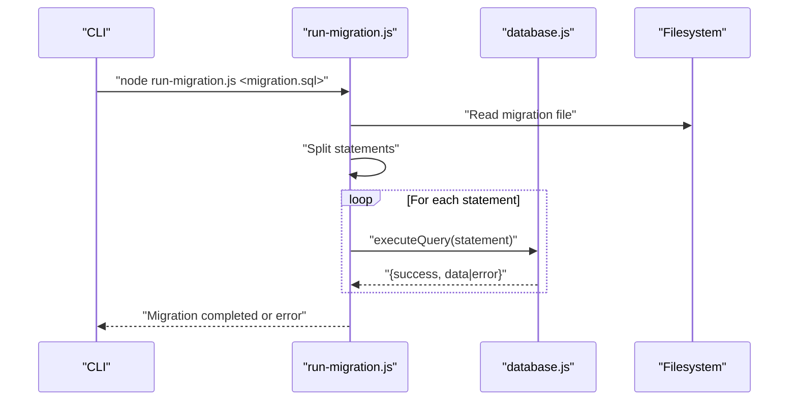
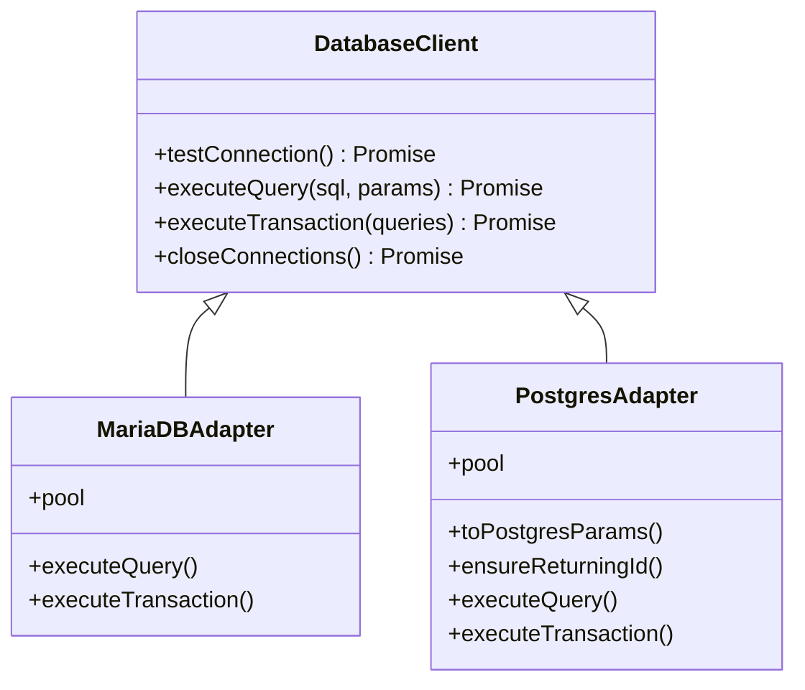
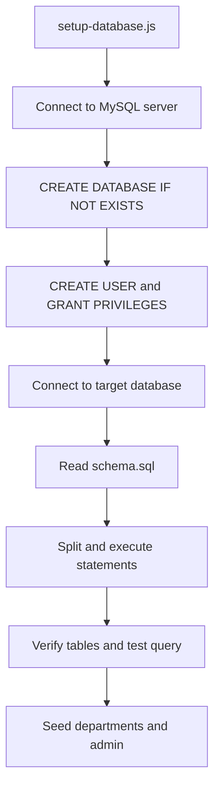
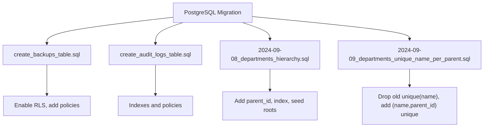
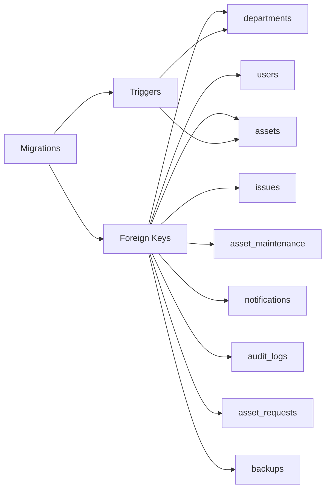

# Database Schema & Migrations

## Table of Contents
1. [Introduction](#introduction)
2. [Project Structure](#project-structure)
3. [Core Components](#core-components)
4. [Architecture Overview](#architecture-overview)
5. [Detailed Component Analysis](#detailed-component-analysis)
6. [Dependency Analysis](#dependency-analysis)
7. [Performance Considerations](#performance-considerations)
8. [Troubleshooting Guide](#troubleshooting-guide)
9. [Conclusion](#conclusion)
10. [Appendices](#appendices)

## Introduction
This document describes the Assets Management System database schema and migration system. It covers entity relationships, field definitions, data types, primary/foreign keys, indexes, constraints, triggers, and schema evolution patterns. It also documents the migration tooling, database client abstraction, and operational guidance for setup, seeding, and performance.

## Project Structure
The database layer consists of:
- A canonical schema definition for MariaDB
- A simplified schema for quick setups
- A database client abstraction supporting both MariaDB/mysql2 and PostgreSQL
- Scripts to bootstrap the database and apply migrations
- A set of migration files for evolving the schema over time

## Core Components
This section documents the core relational schema for MariaDB, including entities, fields, data types, primary keys, foreign keys, indexes, and constraints.

- departments
  - Fields: id (CHAR 36, PK), name (VARCHAR 255, UNIQUE), description (TEXT), location (VARCHAR 255), user_count (INT), asset_count (INT), asset_value (VARCHAR 50), manager (VARCHAR 255), manager_id (CHAR 36), parent_id (CHAR 36), timestamps
  - Indexes: idx_departments_name, idx_departments_location, idx_departments_manager, idx_departments_parent
  - Constraints: UNIQUE(name), optional FK parent_id -> departments(id)
  - Notes: Supports hierarchical departments via parent_id; triggers maintain derived metrics.

- users
  - Fields: id (CHAR 36, PK), email (VARCHAR 255, UNIQUE), password_hash (VARCHAR 255), name (VARCHAR 255), role (ENUM), department_id (CHAR 36), phone (VARCHAR 20), position (VARCHAR 100), is_active (BOOLEAN), last_login (TIMESTAMP), timestamps
  - Indexes: idx_users_email, idx_users_department, idx_users_role, idx_users_active
  - Constraints: FK department_id -> departments(id) ON DELETE SET NULL

- assets
  - Fields: id (CHAR 36, PK), name (VARCHAR 255), type (VARCHAR 100), category (VARCHAR 100), manufacturer (VARCHAR 255), model (VARCHAR 255), serial_number (VARCHAR 255, UNIQUE), purchase_date (DATE), purchase_price (DECIMAL 10,2), current_value (DECIMAL 10,2), status (ENUM), condition (ENUM), location (VARCHAR 255), assigned_to (CHAR 36), department_id (CHAR 36), warranty_expiry (DATE), last_maintenance (DATE), notes (TEXT), timestamps
  - Indexes: idx_assets_serial, idx_assets_department, idx_assets_assigned, idx_assets_status, idx_assets_type, idx_assets_category
  - Constraints: FK assigned_to -> users(id) ON DELETE SET NULL, FK department_id -> departments(id) ON DELETE SET NULL

- issues
  - Fields: id (CHAR 36, PK), title (VARCHAR 255), description (TEXT), status (ENUM), priority (ENUM), category (VARCHAR 100), reported_by (CHAR 36), assigned_to (CHAR 36), asset_id (CHAR 36), department_id (CHAR 36), estimated_resolution_date (DATE), actual_resolution_date (DATE), timestamps
  - Indexes: idx_issues_status, idx_issues_priority, idx_issues_reported_by, idx_issues_assigned_to, idx_issues_asset, idx_issues_department
  - Constraints: FK reported_by -> users(id) ON DELETE CASCADE, FK assigned_to -> users(id) ON DELETE SET NULL, FK asset_id -> assets(id) ON DELETE SET NULL, FK department_id -> departments(id) ON DELETE SET NULL

- issue_comments
  - Fields: id (CHAR 36, PK), issue_id (CHAR 36), user_id (CHAR 36), user_name (VARCHAR 255), content (TEXT), timestamps
  - Indexes: idx_issue_comments_issue, idx_issue_comments_user, idx_issue_comments_created
  - Constraints: FK issue_id -> issues(id) ON DELETE CASCADE, FK user_id -> users(id) ON DELETE CASCADE

- asset_maintenance
  - Fields: id (CHAR 36, PK), asset_id (CHAR 36), maintenance_type (VARCHAR 100), description (TEXT), performed_by (CHAR 36), performed_date (DATE), cost (DECIMAL 10,2), next_maintenance_date (DATE), timestamps
  - Indexes: idx_maintenance_asset, idx_maintenance_date, idx_maintenance_type
  - Constraints: FK asset_id -> assets(id) ON DELETE CASCADE, FK performed_by -> users(id) ON DELETE SET NULL

- notifications
  - Fields: id (CHAR 36, PK), user_id (CHAR 36), title (VARCHAR 255), message (TEXT), type (ENUM), is_read (BOOLEAN), timestamps
  - Indexes: idx_notifications_user, idx_notifications_read, idx_notifications_created
  - Constraints: FK user_id -> users(id) ON DELETE CASCADE

- audit_logs
  - Fields: id (CHAR 36, PK), user_id (CHAR 36), action (VARCHAR 100), entity_type (VARCHAR 50), entity_id (CHAR 36), details (JSON), ip_address (VARCHAR 45), user_agent (TEXT), timestamps
  - Indexes: idx_audit_user, idx_audit_action, idx_audit_entity, idx_audit_created
  - Constraints: FK user_id -> users(id) ON DELETE SET NULL

- asset_requests
  - Fields: id (CHAR 36, PK), user_id (CHAR 36), asset_name (VARCHAR 255), asset_type (VARCHAR 100), category (VARCHAR 100), reason (TEXT), priority (ENUM), status (ENUM), requested_date (DATE), approved_date (DATE), approved_by (CHAR 36), notes (TEXT), estimated_cost (DECIMAL 12,2), timestamps
  - Indexes: idx_asset_requests_user, idx_asset_requests_status, idx_asset_requests_priority, idx_asset_requests_date
  - Constraints: FK user_id -> users(id) ON DELETE CASCADE, FK approved_by -> users(id) ON DELETE SET NULL

- backups
  - Fields: id (CHAR 36, PK), name (VARCHAR 255), description (TEXT), timestamp (TIMESTAMP), version (VARCHAR 50), metadata (JSON), backup_data (JSON), created_by (CHAR 36), timestamps
  - Indexes: idx_backups_created_by, idx_backups_timestamp
  - Constraints: FK created_by -> users(id) ON DELETE CASCADE

Triggers (MariaDB):
- update_department_user_count_*: Increment/decrement departments.user_count on users INSERT/UPDATE/DELETE
- update_department_asset_stats_*: Update departments.asset_count and departments.asset_value on assets INSERT/UPDATE/DELETE

Sample data:
- Departments and admin user inserted during schema execution
- Simplified seed data for quick testing

## Architecture Overview
The database architecture supports two runtime modes:
- MariaDB/mysql2 for the primary schema
- PostgreSQL for additional features (RLS, JSONB, UUID extensions) via separate migration files

## Detailed Component Analysis

### Entity Relationship Model

### Triggers for Derived Metrics

### Migration Execution Flow

### Database Client Abstraction
The client supports:
- MariaDB/mysql2 with connection pooling and Windows auth plugin
- PostgreSQL with connection pooling, param conversion, and RETURNING emulation
- Unified query interface with transactions and error handling

### Bootstrap and Seeding
- setup-database.js connects to MySQL server, creates database and grants privileges, executes schema.sql, verifies tables and data.
- schema.sql seeds departments and an admin user; schema-simple.sql provides minimal seed data.

### PostgreSQL Migration Patterns
- Row Level Security (RLS) enabled on backups and audit_logs
- UUID primary keys and JSONB fields
- Policies restrict access to backups by role
- Departments hierarchy extended with parent_id and unique constraint per parent

## Dependency Analysis
- Referential integrity is enforced via foreign keys across departments, users, assets, issues, asset_maintenance, notifications, audit_logs, asset_requests, and backups.
- Triggers maintain derived metrics in departments for user and asset statistics.
- The migration system applies SQL statements sequentially and handles errors per statement.
- The database abstraction adapts SQL dialects and parameter binding between MariaDB and PostgreSQL.

## Performance Considerations
- Indexes are strategically placed on frequently filtered/sorted columns:
  - departments: name, location, manager_id, parent_id
  - users: email, department_id, role, is_active
  - assets: serial_number, department_id, assigned_to, status, type, category
  - issues: status, priority, reported_by, assigned_to, asset_id, department_id
  - issue_comments: issue_id, user_id, created_at
  - asset_maintenance: asset_id, performed_date, maintenance_type
  - notifications: user_id, is_read, created_at
  - audit_logs: user_id, action, entity_type/entity_id, created_at
  - asset_requests: user_id, status, priority, requested_date
  - backups: created_by, timestamp
- Triggers update aggregated metrics; consider periodic batch updates if high write volume impacts performance.
- Use EXPLAIN/ANALYZE to review slow queries and ensure index usage.
- For PostgreSQL migrations, leverage JSONB fields efficiently and keep RLS policies minimal for read-heavy workloads.

## Troubleshooting Guide
- Connection failures:
  - Verify DB_CLIENT selection and credentials in environment variables.
  - For MariaDB on Windows, ensure auth plugin configuration is present.
- Migration errors:
  - run-migration.js reports failure per statement; check logs for the failing statement and adjust accordingly.
- Transaction rollbacks:
  - executeTransaction wraps queries in BEGIN/COMMIT and rolls back on error; confirm rollback occurred and inspect logs.
- Data seeding:
  - setup-database.js executes schema.sql and performs a basic verification; confirm tables exist and users count is returned.

## Conclusion
The Assets Management System employs a normalized relational schema with robust referential integrity and derived metrics maintained via triggers. The migration system supports both MariaDB and PostgreSQL, enabling incremental schema evolution with explicit policies and indexes. The database abstraction layer ensures consistent query execution across clients, while scripts streamline setup and seeding.

## Appendices

### Sample Data Structures
- departments: id, name, description, location, manager, manager_id, parent_id, metrics
- users: id, email, role, department_id, profile fields, activity flags
- assets: id, identification, valuation, status, assignment, department
- issues: id, title, status, priority, reporting/assignment, asset linkage
- asset_maintenance: id, asset linkage, type, performer, dates, costs
- notifications: id, recipient, type, read flag, timestamps
- audit_logs: id, actor, action, entity, details, timestamps
- asset_requests: id, requester, asset intent, priority/status, approvals, costs
- backups: id, metadata, payload, creator, timestamps

### Common Queries and Access Patterns
- List assets by department with assigned user details
- Find open issues by priority and department
- Retrieve audit logs for a user within a date range
- Get department statistics (counts/values) via triggers
- Manage asset requests with approval chain and cost estimation
