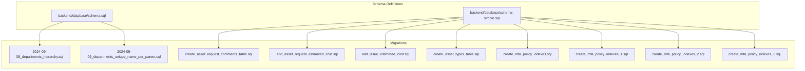
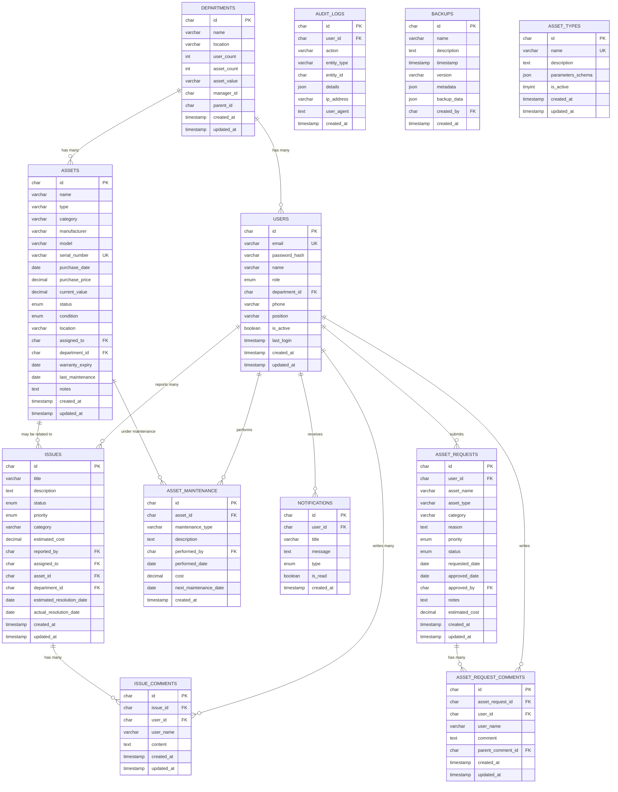
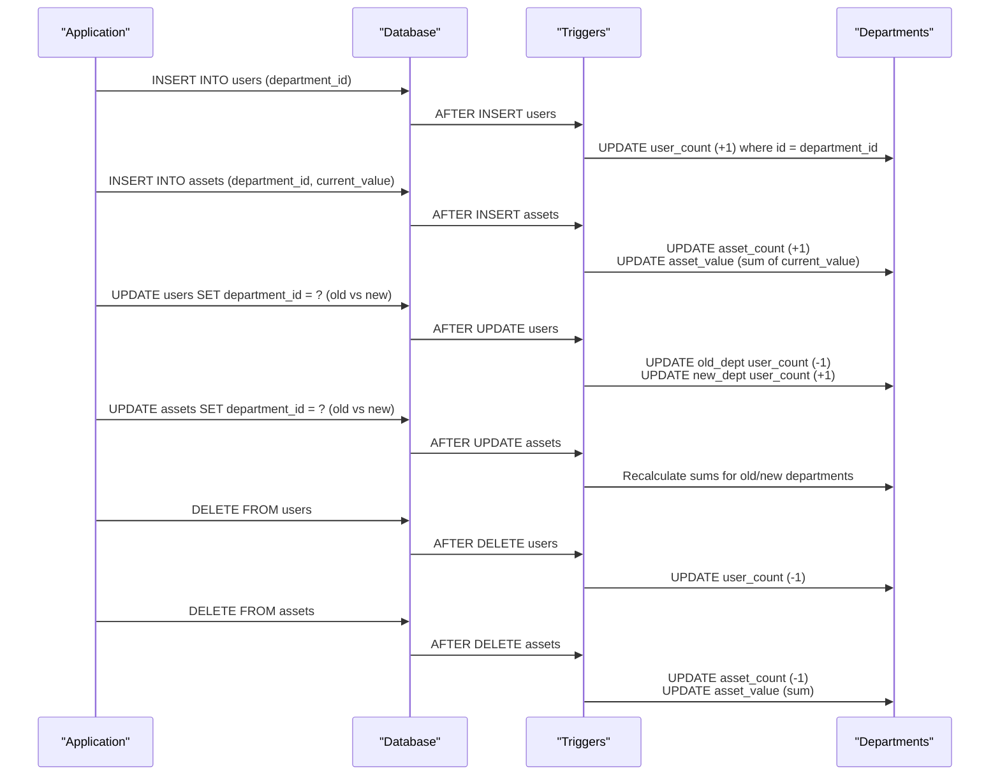
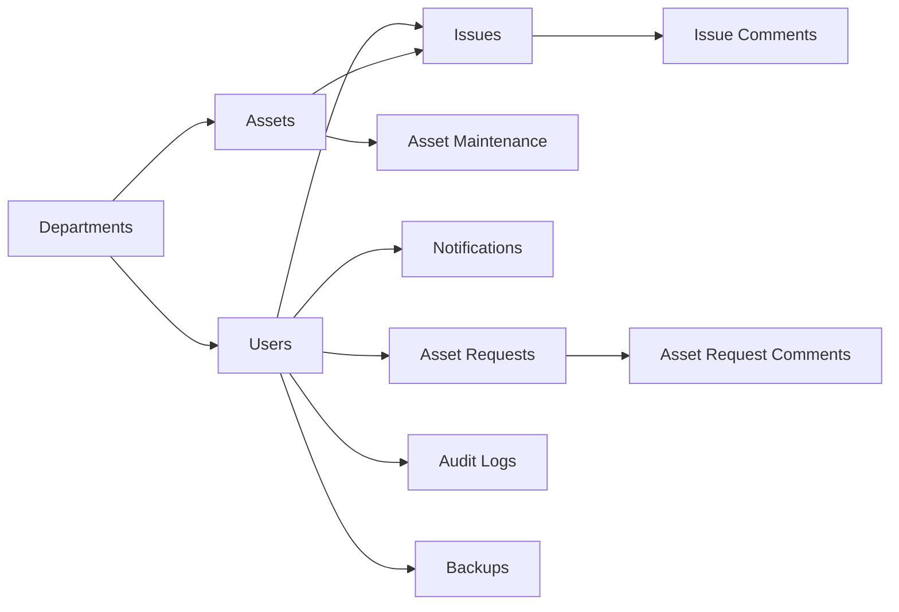

# Indexes & Constraints

## Table of Contents
1. [Introduction](#introduction)
2. [Project Structure](#project-structure)
3. [Core Components](#core-components)
4. [Architecture Overview](#architecture-overview)
5. [Detailed Component Analysis](#detailed-component-analysis)
6. [Dependency Analysis](#dependency-analysis)
7. [Performance Considerations](#performance-considerations)
8. [Troubleshooting Guide](#troubleshooting-guide)
9. [Conclusion](#conclusion)

## Introduction
This document focuses on database indexes, constraints, and performance optimization strategies in the Assets Management System. It catalogs primary keys, foreign keys, unique constraints, and composite indexes across tables, explains indexing strategies for common queries (user lookups, asset searches, issue filtering, department aggregations), documents constraint enforcement and referential integrity rules, and details the trigger-based automatic updates for department statistics. It also covers performance considerations for each index, including query optimization, storage implications, and maintenance overhead.

## Project Structure
The database schema is primarily defined in two SQL files:
- A comprehensive schema with triggers and sample data
- A simplified schema for quick setup and testing

Additional migrations introduce specialized indexes and columns for performance and extensibility.

## Core Components
This section enumerates primary keys, unique constraints, foreign keys, and indexes for each table, and highlights composite indexes where applicable.

- Departments
  - Primary key: id
  - Unique constraints:
    - name (original schema)
    - (name, parent_id) after migration
  - Indexes:
    - idx_departments_name (name)
    - idx_departments_location (location)
    - idx_departments_manager (manager_id)
    - idx_departments_parent (parent_id)
  - Foreign keys:
    - None (self-referencing via parent_id)
  - Notes:
    - Unique constraint on (name, parent_id) prevents duplicate department names under the same parent while allowing duplicates under different parents.

- Users
  - Primary key: id
  - Unique constraints:
    - email
  - Indexes:
    - idx_users_email (email)
    - idx_users_department (department_id)
    - idx_users_role (role)
    - idx_users_active (is_active)
  - Foreign keys:
    - department_id → departments.id (ON DELETE SET NULL)

- Assets
  - Primary key: id
  - Unique constraints:
    - serial_number
  - Indexes:
    - idx_assets_serial (serial_number)
    - idx_assets_department (department_id)
    - idx_assets_assigned (assigned_to)
    - idx_assets_status (status)
    - idx_assets_type (type)
    - idx_assets_category (category)
  - Foreign keys:
    - assigned_to → users.id (ON DELETE SET NULL)
    - department_id → departments.id (ON DELETE SET NULL)

- Issues
  - Primary key: id
  - Indexes:
    - idx_issues_status (status)
    - idx_issues_priority (priority)
    - idx_issues_reported_by (reported_by)
    - idx_issues_assigned_to (assigned_to)
    - idx_issues_asset (asset_id)
    - idx_issues_department (department_id)
  - Foreign keys:
    - reported_by → users.id (ON DELETE CASCADE)
    - assigned_to → users.id (ON DELETE SET NULL)
    - asset_id → assets.id (ON DELETE SET NULL)
    - department_id → departments.id (ON DELETE SET NULL)

- Issue Comments
  - Primary key: id
  - Indexes:
    - idx_issue_comments_issue (issue_id)
    - idx_issue_comments_user (user_id)
    - idx_issue_comments_created (created_at)
  - Foreign keys:
    - issue_id → issues.id (ON DELETE CASCADE)
    - user_id → users.id (ON DELETE CASCADE)

- Asset Maintenance
  - Primary key: id
  - Indexes:
    - idx_maintenance_asset (asset_id)
    - idx_maintenance_date (performed_date)
    - idx_maintenance_type (maintenance_type)
  - Foreign keys:
    - asset_id → assets.id (ON DELETE CASCADE)
    - performed_by → users.id (ON DELETE SET NULL)

- Notifications
  - Primary key: id
  - Indexes:
    - idx_notifications_user (user_id)
    - idx_notifications_read (is_read)
    - idx_notifications_created (created_at)
  - Foreign keys:
    - user_id → users.id (ON DELETE CASCADE)

- Audit Logs
  - Primary key: id
  - Indexes:
    - idx_audit_user (user_id)
    - idx_audit_action (action)
    - idx_audit_entity (entity_type, entity_id)
    - idx_audit_created (created_at)
  - Foreign keys:
    - user_id → users.id (ON DELETE SET NULL)

- Asset Requests
  - Primary key: id
  - Indexes:
    - idx_asset_requests_user (user_id)
    - idx_asset_requests_status (status)
    - idx_asset_requests_priority (priority)
    - idx_asset_requests_date (requested_date)
  - Foreign keys:
    - user_id → users.id (ON DELETE CASCADE)
    - approved_by → users.id (ON DELETE SET NULL)

- Backups
  - Primary key: id
  - Indexes:
    - idx_backups_created_by (created_by)
    - idx_backups_timestamp (timestamp)
  - Foreign keys:
    - created_by → users.id (ON DELETE CASCADE)

- Asset Request Comments (additional table)
  - Primary key: id
  - Indexes:
    - asset_request_id
    - user_id
    - parent_comment_id
  - Foreign keys:
    - asset_request_id → asset_requests.id (ON DELETE CASCADE)
    - user_id → users.id (ON DELETE CASCADE)
    - parent_comment_id → asset_request_comments.id (ON DELETE CASCADE)

- Asset Types (additional table)
  - Primary key: id
  - Unique constraints:
    - name
  - Other columns:
    - parameters_schema JSON
    - is_active
    - created_at, updated_at

- MFA Policies and Compliance (indexes)
  - Indexes:
    - idx_mfa_policies_enabled (enabled)
    - idx_mfa_policies_enforcement (enforcement_level)
    - idx_user_compliance_user (user_id)

## Architecture Overview
The database enforces referential integrity via foreign keys and supports efficient querying through targeted single-column and composite indexes. Triggers maintain summary metrics in the departments table for user and asset statistics.

## Detailed Component Analysis

### Indexing Strategy for Common Queries
- User lookups
  - By email: idx_users_email(email) optimizes login and identity checks.
  - By department: idx_users_department(department_id) supports team and department views.
  - By role: idx_users_role(role) enables role-based dashboards and access control filtering.
  - By activity: idx_users_active(is_active) filters active users efficiently.

- Asset searches
  - By serial number: idx_assets_serial(serial_number) ensures fast lookup by hardware identifier.
  - By department: idx_assets_department(department_id) supports inventory per department.
  - By assignment: idx_assets_assigned(assigned_to) finds assigned assets quickly.
  - By status/type/category: idx_assets_status(status), idx_assets_type(type), idx_assets_category(category) enable filtering and reporting.

- Issue filtering
  - By status/priority: idx_issues_status(status), idx_issues_priority(priority) optimize Kanban-like views and triage.
  - By reporter/assignee/asset/department: idx_issues_reported_by(reported_by), idx_issues_assigned_to(assigned_to), idx_issues_asset(asset_id), idx_issues_department(department_id) support dashboard queries.

- Department aggregations
  - Hierarchical navigation: idx_departments_parent(parent_id) supports tree traversal and nested set-style queries.
  - Unique names per parent: (name, parent_id) unique constraint ensures distinct department names under the same parent.
  - Summary stats: Triggers maintain user_count, asset_count, and asset_value for each department.

- Additional tables
  - Issue comments: idx_issue_comments_issue(issue_id), idx_issue_comments_user(user_id), idx_issue_comments_created(created_at) optimize comment threads and timelines.
  - Asset maintenance: idx_maintenance_asset(asset_id), idx_maintenance_date(performed_date), idx_maintenance_type(maintenance_type) support maintenance schedules and cost analytics.
  - Notifications: idx_notifications_user(user_id), idx_notifications_read(is_read), idx_notifications_created(created_at) power inbox and read-state queries.
  - Audit logs: idx_audit_entity(entity_type, entity_id) accelerates audit trails and entity-scoped reports.
  - Asset requests: idx_asset_requests_user(user_id), idx_asset_requests_status(status), idx_asset_requests_priority(priority), idx_asset_requests_date(requested_date) support request workflows.
  - Backups: idx_backups_created_by(created_by), idx_backups_timestamp(timestamp) enable backup history and ownership queries.
  - Asset request comments: indexes on asset_request_id, user_id, parent_comment_id support threaded comments.
  - Asset types: unique(name) and timestamps for governance.

### Constraint Enforcement and Referential Integrity
- Enforced constraints:
  - Primary keys: All tables except departments define a primary key on id.
  - Unique constraints:
    - departments.name (original)
    - (departments.name, departments.parent_id) (after migration)
    - users.email
    - assets.serial_number
    - asset_types.name
  - Foreign keys:
    - users.department_id → departments.id (ON DELETE SET NULL)
    - assets.assigned_to → users.id (ON DELETE SET NULL)
    - assets.department_id → departments.id (ON DELETE SET NULL)
    - issues.reported_by → users.id (ON DELETE CASCADE)
    - issues.assigned_to → users.id (ON DELETE SET NULL)
    - issues.asset_id → assets.id (ON DELETE SET NULL)
    - issues.department_id → departments.id (ON DELETE SET NULL)
    - issue_comments.issue_id → issues.id (ON DELETE CASCADE)
    - issue_comments.user_id → users.id (ON DELETE CASCADE)
    - asset_maintenance.asset_id → assets.id (ON DELETE CASCADE)
    - asset_maintenance.performed_by → users.id (ON DELETE SET NULL)
    - notifications.user_id → users.id (ON DELETE CASCADE)
    - audit_logs.user_id → users.id (ON DELETE SET NULL)
    - asset_requests.user_id → users.id (ON DELETE CASCADE)
    - asset_requests.approved_by → users.id (ON DELETE SET NULL)
    - backups.created_by → users.id (ON DELETE CASCADE)
    - asset_request_comments.asset_request_id → asset_requests.id (ON DELETE CASCADE)
    - asset_request_comments.user_id → users.id (ON DELETE CASCADE)
    - asset_request_comments.parent_comment_id → asset_request_comments.id (ON DELETE CASCADE)

- Impact:
  - Cascading deletes ensure referential integrity for child records (e.g., comments, notifications, maintenance).
  - SET NULL maintains referential integrity when parent rows are removed (e.g., users leaving departments).

### Triggers for Department Statistics
Triggers automatically update department-level summaries for user count and asset statistics upon inserts, updates, and deletes in users and assets.

### Additional Columns and Indexes Introduced by Migrations
- Estimated costs
  - issues.estimated_cost added to support cost estimation workflows.
  - asset_requests.estimated_cost added similarly.

- Asset request comments
  - New table with self-referencing parent_comment_id and indexes on asset_request_id, user_id, and parent_comment_id.

- Asset types
  - New table with unique(name), JSON parameters_schema, and lifecycle timestamps.

- MFA policy indexes
  - idx_mfa_policies_enabled(enabled)
  - idx_mfa_policies_enforcement(enforcement_level)
  - idx_user_compliance_user(user_id)

These additions improve query performance for specific workloads and enable richer domain modeling.

## Dependency Analysis
The following diagram shows foreign key dependencies among core tables.

## Performance Considerations
- Query optimization
  - Single-column indexes match frequent filter predicates (e.g., status, priority, role, active flag).
  - Composite indexes accelerate multi-column filters; for example, idx_audit_entity(entity_type, entity_id) supports targeted audit queries.

- Storage implications
  - Indexes increase write overhead due to maintenance during INSERT/UPDATE/DELETE.
  - Unique indexes (email, serial_number, department name per parent) prevent duplicates but require additional storage and validation.

- Maintenance overhead
  - Triggers on users/assets ensure department metrics remain consistent but incur CPU and lock contention during row modifications.
  - Consider batching updates or using asynchronous counters if high-frequency writes cause contention.

- Recommendations
  - Monitor slow query logs and periodically re-evaluate index selectivity.
  - Use EXPLAIN/ANALYZE to confirm index usage for critical queries.
  - For high-cardinality columns, consider covering indexes to avoid key lookups.

## Troubleshooting Guide
- Duplicate department names
  - Symptom: Failure to insert/update department with existing name under the same parent.
  - Cause: Unique constraint (name, parent_id).
  - Resolution: Ensure unique department names per parent or adjust parent_id.

- Cascade delete behavior
  - Symptom: Deleting a user removes dependent records (comments, notifications).
  - Cause: Foreign keys with ON DELETE CASCADE.
  - Resolution: Confirm cascade behavior aligns with business rules; consider disabling cascade if needed.

- Trigger inconsistencies
  - Symptom: Department metrics drift after bulk operations.
  - Cause: Triggers rely on per-row events; bulk updates bypass row-level triggers.
  - Resolution: Recalculate department metrics periodically or use stored procedures to update counts atomically.

- Missing indexes
  - Symptom: Slow queries on joins or filters.
  - Cause: Absence of supporting indexes.
  - Resolution: Add targeted indexes based on query patterns; validate with EXPLAIN.

## Conclusion
The Assets Management System employs a robust set of primary keys, unique constraints, and foreign keys to enforce data integrity. A comprehensive indexing strategy targets common queries across users, assets, issues, and administrative tables. Triggers maintain department-level summaries, improving reporting performance at the cost of incremental write overhead. Periodic review of index effectiveness and careful handling of cascading operations will sustain query performance and data consistency.
