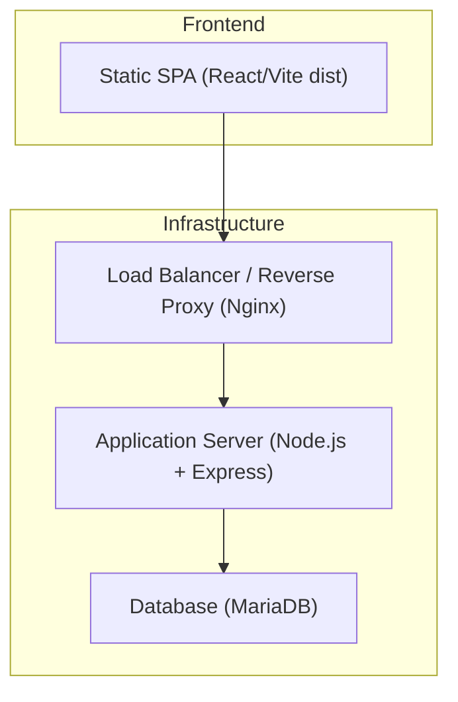
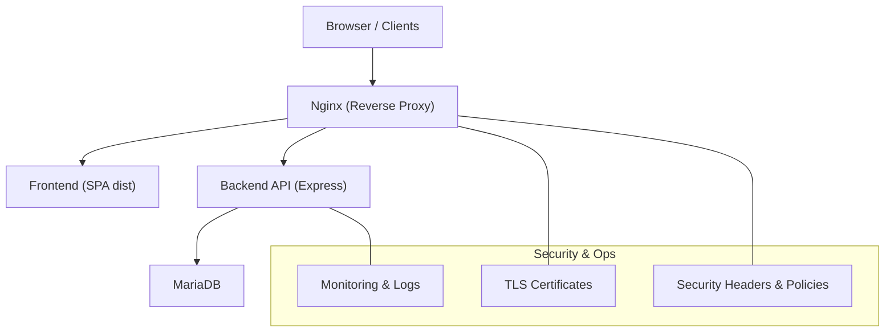
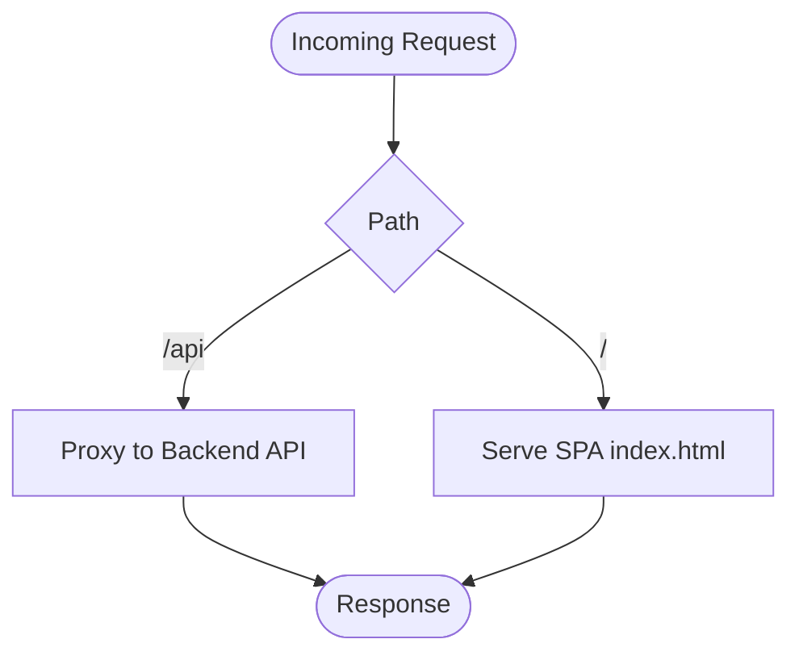
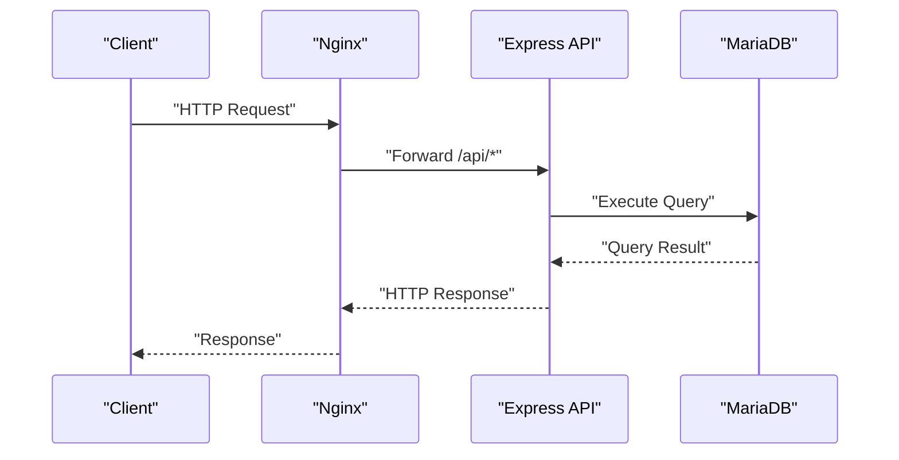
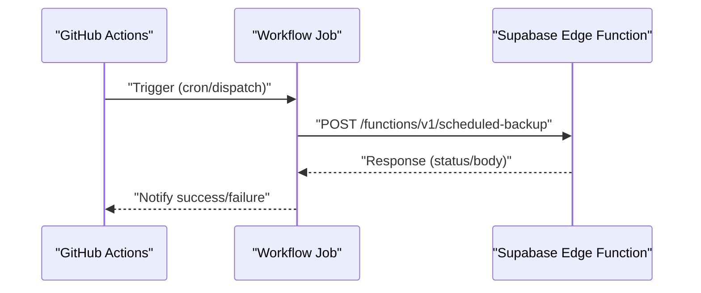
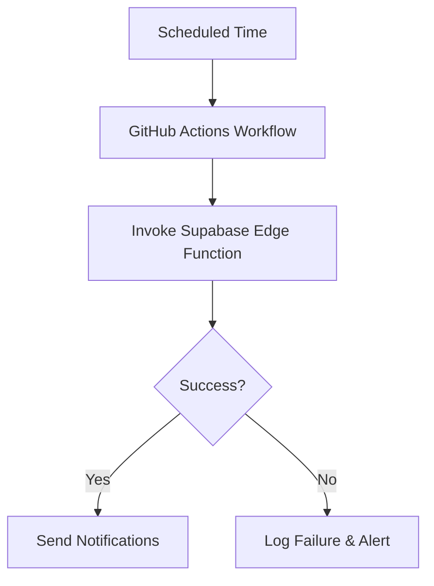
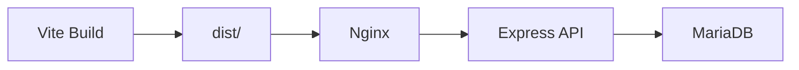
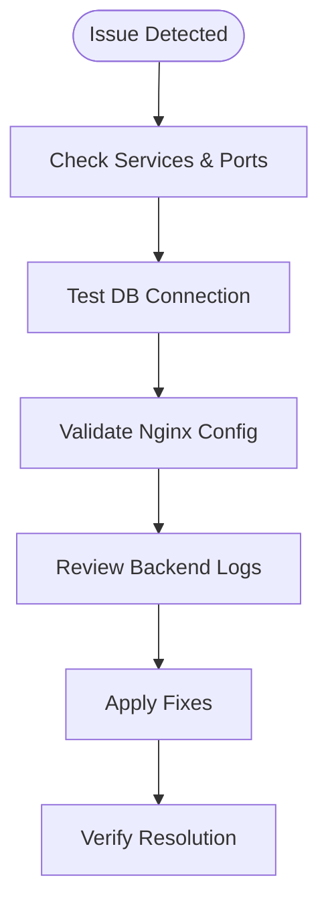

# Deployment & Operations

## Table of Contents
1. [Introduction](#introduction)
2. [Project Structure](#project-structure)
3. [Core Components](#core-components)
4. [Architecture Overview](#architecture-overview)
5. [Detailed Component Analysis](#detailed-component-analysis)
6. [Dependency Analysis](#dependency-analysis)
7. [Performance Considerations](#performance-considerations)
8. [Troubleshooting Guide](#troubleshooting-guide)
9. [Conclusion](#conclusion)
10. [Appendices](#appendices)

## Introduction
This document provides comprehensive deployment and operations guidance for the Assets Management System. It covers production-grade deployment architecture, server requirements, infrastructure setup, reverse proxy configuration, environment and secrets management, monitoring and logging, performance optimization, deployment automation and CI/CD, rollback procedures, security hardening, firewall configuration, maintenance, backup verification, and disaster recovery planning. The content is derived from the repository’s official deployment and operations documents, configuration files, and backend server implementation.

## Project Structure
The repository contains:
- Backend API implemented in Express with Node.js, including routes, middleware, services, and cron-based tasks.
- Frontend built with Vite and React, intended to be served statically via Nginx in production.
- Infrastructure and deployment artifacts including Nginx configurations, deployment scripts, and GitHub Actions workflows.
- Operational documentation covering Ubuntu server deployment, MariaDB setup, troubleshooting, and security.



## Core Components
- Backend API (Express):
  - Routes for authentication, users, departments, assets, issues, notifications, backups, MFA, settings, and more.
  - Security middleware (Helmet), CORS configuration, rate limiting, structured logging (Morgan), health endpoint, and cron-based tasks for weekly notifications and scheduled backups.
- Frontend (React/Vite):
  - Static build for production deployment behind Nginx.
- Infrastructure:
```bash
Nginx reverse proxy with security headers, API proxying, caching, and optional redirect to HTTPS.
```
  - Deployment scripts and CI/CD workflows for automated backups and deployments.

Key operational capabilities:
- Health checks and logging.
- Scheduled tasks for notifications and backups.
- CORS and rate limiting for API protection.
- Environment-driven configuration for database, JWT, and runtime behavior.

## Architecture Overview
The production architecture separates concerns across layers:
```bash
Nginx handles TLS termination, static file serving, API proxying, and security headers.
```
- The backend serves REST APIs and background tasks.
- MariaDB stores application data.



## Detailed Component Analysis

### Nginx Reverse Proxy Configuration
Nginx is configured to:
- Serve static assets from the SPA distribution directory.
- Apply security headers and deny access to source files and sensitive paths.
- Proxy API requests to the backend service.
- Optionally redirect HTTP to HTTPS and enable caching for static assets.

Operational notes:
- Ensure the dist directory is deployed and permissions are correct.
- Validate configuration syntax before reloading.
- Monitor access and error logs for troubleshooting.



### Backend API (Express)
Highlights:
- Security middleware (Helmet), CORS with dynamic origins, rate limiting, and Morgan logging.
- Health endpoint for readiness/liveness checks.
- Extensive routes for CRUD and specialized features (notifications, backups, MFA, settings).
- Cron-based tasks for weekly notifications and scheduled backups.
- Environment-driven configuration for database, JWT, and runtime behavior.



### Environment Management and Secrets
- Backend environment variables include database client, host/port/user/password/name, JWT configuration, server port, CORS origins, and rate limiting parameters.
- Frontend environment variables include API base URL and optional legacy Supabase keys.
- Deployment guides demonstrate creating .env files for both backend and root project.

Best practices:
- Store secrets outside the repository (e.g., OS environment, secrets manager).
- Use distinct secrets per environment.
- Restrict file permissions for .env files.

### Monitoring and Logging
- Backend uses Morgan for structured logs (dev/combined).
- Health endpoint (/health) for quick status checks.
```bash
PM2 process management for process lifecycle and persistence.

Nginx access/error logs for traffic visibility and diagnostics.
```

Recommendations:
- Centralize logs (e.g., syslog, ELK stack).
- Set up log rotation and retention policies.
- Monitor resource usage (CPU, memory, disk).

### Performance Optimization
```bash
Nginx gzip compression and long-term caching for static assets.
```
- Security headers to mitigate common threats.
- Backend rate limiting and CORS configuration.
- Database indexing and query optimization guidance in documentation.

### Deployment Automation and CI/CD
- GitHub Actions workflow triggers a scheduled backup job by invoking a Supabase Edge Function endpoint.
- Local deployment script builds the frontend, copies files to web directory, sets permissions, tests Nginx configuration, and reloads Nginx.



### Rollback Procedures
- Use Nginx configuration validation and reload to safely apply changes.
- Maintain previous Nginx configuration and dist directory snapshots for quick rollback.
- For backend, keep previous builds and environment configurations accessible for revert.

### Security Hardening and Access Controls
```bash
Nginx security headers (X-Content-Type-Options, X-Frame-Options, X-XSS-Protection, Referrer-Policy, Permissions-Policy).
```
- API proxy hides backend URL and applies CORS headers.
- Backend Helmet, CORS with allowed origins, rate limiting, and JWT-based authentication.
- Firewall configuration guidance for allowing required ports.

### Maintenance, Backup, and Disaster Recovery
- Automated backups via GitHub Actions workflow invoking a Supabase Edge Function.
- Database setup and backup/recovery guidance including mysqldump and cron-based automation.
- Frontend build and deployment steps for updating the application.



## Dependency Analysis
- Frontend depends on Vite for building and React for UI.
- Backend depends on Express, MySQL client, rate limiting, logging, and cron for scheduled tasks.
```bash
Nginx depends on the built SPA and backend API availability.
```



## Performance Considerations
- Enable gzip compression and long-term caching for static assets in Nginx.
- Tune MariaDB buffer pool and connection limits based on server capacity.
- Use rate limiting and CORS to protect the API.
- Monitor slow queries and add indexes as needed.

## Troubleshooting Guide
Common areas and commands:
- System services and firewall status.
- Database connectivity and user privileges.
- Port conflicts and process ownership.
```bash
Nginx configuration syntax and logs.
```
- Backend logs via PM2 and Morgan.



## Conclusion
The Assets Management System is designed for straightforward production deployment with Nginx, a Node.js backend, and MariaDB. The repository provides robust documentation for server setup, reverse proxy configuration, environment management, monitoring, performance tuning, and automation. Adhering to the outlined security hardening, backup, and maintenance procedures ensures reliable operations and resilience.

## Appendices

### Step-by-Step Deployment Guides
- Ubuntu server prerequisites, MariaDB installation, database setup, and application startup.
```bash
Nginx installation, configuration, and SSL certificate management.
```
- Frontend build and deployment to web directory.
- Environment variable configuration for backend and frontend.

### Operational Checklists
- Pre-deployment checklist: server readiness, firewall, database, and environment files.
- Post-deployment checklist: health checks, logs review, and performance validation.
- Ongoing maintenance: backups, updates, and monitoring.

- `docs/TROUBLESHOOTING.md:752-799`
