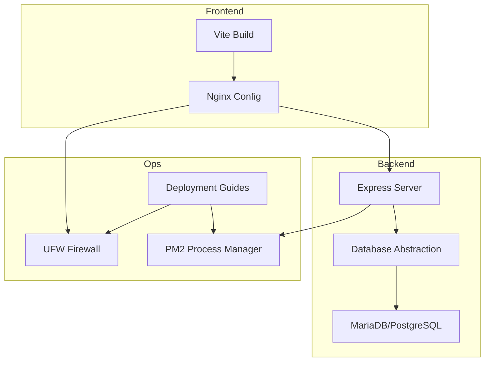
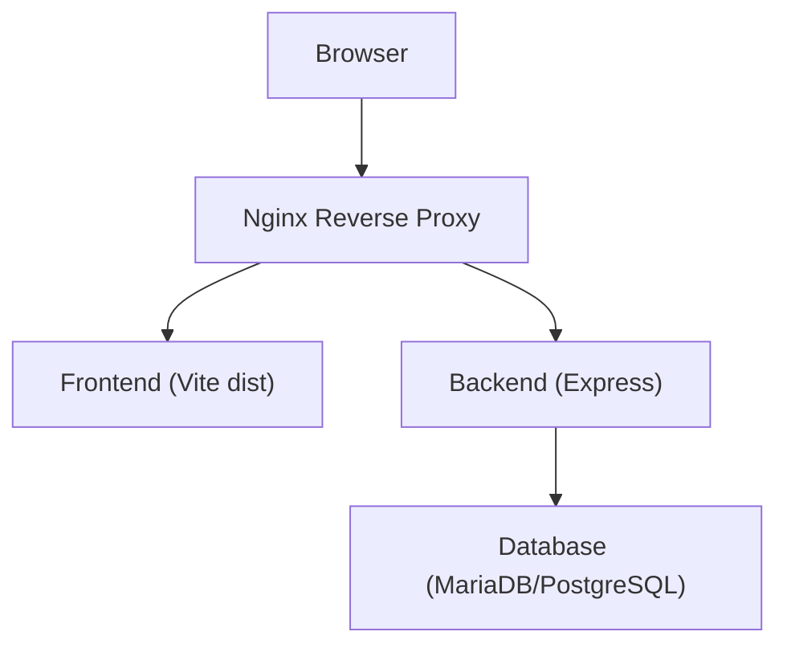
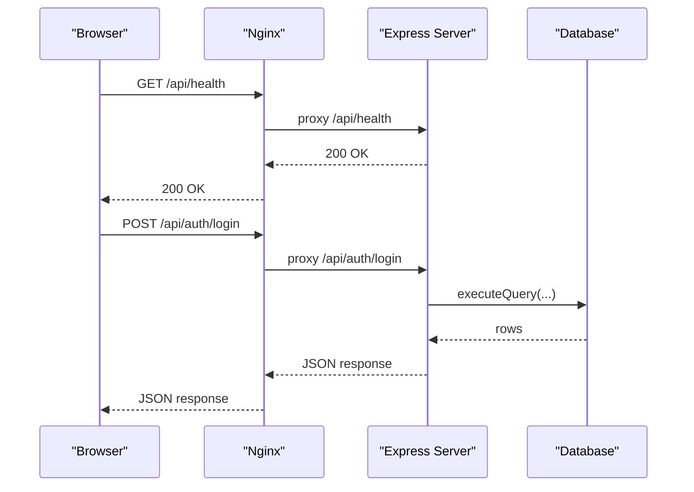
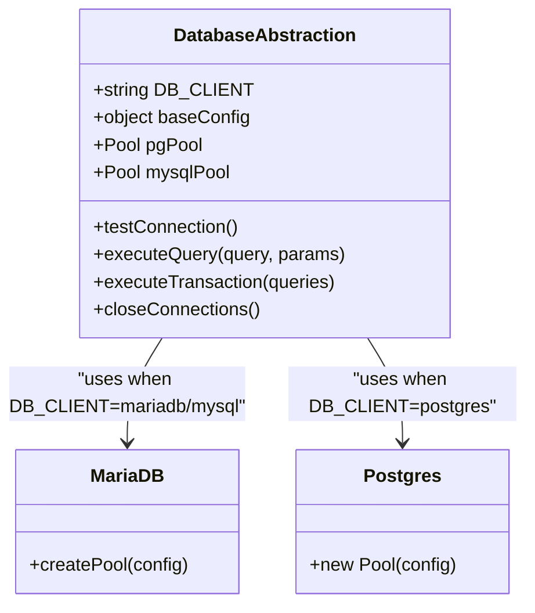
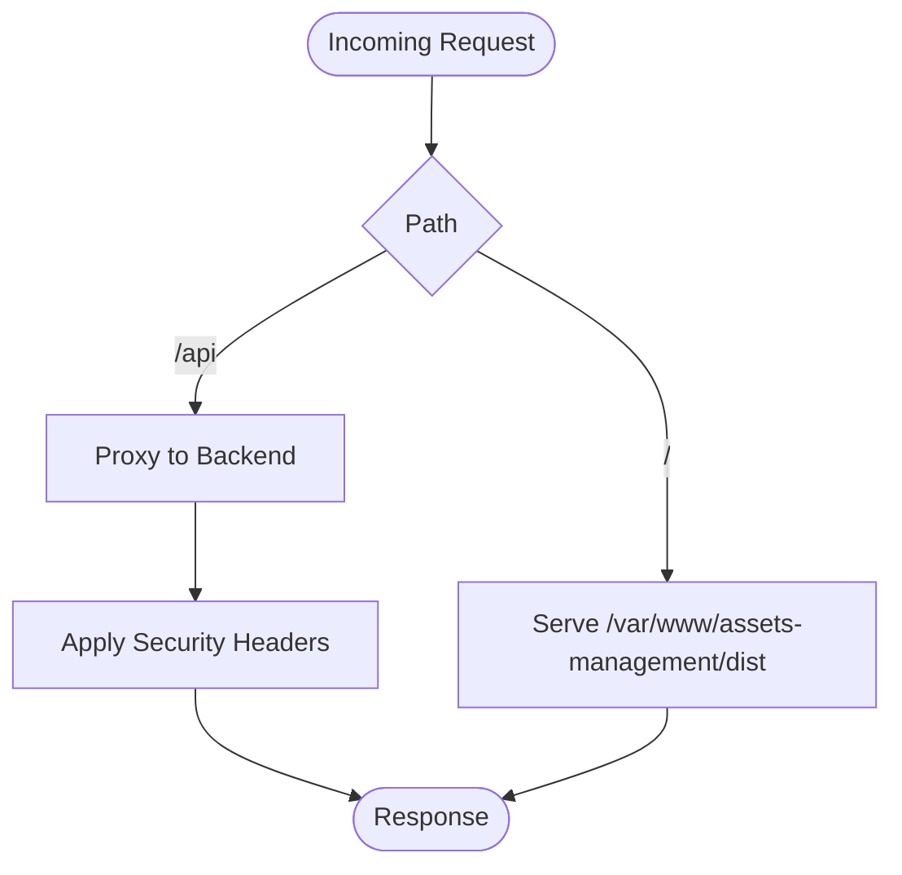
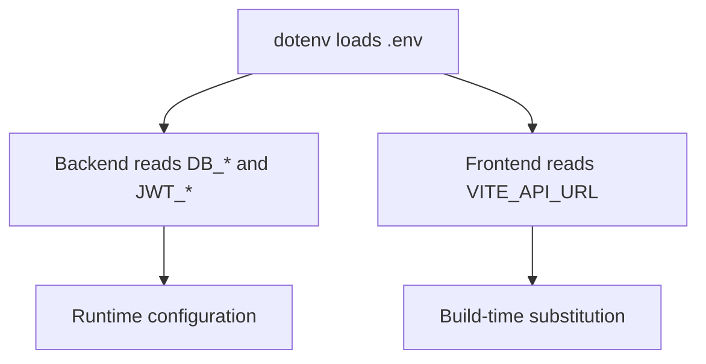
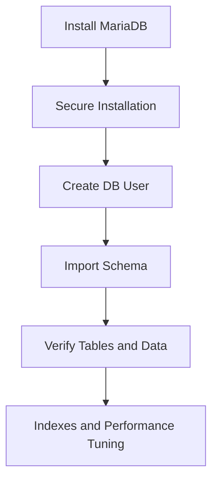
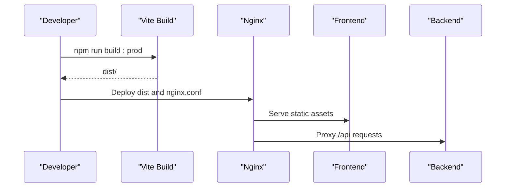
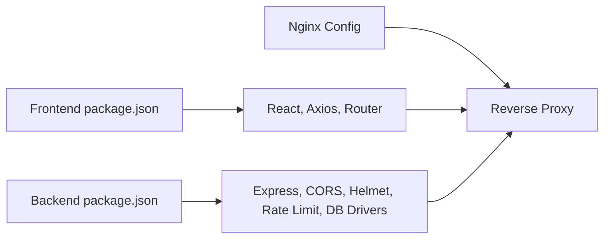

# Infrastructure Setup

## Table of Contents
1. [Introduction](#introduction)
2. [Project Structure](#project-structure)
3. [Core Components](#core-components)
4. [Architecture Overview](#architecture-overview)
5. [Detailed Component Analysis](#detailed-component-analysis)
6. [Dependency Analysis](#dependency-analysis)
7. [Performance Considerations](#performance-considerations)
8. [Troubleshooting Guide](#troubleshooting-guide)
9. [Conclusion](#conclusion)
10. [Appendices](#appendices)

## Introduction
This document provides comprehensive infrastructure setup guidance for the Assets Management System. It covers server requirements, operating system compatibility, network configuration, firewall rules, environment variables, secrets management, database setup and tuning, DNS and SSL, security groups and ACLs, storage and backup, and production deployment via Nginx. The content is derived from the repository’s official deployment and configuration documents, backend configuration, and Nginx configurations.

## Project Structure
The repository organizes infrastructure concerns across:
- Backend runtime and configuration (Node.js, Express, database abstraction)
- Frontend build and deployment (Vite, Nginx)
- Database schema and setup (MariaDB)
- Deployment guides and automation scripts
```bash
Nginx reverse proxy configurations
```



## Core Components
- Backend API server (Express) with health checks, rate limiting, and CORS
- Database abstraction supporting MariaDB and PostgreSQL with connection pooling
```bash
Nginx reverse proxy for frontend, API proxying, caching, and security headers
```
- Deployment guides covering Ubuntu prerequisites, firewall, PM2, and optional Nginx
- Environment variable configuration for backend and frontend

Key implementation references:
- Backend server bootstrap and routes: `backend/server.js:1-774`
- Database client selection and pooling: `backend/config/database.js:1-186`
- Nginx configuration for API proxying and security: `nginx.conf:1-121`, `nginx-simple.conf:1-75`
- Environment examples: `backend/env.example:1-26`, `env.example:1-7`

## Architecture Overview
The system runs as a three-tier stack:
- Frontend (React/Vite) served statically via Nginx
- Backend (Node.js/Express) exposing REST APIs
- Database (MariaDB or PostgreSQL) managed by the backend abstraction



## Detailed Component Analysis

### Backend API Server
- Exposes health endpoint and protected routes
- Implements CORS, rate limiting, and Helmet security headers
- Uses environment-driven configuration for ports, origins, and limits



### Database Abstraction and Connection Pooling
- Supports MariaDB and PostgreSQL via a unified interface
- Provides connection pools with timeouts and SSL options
- Converts placeholders and emulates insertId for Postgres



### Nginx Reverse Proxy
- Serves static assets from the frontend build
- Proxies API requests to the backend
- Applies security headers, caching, and CORS handling
- Supports health check endpoint



### Environment Variables and Secrets Management
- Backend environment variables include database client, host/port/user/password/name, JWT settings, CORS origins, rate limits, and SSL toggle
- Frontend environment variables define API URL and legacy Supabase keys
- Deployment guides demonstrate creating .env files and PM2 usage



### Database Setup and Migration
- Guides cover MariaDB installation, security, user creation, schema import, verification, and performance tuning
- Schema files define tables, indexes, triggers, and sample data
- Environment configuration supports both MariaDB and PostgreSQL



### Production Deployment with Nginx
- Builds a production frontend and serves via Nginx
- Configures API proxy, security headers, caching, and health check
- Includes steps for domain configuration and SSL with Certbot



## Dependency Analysis
- Backend depends on Express, CORS, Helmet, rate limiting, Morgan, and database drivers
- Frontend depends on React, Axios, routing, and proxy middleware
```bash
Nginx depends on static file serving and proxy configuration
```



## Performance Considerations
- Database connection pooling and timeouts are configurable in the backend abstraction
```bash
Nginx enables gzip compression and long-term caching for static assets
```
- Rate limiting and Helmet reduce overhead and improve resilience
- Recommendations include indexing, slow query checks, and automated backups

## Troubleshooting Guide
Common operational issues and resolutions:
- Database connectivity and service status checks
```bash
PM2 process management and logs
```
- Port conflicts and firewall rules
```bash
Nginx configuration testing and reload
```
- Backup script execution and retention

## Conclusion
The Assets Management System infrastructure is designed for straightforward deployment across Ubuntu servers with Nginx, PM2, and a choice of MariaDB or PostgreSQL. The provided guides and configurations cover environment setup, security hardening, reverse proxying, and operational maintenance. Following the documented steps ensures a secure, performant, and maintainable production environment.

## Appendices

### Network Configuration and Ports
- Backend API: 3000 (HTTP)
- Frontend dev server: 5173 (HTTP)
- Production frontend: 5000 (HTTP)
- Nginx: 80 (HTTP), 443 (HTTPS)
- Firewall: SSH (22), HTTP (80), HTTPS (443), API (3000), Frontend (5000/5173)

### DNS and SSL
- Configure domain entries to point to server IP
- Use Certbot for automated SSL issuance and renewal
```bash
Nginx configuration supports redirecting HTTP to HTTPS
```

### Storage and Backup
- Local filesystem for static assets under Nginx
- Automated database backups using mysqldump with retention policies
- Scheduled backup cron jobs and email notifications

### Security Groups, ACLs, and Access Control
```bash
UFW firewall enabled with allow rules for SSH, HTTP, HTTPS, API, and frontend ports
```
- CORS configured in backend and Nginx for controlled origins
- Security headers enforced by Nginx and backend middleware

### Infrastructure Provisioning and Configuration Management
- Deployment guides provide step-by-step commands for prerequisites, installation, configuration, and verification
```bash
PM2 used for process management and persistence

Nginx configuration files included for production deployment
```

- `docs/NGINX_PRODUCTION_DEPLOYMENT.md:22-79`
