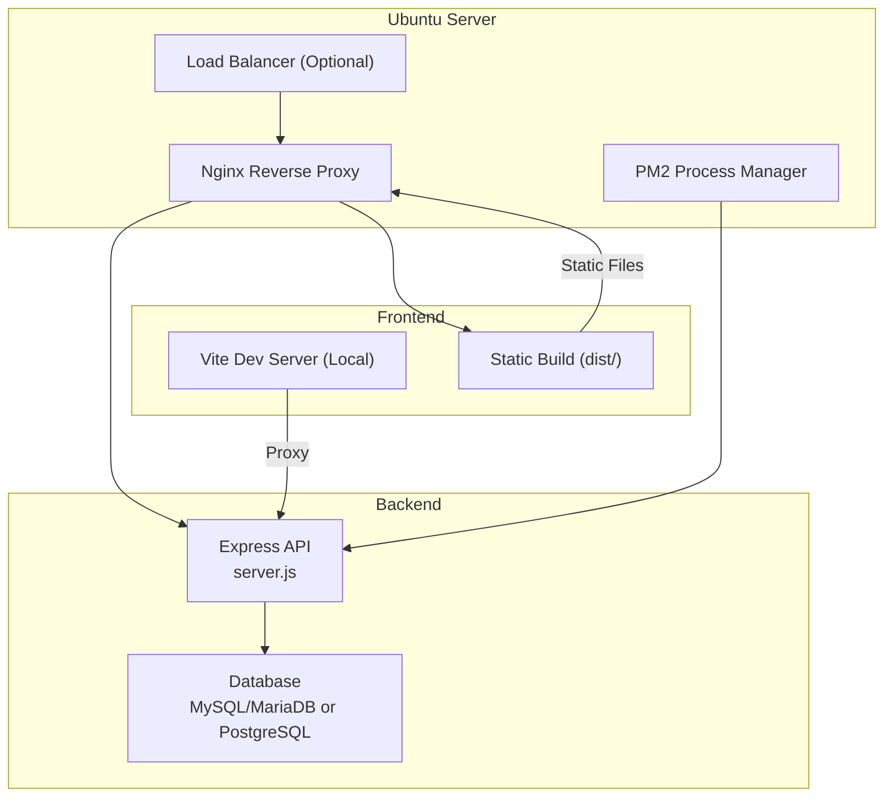
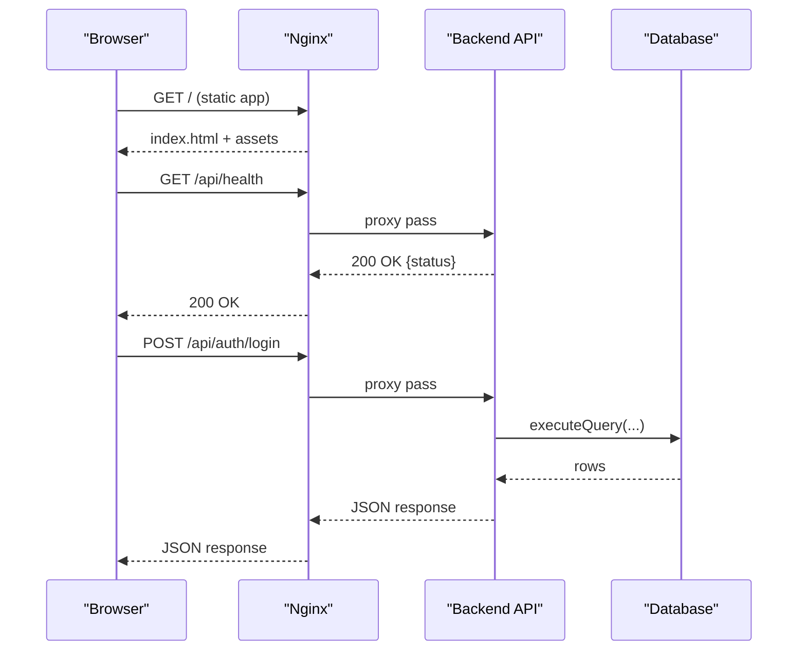
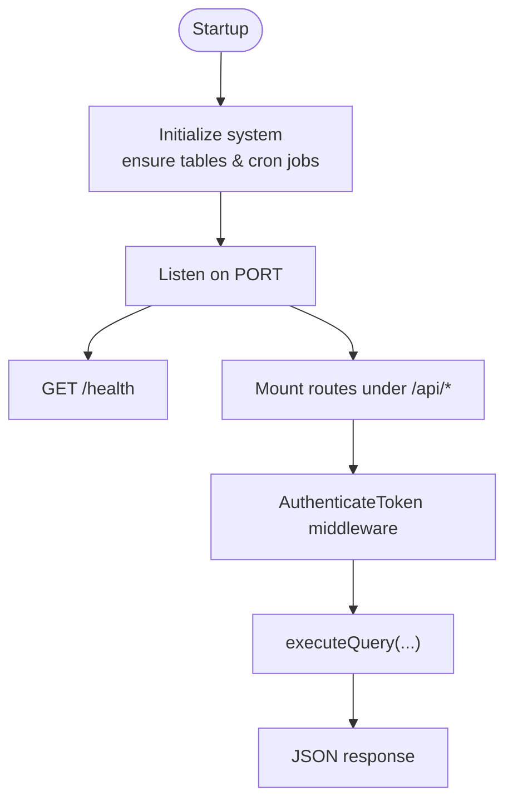
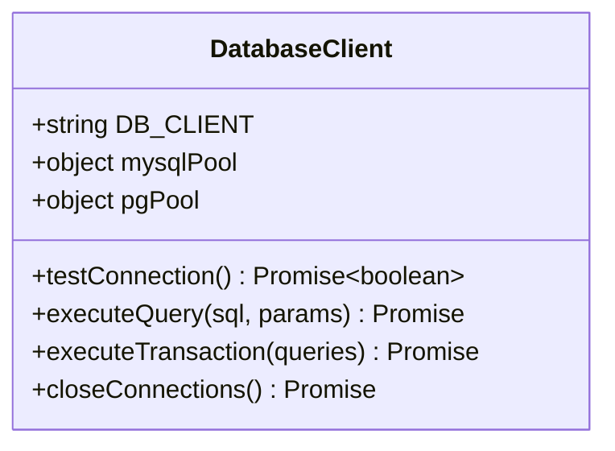
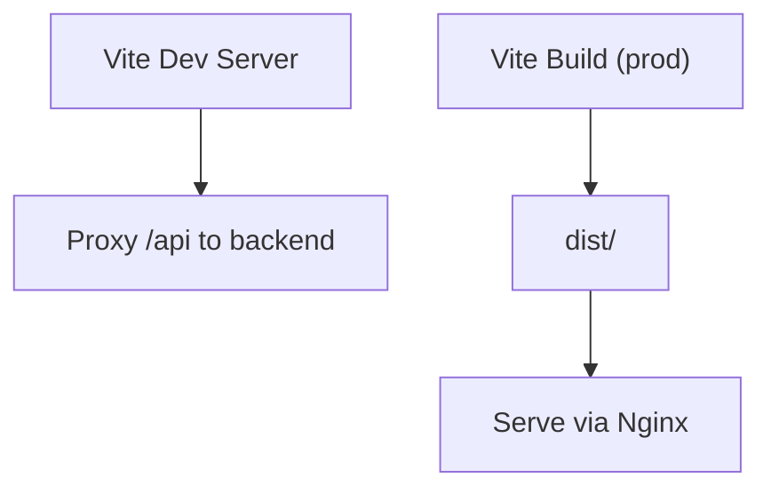
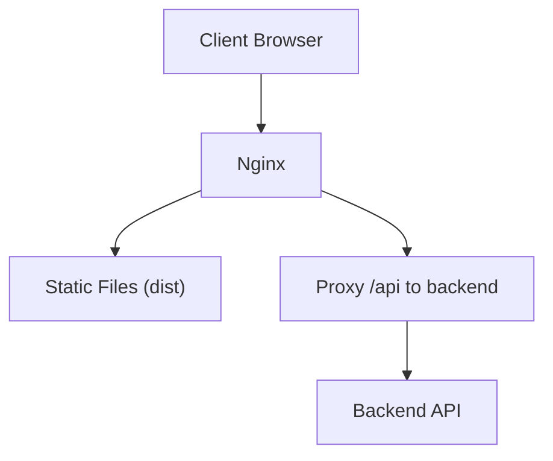
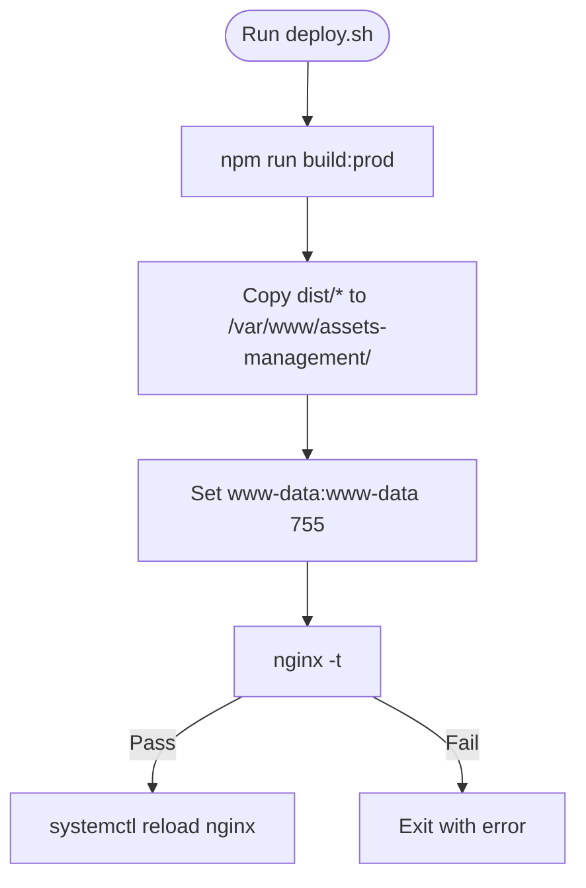
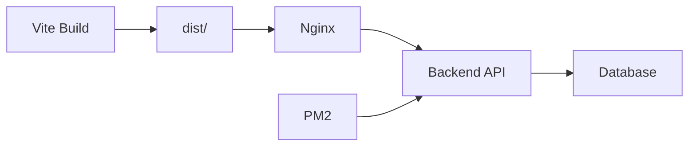

# Production Deployment

## Table of Contents
1. [Introduction](#introduction)
2. [Project Structure](#project-structure)
3. [Core Components](#core-components)
4. [Architecture Overview](#architecture-overview)
5. [Detailed Component Analysis](#detailed-component-analysis)
6. [Dependency Analysis](#dependency-analysis)
7. [Performance Considerations](#performance-considerations)
8. [Troubleshooting Guide](#troubleshooting-guide)
9. [Conclusion](#conclusion)
10. [Appendices](#appendices)

## Introduction
This document provides end-to-end production deployment guidance for the Assets Management System. It covers Ubuntu server prerequisites, Nginx reverse proxy configuration, SSL/TLS setup, HTTPS enforcement, frontend and backend deployment, environment variable configuration, database connectivity, service management, load balancing considerations, static file serving, API proxy configuration, deployment automation via shell scripts, and validation procedures.

## Project Structure
The repository includes:
- Backend API written in Node.js with Express, supporting both MySQL/MariaDB and PostgreSQL backends
- React-based frontend built with Vite
```bash
Nginx configuration examples for production deployment and reverse proxy
```
- Shell script for automated deployment
- Multiple deployment guides and documentation



## Core Components
- Backend API: Express server with health check, CORS, rate limiting, helmet security headers, and modular routes
- Database abstraction: Unified query execution supporting MySQL/MariaDB and PostgreSQL
- Frontend: Vite-built static application served by Nginx
- Nginx: Reverse proxy for API and static assets, caching, security headers, and optional HTTP to HTTPS redirect
- Deployment automation: Shell script to build and deploy the frontend to Nginx’s web root

Key runtime behaviors:
- Health check endpoint exposed by the backend
- Database client selection via environment variables
- Frontend proxy configuration for local development and API routing

## Architecture Overview
The production stack consists of:
```bash
Nginx as the edge server handling TLS termination, static file delivery, and API proxying
```
- Backend API exposing REST endpoints and internal cron-based tasks
- Database layer supporting two backends with unified query interface
- Frontend served as static assets from Nginx



## Detailed Component Analysis

### Backend API (server.js)
- Security middleware: Helmet, CORS with dynamic origins, rate limiting
- Health endpoint: Returns environment and uptime
- Modular routes mounted under /api/*
- Authentication middleware applied to protected routes
- Database initialization and cron-based tasks on startup



### Database Connectivity (database.js)
- Supports MySQL/MariaDB and PostgreSQL via environment flag
- Parameter placeholder normalization for PostgreSQL
- Transaction support and connection pooling
- Connection testing and graceful shutdown



### Frontend Build and Proxy (vite.config.ts)
- Development server bound to 0.0.0.0 with allowed hosts
- API proxy configured for development
- Production build optimizations: Terser, chunk splitting, hashed filenames, removal of console logs



### Nginx Reverse Proxy (nginx.conf)
- Serves static assets from dist/
- Proxies /api to backend
- Security headers and blocking of source files
- Gzip compression and caching for static assets
- Optional HTTP to HTTPS redirect block included



### Deployment Automation (deploy.sh)
- Builds the React app
- Copies dist/ contents to Nginx web root
- Sets ownership and permissions
- Tests and reloads Nginx



## Dependency Analysis
Runtime dependencies and integrations:
- Backend depends on Express, helmet, cors, rate-limit, morgan, dotenv, mysql2/pg, node-cron, nodemailer
- Frontend depends on React, react-router, axios, lucide-react, recharts
```bash
Nginx integrates with backend API and serves static assets
```
- Shell script orchestrates build and deployment



## Performance Considerations
- Static asset caching and compression in Nginx reduce bandwidth and latency
- Chunk splitting and hashed filenames improve long-term caching and cache busting
- Gzip compression reduces payload sizes
- Database connection pooling and transaction support optimize throughput
- Health checks and cron-based maintenance ensure reliability

## Troubleshooting Guide
Common operational issues and remedies:
- Database connection failures: verify DB client, host, port, user, password, and SSL settings
- Port conflicts: check listeners on 3000 (backend) and 5000 (frontend dev), adjust firewall rules
- Nginx configuration errors: test with nginx -t, review proxy and root directives
- Health check failures: confirm backend is reachable and /health responds
- Source file exposure: ensure Nginx blocks .ts, .tsx, and sensitive directories

## Conclusion
This guide consolidates the repository’s deployment materials into a single, actionable production deployment plan. By following the outlined steps—prerequisite installation, database setup, environment configuration, Nginx reverse proxy, SSL/TLS, automated deployment, and validation—you can reliably operate the Assets Management System in production.

## Appendices

### Step-by-Step Deployment Procedures
- Prepare Ubuntu server and install prerequisites
- Install and secure MariaDB or configure PostgreSQL
- Import database schema and seed data
- Configure environment variables for backend and frontend
- Build and deploy frontend to Nginx
- Configure Nginx for API proxy and static serving
- Set up SSL/TLS with Certbot and enforce HTTPS
- Start backend with PM2 and monitor logs
- Validate deployment via health checks and manual tests

### Environment Variable Reference
- Backend (.env):
  - Database: DB_CLIENT, DB_HOST, DB_PORT, DB_USER, DB_PASSWORD, DB_NAME, DB_SSL
  - Server: PORT, NODE_ENV, FRONTEND_URL
  - Security: JWT_SECRET, RATE_LIMIT_WINDOW_MS, RATE_LIMIT_MAX_REQUESTS
- Frontend (.env):
  - VITE_API_URL

### Service Configuration and Startup Scripts
- Backend startup: use PM2 to run server.js with process naming and persistence
- Frontend: serve built dist/ via Nginx; optionally run Vite dev server locally during development
- Nginx: enable site, test configuration, and reload

### Load Balancing and Static File Serving
- Use Nginx as the primary load balancer and reverse proxy
- Serve static assets directly from Nginx with caching and compression
- Route API traffic to backend instances behind Nginx

### API Proxy Configuration
```bash
Nginx location /api proxies to backend
```
- CORS headers configured for allowed origins
- Preflight handling for cross-origin requests

### Deployment Validation and Health Checks
- Backend health: GET /health
- Frontend accessibility: open root URL
- Database connectivity: test connection and basic queries
```bash
# Nginx status
systemctl status nginx, nginx -t
```

- `NGINX_PRODUCTION_DEPLOYMENT.md:167-187`
