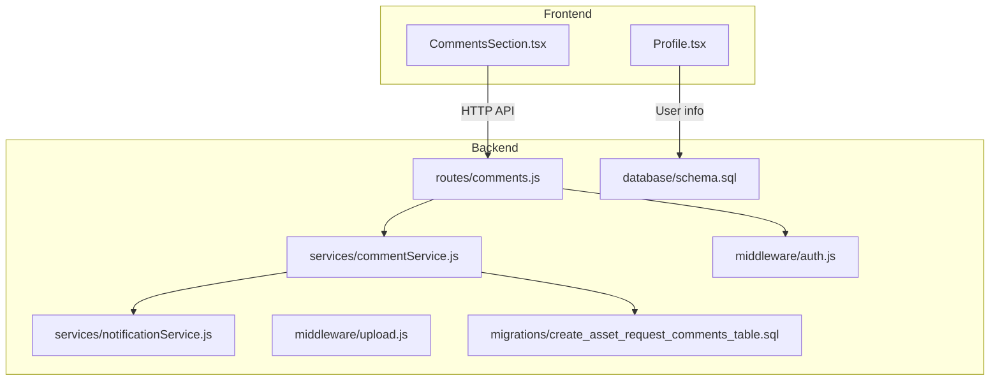
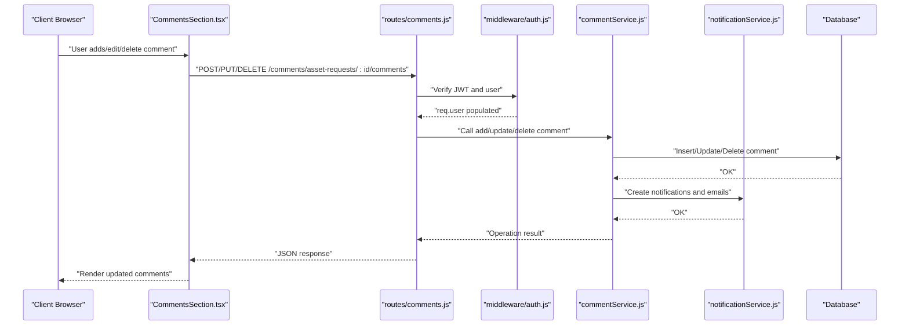
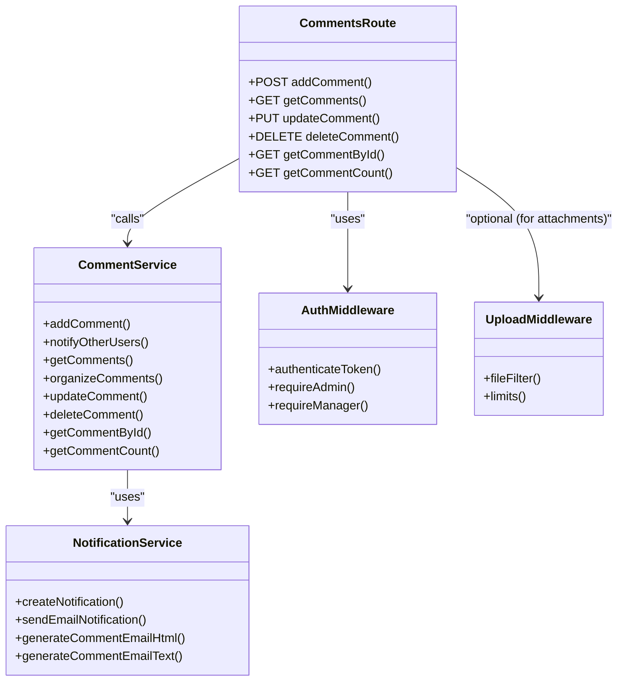

# Collaborative Commenting System

## Table of Contents
1. [Introduction](#introduction)
2. [Project Structure](#project-structure)
3. [Core Components](#core-components)
4. [Architecture Overview](#architecture-overview)
5. [Detailed Component Analysis](#detailed-component-analysis)
6. [Dependency Analysis](#dependency-analysis)
7. [Performance Considerations](#performance-considerations)
8. [Security Considerations](#security-considerations)
9. [Troubleshooting Guide](#troubleshooting-guide)
10. [Conclusion](#conclusion)

## Introduction
This document describes the Collaborative Commenting System used for asset request discussions. It covers comment creation, editing, deletion, threading and replies, notification triggers, user profile integration, and security measures. The system supports hierarchical comments with parent-child relationships and integrates with the broader notification framework.

## Project Structure
The commenting system spans backend routes and services, frontend UI components, and supporting database migrations and middleware.

## Core Components
- Backend routes expose REST endpoints for CRUD operations on comments and retrieval of counts.
- The comment service encapsulates business logic: inserting, updating, deleting, organizing threaded comments, and triggering notifications.
- The notification service creates in-app notifications and sends email notifications.
- The frontend component renders comments, supports replies, edits, and deletions, and displays user avatars/profiles.

Key responsibilities:
- Authentication and authorization enforcement via JWT middleware.
- Threaded comment organization using parent_comment_id foreign key.
- Non-blocking notification dispatch to requester and admins/managers.
- User profile integration for display of author name and role.

## Architecture Overview
The system follows a layered architecture:
- Presentation layer: React component renders comments and handles user actions.
- Application layer: Express routes delegate to comment service.
- Domain layer: Comment service manages data transformations and notifications.
- Infrastructure layer: Database schema and migrations define persistence.

## Detailed Component Analysis

### Backend Routes: Comments
- POST /comments/asset-requests/:assetRequestId/comments: Creates a new top-level or reply comment.
- GET /comments/asset-requests/:assetRequestId/comments: Retrieves all comments and organizes them into a tree.
- PUT /comments/asset-requests/:assetRequestId/comments/:id: Updates a comment authored by the current user.
- DELETE /comments/asset-requests/:assetRequestId/comments/:id: Deletes a comment authored by the current user or an admin.
- GET /comments/comments/:id: Fetches a single comment by ID.
- GET /comments/asset-requests/:assetRequestId/comments/count: Returns the total comment count.

Authorization:
- All endpoints require a valid JWT token.
- Update and delete enforce ownership or admin privileges.

Validation:
- Rejects empty comments on create/update.

### Comment Service: Business Logic
Responsibilities:
- Insert comment with generated UUID and parent_comment_id support.
- Retrieve comments and organize them into a hierarchical structure.
- Update/delete with ownership checks.
- Trigger notifications:
  - Notify requester (if not the commenter).
  - Notify admins/managers except the commenter.
- Email generation helpers for comment notifications.

Threaded comments:
- Uses a self-referencing foreign key parent_comment_id.
- Organizes comments into root nodes and nested replies.

Notifications:
- Creates in-app notifications and optionally emails based on user preferences.

### Frontend Component: CommentsSection
Features:
- Load comments via API and render in a thread.
- Add new top-level comments.
- Reply to any comment (nested replies supported).
- Edit and delete owned comments.
- Confirmation modal for deletions.
- Real-time feedback via toast notifications.
- Avatar/profile integration via user context/profile page.

Rendering:
- Displays user name and relative timestamps.
- Supports nested replies with indentation.
- Edit mode with textarea and save/cancel controls.

### Database Schema and Migrations
- asset_request_comments table stores comments with UUID primary keys and parent-child relationships.
- Foreign keys cascade deletes to maintain referential integrity.
- Users table defines roles (admin, manager, user) used for privilege checks.

### Notification System Integration
- On new comment, requester receives an in-app notification and optionally an email.
- Admins and managers receive in-app notifications and optionally emails.
- Notification creation and email sending are delegated to notificationService.
- Email templates are generated per scenario.

### User Profiles and Avatar Display
- Profile page shows user details including role badges and department.
- Comments display the author’s name and relative timestamps.
- Avatars are not explicitly stored in the provided code; user roles and names are used for identification.

### Attachment Handling for Comments
- The comments module itself does not include attachment fields in the asset_request_comments table.
- The upload middleware supports images and documents with size and count limits.
- Attachments are commonly handled in related modules (e.g., issues) and can be integrated similarly for asset requests if needed.

Note: For asset request comments, attachments are not part of the current schema. If required, extend the table and integrate upload middleware accordingly.

## Dependency Analysis

## Performance Considerations
- Asynchronous notifications are executed in parallel to avoid blocking comment operations.
- Database queries use indexed columns (asset_request_id, user_id, parent_comment_id) to improve lookup performance.
- Pagination utilities are available in the notification service for scalable retrieval of notifications.

Recommendations:
- Consider caching frequently accessed comment threads.
- Batch notification sends when scaling.
- Indexes on created_at and updated_at can aid sorting and filtering.

## Security Considerations
Authentication and Authorization:
- All comment endpoints require a valid JWT token.
- Ownership checks prevent unauthorized updates/deletes.
- Admin and manager roles bypass ownership checks for deletions.

Data Validation:
- Empty comments are rejected during creation and updates.
- File uploads restrict MIME types and enforce size/count limits.

Privacy and Exposure:
- The API security guide recommends using a reverse proxy to hide backend URLs and centralize CORS and rate limiting.

Additional safeguards:
- Sanitize inputs and escape HTML in email templates.
- Enforce role-based access for sensitive operations.
- Monitor audit logs for suspicious activity.

## Troubleshooting Guide
Common issues and resolutions:
- Unauthorized errors when editing/deleting comments: Ensure the current user owns the comment or has admin/manager privileges.
- Empty comment errors: Validate that the comment field is present and non-empty.
- Notification delivery failures: Check user email preferences and SMTP configuration.
- CORS or proxy issues: Verify reverse proxy configuration and CORS headers.

Operational tips:
- Use the health check endpoint of the proxy server for monitoring.
- Inspect logs for failed notification attempts.
- Confirm database indexes are present for optimal query performance.

## Conclusion
The Collaborative Commenting System provides a robust foundation for threaded discussions around asset requests. It enforces proper authentication and authorization, supports non-blocking notifications, and integrates with user profiles. While the current schema does not include attachments for comments, the upload middleware and pattern can be extended to support images and documents. Security best practices, including JWT verification, input validation, and reverse proxy deployment, ensure safe operation in production environments.
