# Issue & Ticketing System

## Table of Contents
1. [Introduction](#introduction)
2. [System Architecture](#system-architecture)
3. [Ticket Lifecycle Management](#ticket-lifecycle-management)
4. [Issue Categories and Classification](#issue-categories-and-classification)
5. [Collaborative Commenting System](#collaborative-commenting-system)
6. [Attachment Handling](#attachment-handling)
7. [Notification System](#notification-system)
8. [Integration with Assets](#integration-with-assets)
9. [Reporting and Analytics](#reporting-and-analytics)
10. [Queue Management and Escalation](#queue-management-and-escalation)
11. [Common Resolution Patterns](#common-resolution-patterns)
12. [Troubleshooting Guide](#troubleshooting-guide)
13. [Conclusion](#conclusion)

## Introduction

The Issue and Ticketing System is a comprehensive asset management solution designed to streamline problem identification, tracking, and resolution within organizational environments. This system provides a structured approach to managing technical issues, equipment malfunctions, and operational problems while maintaining detailed audit trails and fostering collaborative problem-solving among team members.

The system operates on a dual-layer architecture where users can report issues directly, administrators can manage and assign problems, and the platform maintains detailed records of all activities. Built with modern web technologies, it supports real-time collaboration, automated notifications, and comprehensive reporting capabilities essential for effective IT and facilities management operations.

## System Architecture

The Issue and Ticketing System follows a modular architecture with clear separation of concerns between frontend presentation, backend APIs, and database operations. The system is designed to handle concurrent users, maintain data integrity, and provide scalable solutions for growing organizations.

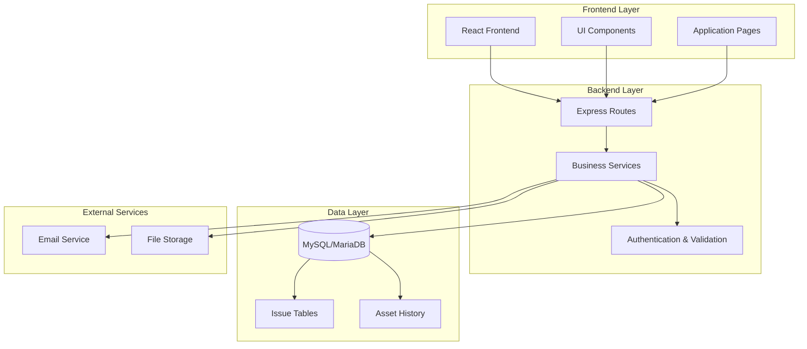

The architecture ensures scalability through:
- **RESTful API Design**: Clean separation of concerns with dedicated endpoints for each operation
- **Modular Services**: Independent services for notifications, comments, and email handling
- **Database Normalization**: Proper indexing and foreign key relationships for optimal performance
- **Middleware Pipeline**: Consistent authentication, validation, and error handling across all operations

## Ticket Lifecycle Management

The ticket lifecycle encompasses the complete journey of an issue from initial reporting through resolution and closure. This comprehensive process ensures proper tracking, accountability, and quality assurance throughout the problem-solving workflow.

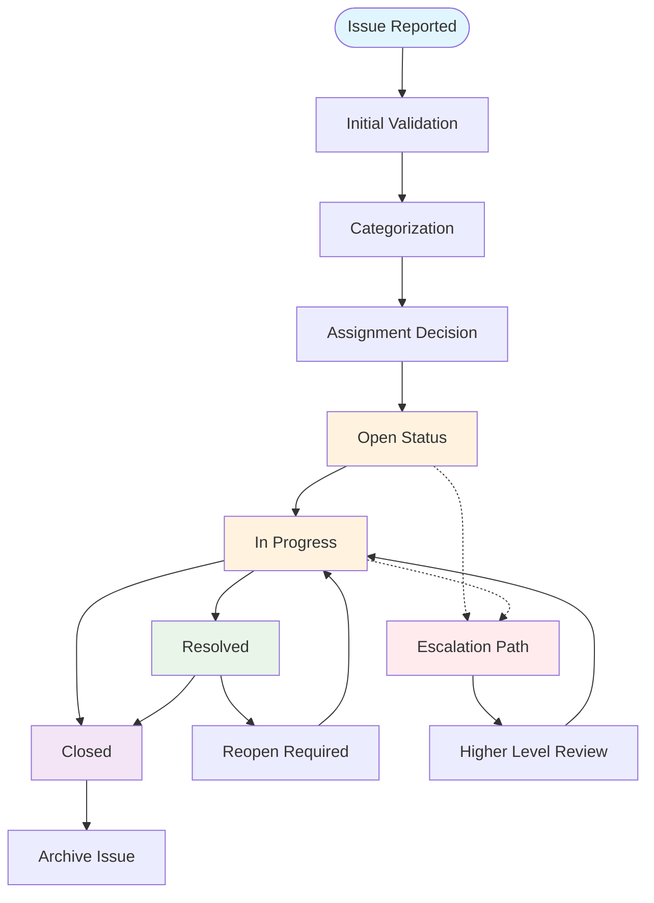

### Status Management Workflow

The system implements a structured status management approach with predefined states and transitions:

| Status | Description | Color Coding | Typical Actions |
|--------|-------------|--------------|-----------------|
| **Open** | Newly reported, awaiting assignment | Red (#ef4444) | Initial triage, categorization |
| **In Progress** | Active investigation/resolution | Yellow (#f59e0b) | Technical work, progress updates |
| **Resolved** | Problem fixed, awaiting verification | Green (#10b981) | Testing, validation |
| **Closed** | Verified complete, documentation complete | Purple (#8b5cf6) | Closure, feedback collection |
| **Scheduled** | Planned resolution, future work | Blue (#3b82f6) | Resource allocation |

### Priority Management System

Priority levels determine resource allocation and escalation paths:

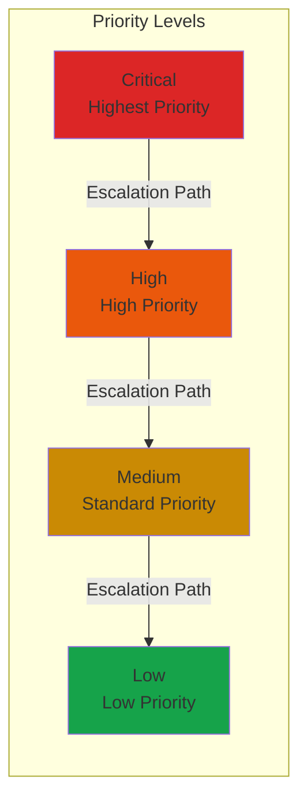

## Issue Categories and Classification

The classification system provides structured categorization of issues to enable efficient routing, reporting, and analytics. Categories help teams understand problem patterns and allocate resources appropriately.

### Category Management Architecture

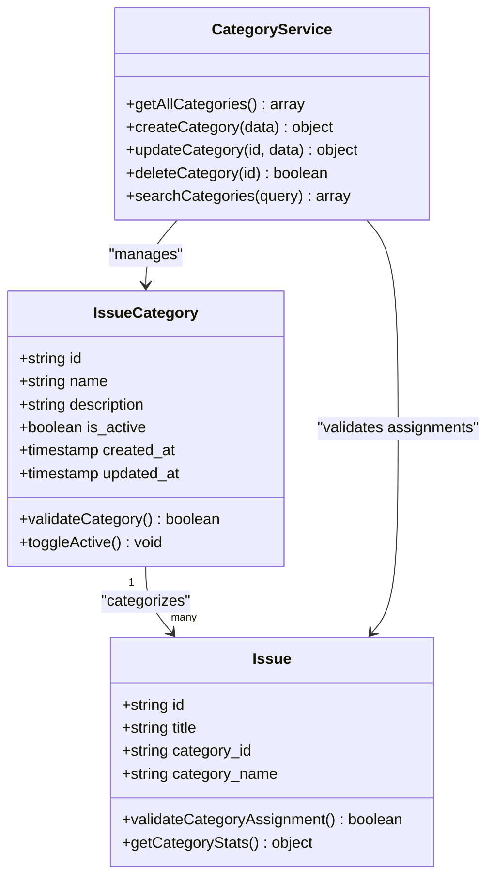

### Category Types and Examples

The system supports various issue classification schemes:

| Category Type | Examples | Purpose |
|---------------|----------|---------|
| **Hardware** | Servers, Workstations, Printers, Networking Equipment | Physical device issues |
| **Software** | Applications, Operating Systems, Drivers, Updates | Digital solution problems |
| **Network** | Connectivity, Bandwidth, DNS, Firewalls | Infrastructure connectivity |
| **Facilities** | Power, Cooling, Lighting, Space | Physical environment issues |
| **Security** | Access Control, Authentication, Compliance | Safety and protection |
| **Data** | Databases, Storage, Backups, Migration | Information management |

### Dynamic Category Management

The category system supports:
- **Hierarchical Organization**: Subcategories and parent-child relationships
- **Active/Inactive States**: Enable/disable categories based on relevance
- **Search and Filtering**: Advanced querying capabilities
- **Audit Trails**: Complete history of category modifications

## Collaborative Commenting System

The commenting system facilitates transparent, collaborative problem-solving with rich communication features and role-based access controls. It enables stakeholders to contribute insights, track progress, and maintain comprehensive documentation.

### Comment Architecture

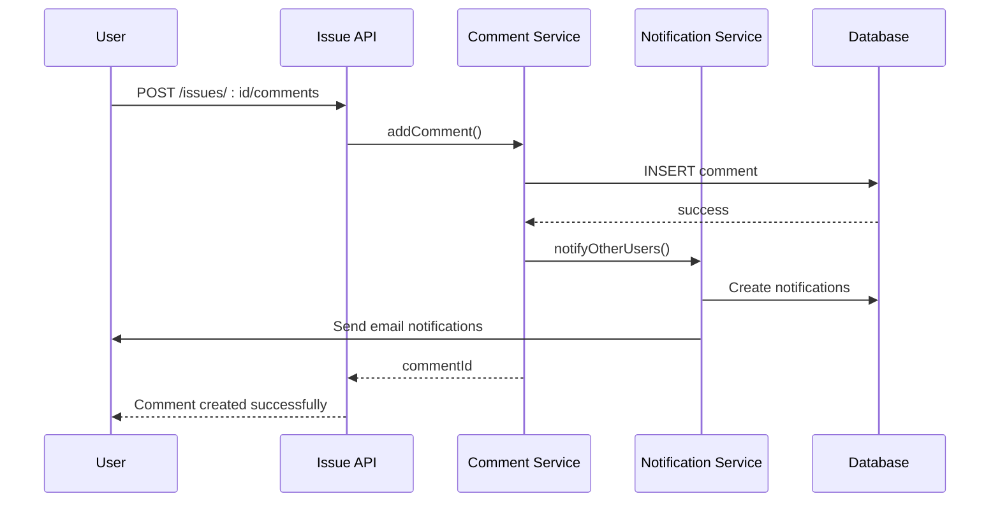

### Comment Features and Capabilities

| Feature | Description | Implementation |
|---------|-------------|----------------|
| **Rich Text Support** | Markdown formatting, links, mentions | Frontend editor with preview |
| **Threaded Discussions** | Nested replies, conversation threading | Parent-child relationship model |
| **File Attachments** | Images, documents, logs | Secure file upload system |
| **Real-time Updates** | Live comment feed refresh | WebSocket integration |
| **Permission Controls** | Role-based visibility | User authentication checks |
| **Audit Trail** | Complete comment history | Full CRUD logging |

### Notification Triggers

The system automatically notifies relevant parties based on comment context:

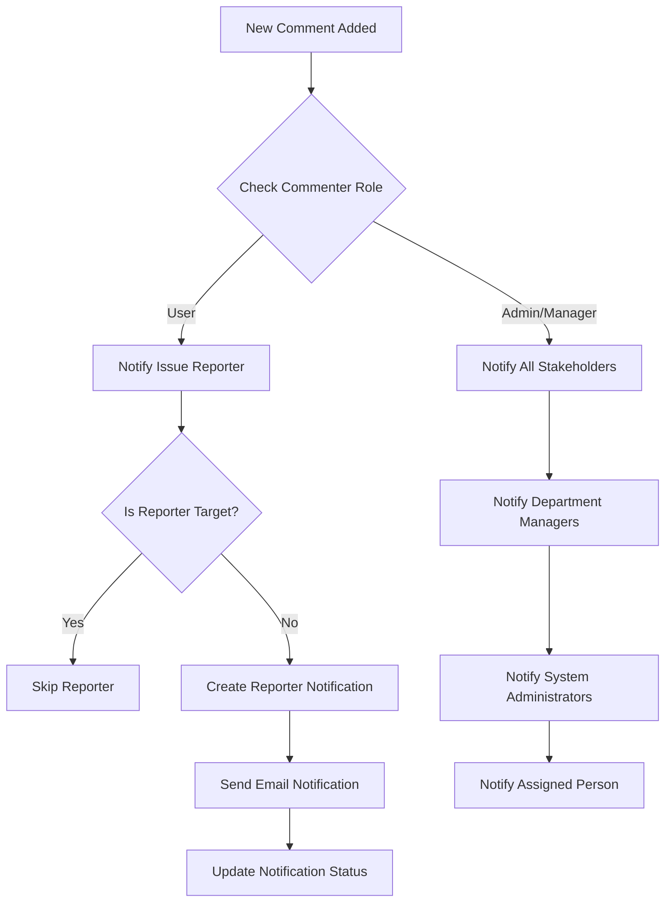

## Attachment Handling

The attachment system provides secure, scalable file management for issue-related documentation, images, and supporting materials. It ensures compliance with storage policies while maintaining accessibility and performance.

### Attachment Architecture

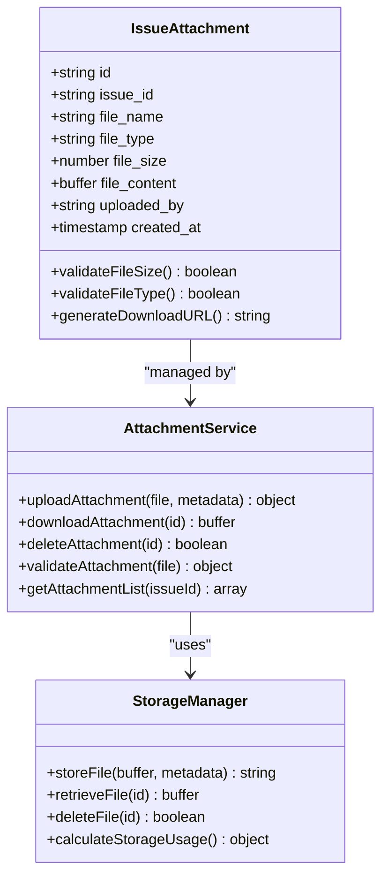

### File Management Features

| Capability | Implementation | Limits |
|------------|----------------|--------|
| **File Upload** | Multi-file support via FormData | Up to 5 files per submission |
| **Size Limits** | Configurable per file type | Maximum 10MB per file |
| **Type Validation** | MIME type checking | Images, PDFs, Office documents |
| **Storage Backend** | Database blob storage | Encrypted at rest |
| **Download Access** | Secure URL generation | Token-based authentication |
| **Cleanup Automation** | Automatic orphan cleanup | 30-day retention policy |

### Security and Compliance

The attachment system implements comprehensive security measures:
- **Authentication**: All downloads require valid session tokens
- **Authorization**: Access control based on issue ownership and permissions
- **Encryption**: File content encrypted during storage
- **Audit Logging**: Complete access and modification tracking
- **Virus Scanning**: Automated malware detection for uploaded files

## Notification System

The notification system provides comprehensive communication channels ensuring stakeholders remain informed throughout the issue resolution process. It supports multiple delivery methods and customizable preferences.

### Notification Architecture

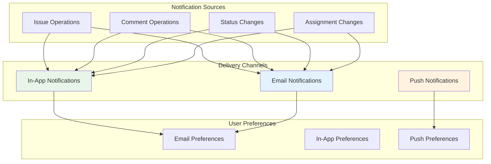

### Notification Types and Templates

| Notification Type | Trigger Conditions | Delivery Methods | Template Content |
|-------------------|-------------------|------------------|------------------|
| **Issue Creation** | New issue reported | In-App, Email | Confirmation details, next steps |
| **Assignment Notification** | Issue assigned to user | In-App, Email | Assignment details, responsibility |
| **Status Change** | Status update occurs | In-App, Email | Change details, impact assessment |
| **Comment Response** | New comment added | In-App, Email | Comment excerpt, action required |
| **Escalation Alert** | Priority escalation | In-App, Email | Escalation details, urgency level |
| **Resolution Confirmation** | Issue closed | In-App, Email | Resolution summary, satisfaction survey |

### Preference Management

Users can customize their notification preferences through granular controls:

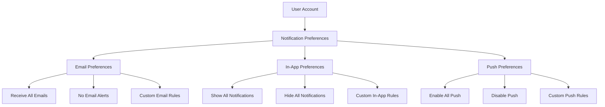

## Integration with Assets

The system provides seamless integration between issues and assets, enabling contextual problem tracking and maintenance scheduling. This integration ensures proper attribution and facilitates preventive maintenance workflows.

### Asset-Issue Relationship

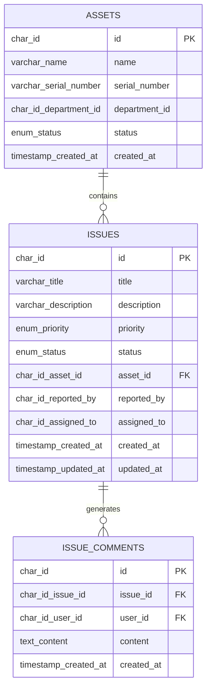

### Asset History Tracking

The system maintains comprehensive history of asset-issue interactions:

| Event Type | Description | Impact | Trigger |
|------------|-------------|---------|---------|
| **Created** | Issue initially reported against asset | Establishes baseline | New issue creation |
| **Status Change** | Issue moves between open/in-progress/resolved | Progress tracking | Status update |
| **Owner Change** | Issue reassigned to different person/team | Responsibility transfer | Assignment update |
| **Resolution** | Issue marked as resolved/closed | Completion confirmation | Final status change |
| **Comment** | New discussion added to issue | Collaboration record | Comment creation |
| **Asset Linked** | Issue associated with specific asset | Context establishment | Asset selection |
| **Asset Unlinked** | Issue disassociated from asset | Context removal | Asset removal |

### Asset-Based Workflows

The integration enables sophisticated workflows:

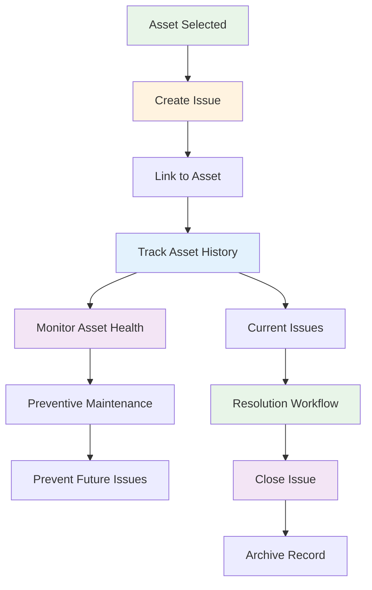

## Reporting and Analytics

The system provides comprehensive reporting capabilities enabling management to track performance metrics, identify trends, and make data-driven decisions. Reports cover various aspects of the issue management process.

### Dashboard Components

The administrative interface presents key metrics through interactive dashboards:

| Metric Type | Visualization | Data Source | Frequency |
|-------------|---------------|-------------|-----------|
| **Issue Volume** | Line Chart | Daily counts | Real-time |
| **Resolution Times** | Histogram | SLA tracking | Hourly |
| **Priority Distribution** | Pie Chart | Priority breakdown | Real-time |
| **Department Performance** | Bar Chart | Team metrics | Daily |
| **Asset Health** | Heat Map | Asset status | Real-time |
| **Resource Utilization** | Gantt Chart | Staff workload | Hourly |

### Advanced Analytics Features

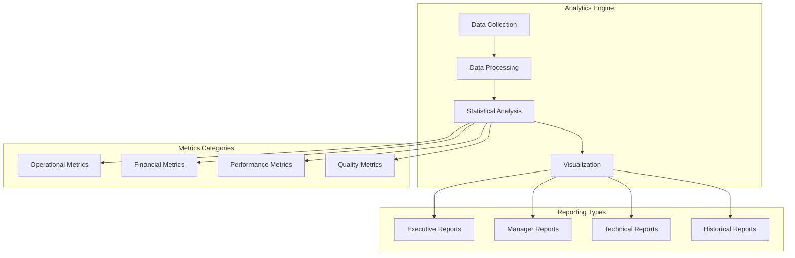

### Key Performance Indicators

| KPI | Definition | Target | Monitoring |
|-----|------------|--------|------------|
| **First Response Time** | Time from issue creation to first response | < 2 hours | Real-time tracking |
| **Resolution Time** | Time from assignment to closure | < 5 days | SLA compliance |
| **Customer Satisfaction** | Post-resolution survey scores | > 4.5/5 | Monthly averages |
| **Issue Volume** | Total issues per period | Baseline growth | Trend analysis |
| **Reopened Rate** | Issues requiring follow-up | < 10% | Quality metric |
| **Resource Utilization** | Staff workload distribution | Balanced | Capacity planning |

### Export and Integration Capabilities

The system supports multiple export formats and external integrations:

- **Export Formats**: CSV, Excel, PDF, JSON
- **API Access**: RESTful endpoints for external systems
- **Integration Points**: LDAP, Active Directory, ticketing systems
- **Custom Fields**: Extensible metadata support
- **Automated Reporting**: Scheduled reports via email

## Queue Management and Escalation

The queue management system provides intelligent routing and prioritization of issues to ensure optimal resource utilization and timely resolution. It implements sophisticated algorithms for workload balancing and escalation handling.

### Queue Architecture

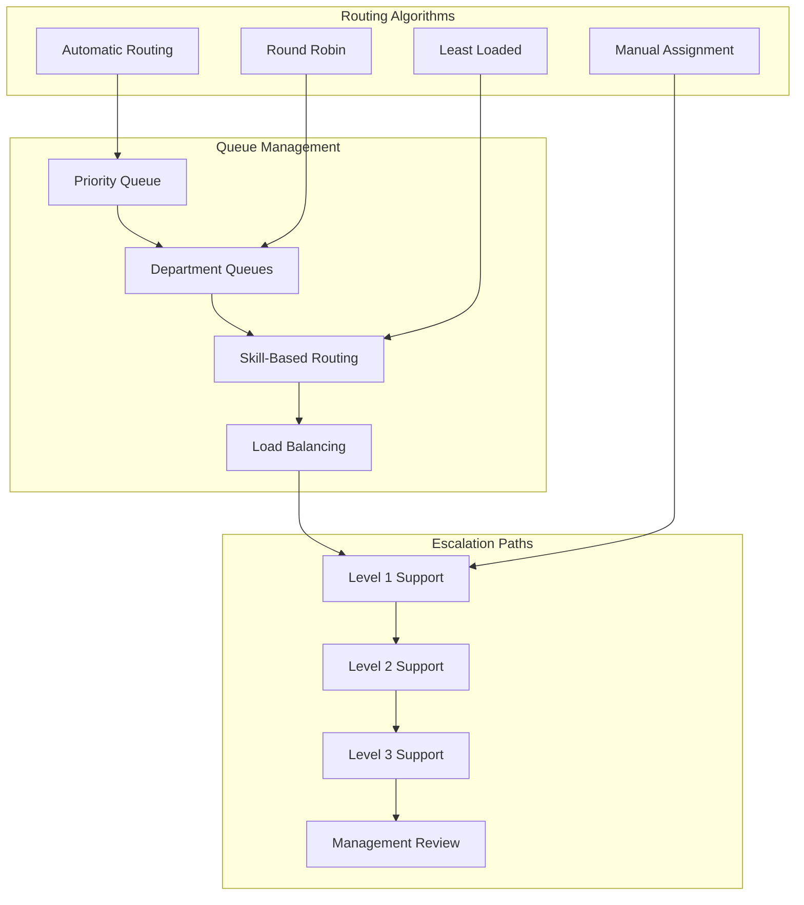

### Escalation Logic

The system implements tiered escalation based on priority, time thresholds, and resource availability:

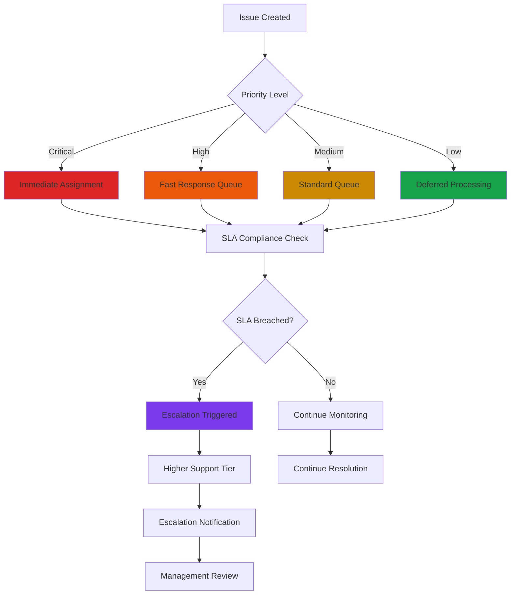

### Resource Allocation Strategies

The system employs multiple strategies for optimal resource allocation:

| Strategy | Algorithm | Use Case | Benefits |
|----------|-----------|----------|----------|
| **Round Robin** | Equal distribution | Balanced workload | Fair resource sharing |
| **Least Loaded** | Dynamic load balancing | Variable demand | Optimal throughput |
| **Skill-Based** | Expert matching | Specialized issues | Higher quality resolution |
| **Department Affinity** | Local expertise | Contextual problems | Faster resolution |
| **Geographic Proximity** | Location-based | On-site issues | Reduced travel time |

## Common Resolution Patterns

The system captures and analyzes common issue resolution patterns to improve efficiency and reduce resolution times. These patterns inform best practices and training programs for support staff.

### Typical Issue Scenarios

| Scenario | Description | Resolution Pattern | Average Time |
|----------|-------------|-------------------|--------------|
| **Hardware Failure** | Device stops responding, physical damage | Replacement/Repair | 2-3 days |
| **Software Bug** | Application crashes, functionality issues | Patch/Workaround | 1-2 days |
| **Network Connectivity** | Internet/wifi issues, connection drops | Diagnostics/Troubleshooting | 4-6 hours |
| **Account Access** | Login problems, permission issues | Reset/Recovery | 30-60 minutes |
| **Data Recovery** | Lost files, corrupted data | Backup restoration | 1-2 days |
| **Configuration Error** | Misconfigured settings, policy violations | Correction/Reconfiguration | 2-4 hours |

### Resolution Templates

The system provides standardized templates for common issues:

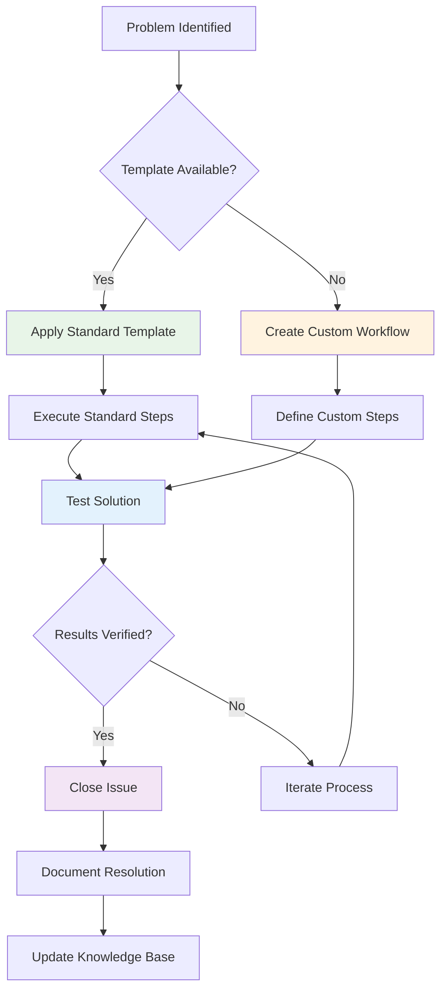

### Knowledge Base Integration

Resolved issues contribute to a growing knowledge base:

- **Solution Documentation**: Step-by-step resolution procedures
- **Preventive Measures**: Tips to avoid similar issues
- **Related Issues**: Cross-references to similar problems
- **Best Practices**: Industry-standard approaches
- **Training Materials**: Educational content for staff development

## Troubleshooting Guide

This comprehensive troubleshooting guide addresses common issues and provides step-by-step resolution procedures for maintaining system health and optimal performance.

### Common Issues and Solutions

#### Authentication and Authorization Problems

**Issue**: Users unable to log in or access system features
**Symptoms**: 
- Login failures despite correct credentials
- Permission errors when accessing features
- Session timeout issues

**Diagnostic Steps**:
1. Verify user account status and activation
2. Check role assignments and permission levels
3. Validate authentication tokens and session validity
4. Review browser compatibility and cookie settings

**Resolution Procedures**:
- Reset user passwords through admin interface
- Update role assignments for appropriate access
- Clear browser cache and cookies
- Configure CORS settings for cross-origin requests

#### Database Connection Issues

**Issue**: System unable to connect to database or experiencing timeouts
**Symptoms**:
- Database connection errors during login
- Slow query performance or timeouts
- Transaction failures during operations

**Diagnostic Steps**:
1. Verify database server status and network connectivity
2. Check connection pool limits and current connections
3. Monitor database performance metrics
4. Validate database credentials and permissions

**Resolution Procedures**:
- Restart database service if unresponsive
- Increase connection pool limits for high traffic
- Optimize slow queries and add appropriate indexes
- Update database credentials and firewall rules

#### Email Notification Failures

**Issue**: Users not receiving email notifications for issue updates
**Symptoms**:
- In-app notifications appear but no emails received
- Email delivery failures or bounces
- Delayed or missing notification emails

**Diagnostic Steps**:
1. Verify SMTP server configuration and credentials
2. Check email queue and delivery logs
3. Validate recipient email addresses and preferences
4. Review spam filtering and email server reputation

**Resolution Procedures**:
- Update SMTP settings with correct server details
- Configure SPF/DKIM records for email authentication
- Adjust email template formatting for client compatibility
- Implement email retry mechanisms for failed deliveries

#### File Upload and Attachment Issues

**Issue**: Problems uploading files or downloading attachments
**Symptoms**:
- Upload failures or timeouts during file transfer
- Corrupted or incomplete file downloads
- File type validation errors

**Diagnostic Steps**:
1. Check file size limits and supported formats
2. Verify storage permissions and disk space
3. Validate file type detection and virus scanning
4. Review network connectivity during transfers

**Resolution Procedures**:
- Increase file upload limits for large files
- Configure antivirus software exceptions
- Implement chunked file upload for large files
- Optimize storage backend performance

### Performance Optimization Guidelines

#### Database Optimization
- **Index Management**: Regular index analysis and optimization
- **Query Optimization**: Identify and resolve slow-running queries
- **Connection Pool Tuning**: Adjust pool sizes based on traffic patterns
- **Backup Scheduling**: Optimize backup windows to minimize impact

#### Frontend Performance
- **Bundle Optimization**: Minimize JavaScript and CSS bundle sizes
- **Image Optimization**: Implement lazy loading and compression
- **Caching Strategy**: Configure appropriate caching headers
- **CDN Integration**: Distribute static assets globally

#### System Monitoring
- **Health Checks**: Implement automated system health monitoring
- **Performance Metrics**: Track key performance indicators continuously
- **Alerting System**: Configure alerts for critical system events
- **Capacity Planning**: Monitor usage trends for future scaling needs

### Security and Compliance

#### Access Control
- **Role-Based Permissions**: Implement principle of least privilege
- **Multi-Factor Authentication**: Enable MFA for administrative accounts
- **Session Management**: Secure session handling and timeout policies
- **Audit Logging**: Comprehensive logging of all administrative actions

#### Data Protection
- **Encryption**: Encrypt sensitive data at rest and in transit
- **Data Retention**: Implement appropriate data lifecycle policies
- **Backup Security**: Secure backup storage and encryption
- **Compliance**: Ensure adherence to relevant regulations and standards

## Conclusion

The Issue and Ticketing System represents a comprehensive solution for modern asset management organizations seeking to streamline problem identification, tracking, and resolution. Through its robust architecture, extensive feature set, and focus on collaboration and transparency, the system provides significant value in terms of operational efficiency, cost reduction, and improved service quality.

Key strengths of the system include its modular design enabling easy customization and extension, comprehensive notification and communication features fostering collaboration, sophisticated analytics and reporting capabilities supporting data-driven decision-making, and seamless integration with asset management workflows ensuring contextual problem tracking.

The system's commitment to security, compliance, and performance ensures it meets the demands of enterprise environments while remaining accessible and user-friendly for end users. Its extensible architecture and comprehensive API support enable integration with existing organizational systems and workflows.

Future enhancements could include advanced AI-powered issue categorization, predictive maintenance capabilities, mobile application support, and expanded integration with third-party tools and services. The solid foundation established by the current implementation provides an excellent platform for continued evolution and improvement.

Organizations implementing this system can expect measurable improvements in issue resolution times, increased operational efficiency, enhanced stakeholder satisfaction, and better overall asset management outcomes. The combination of automation, collaboration, and analytics creates a powerful platform for continuous improvement and organizational success.
