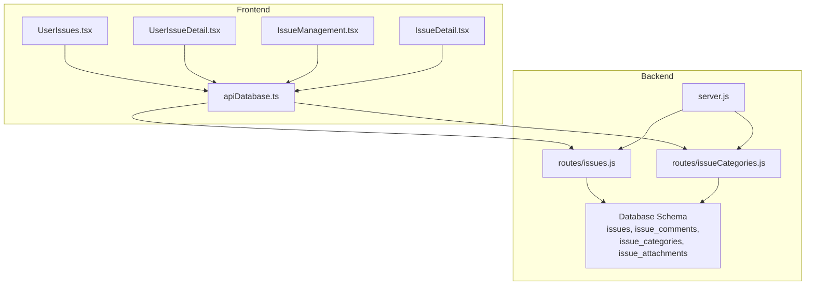
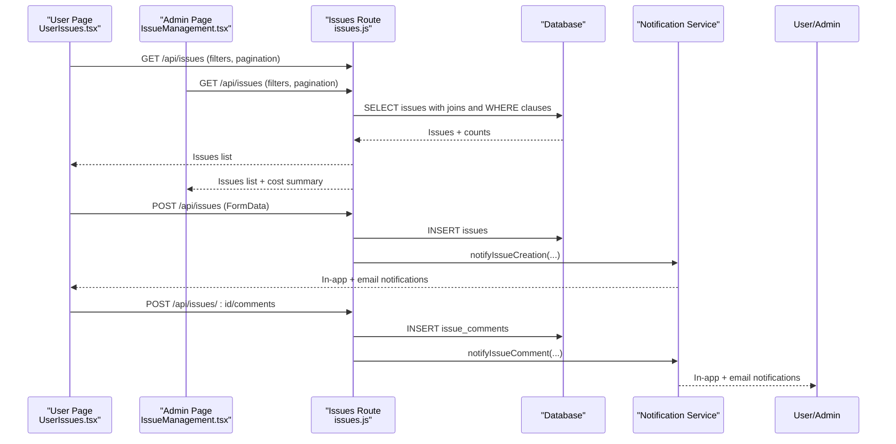
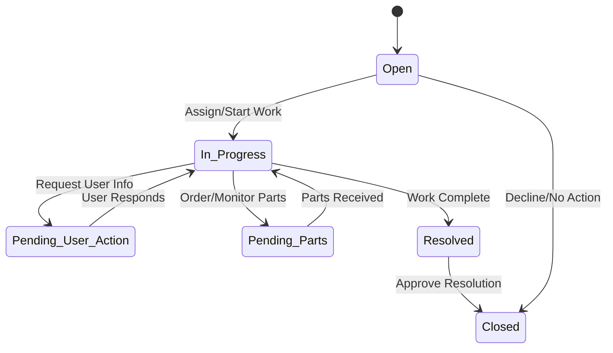
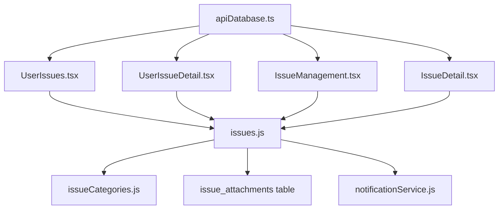

# Issue Ticket Lifecycle Management

## Table of Contents
1. [Introduction](#introduction)
2. [Project Structure](#project-structure)
3. [Core Components](#core-components)
4. [Architecture Overview](#architecture-overview)
5. [Detailed Component Analysis](#detailed-component-analysis)
6. [Dependency Analysis](#dependency-analysis)
7. [Performance Considerations](#performance-considerations)
8. [Troubleshooting Guide](#troubleshooting-guide)
9. [Conclusion](#conclusion)

## Introduction
This document describes the Issue Ticket Lifecycle Management system within the Assets Management platform. It covers the complete lifecycle from issue creation to resolution, including status transitions, priority management, estimation system, filtering/sorting/search capabilities, bulk operations, asset integration, and performance metrics. The system supports multi-role workflows (user, manager, admin) with role-based visibility and actions.

## Project Structure
The system spans a Node.js/Express backend with REST APIs and a React/TypeScript frontend. Key areas:
- Backend routes for issues, comments, categories, and attachments
- Database schema defining issues, comments, categories, and attachments
- Frontend pages for admin and user views, plus detailed issue pages
- Services layer abstracting API calls



## Core Components
- Issues table with lifecycle fields (status, priority, category, estimated_cost, timestamps)
- Issue comments for collaboration
- Issue categories for classification
- Issue attachments for evidence
- Role-based UI and permissions (user, manager, admin)
- Cost estimation and currency formatting
- Search, filter, and sort capabilities

Key data model highlights:
- Status values: open, in_progress, resolved, closed, scheduled
- Priority values: low, medium, high, critical
- Estimated cost stored as decimal with currency formatting
- Attachments stored as binary blobs with metadata

## Architecture Overview
End-to-end flow from UI to persistence and notifications:



## Detailed Component Analysis

### Lifecycle States and Transitions
Supported statuses:
- Open, In Progress, Pending User Action, Pending Parts, Resolved, Closed

Transitions are managed via:
- Admin/IT Officer updates via Issue Detail page
- User can update status/priority/category in their view (subject to role permissions)



### Priority Management and Routing
Priority values: Low, Medium, High, Critical
- Priority affects notification severity and routing:
  - Critical issues trigger higher-severity notifications
  - Routing logic resolves department managers and admins based on priority and department

Routing and notifications:
- New issue: notify reporter (confirmation), department managers, and admins
- New comment: notify reporter, assignee, and scoped admins/managers

### Estimation System
- Estimated cost stored as DECIMAL(12,2) in issues table
- Currency formatting applied client-side with DEFAULT_CURRENCY
- Admin can update estimated cost; users see formatted amounts
- Admin view exposes cost summary across filtered results

Implementation highlights:
- Backend migration adds estimated_cost column
- Frontend normalizes cost values and formats currency
- Cost summary aggregation available when admin filters

### Filtering, Sorting, and Search
Backend filtering supports:
- Search by title/description
- Filter by status, priority, department_id, assigned_to, asset_id, reported_by
- Pagination with sanitized limits
- Optional cost summary aggregation for admins

Frontend filtering/sorting:
- Admin: search by title/description/category; filter by status, priority, department; sort by created_at/updated_at
- User: similar filters for their own issues

### Bulk Operations
Bulk operations supported:
```bash
Export issues (CSV/JSON/TXT/Excel/PDF) from admin interface
```
- Edit/Delete issues (admin and authorized users)
- Users can edit/delete their own issues (reported_by)

### Asset Integration
- Issues can be linked to assets via asset_id
- Asset name and image displayed in issue details
- Asset-related history tracking via asset_issue_history (recorded on updates)
- Users can pre-select related asset when reporting issues

### Comments and Collaboration
- Comments stored in issue_comments table
- Real-time notifications on new comments
- Authorized users can edit/delete their own comments
- Comment content preserved with user context

### Attachments
- Binary attachments stored in issue_attachments table
- Metadata includes file_name, file_type, file_size, uploaded_by
- Preview modal for images/pdf in UI

### Categories
- Issue categories table with name, description, is_active
- Active categories used for reporting and filtering
- Admin can manage categories (create/update/delete)

### Typical Scenarios and Examples
- User reports hardware failure on laptop → assigned to IT department → moved to In Progress → parts ordered → Pending Parts → parts received → In Progress → Resolved → Closed
- Manager escalates critical network outage → immediate admin notification → scheduled status until resolution
- Admin tracks cost impact across filtered issues using cost summary

## Dependency Analysis
Component relationships and external dependencies:



## Performance Considerations
- Pagination defaults and caps reduce payload sizes
- Indexes on issues (status, priority, reported_by, assigned_to, asset_id, department_id) improve filtering performance
- Cost summary aggregation executed only for admins with explicit flag
- Binary attachments increase payload size; consider streaming/file storage for large files
- Notification dispatch uses parallel promises to minimize latency

## Troubleshooting Guide
Common issues and resolutions:
- Issue not found: Verify issueId and user permissions; check routes and error responses
- Failed to fetch issues: Review query parameters, pagination, and database connectivity
- Notification failures: Check email preferences and notification service configuration
- Attachment upload errors: Validate file types and size limits; ensure proper FormData usage

## Conclusion
The Issue Ticket Lifecycle Management system provides a robust, role-aware workflow for managing technical issues across departments. It integrates seamlessly with asset data, supports rich collaboration via comments and attachments, and offers flexible filtering, cost tracking, and notifications. The modular backend/frontend architecture enables extensibility for future enhancements such as SLA tracking, escalation rules, and advanced analytics.
