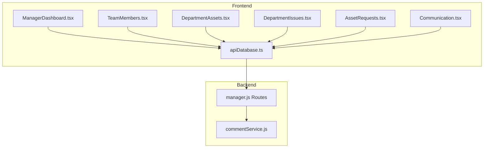
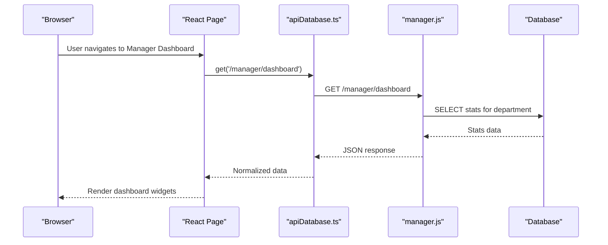
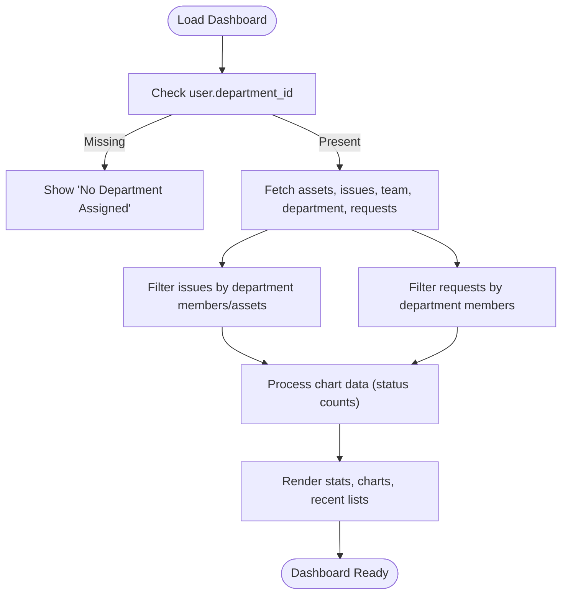
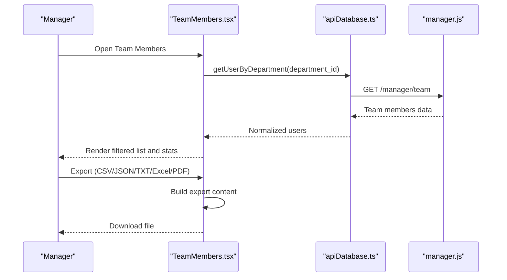
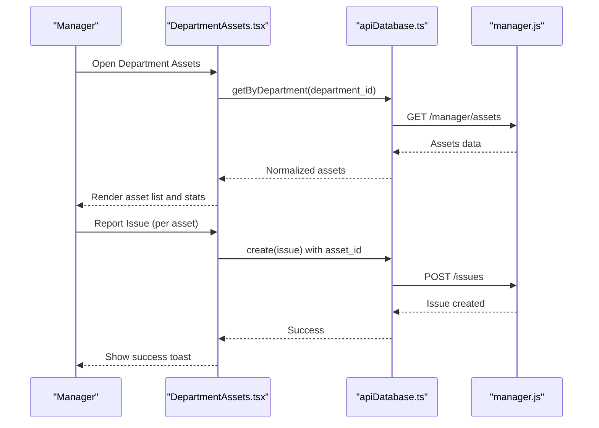
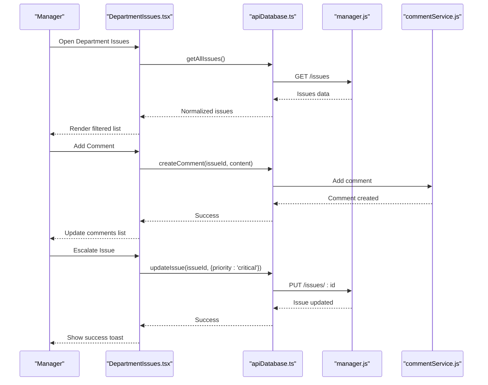
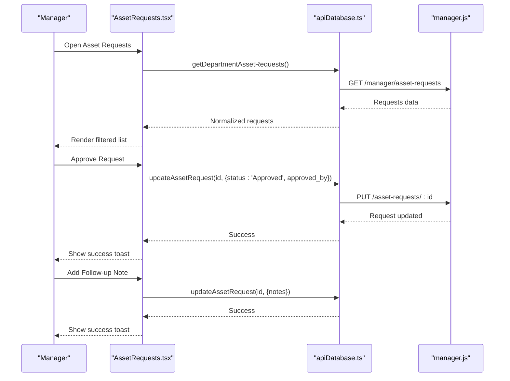
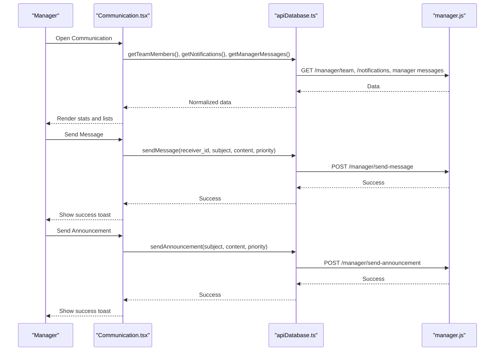
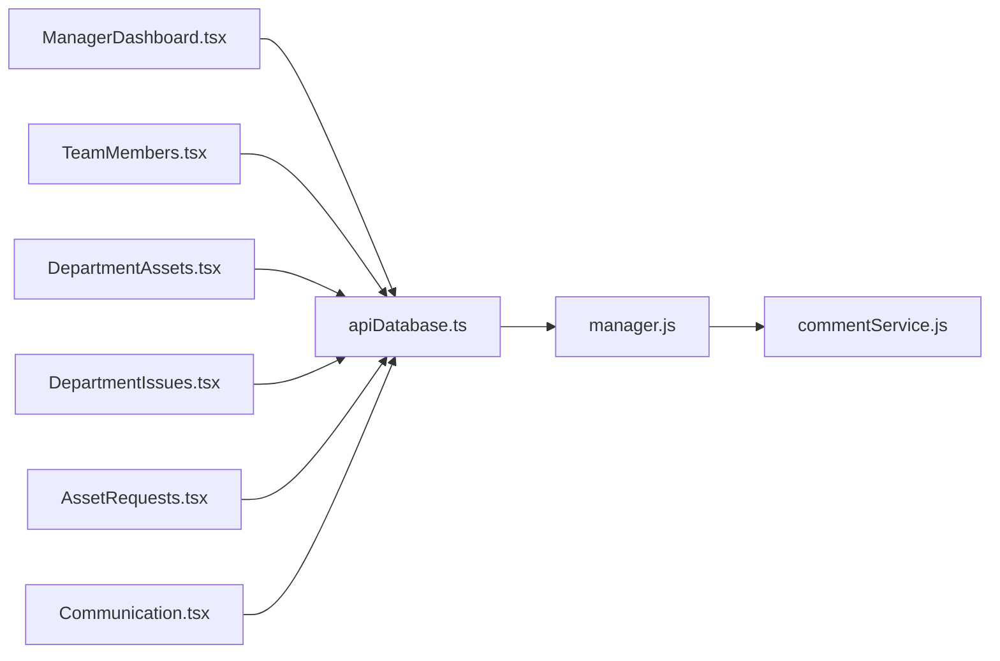

# Manager Dashboard & Department Features

## Table of Contents
1. [Introduction](#introduction)
2. [Project Structure](#project-structure)
3. [Core Components](#core-components)
4. [Architecture Overview](#architecture-overview)
5. [Detailed Component Analysis](#detailed-component-analysis)
6. [Dependency Analysis](#dependency-analysis)
7. [Performance Considerations](#performance-considerations)
8. [Troubleshooting Guide](#troubleshooting-guide)
9. [Conclusion](#conclusion)

## Introduction
This document provides comprehensive documentation for the Manager Dashboard and Department Features within the Asset Management System. It covers departmental oversight capabilities, team management, asset tracking, issue management, asset requests, communication tools, and administrative controls. The goal is to help managers efficiently monitor and control departmental operations while maintaining transparency and accountability across teams.

## Project Structure
The Manager Dashboard and Department Features are implemented as React pages in the frontend and backed by Express.js routes in the backend. The frontend communicates with the backend via an API service abstraction that normalizes data types and handles CRUD operations for departments, users, assets, issues, asset requests, and notifications.



## Core Components
This section outlines the key manager-focused pages and their responsibilities:

- Manager Dashboard: Provides department overview, quick actions, statistics cards, charts, recent activity, and navigation to departmental views.
- Team Members: Lists department members with filtering/searching, export capabilities, and basic profile viewing.
- Department Assets: Displays department assets with filtering, export, asset details, issue reporting, and asset request submission.
- Department Issues: Manages department issues with filtering, export, comments, escalation, and reporting.
- Asset Requests: Handles department asset requests with approval/rejection, follow-up notes, and export.
- Communication: Enables messaging and announcements to team members, along with notification management.

Each component integrates with the API service for data retrieval and updates, ensuring consistent data normalization and error handling.

## Architecture Overview
The Manager Dashboard and Department Features follow a layered architecture:
- Frontend: React pages with TypeScript and TailwindCSS for UI, consuming normalized APIs.
- Backend: Express.js routes handling manager-specific queries and operations.
- Services: Backend services for notifications and comments, integrated with database queries.
- Data Normalization: API service layer converts raw backend responses into typed models.



## Detailed Component Analysis

### Manager Dashboard
The Manager Dashboard aggregates department-wide metrics and recent activities:
- Department overview with quick actions to navigate to team, issues, assets, asset requests, and communication.
- Statistics cards for total assets, open issues, team members, and pending requests.
- Charts visualizing assets and issues by status distribution.
- Recent issues and asset requests lists with status badges and quick actions.



### Team Members Management
Team Members provides:
- Filtering by search term and role.
```bash
Export to CSV, JSON, TXT, Excel, PDF formats with appropriate headers and styling.
```
- Team statistics including total members, active members, and recently joined.
- Individual member profiles with roles, status, and join dates.



### Department Assets Tracking
Department Assets enables:
- Filtering by search term, status, and type.
```bash
Export to multiple formats with tailored headers.
```
- Asset details modal with assignment and purchase date.
- Issue reporting per asset and asset request submission.
- Asset statistics and type breakdown.



### Department Issues Management
Department Issues supports:
- Filtering by search, status, and priority.
```bash
Export to multiple formats.
```
- Comments on issues with hierarchical threading.
- Escalation to critical priority.
- Reporting new issues and managing notifications.



### Asset Requests Management
Asset Requests allows:
- Filtering by search, status, and priority.
```bash
Export to multiple formats.
```
- Approve or reject requests with automatic updates.
- Add follow-up notes for admin review.
- Submit new asset requests on behalf of team members.



### Communication Tools
Communication provides:
- Messaging to individual team members with priority levels.
- Announcements to all team members.
- Notification management with read/unread status.
- Statistics on team members, unread notifications, messages sent, and total notifications.



### Department Analytics and Reporting
- Dashboard charts visualize asset and issue distributions by status.
```bash
Export capabilities across all major pages support CSV, JSON, TXT, Excel, and PDF formats.
```
- Statistics cards provide quick insights into department health.

### Manager Permissions and Administrative Controls
- Authentication and authorization middleware ensures only managers can access manager routes.
- Validation for message and announcement endpoints prevents misuse.
- Email notifications and in-app notifications are integrated for timely communication.

## Dependency Analysis
The frontend components depend on the API service abstraction, which encapsulates backend route calls. The backend routes depend on database queries and services for notifications and comments.



## Performance Considerations
- Parallel data fetching: Components use Promise.all to fetch related datasets concurrently, reducing load times.
- Client-side filtering and export: Efficient client-side operations minimize backend load for search and export tasks.
- Chart rendering: Recharts components render responsive charts optimized for performance.
- Pagination and limits: Backend routes accept query parameters for limiting results and enabling pagination.

## Troubleshooting Guide
Common issues and resolutions:
- No Department Assigned: Components display a friendly message and prompt administrators to assign a department.
```bash
# Export Failures
Export functions include error handling and user feedback via toast notifications.
```
- API Errors: Centralized error handling in components displays meaningful messages and logs errors for debugging.
- Notification Delivery: Email notifications are logged and non-fatal failures are handled gracefully.

## Conclusion
The Manager Dashboard and Department Features deliver a comprehensive toolkit for departmental oversight. Managers can monitor departmental health, manage team members, track assets and issues, process asset requests, and communicate effectively with their teams. The modular architecture, robust backend routes, and rich frontend components ensure scalability, maintainability, and a strong user experience.
