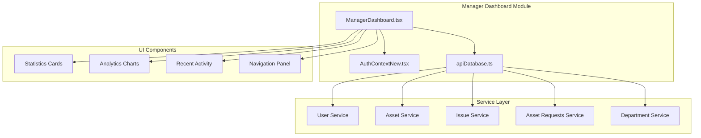
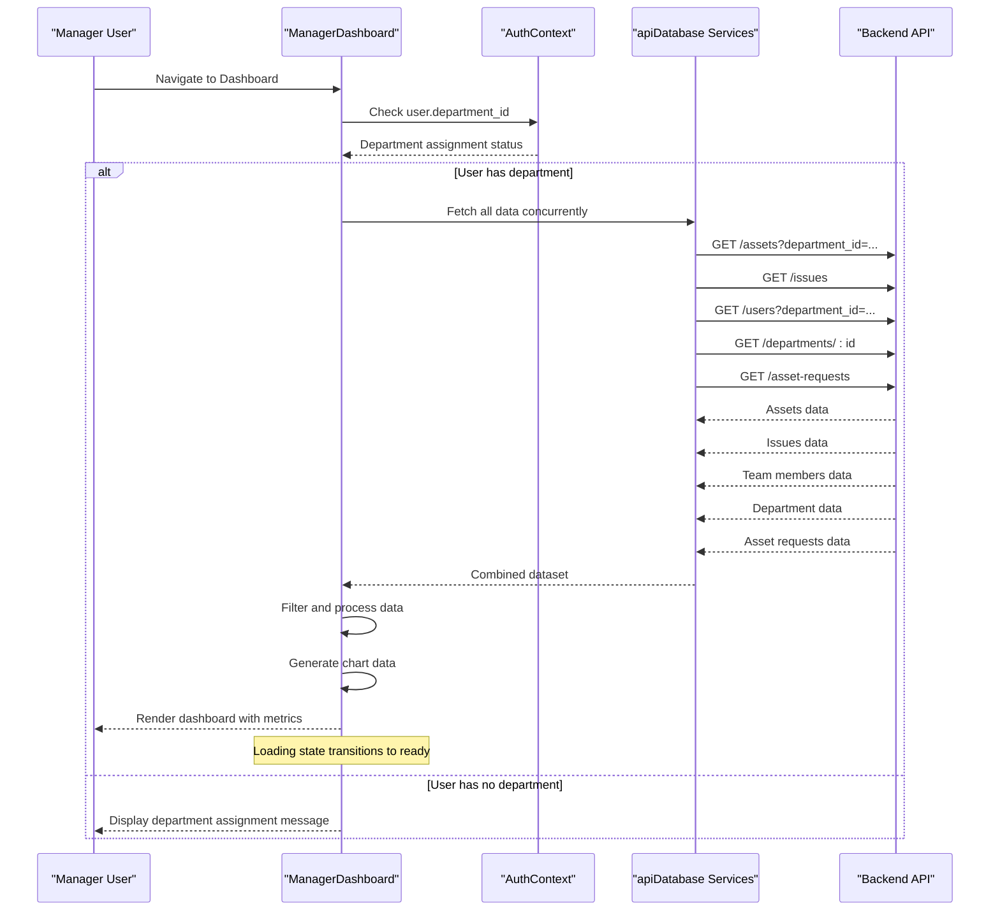
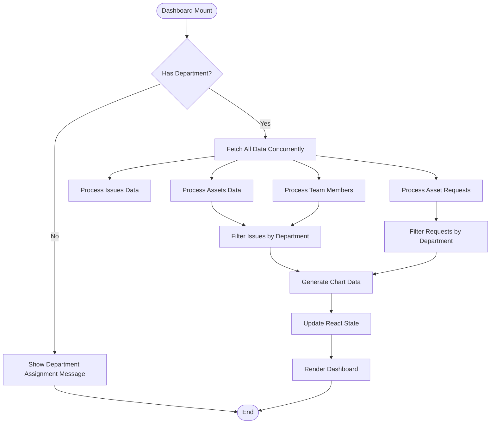
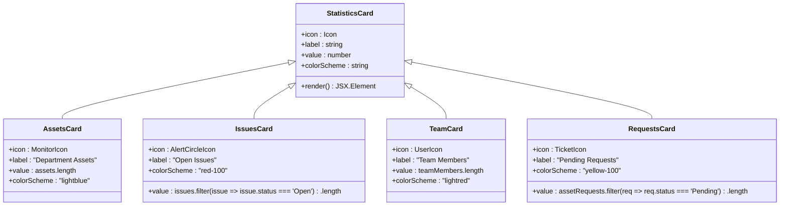
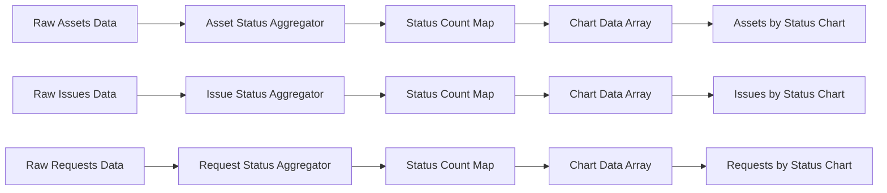
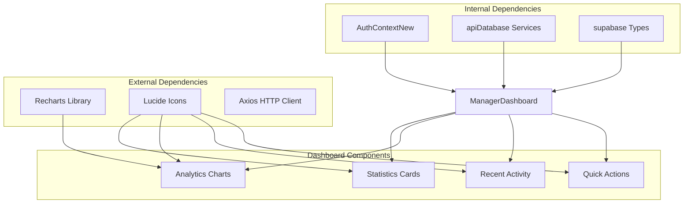
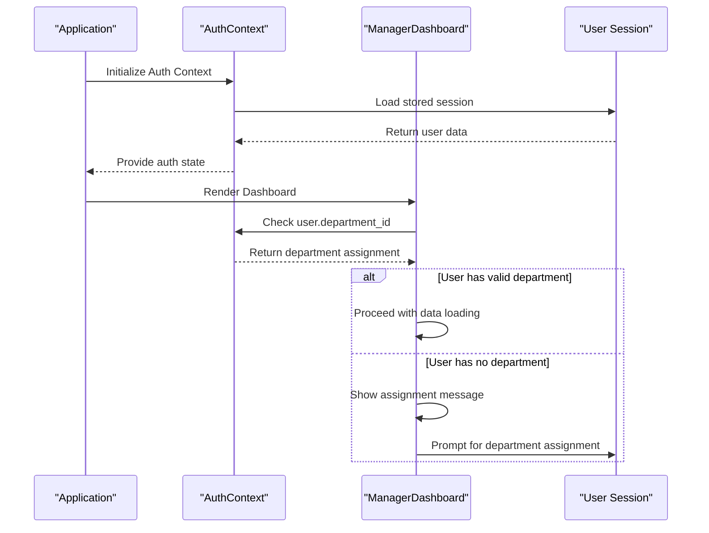
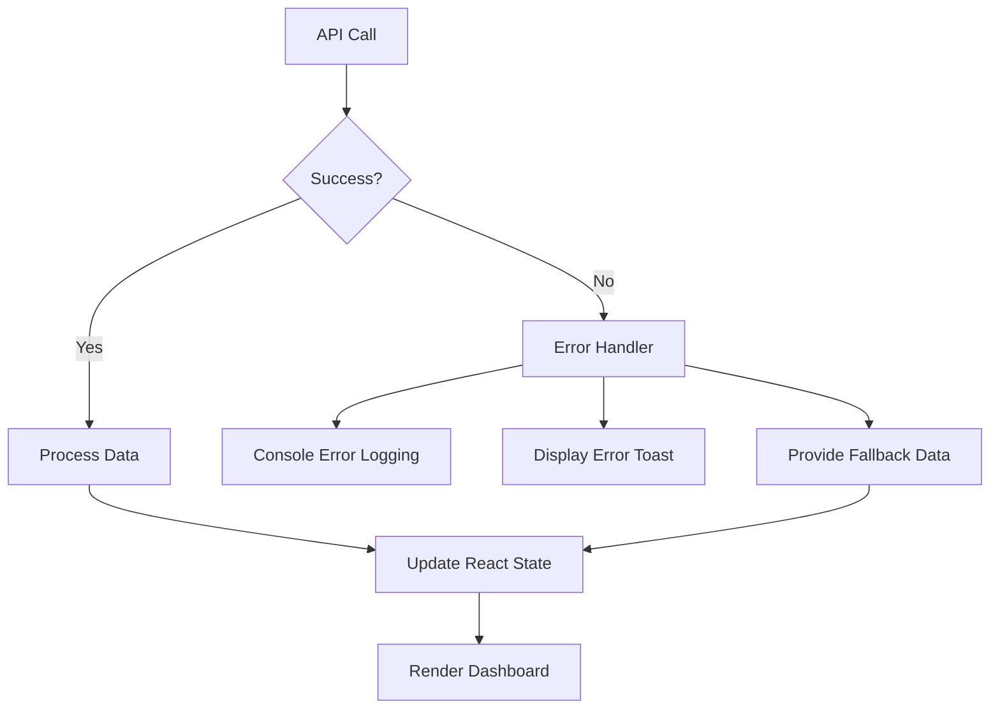

# Manager Dashboard Overview

## Table of Contents
1. [Introduction](#introduction)
2. [Project Structure](#project-structure)
3. [Core Components](#core-components)
4. [Architecture Overview](#architecture-overview)
5. [Detailed Component Analysis](#detailed-component-analysis)
6. [Dependency Analysis](#dependency-analysis)
7. [Performance Considerations](#performance-considerations)
8. [Troubleshooting Guide](#troubleshooting-guide)
9. [Conclusion](#conclusion)

## Introduction
The Manager Dashboard Overview provides department managers with a centralized view of their team's operational health. It displays key metrics cards, departmental analytics via pie charts, recent activity feeds for issues and asset requests, and quick navigation actions. The dashboard enforces user department assignment requirements and implements robust loading and error handling mechanisms.

## Project Structure
The dashboard is implemented as a standalone React component that integrates with the application's service layer and authentication context. It leverages reusable UI components and follows a modular architecture pattern.

## Core Components
The dashboard consists of four primary functional areas:

### Statistics Cards
The dashboard presents four key metrics cards:
- **Department Assets**: Total count of assets assigned to the manager's department
- **Open Issues**: Count of unresolved issues within the department
- **Team Members**: Total number of users in the department
- **Pending Requests**: Count of asset requests awaiting approval

Each card displays a prominent icon, descriptive label, and current numerical value with consistent styling and responsive grid layout.

### Analytics Visualizations
Interactive pie charts provide departmental insights:
- **Assets by Status**: Distribution of asset inventory across status categories
- **Issues by Status**: Breakdown of issue resolution states

Charts utilize responsive containers, tooltips, legends, and dynamic coloring for enhanced user experience.

### Recent Activity Sections
Two activity streams showcase recent department events:
- **Recent Department Issues**: Top 5 most recent issues with status indicators and reporter information
- **Recent Asset Requests**: Top 5 latest asset requests with priority indicators and requester details

Each activity item includes status badges, timestamps, and navigation links to detailed views.

### Quick Actions Panel
Four primary navigation buttons enable rapid access to department management areas:
- **Team Members**: Access to team member management
- **Department Issues**: View and manage reported issues
- **Department Assets**: Manage department assets
- **Asset Requests**: Review and process asset requests
- **Team Communication**: Access communication tools

## Architecture Overview
The dashboard implements a reactive data flow architecture with concurrent API calls and real-time state updates.

## Detailed Component Analysis

### Dashboard Data Processing Engine
The dashboard employs a sophisticated data processing pipeline that handles concurrent API calls, intelligent filtering, and real-time analytics generation.

### Statistics Card Implementation
Each statistics card follows a consistent pattern with dedicated styling and data presentation:

### Chart Data Processing Logic
The dashboard generates analytics data through structured aggregation processes:

## Dependency Analysis
The dashboard maintains loose coupling with external systems while ensuring robust data integrity and user experience.

### Authentication and Authorization Flow
The dashboard enforces department assignment requirements through the authentication context:

## Performance Considerations
The dashboard implements several optimization strategies for efficient data handling and rendering:

### Concurrent Data Fetching
The dashboard utilizes `Promise.all()` to execute multiple API calls simultaneously, reducing overall loading time and providing immediate feedback to users.

### Intelligent Caching Strategy
- **State-based caching**: React state manages fetched data to prevent redundant API calls during the session
- **Ref-based optimization**: `useRef` prevents duplicate toast notifications during initial load
- **Selective re-rendering**: Individual state updates trigger minimal component re-renders

### Memory Management
- **Cleanup functions**: Proper cleanup of subscriptions and intervals
- **Conditional rendering**: Loading states prevent unnecessary DOM manipulation
- **Efficient filtering**: Optimized array filtering operations with early termination

### Scalability Features
- **Pagination support**: Service layer supports pagination parameters for large datasets
- **Search and filter**: Client-side filtering reduces server load for small to medium datasets
- **Responsive design**: Mobile-first approach ensures optimal performance across devices

## Troubleshooting Guide

### Common Issues and Solutions

#### Department Assignment Required
**Problem**: Users see "No Department Assigned" message
**Solution**: Contact administrator to assign user to a department
**Prevention**: Verify `user.department_id` exists before dashboard initialization

#### Loading State Issues
**Problem**: Dashboard remains in loading state indefinitely
**Solution**: Check network connectivity and API endpoint availability
**Monitoring**: Console logs show individual API errors for debugging

#### Data Filtering Problems
**Problem**: Incorrect counts in statistics cards
**Solution**: Verify department membership filtering logic
**Debugging**: Check `departmentMemberIds` array construction and filtering conditions

#### Chart Rendering Issues
**Problem**: Charts not displaying properly
**Solution**: Ensure chart data arrays contain valid numeric values
**Validation**: Verify status field consistency across data sources

### Error Handling Mechanisms
The dashboard implements comprehensive error handling:

## Conclusion
The Manager Dashboard Overview provides a comprehensive, efficient solution for department managers to monitor and manage their team's operational metrics. Its modular architecture, robust error handling, and performance optimizations ensure reliable operation across various deployment scenarios. The dashboard's design prioritizes user experience through intuitive navigation, real-time data visualization, and responsive performance characteristics.

The implementation demonstrates best practices in React development, including proper state management, concurrent data fetching, and user-centric error handling. The modular design allows for easy extension and customization while maintaining system stability and performance.
