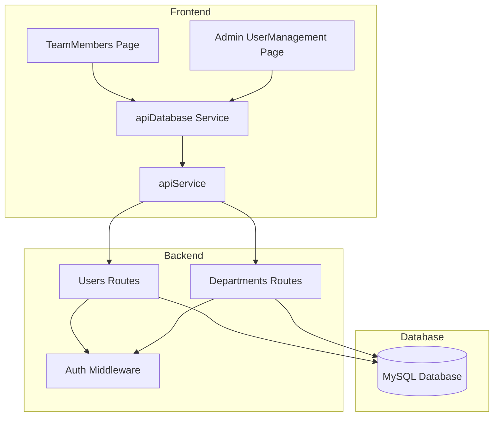
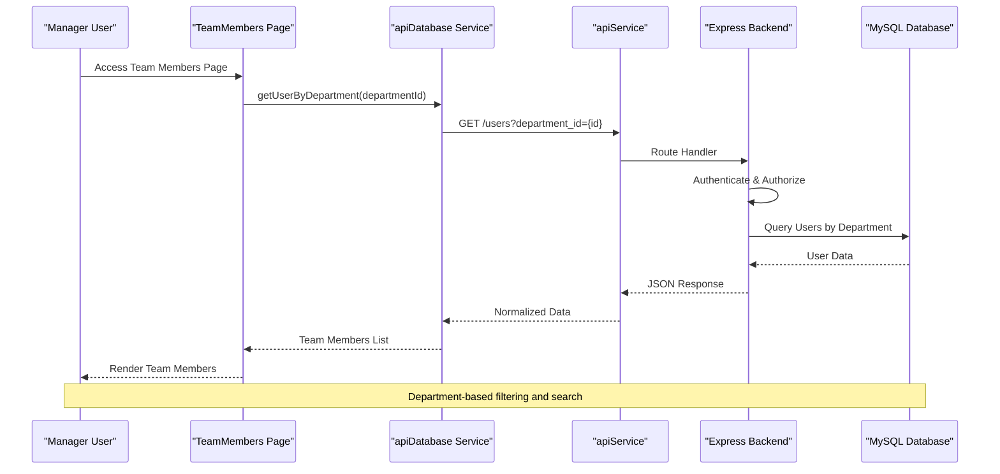
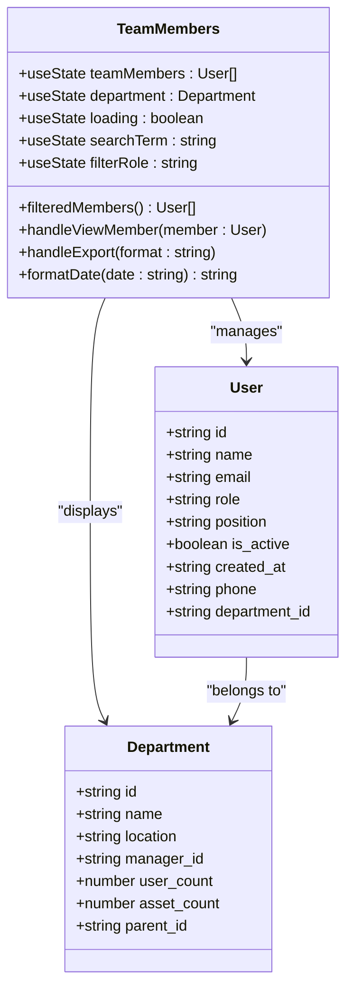
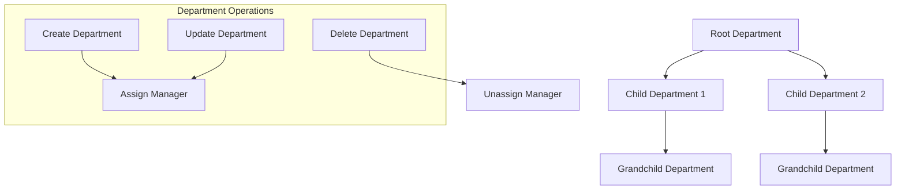
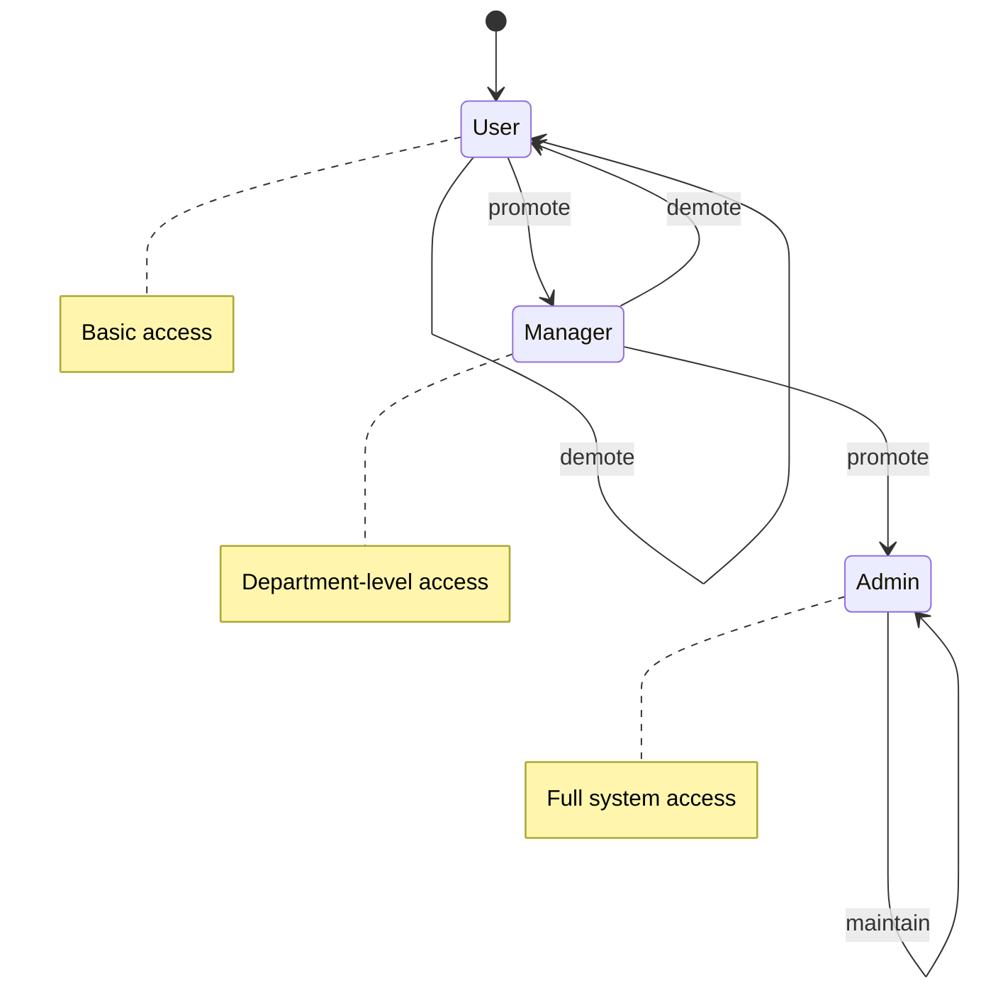
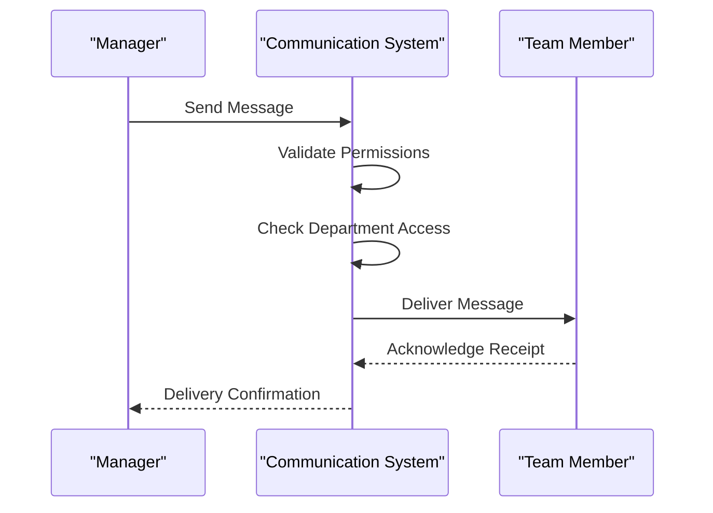
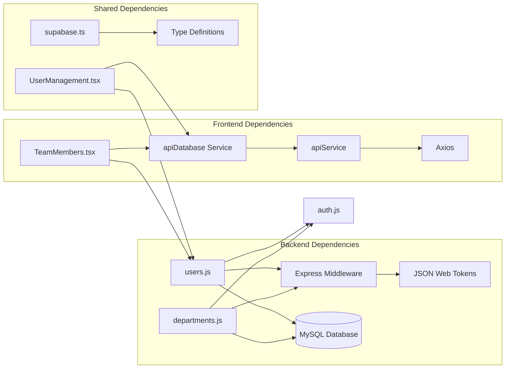

# Team Members Management

## Table of Contents
1. [Introduction](#introduction)
2. [Project Structure](#project-structure)
3. [Core Components](#core-components)
4. [Architecture Overview](#architecture-overview)
5. [Detailed Component Analysis](#detailed-component-analysis)
6. [Dependency Analysis](#dependency-analysis)
7. [Performance Considerations](#performance-considerations)
8. [Troubleshooting Guide](#troubleshooting-guide)
9. [Conclusion](#conclusion)

## Introduction
This document provides comprehensive documentation for the Team Members Management functionality within the Assets Management system. It covers the team member listing interface, user profile viewing, department-based filtering, search and filtering capabilities, role assignments, department hierarchies, position management, activity tracking, performance metrics, resource allocation insights, onboarding processes, access permissions, departmental assignments, and communication tools for manager oversight.

## Project Structure
The Team Members Management feature spans both frontend and backend components:
- Frontend: React-based manager dashboard page for team member management
- Backend: Express.js routes for user and department data retrieval and manipulation
- Services: API abstraction layer for database operations
- Authentication: Middleware enforcing role-based access control



## Core Components
The Team Members Management functionality consists of several interconnected components:

### Manager Dashboard Team Members Page
The primary interface for managers to view and manage their team members, featuring:
- Real-time team member listing with department-based filtering
- Advanced search and filtering capabilities
- User profile viewing with detailed information
```bash
Export functionality supporting multiple formats
```
- Messaging capability (planned)

### Backend User Management APIs
Comprehensive backend services providing:
- User retrieval by department with pagination
- Role-based filtering and search
- User history tracking and performance metrics
- Department-based access control

### Department Hierarchy Management
Structured department management supporting:
- Parent-child department relationships
- Manager assignment and role synchronization
- Hierarchical department queries

### Authentication and Authorization
Robust security framework ensuring:
- Role-based access control (admin, manager, user)
- Department-specific access permissions
- Token-based authentication with expiration handling

## Architecture Overview
The Team Members Management system follows a layered architecture pattern with clear separation of concerns:



The system implements a three-tier architecture:
- Presentation Layer: React components handling user interface and state management
- Service Layer: API abstraction providing clean interfaces to backend services
- Data Access Layer: Express.js routes with MySQL database connectivity

## Detailed Component Analysis

### Team Members Listing Interface
The manager dashboard provides an intuitive interface for team member management:

#### Key Features
- **Department-Based Filtering**: Automatically loads team members based on the manager's department assignment
- **Advanced Search**: Multi-field search across name, email, and position
- **Role Filtering**: Separate filtering for managers, users, and all roles
- **Real-Time Updates**: Dynamic filtering as users type in search fields
- **Visual Indicators**: Color-coded badges for roles and status indicators

#### User Interface Components


#### Search and Filtering Logic
The filtering mechanism implements multiple criteria:
- **Text Search**: Case-insensitive matching across name, email, and position fields
- **Role Filtering**: Dropdown selection for manager, user, or all roles
- **Dynamic Updates**: Real-time filtering as users modify search criteria

### User Profile Viewing and Management
The system provides comprehensive user profile management capabilities:

#### Profile Display Features
- **Avatar Generation**: Initial-based avatars for quick identification
- **Contact Information**: Email and phone number display
- **Department Assignment**: Clear department affiliation display
- **Role Classification**: Color-coded role badges with appropriate styling
- **Status Indicators**: Active/inactive status with visual cues

#### Profile Modal Functionality
The detailed profile modal provides:
- **Enhanced Contact Details**: Full contact information display
- **Join Date Tracking**: Precise membership duration calculation
- **Interactive Actions**: Messaging and profile management options
- **Department Context**: Clear department hierarchy and manager information

### Department-Based Filtering and Hierarchies
The system supports sophisticated department management:

#### Department Hierarchy Implementation


#### Department-Based Access Control
The authentication middleware enforces strict department boundaries:
- **Admin Privileges**: Full access across all departments
- **Manager Access**: Department-specific access only
- **User Restrictions**: Limited to their own department
- **Permission Validation**: Runtime verification of access rights

### Search, Sorting, and Filtering Capabilities
The system implements comprehensive search and filtering mechanisms:

#### Backend Search Implementation
The users route provides robust search capabilities:
- **Multi-Criteria Search**: Simultaneous filtering by name, email, role, and department
- **Pagination Support**: Efficient handling of large datasets with configurable limits
- **Performance Optimization**: Database-level filtering reduces frontend processing overhead
- **Flexible Query Building**: Dynamic WHERE clause construction based on provided parameters

#### Frontend Filtering Enhancement
The React component adds additional filtering:
- **Real-Time Search**: Immediate feedback as users type
- **Role-Specific Filtering**: Dropdown-based role selection
- **Combined Criteria**: Logical AND operation between search and filter conditions
- **Visual Feedback**: Clear indication of filtered results count

### Role Assignments and Position Management
The system manages user roles and positions comprehensively:

#### Role-Based Access Control


#### Position Management System
The position management supports:
- **Hierarchical Organization**: Structured position definitions
- **Active/Inactive Status**: Flexible position availability management
- **Integration with Users**: Direct assignment during user creation/update
- **Reporting Capabilities**: Position-based user aggregation and reporting

### Activity Tracking and Performance Metrics
The system provides comprehensive activity tracking and analytics:

#### User Activity Monitoring
The backend tracks extensive user activities:
- **Asset Assignment History**: Complete audit trail of asset assignments
- **Issue Resolution Tracking**: Performance metrics for issue handling
- **Asset Request Analysis**: Request volume and resolution patterns
- **Last Activity Timestamps**: Recency-based user engagement metrics

#### Performance Metrics Implementation
Key metrics tracked:
- **Assignment Counts**: Total and active asset assignments per user
- **Issue Statistics**: Reported and assigned issue counts
- **Request Volume**: Asset request frequency and resolution rates
- **Engagement Indicators**: Last activity timestamps for user monitoring

### Resource Allocation Insights
The system provides valuable insights into resource allocation:

#### Department Resource Analytics
- **Asset Valuation**: Total asset value per department
- **User Distribution**: Headcount analysis across organizational units
- **Resource Utilization**: Asset assignment ratios and turnover rates
- **Budget Impact**: Cost analysis of departmental asset holdings

#### Manager Oversight Capabilities
Managers gain visibility into:
- **Team Performance**: Individual and collective performance metrics
- **Resource Efficiency**: Asset utilization and maintenance patterns
- **Capacity Planning**: Headroom and resource gaps within teams
- **Trend Analysis**: Historical patterns in team composition and resource usage

### Team Member Onboarding Processes
The system supports comprehensive onboarding workflows:

#### Automated Onboarding Features
- **Department Assignment**: Automatic assignment based on organizational structure
- **Role Synchronization**: Manager role updates when department managers change
- **Welcome Notifications**: Automated welcome and setup notifications
- **Profile Completion**: Guided profile completion with required fields

#### Access Permissions Management
- **Initial Access Setup**: Default permission assignment during onboarding
- **Department Integration**: Seamless integration with departmental access controls
- **Role-Based Feature Access**: Feature availability based on user roles
- **Security Compliance**: Automated security policy application

### Communication Tools and Collaboration Features
The system provides manager oversight communication capabilities:

#### Messaging Infrastructure


#### Collaboration Features
- **Direct Messaging**: One-on-one communication between managers and team members
- **Announcements**: Broadcast messaging to entire departments
- **Priority Levels**: Message prioritization system
- **Delivery Tracking**: Read receipt and delivery confirmation
- **Thread Management**: Conversation threading for complex discussions

### Export and Reporting Capabilities
The system provides comprehensive export functionality:

#### Supported Export Formats
- **CSV**: Standard spreadsheet format with UTF-8 BOM for Excel compatibility
- **JSON**: Structured data format with metadata and timestamps
- **TXT**: Formatted text tables with aligned columns
- **Excel (.xls)**: Richly formatted spreadsheets with styling
- **PDF**: Professional PDF documents with branding and formatting

#### Export Features
```bash
# **Filtered Data Export**
Export only current search/filter results
```
- **Batch Processing**: Large dataset handling with progress indication
- **Format Customization**: Configurable field selection and formatting
- **Error Handling**: Comprehensive error detection and user feedback

## Dependency Analysis
The Team Members Management system exhibits well-structured dependencies:



### Component Coupling and Cohesion
The system demonstrates strong internal cohesion with loose external coupling:
- **High Cohesion**: Related functionality grouped within specific components
- **Low Coupling**: Minimal inter-component dependencies
- **Clear Interfaces**: Well-defined API boundaries between layers
- **Separation of Concerns**: Distinct responsibilities for each component

### External Dependencies
Key external dependencies include:
- **React Ecosystem**: Modern React patterns with hooks and TypeScript
- **Express.js**: Robust backend framework with middleware support
- **Axios**: HTTP client for API communications
- **MySQL**: Relational database with proper indexing and relationships
- **JWT**: Secure authentication and authorization

## Performance Considerations
The Team Members Management system incorporates several performance optimization strategies:

### Database Optimization
- **Indexing Strategy**: Proper indexing on frequently queried fields (department_id, role, name, email)
- **Query Optimization**: Efficient JOIN operations and WHERE clause optimization
- **Pagination Implementation**: Configurable limits to prevent large result sets
- **Connection Pooling**: Optimized database connection management

### Frontend Performance
- **Lazy Loading**: Component-level lazy loading for improved initial load times
- **Virtual Scrolling**: Efficient rendering of large lists without DOM overload
- **Debounced Search**: Input debouncing to reduce unnecessary API calls
- **State Management**: Efficient state updates and re-render optimization

### Caching Strategies
- **API Response Caching**: Strategic caching of frequently accessed data
- **Component Memoization**: React.memo usage for expensive component renders
- **Local Storage**: Persistent caching of user preferences and filters

## Troubleshooting Guide
Common issues and their resolutions:

### Authentication and Authorization Issues
- **Symptom**: "Access denied" messages when accessing team members
- **Cause**: Insufficient role permissions or inactive account
- **Resolution**: Verify user role and department assignment; ensure account is active

### Department Assignment Problems
- **Symptom**: No team members displayed despite having department access
- **Cause**: User not properly assigned to department or department not configured
- **Resolution**: Verify department assignment in user record; check department hierarchy

### Search and Filter Failures
- **Symptom**: Search not returning expected results
- **Cause**: Database indexing issues or query parameter problems
- **Resolution**: Check database indices; verify search parameters are properly encoded

### Export Functionality Issues
```bash
# **Symptom**
Export fails
# or: produces corrupted files
```
- **Cause**: Large dataset handling or browser compatibility issues
- **Resolution**: Reduce dataset size; try different export formats; check browser compatibility

### Performance Degradation
- **Symptom**: Slow loading times for large datasets
- **Cause**: Inefficient queries or insufficient pagination
- **Resolution**: Implement proper pagination; optimize database queries; add appropriate indexes

## Conclusion
The Team Members Management functionality provides a comprehensive solution for manager oversight of team members within the Assets Management system. The implementation demonstrates strong architectural principles with clear separation of concerns, robust security measures, and efficient data management capabilities.

Key strengths of the implementation include:
- **Intuitive User Interface**: Clean, responsive design optimized for manager workflows
- **Comprehensive Functionality**: Full suite of team management features including search, filtering, and reporting
- **Strong Security**: Role-based access control with department-specific permissions
- **Scalable Architecture**: Well-designed backend services supporting large-scale deployments
- **Rich Analytics**: Extensive activity tracking and performance metrics

The system successfully balances functionality with performance, providing managers with the tools needed for effective team oversight while maintaining security and scalability. Future enhancements could include expanded communication features, advanced reporting capabilities, and integration with additional HR systems.
