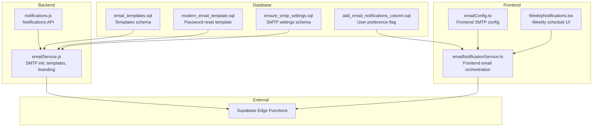
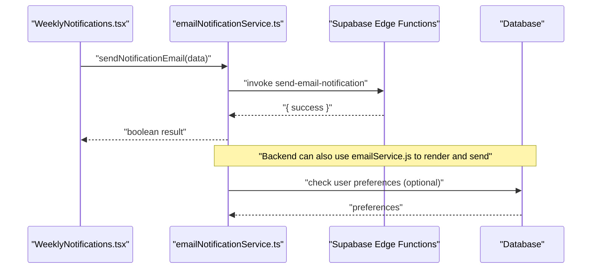
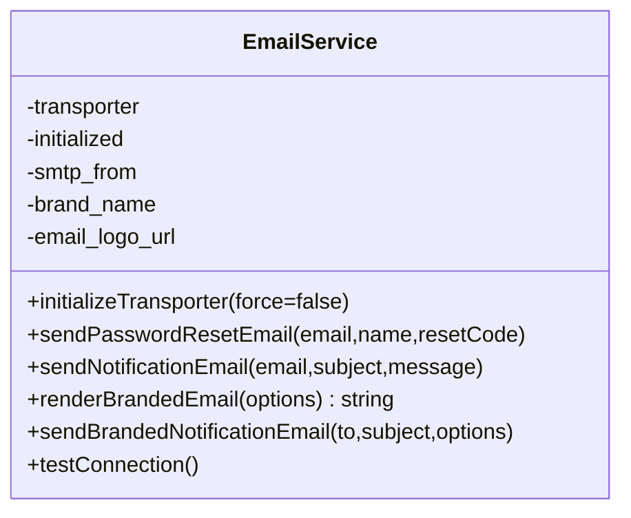
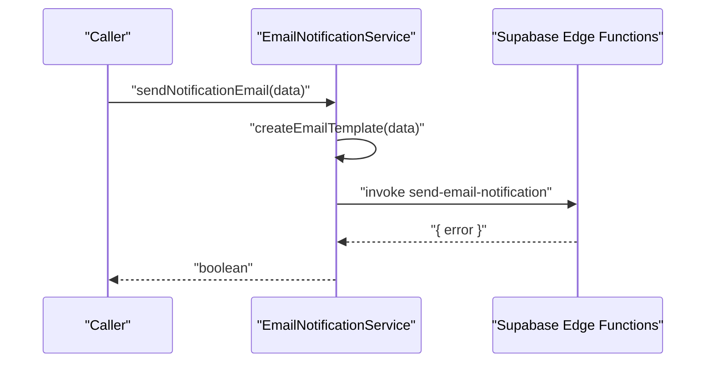
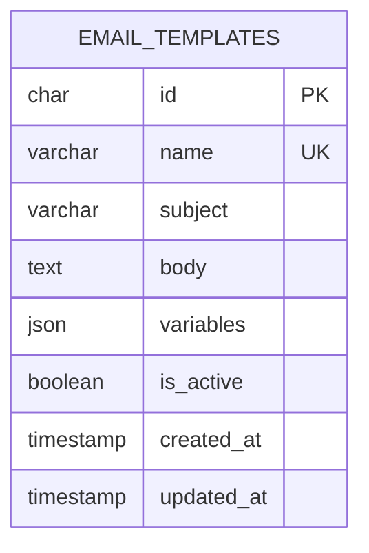
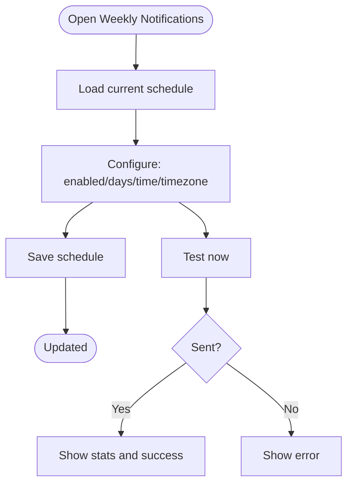
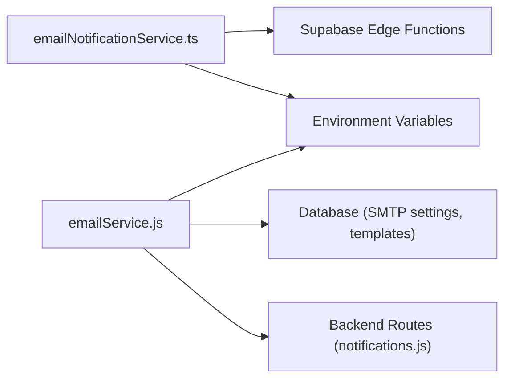

# Email Integration & Templates

## Table of Contents
1. [Introduction](#introduction)
2. [Project Structure](#project-structure)
3. [Core Components](#core-components)
4. [Architecture Overview](#architecture-overview)
5. [Detailed Component Analysis](#detailed-component-analysis)
6. [Dependency Analysis](#dependency-analysis)
7. [Performance Considerations](#performance-considerations)
8. [Troubleshooting Guide](#troubleshooting-guide)
9. [Conclusion](#conclusion)
10. [Appendices](#appendices)

## Introduction
This document explains the email notification system integration for the assets management platform. It covers the backend email service architecture, SMTP configuration, database-backed email templates, frontend email configuration, and the weekly notification scheduling feature. It also documents how emails are rendered, delivered via a Supabase Edge Function, and how to configure, customize, and troubleshoot the system for reliable, scalable email delivery.

## Project Structure
The email system spans three layers:
- Backend Node.js service that initializes SMTP transport, renders branded emails, and sends them via a Supabase Edge Function.
- Frontend configuration and service that orchestrates email sending, validates configuration, and supports bulk operations.
- Database migrations that define the email templates and SMTP settings schema.



## Core Components
- Backend Email Service
  - Initializes SMTP transport from database/system settings.
  - Renders branded HTML emails with optional embedded logo.
  - Sends password reset emails using database-stored templates.
  - Provides connection verification and branded email dispatch.
- Frontend Email Configuration
  - Defines SMTP defaults and branding options.
  - Exposes helpers to check email enablement and configuration.
- Frontend Email Notification Service
  - Orchestrates sending via Supabase Edge Functions.
  - Supports bulk sending and basic configuration checks.
- Database Templates and SMTP Settings
  - Schema for email templates and variables.
  - Modern password reset template with placeholders.
  - SMTP settings table with keys for host, port, credentials, and branding.

## Architecture Overview
The system integrates frontend configuration with backend rendering and Supabase Edge Functions for delivery. The frontend invokes a Supabase Edge Function to send emails, while the backend can also render and send branded emails directly when needed.



## Detailed Component Analysis

### Backend Email Service
Responsibilities:
- Initialize SMTP transport from database/system settings.
- Load email templates from the database and substitute variables.
- Render a modern branded HTML email with optional embedded logo.
- Send emails via Supabase Edge Functions or direct SMTP.

Key behaviors:
- Transport initialization merges database and environment overrides.
- Branded renderer composes HTML with dynamic variables and optional logo attachment.
- Password reset flow fetches template by name and performs placeholder replacement.



### Frontend Email Configuration
Defines SMTP defaults and branding options for the client-side configuration. Includes helper to check if email is enabled based on presence of credentials and sender email.

Highlights:
- SMTP host/port/secure/auth derived from environment variables.
- Sender name and email configurable.
- Template branding colors and default subject.
- Preferences for default enabled state, default types, retries, and retry delay.

### Frontend Email Notification Service
Orchestrates email sending and configuration checks:
- Sends individual and bulk notifications via Supabase Edge Functions.
- Tests email configuration by invoking the Edge Function and checking user preferences.
- Provides a template factory for generating HTML and text bodies.



### Email Templates and Variables
Templates are stored in the database with subject, body, and supported variables. The modern password reset template includes placeholders for user name and reset code.



### SMTP Configuration and Provider Support
SMTP settings are persisted in the system settings table and can be overridden by environment variables. The backend initializes the transporter using host, port, secure flag, and credentials, then sets a branded sender address.

- Keys include host, port, user, pass, secure, sender address, logo URL, and brand name.
- Environment variables serve as fallbacks for runtime configuration.

### User Notification Preferences
A per-user flag controls whether email notifications are enabled. Defaults to enabled for existing users.

### Weekly Notification Scheduling (Admin UI)
The admin UI allows configuring weekly notifications for unresolved issues and pending asset requests. It supports enabling/disabling, selecting days, setting time and timezone, and triggering tests.



## Dependency Analysis
- Frontend depends on Supabase Edge Functions for sending emails.
- Backend depends on database for SMTP settings and email templates.
- Both layers depend on environment variables for fallback configuration.
- Notifications API supports retrieving and managing notifications.



## Performance Considerations
- Asynchronous processing: Frontend bulk sending iterates sequentially; consider batching and concurrency limits for high-volume scenarios.
- Edge Function invocation overhead: Centralize template creation on the server to reduce payload sizes and leverage database-backed templates.
- Logo embedding: Optional embedded logo adds attachment overhead; disable embedding in high-volume scenarios.
- Retry strategy: Frontend configuration exposes retry count and delay; implement exponential backoff at the caller level for resilience.
- Caching: Cache SMTP settings and templates to minimize repeated database queries during bursts.

## Troubleshooting Guide
Common issues and resolutions:
- Missing SMTP configuration
  - Ensure SMTP host, port, user, and pass are present in system settings or environment variables.
  - Use the connection test method to verify connectivity.
- Template not found
  - Confirm the template exists and is active in the database.
  - Verify the template name matches the lookup key.
- Email sending fails
  - Check Edge Function accessibility and error responses.
  - Validate user preferences and notification flags.
- Logo embedding errors
  - Disable logo embedding or provide a valid logo path.
- Environment variables
  - Review frontend environment configuration and ensure required keys are set.

## Conclusion
The email integration combines a robust backend email service with database-backed templates, a flexible frontend configuration, and a weekly notification scheduler. By centralizing SMTP configuration, leveraging Edge Functions for delivery, and supporting customizable templates and branding, the system provides a scalable foundation for automated email communication.

## Appendices

### SMTP Configuration Options
- Keys and categories
  - smtp_host, smtp_port, smtp_user, smtp_pass, smtp_secure, smtp_from, email_logo_url, brand_name
- Environment variable fallbacks
  - Host, port, user, pass, secure, sender, logo URL, brand name can be supplied via environment variables.

### Email Template Variables
- Supported variables
  - user_name, reset_code (example: password reset)
- Template lookup
  - Templates are fetched by name and activated flag.

### Example Workflows

- Sending a password reset email
  - Backend loads the password reset template from the database, substitutes variables, and sends a branded email.
  
  ```mermaid
sequenceDiagram
participant Caller as "Caller"
participant BE as "emailService.js"
participant DB as "Database"
participant SB as "Supabase Edge Functions"
Caller->>BE : "sendPasswordResetEmail(email,name,resetCode)"
BE->>DB : "SELECT subject, body FROM email_templates WHERE name='password_reset'"
DB-->>BE : "Template data"
BE->>BE : "Replace {{user_name}}, {{reset_code}}"
BE->>SB : "sendBrandedNotificationEmail(...)"
SB-->>BE : "{ success, messageId }"
BE-->>Caller : "Result"
```

    - `emailService.js:73-118`
  - `2024-12-19_modern_email_template.sql:6-131`

- Sending a generic notification email
  - Frontend composes HTML and text bodies and invokes the Edge Function.

    - `emailNotificationService.ts:166-239`
  - `emailNotificationService.ts:31-55`

- Weekly notification scheduling
  - Admin configures schedule, triggers a test, and receives feedback on delivery statistics.

    - `WeeklyNotifications.tsx:51-128`

### Best Practices
- Prefer database-backed templates for maintainability and localization.
- Use Edge Functions for delivery to offload SMTP to the cloud provider.
- Implement retry with backoff and circuit breaker patterns for high-volume sending.
- Monitor delivery failures and maintain logs for debugging.
- Keep branding consistent by centralizing sender name and logo configuration.
