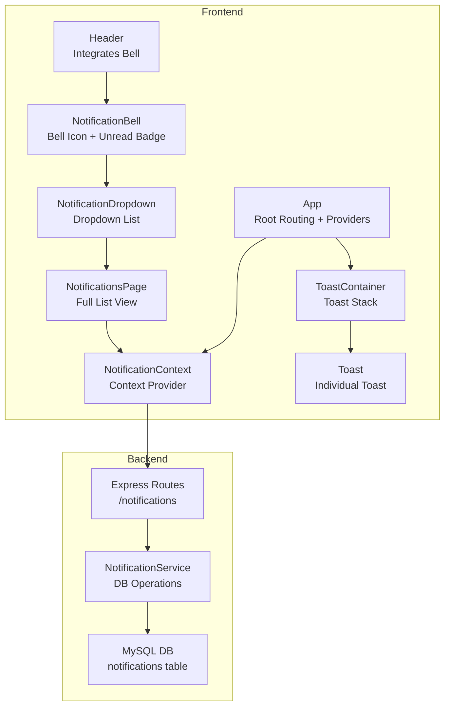
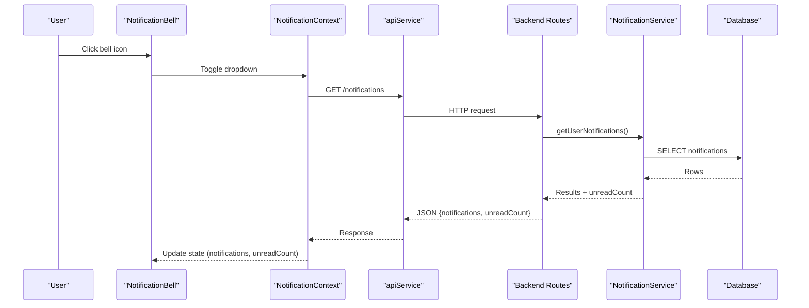
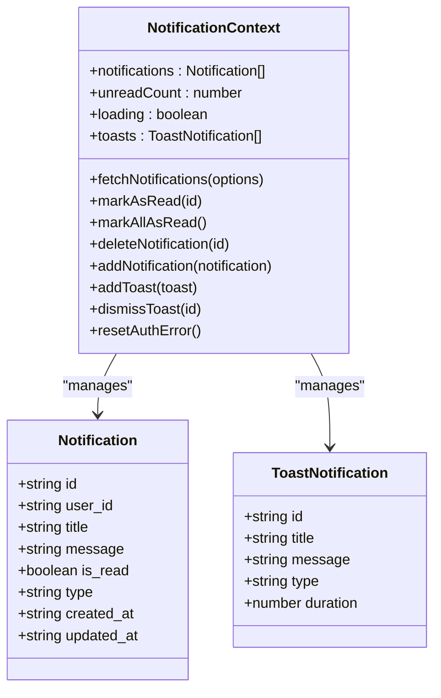
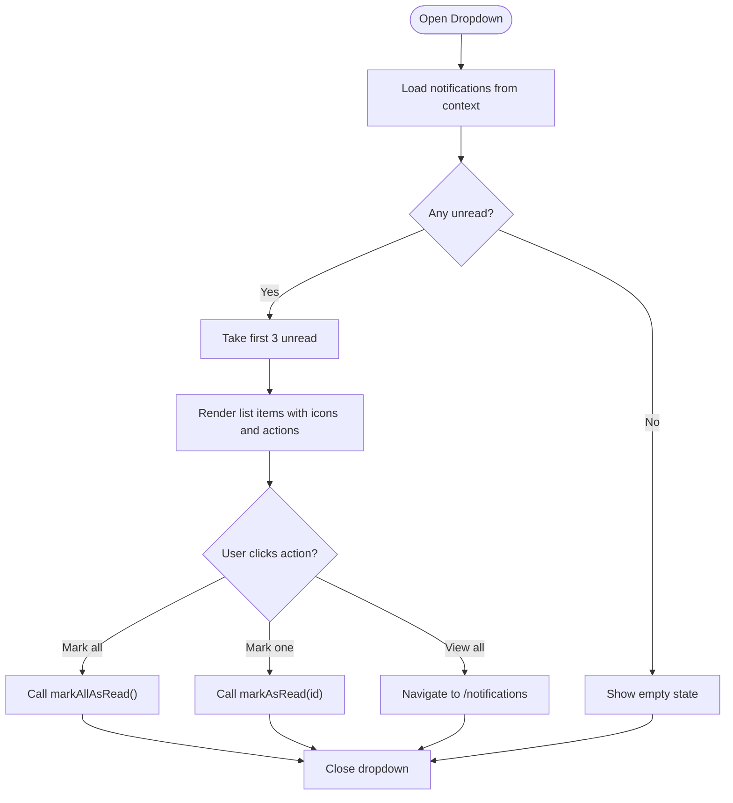
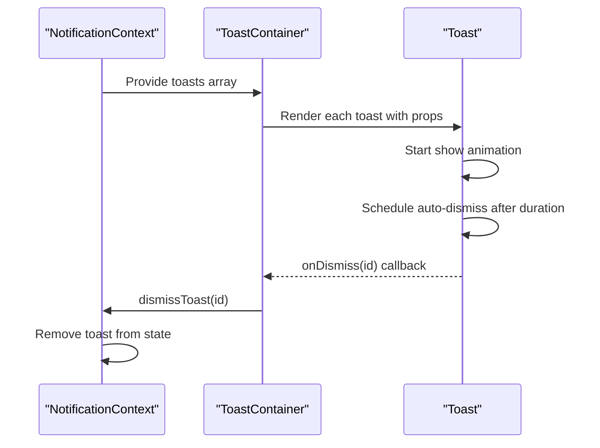
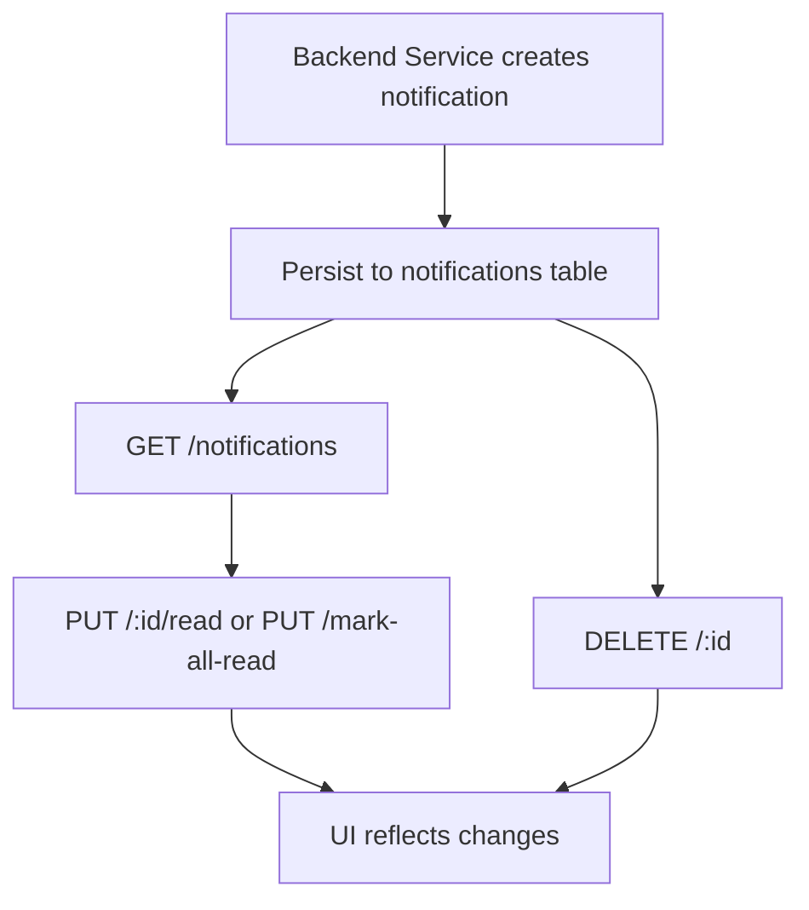
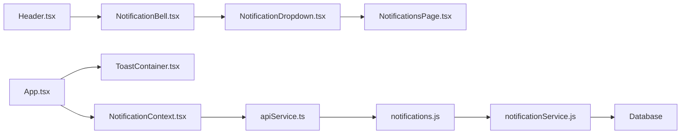

# In-App Notifications

## Table of Contents
1. [Introduction](#introduction)
2. [Project Structure](#project-structure)
3. [Core Components](#core-components)
4. [Architecture Overview](#architecture-overview)
5. [Detailed Component Analysis](#detailed-component-analysis)
6. [Dependency Analysis](#dependency-analysis)
7. [Performance Considerations](#performance-considerations)
8. [Troubleshooting Guide](#troubleshooting-guide)
9. [Conclusion](#conclusion)

## Introduction
This document describes the in-app notification system, covering the notification context architecture, real-time fetching, display mechanisms, and lifecycle management. It explains the notification data model, the notification dropdown and page interfaces, the toast notification system, polling for real-time updates, authentication error handling, and user interaction patterns. It also documents persistence, unread count tracking, and practical examples of creating notifications, marking as read, bulk operations, and toast configuration.

## Project Structure
The notification system spans frontend React components and backend APIs:
- Frontend: Context provider, UI components (bell, dropdown, page, toasts), routing integration
- Backend: Express routes, service layer, database migrations

## Core Components
- NotificationContext: Central state for notifications, unread count, loading, and toast notifications. Provides actions to fetch, mark as read, mark all as read, delete, add, and manage toasts. Implements polling and authentication error gating.
- UI Components:
  - NotificationBell: Triggers the dropdown and shows unread badge.
  - NotificationDropdown: Renders recent unread notifications and allows quick actions.
  - NotificationsPage: Full-screen page to view, filter, and manage notifications.
  - ToastContainer and Toast: Non-blocking user feedback with auto-dismiss and manual dismissal.
- Backend:
  - Routes: GET /notifications, PUT /:id/read, PUT /mark-all-read, GET /unread-count, DELETE /:id.
  - Service: CRUD operations, unread count calculation, and email notification helpers.
  - Database: notifications table with UUIDs, foreign keys, and indexes.

Key capabilities:
- Real-time polling every 30 seconds (authenticated and no auth error)
- Unread count tracking and synchronization
- Bulk mark-as-read and delete operations
- Toast notifications with configurable durations
- Email notifications alongside in-app notifications

## Architecture Overview
The system follows a client-server pattern:
- Frontend React app with providers for auth, notifications, theme, branding, AI.
- NotificationContext orchestrates state and network calls via apiService.
- Backend routes expose REST endpoints protected by JWT authentication.
- NotificationService encapsulates database queries and email dispatch.

## Detailed Component Analysis

### Notification Context and Data Model
- Data model:
  - Notification: id, user_id, type ('success' | 'error' | 'warning' | 'info'), title, message, is_read (boolean), created_at, updated_at.
  - ToastNotification: id, title, message, type, duration.
- State and actions:
  - fetchNotifications(options): loads notifications and unreadCount; supports silent mode for polling.
  - markAsRead(id), markAllAsRead(), deleteNotification(id): per-item and bulk operations.
  - addNotification(notification): adds a new notification to the top of the list.
  - Toaster: addToast(), dismissToast(), toasts array.
- Polling and auth:
  - Polls every 30 seconds while authenticated and no auth error.
  - Resets authError on successful fetch; stops polling on 401.
- Unread count:
  - Maintained locally and synchronized with backend unreadCount.

### Notification Dropdown Component
- Renders up to three recent unread notifications.
- Provides "Mark all as read" and individual "Mark as read" actions.
- Uses date formatting and conditional styling based on read state and type.
- Click outside closes the dropdown.

### Notification Bell and Header Integration
- NotificationBell displays the bell icon with an unread dot indicator and opens the dropdown.
- Header integrates the bell and shows the global unread count.
- Clicking outside the bell or selecting an option closes the dropdown.

### Notifications Page Interface
- Loads all notifications for the current user with a large limit.
- Supports "Mark all as read" and per-item "Mark as read".
- Shows formatted timestamps and read-state styling.

### Toast Notification System
- ToastContainer renders a stack of toasts in the top-right corner.
- Toast supports four types with distinct icons and colors, auto-dismiss after duration, and manual dismissal.
- NotificationContext manages toast lifecycle and auto-dismiss timers.

### Real-Time Updates and Polling
- NotificationContext sets up a 30-second polling interval when authenticated and no auth error.
- Uses a "silent" fetch during polling to avoid changing loading state.
- Stops polling when authentication changes or when an auth error is detected.

### Authentication Error Handling
- On 401 responses, the request interceptor clears auth tokens and redirects to login (except on public routes).
- NotificationContext tracks authError and prevents polling until reset.
- resetAuthError resets the flag and allows polling to resume after re-authentication.

### Notification Lifecycle Management
- Creation: Backend services create notifications (e.g., notifyStatusChange) and persist them to the database.
- Retrieval: Frontend fetches notifications and unreadCount via GET /notifications.
- Updates: markAsRead and markAllAsRead update both backend and frontend state.
- Deletion: DELETE /notifications/:id removes a notification and adjusts unread count if applicable.
- Persistence: notifications table stores records with UUID primary keys and foreign keys to users and asset requests.

### Examples and Usage Patterns
- Creating a notification:
  - Backend: notifyStatusChange constructs and persists notifications for user, managers, and admins.
  - Frontend: addNotification can be used to inject a notification immediately (e.g., for optimistic UI).
- Marking as read:
  - Single: call markAsRead(id) to update backend and UI.
  - All: call markAllAsRead() to batch-update.
- Bulk operations:
  - markAllAsRead() and DELETE /:id support efficient bulk actions.
- Toast configuration:
  - addToast({ title, message, type, duration? }) to display transient messages.

## Dependency Analysis
- Frontend dependencies:
  - NotificationContext depends on apiService for HTTP calls and AuthContextNew for authentication state.
  - UI components depend on NotificationContext for state and actions.
  - App wires providers and mounts ToastContainer globally.
- Backend dependencies:
  - Routes depend on NotificationService.
  - NotificationService depends on database configuration and executes SQL queries.

## Performance Considerations
- Polling interval: 30 seconds balances freshness with server load; adjust based on traffic.
- Silent polling: reduces UI thrashing by avoiding loading state during periodic fetches.
- Pagination: backend supports pagination; frontend can leverage limits for large lists.
- Local normalization: converts is_read to boolean for consistent internal representation.
- Toast auto-dismiss: minimizes DOM churn by removing toasts after animations.

## Troubleshooting Guide
- Notifications not updating:
  - Verify authentication state; polling halts on 401.
  - Check network tab for /notifications requests and response payloads.
- Unread count incorrect:
  - Ensure markAsRead and markAllAsRead are invoked; confirm backend updates.
- Toasts not appearing:
  - Confirm ToastContainer is mounted and NotificationProvider is initialized.
  - Verify addToast is called with required fields (title, message, type).
- Auth errors:
  - On 401, tokens are cleared and user redirected; call resetAuthError after re-authentication to resume polling.

## Conclusion
The in-app notification system combines a robust frontend context with a clean backend API and database schema. It provides real-time updates via polling, reliable unread tracking, flexible UI components, and a toast subsystem for user feedback. The design emphasizes separation of concerns, maintainable state management, and responsive user interactions.
