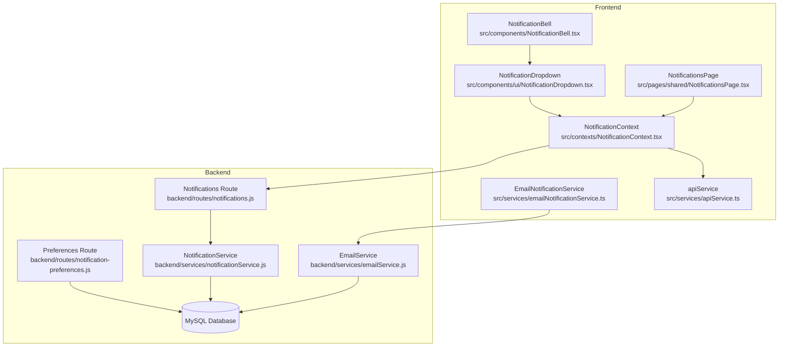
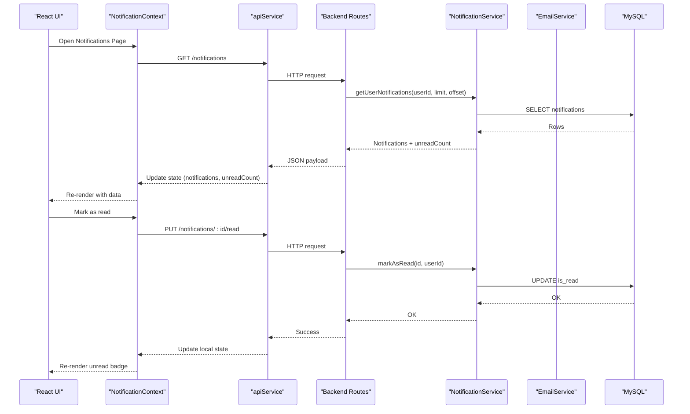
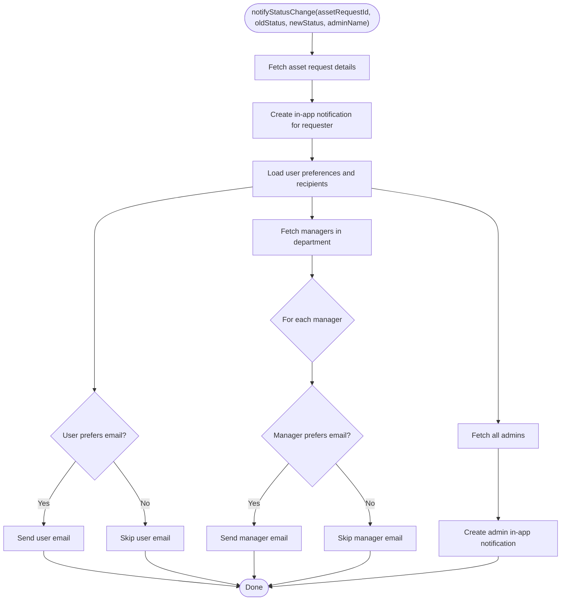
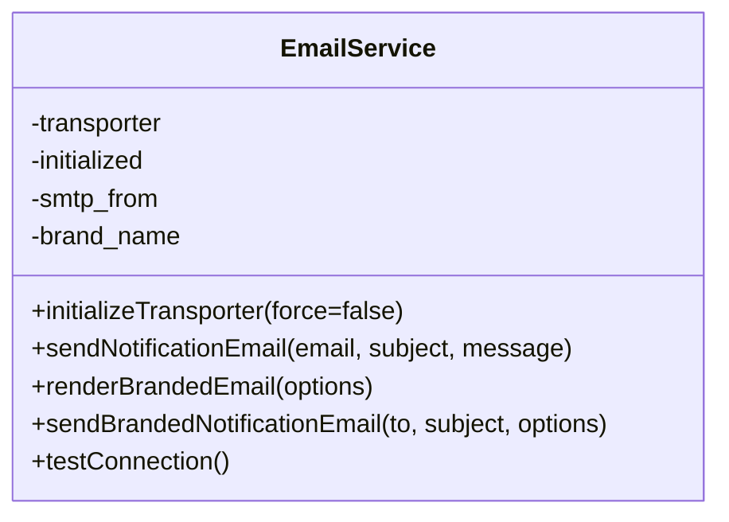
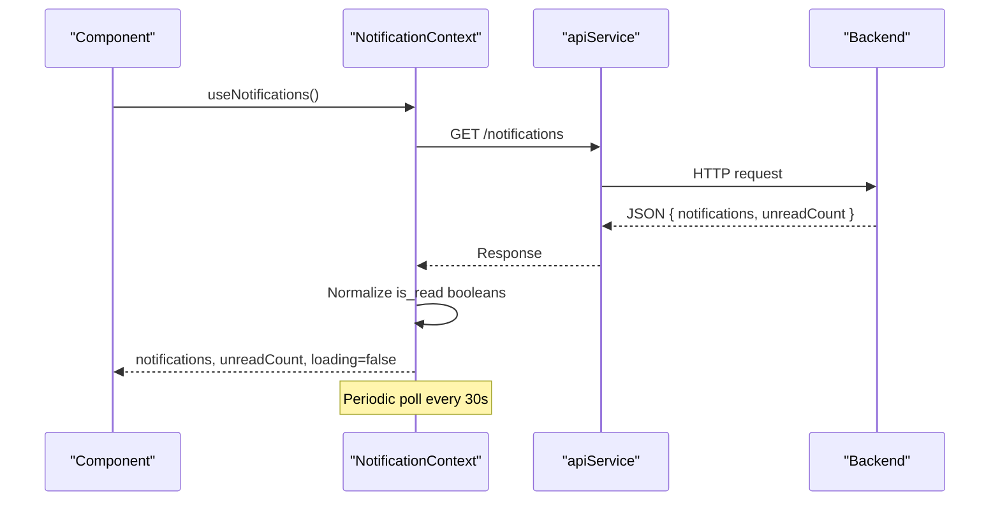
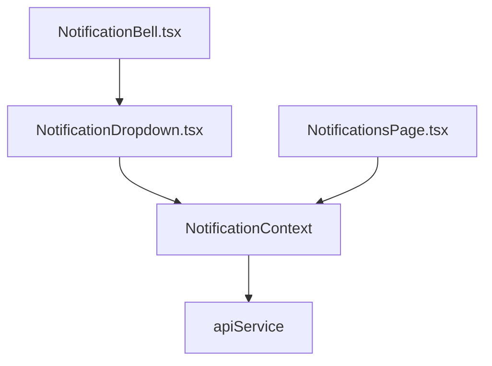
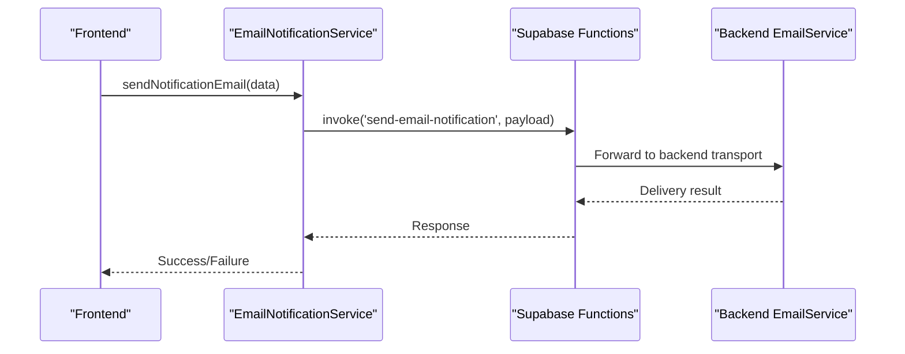
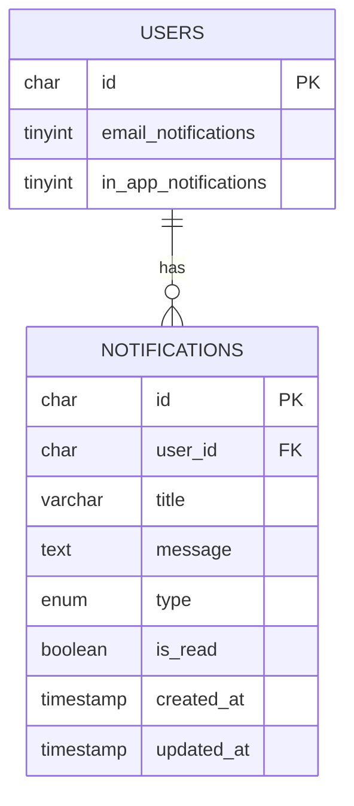
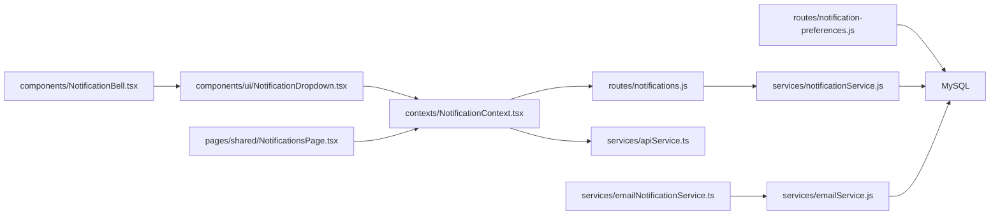

# Notification & Communication System

## Table of Contents
1. [Introduction](#introduction)
2. [Project Structure](#project-structure)
3. [Core Components](#core-components)
4. [Architecture Overview](#architecture-overview)
5. [Detailed Component Analysis](#detailed-component-analysis)
6. [Dependency Analysis](#dependency-analysis)
7. [Performance Considerations](#performance-considerations)
8. [Troubleshooting Guide](#troubleshooting-guide)
9. [Conclusion](#conclusion)
10. [Appendices](#appendices)

## Introduction
This document describes the Notification and Communication System that powers multi-channel notifications across the platform. It supports in-app notifications, email alerts, and integrates with email services for automated triggers. The system includes:
- Multi-channel delivery: in-app notifications stored in the database and surfaced in the UI; email notifications generated from templates and sent via SMTP.
- Notification preferences: user-controlled opt-in/out and filtering by notification type and frequency.
- Real-time updates: client-side polling and reactive UI updates.
- Unread tracking: persistent counters and per-item read/unread state.
- Delivery mechanisms: backend services for in-app persistence and email transport; frontend services for email orchestration and UI rendering.
- Scheduling and batch processing: scheduled workflows for digest emails and bulk operations.
- Analytics and monitoring: basic counters and logs; extensible for deeper metrics.

## Project Structure
The notification system spans backend services, routes, and frontend components:
- Backend
  - Services: notification and email services manage persistence and transport.
  - Routes: REST endpoints expose CRUD and state operations for notifications and preferences.
  - Migrations: database schema for notifications and user preference columns.
- Frontend
  - Context: centralized state for notifications, unread counts, and toasts.
  - UI components: bell, dropdown, and page for viewing notifications.
  - Services: API wrappers and email orchestration helpers.
  - Config: environment-driven email configuration.



## Core Components
- Backend Notification Service
  - Creates in-app notifications, retrieves paginated lists, marks read/unread, computes unread counts, and orchestrates email notifications for status changes and comments.
- Backend Email Service
  - Initializes SMTP from database/system settings, renders branded emails, and sends transactional messages.
- Backend Routes
  - Expose endpoints to list, mark read, mark all read, get unread count, and delete notifications; expose endpoints to get/update user notification preferences.
- Frontend Notification Context
  - Centralizes notifications, unread counts, loading states, and toast notifications; polls for updates and exposes actions to mark/read and delete.
- Frontend UI Components
  - Notification bell with unread badge, dropdown preview, and full notifications page.
- Frontend Email Notification Service
  - Wraps Supabase Edge Functions to send emails with templated HTML/text bodies.
- Frontend API Service
  - Axios-based client with interceptors for auth and redirects on 401.

## Architecture Overview
The system follows a layered architecture:
- UI Layer: React components consume the NotificationContext and render notifications and preferences.
- Service Layer: Frontend services encapsulate API calls and email orchestration.
- Backend Layer: Express routes delegate to services for persistence and transport.
```bash
# Persistence Layer
MySQL stores notifications and user preferences; system settings store SMTP configuration.
```



## Detailed Component Analysis

### Backend Notification Service
Responsibilities:
- In-app notifications: create, paginate, mark read/unread, compute unread counts.
- Email orchestration: generate HTML/text templates for status changes and comments; send to user, managers, and admins; respect user preferences.
- Template generation: branded HTML and text variants for user, manager, and admin audiences.

Key behaviors:
- Creation uses UUID primary keys and sanitizes pagination limits.
- Unread counting aggregates unread records per user.
- Email sending delegates to EmailService; failures are logged and non-blocking for in-app creation.



### Backend Email Service
Responsibilities:
- Initialize SMTP transport from database/system settings and environment variables.
- Send branded and raw notification emails with HTML/text alternatives.
- Render modern branded templates with optional embedded logo.

Key behaviors:
- Initialization merges database and environment settings; constructs a formatted sender address with brand name.
- Sends HTML and text variants; logs success and failure.



### Backend Routes: Notifications
Endpoints:
- GET /notifications: Paginated notifications and unread count.
- PUT /notifications/:id/read: Mark single notification as read.
- PUT /notifications/mark-all-read: Mark all unread as read.
- GET /notifications/unread-count: Get unread count.
- DELETE /notifications/:id: Delete a notification.

Behavior:
- Uses JWT authentication middleware.
- Returns structured JSON with success flag and data.

### Backend Routes: Notification Preferences
Endpoints:
- GET /notification-preferences/users/:userId/preferences: Get another user’s preferences (admin-only).
- PUT /notification-preferences/users/:userId/preferences: Update another user’s preferences (admin-only).
- GET /notification-preferences/me: Get current user’s preferences with fallbacks.
- PUT /notification-preferences/me: Update current user’s preferences.

Behavior:
- Enforces ownership/admin checks.
- Gracefully handles missing columns by returning defaults.

### Frontend Notification Context
Responsibilities:
- Fetch notifications and unread counts via API.
- Poll for updates every 30 seconds while authenticated.
- Provide actions to mark as read, mark all as read, delete, and add local notifications.
- Manage toast notifications with auto-dismiss.



### Frontend UI Components
- NotificationBell: Renders bell with unread count and toggles dropdown.
- NotificationDropdown: Shows top 3 unread notifications, allows mark-as-read and “view all”.
- NotificationsPage: Full list with mark-all-as-read and individual mark-as-read.



### Frontend Email Notification Service
Responsibilities:
- Invoke Supabase Edge Function to send emails with templated HTML/text.
- Support bulk sending and testing.
- Check configuration (SMTP availability, function accessibility, user preferences).



### Frontend API Service
Responsibilities:
- Axios instance with base URL from environment.
- Request interceptor adds Authorization header.
- Response interceptor handles 401 by clearing tokens and redirecting to login.

### Database Schema and Migrations
- Notifications table: UUID primary key, foreign key to users, indexes on user_id, is_read, created_at, type.
- User preference columns: email_notifications and in_app_notifications with defaults.



## Dependency Analysis
- Backend
  - notificationService depends on emailService and database queries.
  - routes depend on services and authentication middleware.
- Frontend
  - UI components depend on NotificationContext.
  - NotificationContext depends on apiService.
  - emailNotificationService depends on Supabase Functions and EmailService.



## Performance Considerations
- Pagination and Limits: Backend enforces default and maximum limits for notification retrieval to avoid heavy queries.
- Indexes: Notifications table includes indexes on user_id, is_read, created_at, and type to optimize reads and filtering.
- Polling Interval: Frontend polls every 30 seconds; adjust interval based on traffic and latency.
- Asynchronous Operations: Email sending is delegated to external services/functions; failures are logged and do not block in-app creation.
- Batch Sending: Frontend email service supports bulk sending with aggregated results.

## Troubleshooting Guide
Common issues and resolutions:
- Missing User Preference Columns
  - Symptoms: 500 errors when updating preferences.
  - Resolution: Run migrations to add email_notifications and in_app_notifications columns.
- SMTP Not Configured
  - Symptoms: Email sending fails; logs indicate missing SMTP configuration.
  - Resolution: Ensure system settings or environment variables contain SMTP credentials; verify initialization path.
- Authentication Errors
  - Symptoms: 401 responses; UI redirects to login.
  - Resolution: Refresh token; ensure cookies are enabled; verify interceptor behavior.
- Email Templates Not Found
  - Symptoms: Email sending bypassed due to missing templates.
  - Resolution: Seed or activate appropriate email templates in the system settings.
- Delivery Failures
  - Symptoms: Emails not received; backend logs show errors.
  - Resolution: Test SMTP connectivity; verify sender address formatting; confirm recipient validity.

## Conclusion
The Notification and Communication System provides a robust, multi-channel solution for delivering timely updates to users. It combines persistent in-app notifications with configurable email delivery, offering granular user controls and real-time updates. The modular backend services and frontend context enable scalable enhancements for scheduling, batching, and analytics.

## Appendices

### Notification Workflows
- Status Change Notification
  - Trigger: Asset request status update.
  - Actions: Create in-app notification for requester; optionally email requester; notify managers and admins (in-app only).
- Comment Notification
  - Trigger: New comment on asset request.
  - Actions: Generate HTML/text templates and send to involved parties.

### Customization Scenarios
- Email Templates
  - Customize HTML and text bodies for different event types; leverage branding options and optional logo embedding.
- User Preferences
  - Enable/disable email and in-app notifications; filter notification types; choose email frequency (immediate/daily/weekly).
- SMTP Configuration
  - Configure host, port, security, and credentials via environment variables or system settings; verify sender branding.

- `emailConfig.ts:31-71`
