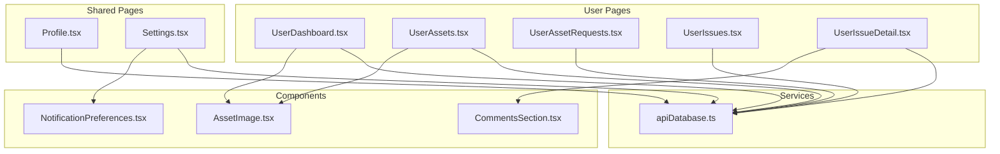
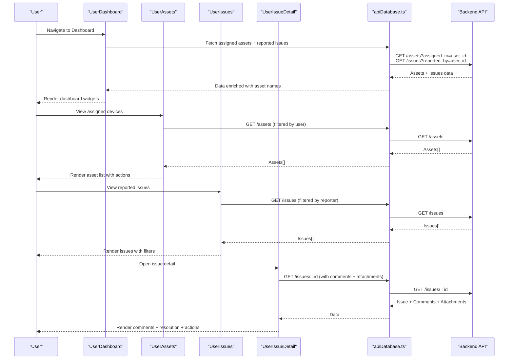
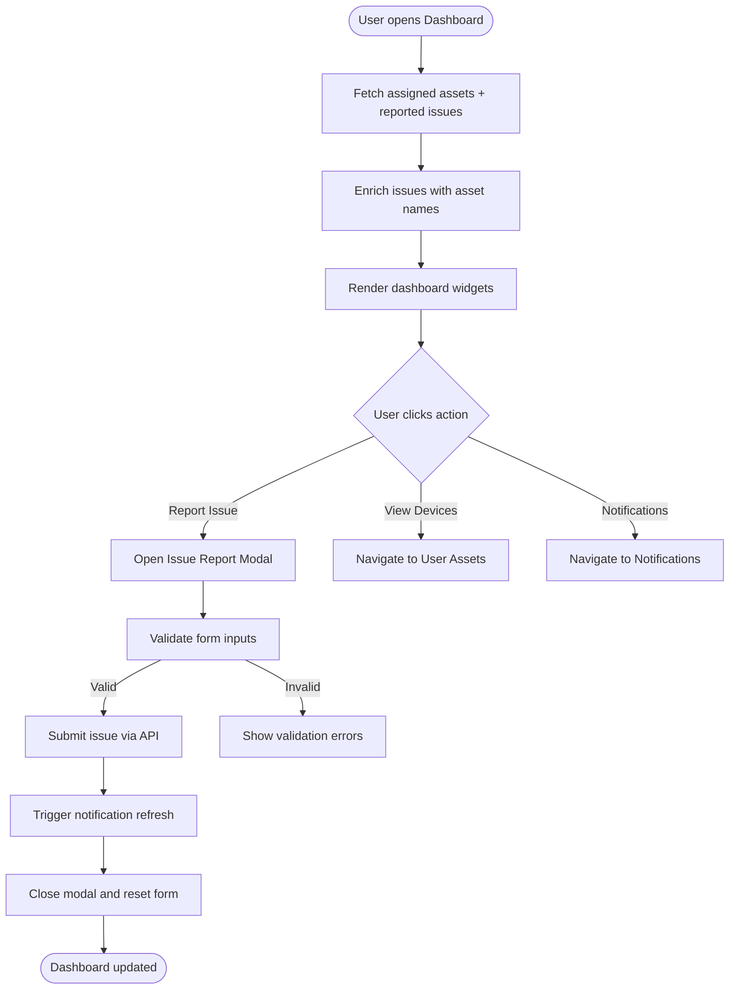
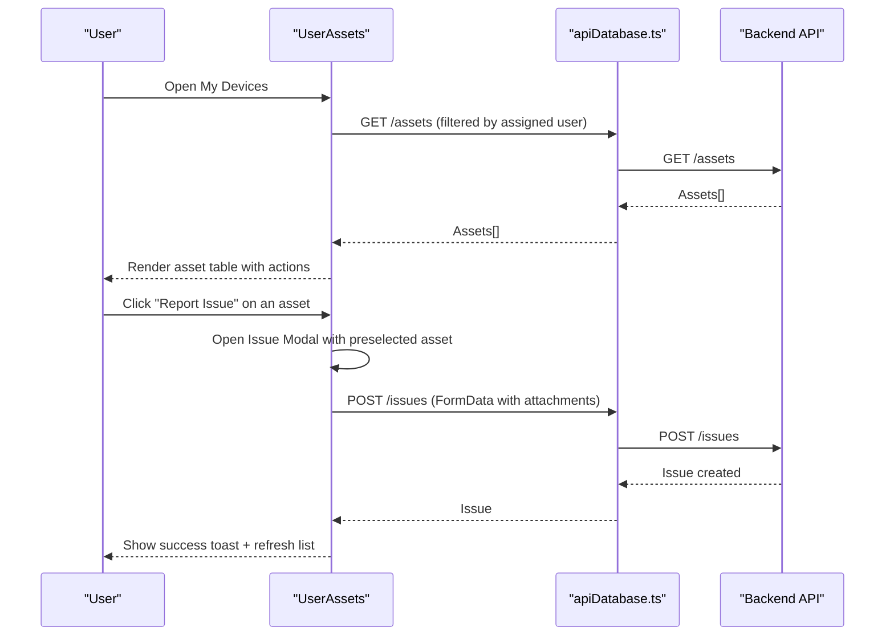
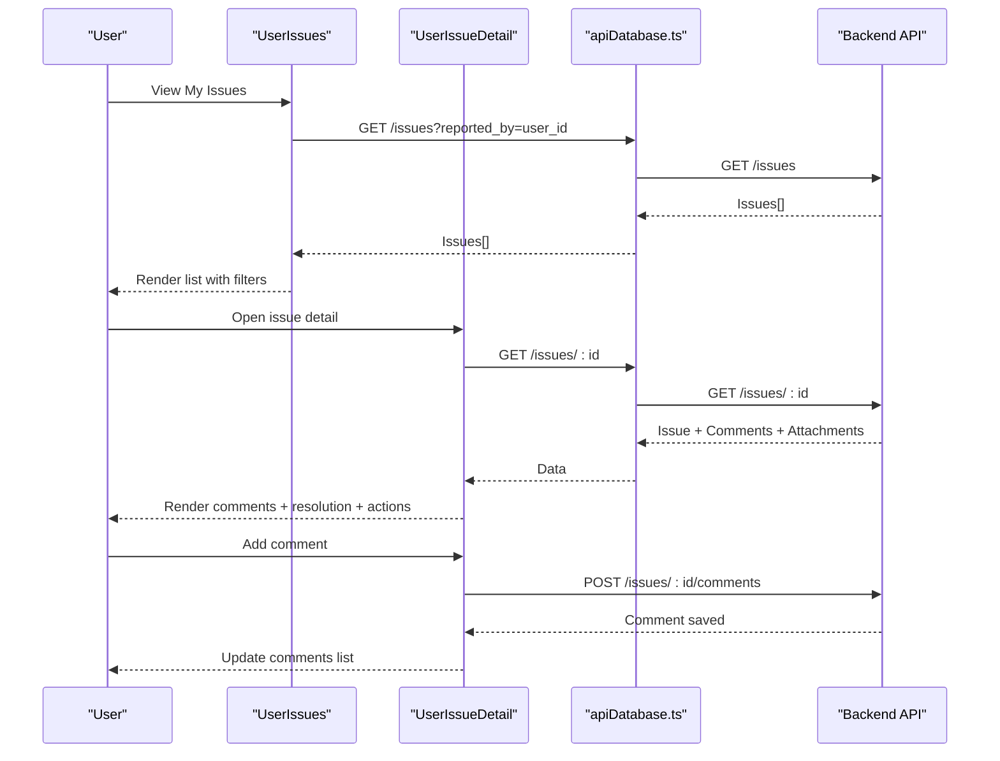
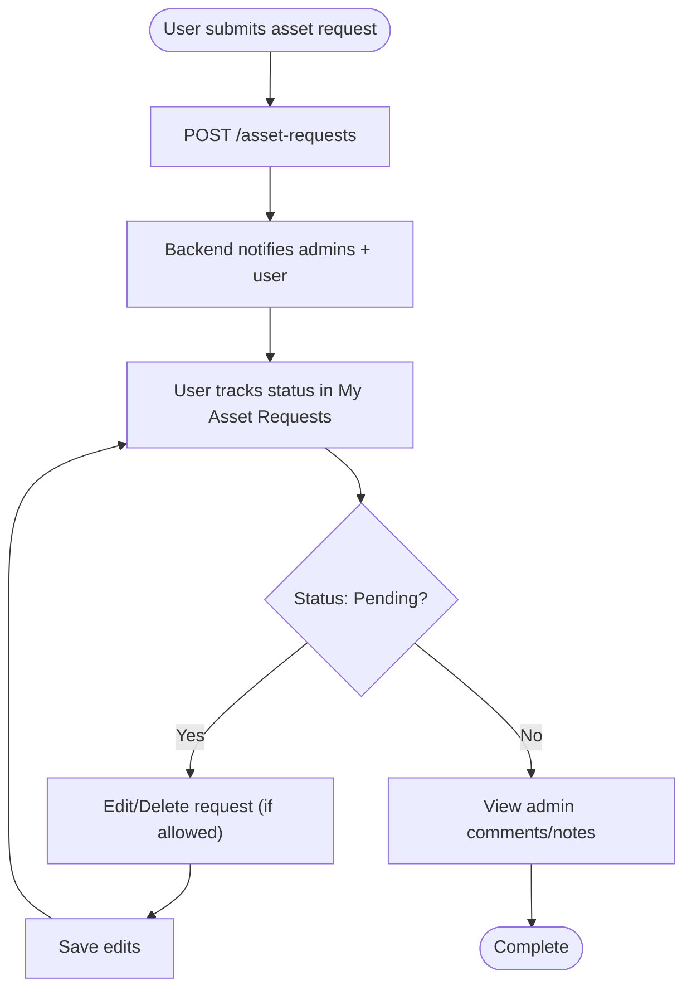
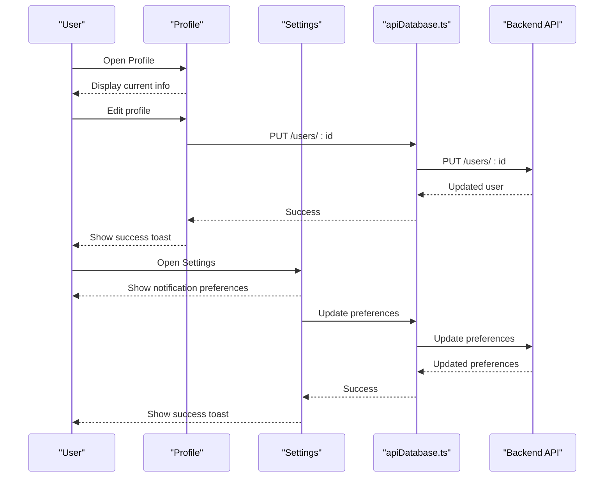
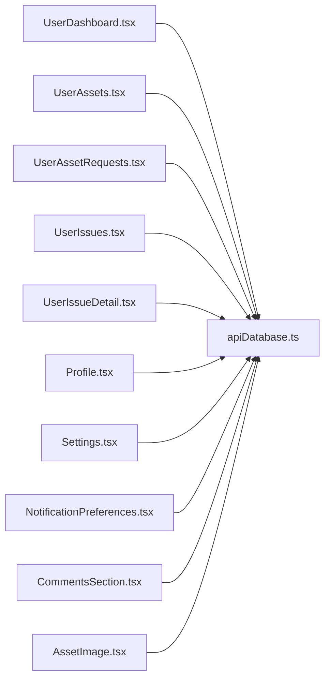

# User Dashboard & Personal Features

## Table of Contents
1. [Introduction](#introduction)
2. [Project Structure](#project-structure)
3. [Core Components](#core-components)
4. [Architecture Overview](#architecture-overview)
5. [Detailed Component Analysis](#detailed-component-analysis)
6. [Dependency Analysis](#dependency-analysis)
7. [Performance Considerations](#performance-considerations)
8. [Troubleshooting Guide](#troubleshooting-guide)
9. [Conclusion](#conclusion)

## Introduction
This document provides comprehensive documentation for the User Dashboard and Personal Features module. It covers the user dashboard overview, personal asset tracking, individual issue management, asset request workflows, approval processes, status tracking, personal issue detail views, collaborative commenting, resolution updates, profile management, personal settings, notification preferences, personal reporting features, activity timelines, and self-service capabilities. It also includes user onboarding, help resources, support access, workflow optimization shortcuts, and productivity tools with practical examples.

## Project Structure
The user-facing personal features are implemented as React components under the `/src/pages/user` directory, with supporting components and services in `/src/components` and `/src/services`. The architecture follows a clear separation of concerns:
- Pages: UserDashboard, UserAssets, UserAssetRequests, UserIssues, UserIssueDetail
- Shared: Profile, Settings
- Components: AssetImage, CommentsSection, NotificationPreferences
- Services: apiDatabase (API client), notificationPreferencesService

## Core Components
This section outlines the primary components that deliver user dashboard and personal features:

- UserDashboard: Provides a personalized overview with quick actions, assigned devices summary, recent issues, and modal forms for reporting issues and requesting assets.
- UserAssets: Displays a user's assigned assets, supports filtering/searching, and enables reporting issues per asset.
- UserAssetRequests: Allows users to track, edit, and delete their asset requests with comments and status visibility.
- UserIssues: Lists issues reported by the user, supports filtering, search, and inline editing/deletion.
- UserIssueDetail: Detailed view for an issue with comments, resolution notes, and collaborative editing controls.
- Profile: Self-service profile management with personal information updates and password changes.
- Settings: Centralized personal settings including notification preferences, MFA configuration, and account information.
- NotificationPreferences: Configurable notification channels and frequencies.
- CommentsSection: Collaborative commenting for asset requests.
- AssetImage: Dynamic asset image rendering with fallbacks.

## Architecture Overview
The user personal features follow a unidirectional data flow:
- Components consume services (apiDatabase) to fetch and mutate data.
- Contexts (AuthContext, NotificationContext) provide global state and notifications.
- UI components render lists, forms, and modals with controlled state and validation.
- Backend APIs handle business logic, notifications, and audit logging.

## Detailed Component Analysis

### User Dashboard
The dashboard serves as a central hub for users to:
- View quick actions (View Devices, Report Issue, Notifications)
- See assigned devices summary and recent issues
- Report issues via a modal with attachments
- Access notifications and manage personal workflows

Key behaviors:
- Concurrently loads assigned assets and reported issues
- Enriches issues with asset names for better context
- Validates issue reports (title length, description length, category selection)
- Handles file uploads with attachment limits and previews
- Triggers notification refresh upon successful submissions

### Personal Asset Tracking
The personal asset tracking feature allows users to:
- View assigned devices with images, status, and location
- Search and filter assets by type and status
- Report issues directly from the asset list
- Manage assets (view details, report issues)

Implementation highlights:
- Uses AssetImage component for dynamic image rendering
- Supports search by name, serial number, or type
- Filters by asset type and status
- Integrates issue reporting with selected asset context

### Individual Issue Management
The individual issue management system provides:
- Comprehensive list of reported issues with status and priority
- Filtering by status and priority
- Inline editing and deletion for eligible issues
- Detailed view with comments, attachments, and resolution notes
- Collaborative commenting and attachment previews

### Asset Request Workflows
The asset request workflow enables users to:
- Track submitted requests with status and priority
- View admin notes and comments
- Edit pending requests and delete them
- Communicate via comments with administrators

### Profile Management and Settings
Profile management includes:
- Viewing and editing personal information (name, phone, position, department)
- Changing passwords with complexity requirements
- Managing notification preferences (email/in-app, types, frequency)
- Configuring two-factor authentication (TOTP) and recovery codes

Settings consolidates:
- Notification preferences UI
- MFA enrollment and verification
- Account information display
- System settings (admin-only)

### Collaboration and Communication
Collaboration features include:
- Comments on asset requests with nested replies
- Real-time comment addition and editing
- Deletion controls for authorized users
- Rich comment UI with timestamps and user identification

## Dependency Analysis
The personal features depend on:
- apiDatabase service for all CRUD operations
- Contexts for authentication and notifications
- Utility components for images and UI elements
- Backend APIs for business logic, notifications, and audit trails

## Performance Considerations
- Concurrent data fetching reduces initial load time (e.g., dashboard loads assets and issues together).
- Memoization and controlled re-renders minimize unnecessary computations.
- Optimistic UI updates followed by backend synchronization improve perceived responsiveness.
- Image lazy-loading and fallbacks prevent blocking renders.
- Validation prevents invalid submissions, reducing server errors and retries.

## Troubleshooting Guide
Common issues and resolutions:
- Dashboard fails to load: Check network connectivity and authentication state; verify concurrent fetches and error notifications.
- Issue submission errors: Validate minimum lengths for title/description and ensure category selection; confirm attachment limits.
- Asset request not updating: Ensure status is pending; verify user permissions; check backend notifications.
- Profile update failures: Confirm required fields and password complexity; verify email uniqueness.
- Notification preferences not saving: Ensure user is authenticated; check service responses and toast messages.

## Conclusion
The User Dashboard and Personal Features module delivers a cohesive, efficient, and user-friendly experience for managing personal assets, tracking issues, and configuring preferences. Its modular architecture, robust service layer, and rich collaboration features enable streamlined workflows, improved productivity, and seamless self-service capabilities.
