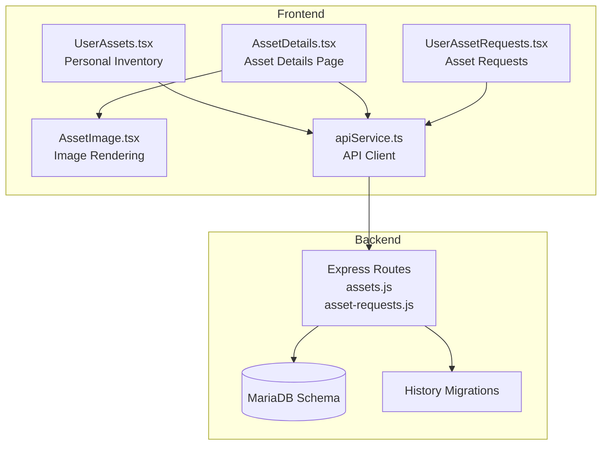
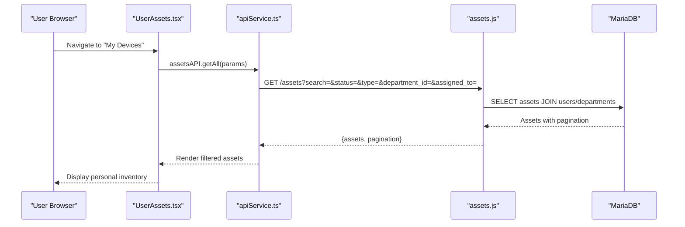
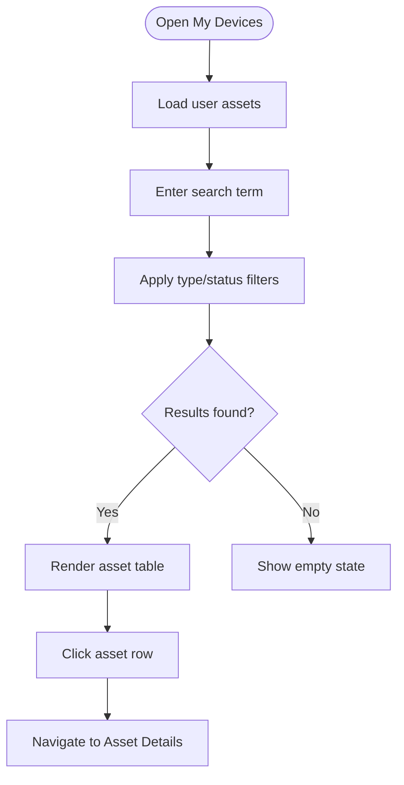
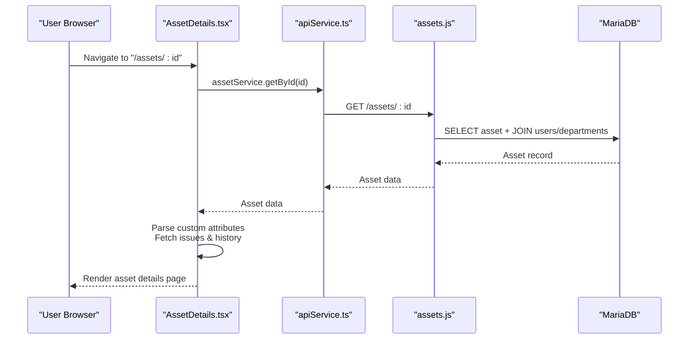
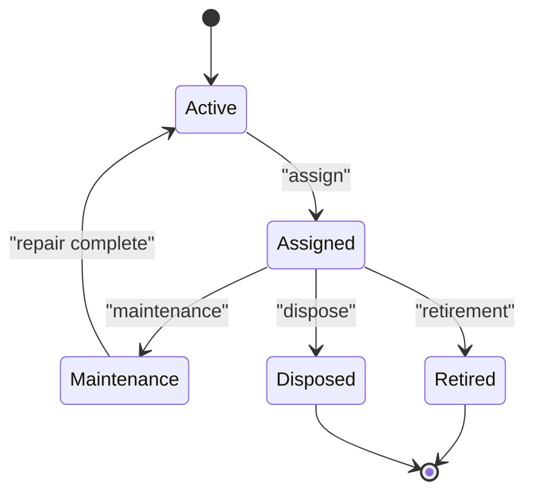
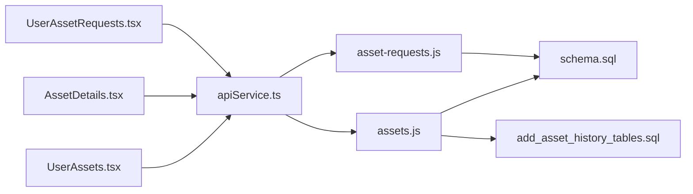

# Personal Asset Management

## Table of Contents
1. [Introduction](#introduction)
2. [Project Structure](#project-structure)
3. [Core Components](#core-components)
4. [Architecture Overview](#architecture-overview)
5. [Detailed Component Analysis](#detailed-component-analysis)
6. [Dependency Analysis](#dependency-analysis)
7. [Performance Considerations](#performance-considerations)
8. [Troubleshooting Guide](#troubleshooting-guide)
9. [Conclusion](#conclusion)

## Introduction
This document explains the Personal Asset Management functionality, focusing on how individual users can view and manage their assigned assets, track device assignments, and access personal inventory details. It covers asset details pages, serial number tracking, location information, status updates, search and filtering, history viewing, maintenance records, transfer and return procedures, lifecycle tracking, image display, technical specifications, department assignment, request workflows, replacement processes, and valuation information. Examples demonstrate common scenarios and self-service procedures.

## Project Structure
The Personal Asset Management system comprises:
- Frontend React application with TypeScript and TailwindCSS
- Backend REST API built with Express.js and MariaDB
- Database schema supporting assets, users, departments, issues, and asset requests
- Migration scripts enabling asset assignment and issue history tracking

## Core Components
- Asset API: Provides CRUD operations, search/filtering, and history retrieval for assets
- Asset Details Page: Displays asset core info, technical specs, QR code, warranty, assignment history, and issues
- Personal Inventory: Lists user-assigned assets with search and filter controls
- Asset Requests: Manages personal equipment requests with status tracking and comments
- Image Handling: Renders asset images or default icons
- Database Schema: Defines assets, departments, users, issues, asset requests, and history tables

Key capabilities:
- View assigned assets and personal inventory
- Search by name, serial number, type
- Filter by asset type and status
- Access asset details, technical specs, warranty, and QR code
- Track assignment history and issues
- Report issues with attachments
- Submit asset requests for replacements
- Lifecycle tracking via history tables

## Architecture Overview
The system follows a client-server architecture:
- Frontend React components communicate with backend REST endpoints via an API client
- Backend routes handle requests, apply filters, join related tables, and return paginated results
- Database schema supports asset lifecycle, department associations, and audit trails
- Migrations enable detailed assignment and issue history tracking

## Detailed Component Analysis

### Asset Viewing and Personal Inventory
- Purpose: Allow users to view and manage their assigned devices
- Features:
  - Load user-specific assets from API
  - Search by name, serial number, or type
  - Filter by asset type and status
  - Navigate to asset details page
  - Report issues per device
- Implementation highlights:
  - Uses assetsAPI.getAll with assigned_to filter
  - Applies client-side search and filter logic
  - Displays asset image via AssetImage component
  - Integrates with issue reporting workflow

### Asset Details Page
- Purpose: Present comprehensive asset information and actions
- Features:
  - Core info: name, type, serial number, location, assigned user
  - Technical specifications: dynamic parameters per asset type
  - Warranty information: status, purchase date, expiry, remaining days
  - QR code: shareable link, copy/download/share
  - Assignment history: timeline of assignments and returns
  - Issues history: list of related issues with status badges
  - Image display: asset image or default icon
  - Edit asset (admin): update fields, images, department, assigned user
  - Dispose asset (admin): mark as disposed
- Implementation highlights:
  - Fetches asset, assigned user, department, issues, and assignment history
  - Parses custom attributes for technical specs
  - Generates QR code URL and supports download/share/copy
  - Supports issue creation with attachments

### Serial Number Tracking and Location Information
- Serial number uniqueness enforced at creation
- Location stored per asset with defaults
- Department association tracked for asset ownership
- Assignment history captures location changes during transfers

### Status Updates and Lifecycle Tracking
- Asset status managed via update endpoint
- Assignment history tracks assign/transfer/return/unassign events
- Issue history logs lifecycle events for linked issues
- Asset lifecycle: active → assigned → maintenance → retired/disposed

### Search and Filtering Options
- Backend search: name, serial number, manufacturer
- Filters: status, type, department_id, assigned_to
- Pagination: sanitized limits with default and max caps
- Frontend search: client-side filtering on personal inventory

### Asset History Viewing and Maintenance Records
- Comprehensive history endpoint aggregates assignment and issue events
- Assignment history includes timestamps, conditions, and department
- Issue history includes event types and status changes
- Maintenance records tracked separately with costs and dates

### Asset Transfer Processes and Returns
- Transfers and returns recorded in asset_assignment_history
- Conditions captured on assign/return
- Automatic department resolution when assigning assets
- Timeline shows current assignment until returned

### Asset Image Display and Technical Specifications
- Image rendering supports binary data or default icons
- Dynamic technical specs per asset type configured via parameters schema
- Custom attributes parsed and formatted for display

### Department Assignment Information
- Assets linked to departments via foreign keys
- Department stats updated via triggers (counts and valuation)
- Edit asset flow allows selecting parent department and sub-department

### Asset Request Workflows and Replacement Processes
- Users submit requests with asset type, category, reason, and priority
- Admins approve/reject/fulfill requests with optional estimated cost
- Comments section enables communication around requests
- Users can edit/delete pending requests

### Asset Valuation Information
- Purchase price and current value stored per asset
- Department asset_value computed via triggers summing current values
- Estimated cost supported for asset requests (admin-only)

### Common Scenarios and Self-Service Procedures
- View personal inventory:
  - Navigate to "My Devices", search and filter assets
- Report an issue:
  - From asset details or personal inventory, attach files, submit issue
- Request replacement:
  - Use "Request New Device" quick action, fill reason and urgency
- Track lifecycle:
  - Review assignment history and issues history on asset details
- Share asset details:
  - Copy QR code link or download/share QR image

## Dependency Analysis
The frontend depends on the backend API for all asset operations. The backend routes depend on the database schema and migration tables for history tracking.

## Performance Considerations
- Pagination: Backend enforces default and max limits to prevent heavy queries
- Indexes: Strategic indexes on assets, users, departments, and issues improve query performance
- Client-side filtering: Lightweight filtering on small datasets for personal inventory
- Image handling: Binary image data converted to blobs; consider CDN for large-scale deployments

## Troubleshooting Guide
- Authentication errors: API client redirects unauthenticated users to login
- Asset not found: Details page validates access permissions and displays appropriate messages
- Validation failures: Creation/update endpoints validate input and return structured errors
- History queries: Defensive checks for optional history tables; gracefully handle missing tables

Common fixes:
- Clear browser cache and re-login if redirected unexpectedly
- Verify search/filter parameters match expected formats
- Confirm serial number uniqueness when creating assets
- Ensure proper roles for administrative actions (edit/dispose)

## Conclusion
The Personal Asset Management system provides a robust, user-friendly solution for individuals to view, track, and manage their assigned assets. It integrates search and filtering, detailed asset pages with technical specifications and QR sharing, comprehensive history tracking, and streamlined request workflows for replacements. Administrative capabilities for editing, disposing, and managing departments complement the self-service experience, ensuring efficient personal asset lifecycle management.
