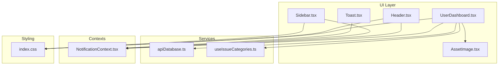
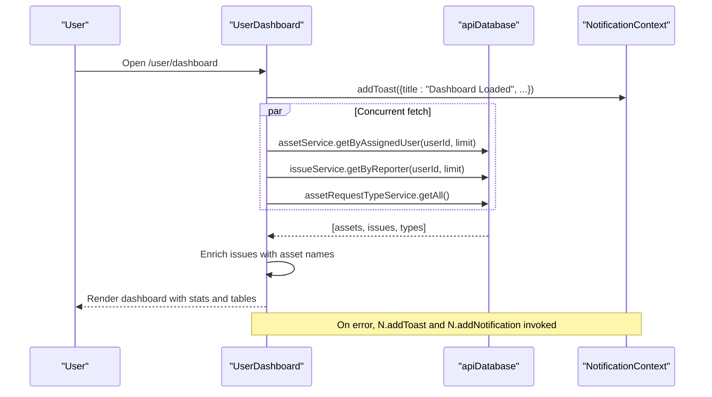
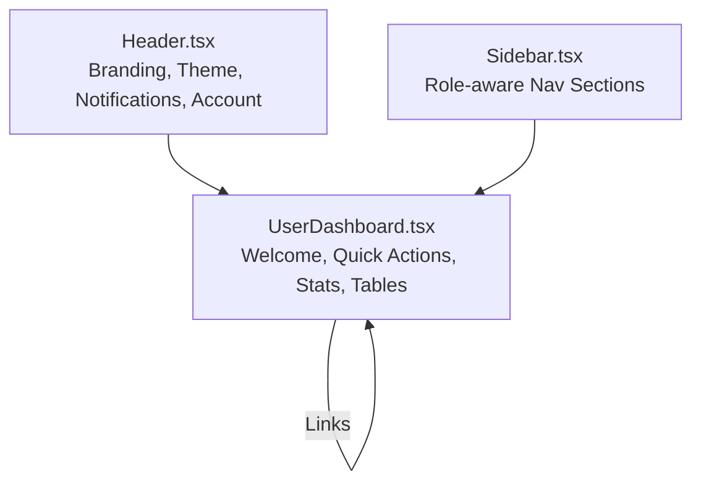
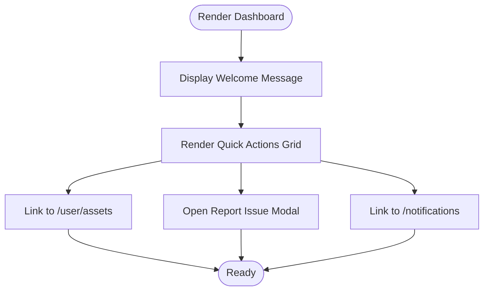
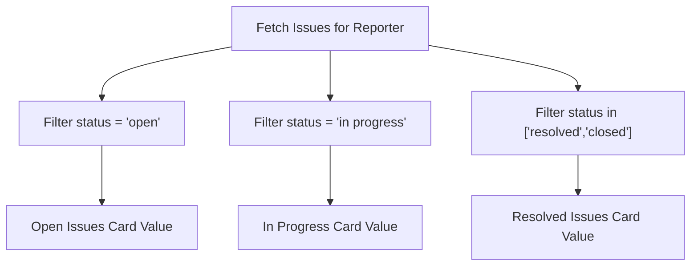
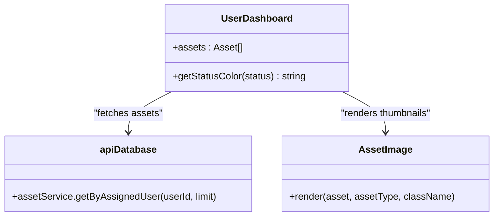
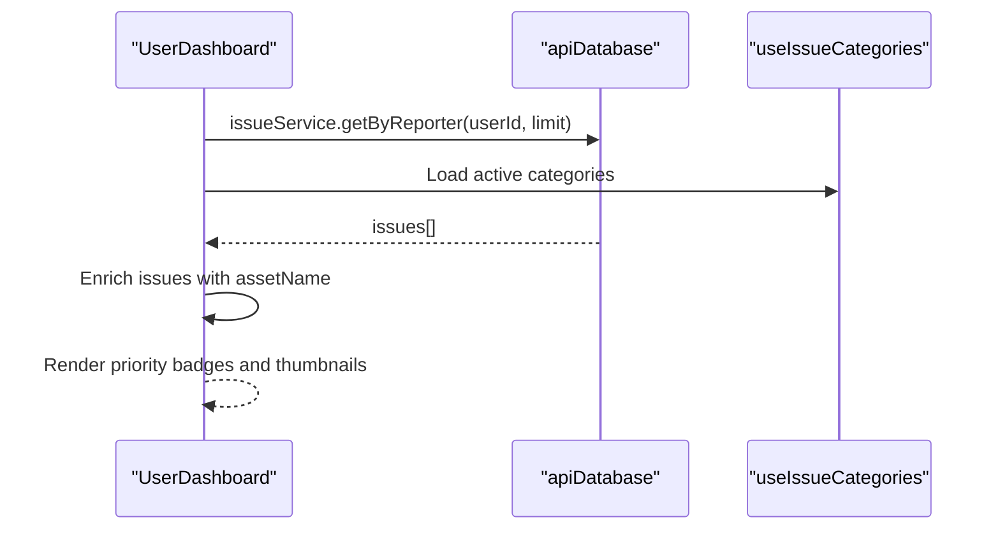
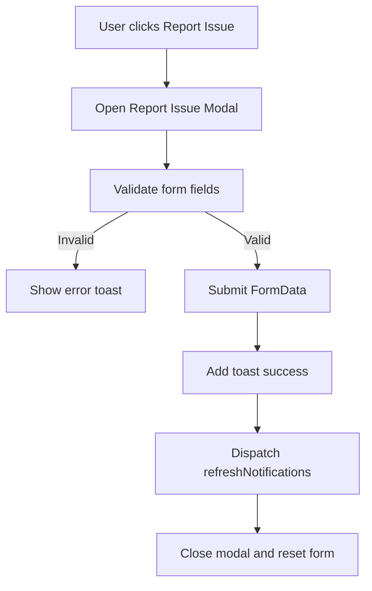
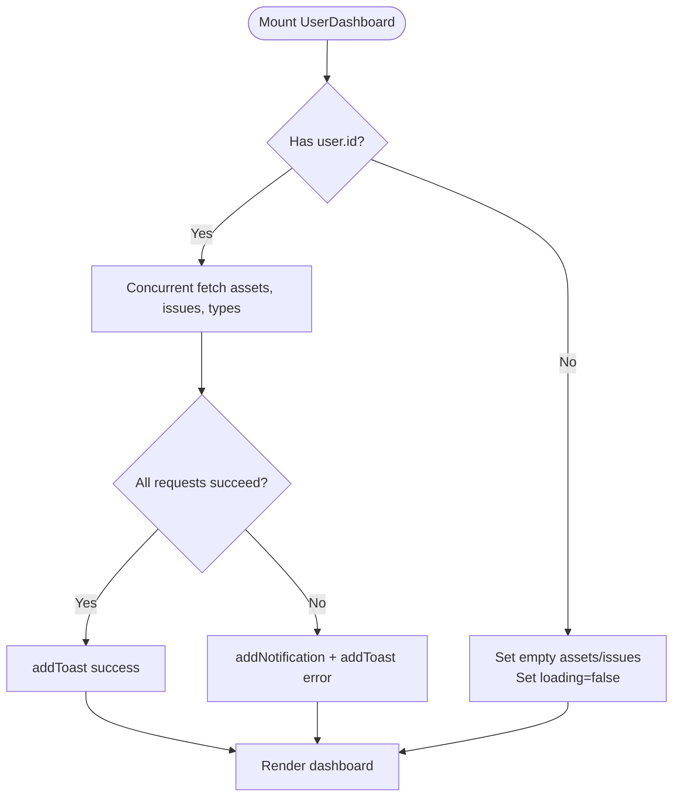
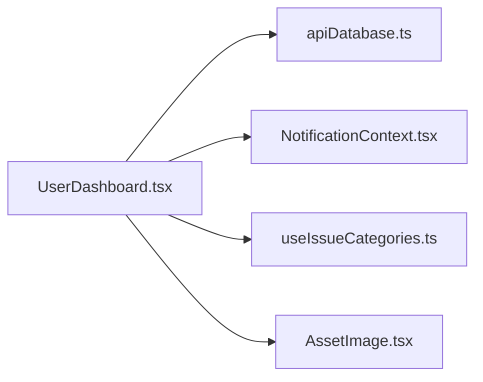

# User Dashboard Overview

## Table of Contents
1. [Introduction](#introduction)
2. [Project Structure](#project-structure)
3. [Core Components](#core-components)
4. [Architecture Overview](#architecture-overview)
5. [Detailed Component Analysis](#detailed-component-analysis)
6. [Dependency Analysis](#dependency-analysis)
7. [Performance Considerations](#performance-considerations)
8. [Troubleshooting Guide](#troubleshooting-guide)
9. [Conclusion](#conclusion)
10. [Appendices](#appendices)

## Introduction
This document describes the User Dashboard Overview, focusing on the layout, welcome messaging, quick actions, statistics cards, responsive design, card-based interface, navigation elements, asset table display, recent issues table, loading states, error handling, and user-specific personalization. It also outlines customization options and frequently accessed features for end users.

## Project Structure
The User Dashboard is implemented as a React functional component with TypeScript and styled via Tailwind CSS utilities. It integrates with a centralized API service layer, a notification system, and shared UI components for header, sidebar, and toasts.

## Core Components
- UserDashboard: Orchestrates data fetching, renders welcome message, quick actions, stats cards, asset table, recent issues table, and modal forms.
- Header: Provides branding, theme toggle, notifications bell, and user profile menu.
- Sidebar: Renders role-aware navigation with collapsible sections and active state highlighting.
- apiDatabase: Centralized service layer for assets, issues, notifications, and related operations.
- useIssueCategories: Hook to load and manage issue categories for reporting.
- AssetImage: Renders device thumbnails with fallback icons.
- NotificationContext and Toast: Global notification and toast management with auto-dismiss and polling.

## Architecture Overview
The dashboard follows a layered architecture:
- Presentation layer: React components (UserDashboard, Header, Sidebar).
- Service layer: apiDatabase encapsulates HTTP calls to backend endpoints.
- State and notifications: NotificationContext manages global notifications and toasts.
- UI primitives: Shared components (AssetImage, Toast) support consistent UX.

## Detailed Component Analysis

### Dashboard Layout and Navigation Elements
- Responsive grid layout with card-based containers using Tailwind utilities.
- Header displays branding, theme toggle, notifications, and user menu.
- Sidebar provides role-aware navigation with collapsible sections and active highlighting.

### Welcome Message and Quick Actions
- Welcome message personalized with user name and contextual summary.
- Quick Actions provide shortcuts to Devices, Issue Reporting, and Notifications.

### Statistics Cards
Four KPI cards summarize user-related metrics:
- Assigned Devices: Count of assets assigned to the user.
- Open Issues: Count of issues with status "open".
- In Progress: Count of issues with status "in progress".
- Resolved Issues: Count of issues with statuses "resolved" or "closed".

### Asset Table Display
- Displays user’s assigned devices with thumbnails, type, serial number, status, and location.
- Uses AssetImage for device images with fallback icons.
- Status badges use dynamic color mapping based on asset/issue status.

### Recent Issues Table
- Lists recent issues reported by the user with priority indicators, associated device thumbnails, status badges, and date columns.
- Priority indicators use distinct colors per priority level.
- Device association shown with AssetImage and truncated names.

### Report Issue Modal
- Form supports title, priority, category selection, optional asset association, and file attachments.
- Validation ensures minimum lengths and required fields.
- Submits via FormData to backend; triggers audit logging and notification dispatch.

### Dashboard Loading States and Error Handling
- Loading spinner displayed while initial data is fetched.
- On success, a success toast confirms dashboard load.
- On failure, both in-app toast and persistent notification are shown.

### User-Specific Content Personalization
- Welcome message and quick actions adapt to the current user.
- Asset and issue tables filter by user identifiers.
- Notifications integrate with unread counts and per-user endpoints.

### Dashboard Customization Options and Frequently Accessed Features
- Customize quick actions by extending the actions grid with additional links.
- Frequently accessed features include:
  - View All Devices
  - Report an Issue
  - Notifications
  - Profile and Settings
  - Issue history and asset details

## Dependency Analysis
The dashboard depends on:
- apiDatabase for data retrieval and submission.
- NotificationContext for toasts and persistent notifications.
- useIssueCategories for dynamic category selection.
- AssetImage for rendering device thumbnails.

## Performance Considerations
- Concurrent data fetching reduces total load time.
- Memoization and minimal re-renders via React state management.
- Efficient status badge coloring avoids heavy computations.
- Toasts auto-dismiss to prevent UI clutter.

## Troubleshooting Guide
Common scenarios and remedies:
- Dashboard does not load: Verify user authentication and network connectivity; check notification toast for error details.
- Issue submission fails: Confirm required fields meet minimum length, category is selected, and attachments comply with limits.
- Notifications not updating: Ensure polling is active and refresh event is dispatched after submission.

## Conclusion
The User Dashboard delivers a responsive, card-based overview tailored to individual users. It consolidates actionable insights, quick navigation, and integrated reporting capabilities while maintaining robust loading and error-handling mechanisms. The modular architecture and shared components enable easy customization and consistent user experience.

## Appendices

### Responsive Design and Styling
- Tailwind utilities define responsive grids, spacing, and dark mode support.
- Custom CSS classes (.card, .button-primary) standardize appearance across components.

- `UserDashboard.tsx:298-326`
