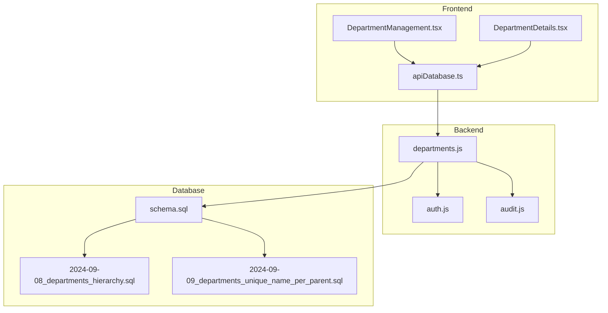
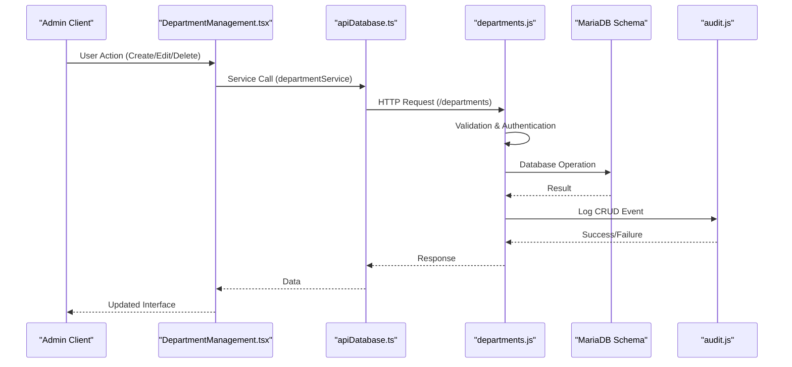
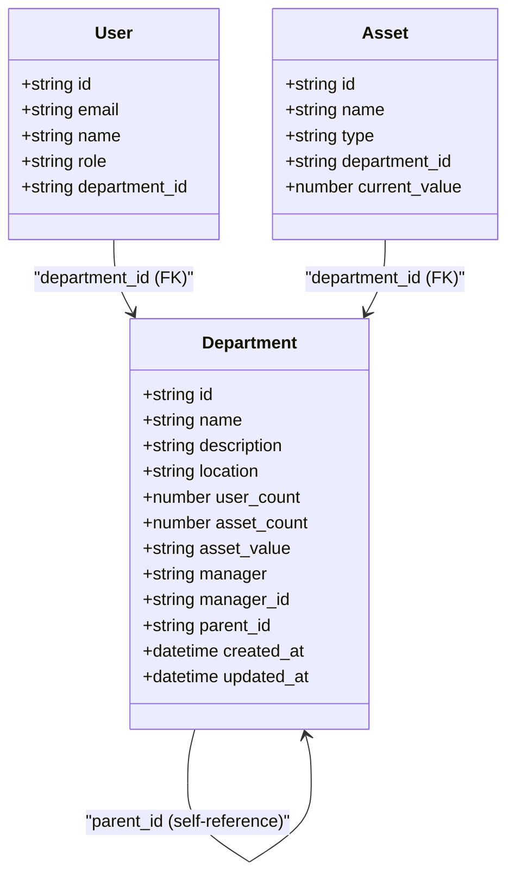
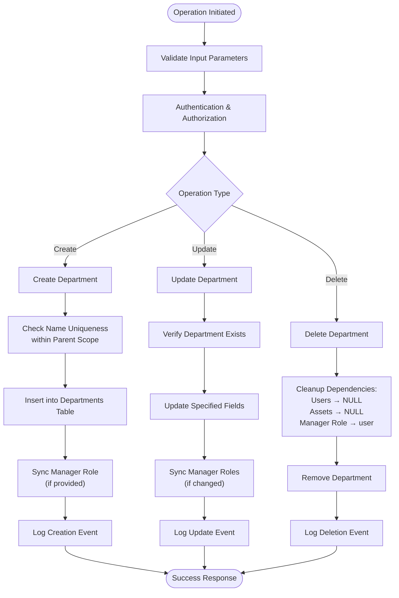
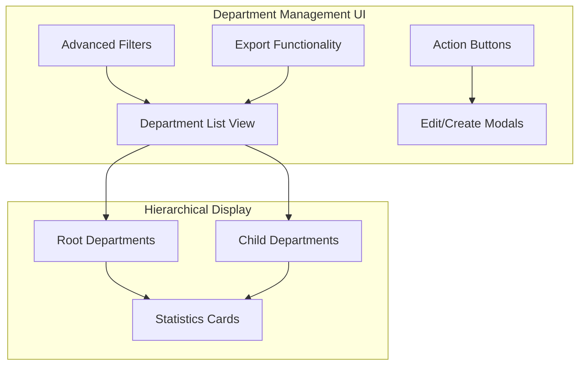
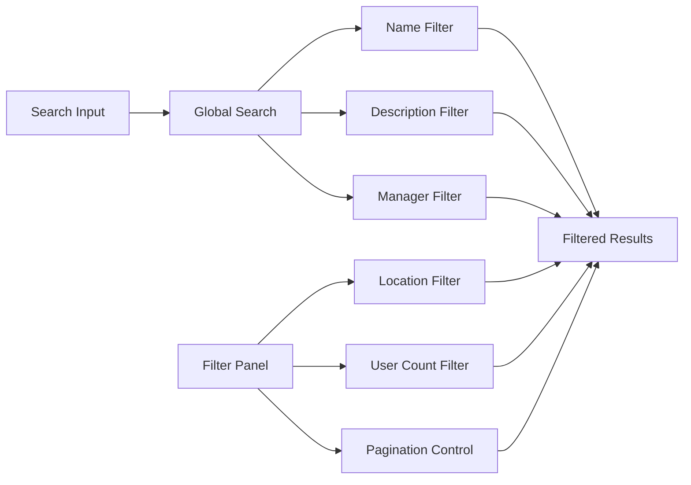
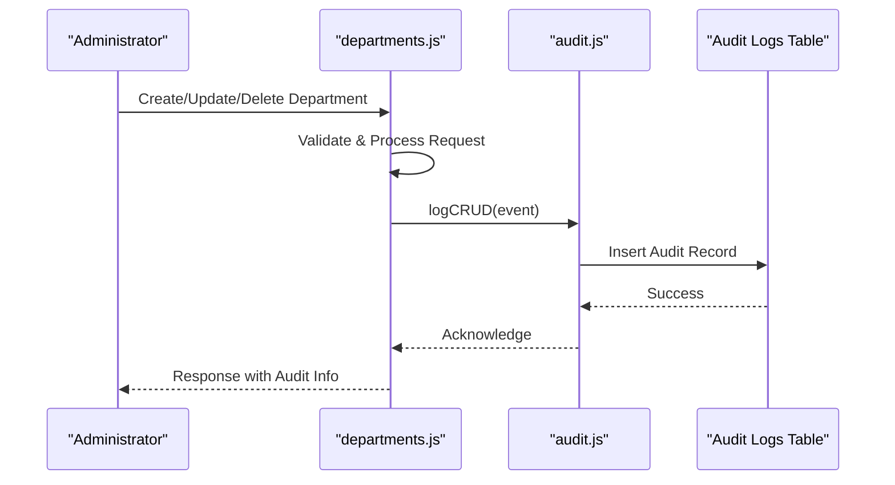
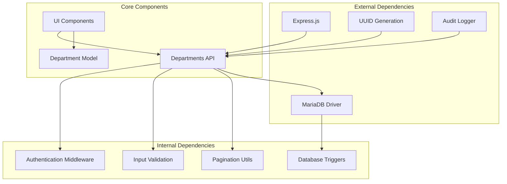

# Department Hierarchy Management

## Table of Contents
1. [Introduction](#introduction)
2. [Project Structure](#project-structure)
3. [Core Components](#core-components)
4. [Architecture Overview](#architecture-overview)
5. [Detailed Component Analysis](#detailed-component-analysis)
6. [Dependency Analysis](#dependency-analysis)
7. [Performance Considerations](#performance-considerations)
8. [Troubleshooting Guide](#troubleshooting-guide)
9. [Conclusion](#conclusion)

## Introduction
This document provides comprehensive documentation for the department hierarchy management system within the assets management platform. It covers the hierarchical structure implementation, parent-child relationships, department inheritance, and organizational chart visualization. The system supports department creation workflows (including parent departments and sub-departments), filtering and search capabilities, administrative functions (renaming, reorganization, deletion), and integrates with user and asset management. While the current implementation focuses on department management, the architecture supports future extensions for budget allocation, reporting relationships, and permission inheritance patterns.

## Project Structure
The department hierarchy management spans three primary layers:
- Backend API: Express routes handling CRUD operations, validation, and audit logging
- Database Schema: MariaDB schema with hierarchical department table and triggers
- Frontend UI: React components for department management, filtering, and visualization



## Core Components
The department hierarchy management system comprises several core components working together to provide a robust organizational structure:

### Database Schema and Triggers
The departments table implements a self-referencing parent-child relationship with cascading foreign key constraints. Triggers automatically maintain department statistics for user counts and asset values.

Key schema elements:
- Self-referencing parent_id column with foreign key constraint
- Unique constraint on (name, parent_id) allowing duplicate names under different parents
- Automatic statistics via triggers for user_count, asset_count, and asset_value
- Comprehensive indexing strategy for performance

### Backend API Layer
The Express route handlers provide full CRUD operations with validation, authentication, and audit logging:
- GET /departments: Paginated retrieval with search and filtering
- GET /departments/:id: Single department details with manager and resource counts
- POST /departments: Department creation with manager role synchronization
- PUT /departments/:id: Department updates with role management
- DELETE /departments/:id: Safe deletion with dependency cleanup

### Frontend Management Interface
React components deliver an intuitive interface for department administration:
- Hierarchical department listing grouped by root departments
- Advanced filtering by location and user count ranges
- Bulk operations and export capabilities
- Real-time statistics and resource associations

## Architecture Overview
The system follows a layered architecture with clear separation of concerns:



The architecture ensures:
- Strong data integrity through database constraints and triggers
- Audit trail for all administrative actions
- Scalable pagination and filtering mechanisms
- Real-time statistics updates

## Detailed Component Analysis

### Department Data Model
The department entity serves as the foundation for the entire hierarchy:



The data model supports:
- Hierarchical organization with unlimited depth
- Resource aggregation (users and assets)
- Manager assignments with role synchronization
- Location-based filtering and reporting

### Hierarchical Operations Flow
Department hierarchy operations follow standardized patterns:



### Department Management Interface
The frontend provides comprehensive administrative capabilities:



Key UI features include:
- Grouped display by root departments with expandable children
- Real-time filtering by location and user count ranges
- Bulk selection and operations
```bash
Export to multiple formats (CSV, Excel, PDF, JSON)
```
- Responsive design supporting various screen sizes

### Search and Filtering Implementation
The system provides multiple layers of search and filtering:



Filtering capabilities include:
- Text-based search across name, description, and manager fields
- Location-based filtering with dynamic option population
- User count range filtering (0-5, 6-10, 11-20, 20+)
- Real-time filtering with instant UI updates

### Audit and Compliance Features
The system maintains comprehensive audit trails for all administrative actions:



Audit logging captures:
- User actions (CREATE, UPDATE, DELETE)
- Entity modifications with before/after snapshots
- IP address and user agent information
- Timestamps for compliance reporting

## Dependency Analysis
The department hierarchy system exhibits well-structured dependencies:



Key dependency characteristics:
- Loose coupling between frontend and backend through REST API
- Strong database constraints ensuring referential integrity
- Modular middleware architecture for authentication and validation
- Event-driven statistics updates via triggers

## Performance Considerations
The system incorporates several performance optimization strategies:

### Database-Level Optimizations
- Composite unique index on (name, parent_id) for efficient hierarchy queries
- Dedicated indexes on frequently queried columns (location, manager_id, parent_id)
- Triggers for automatic statistics calculation, reducing runtime computation
- Cascading foreign key constraints for efficient cascade operations

### Application-Level Optimizations
- Pagination with configurable limits (default 1000 items per page)
- Efficient bulk operations for bulk deletions and exports
- Lazy loading of child departments to minimize initial payload
- Caching strategies for frequently accessed department lists

### Frontend Performance
- Virtualized rendering for large department lists
- Debounced search operations to reduce API calls
- Client-side filtering for immediate UI responsiveness
- Efficient state management for bulk operations

## Troubleshooting Guide
Common issues and their resolutions:

### Department Creation Failures
**Symptoms**: "Department already exists" errors during creation
**Causes**: Duplicate department names within the same parent scope
**Resolutions**: 
- Verify unique constraint on (name, parent_id)
- Check existing department hierarchy for duplicates
- Modify department name or adjust parent assignment

### Permission Issues
**Symptoms**: "Access denied" when accessing department management
**Causes**: Insufficient user roles (admin/manager required)
**Resolutions**:
- Verify user role assignments in the users table
- Ensure proper authentication middleware configuration
- Check role synchronization during manager assignments

### Performance Degradation
**Symptoms**: Slow loading of department lists or search operations
**Causes**: Missing indexes or large dataset without pagination
**Resolutions**:
- Verify all required indexes exist (name, location, manager_id, parent_id)
- Implement proper pagination and filtering
- Monitor trigger performance for statistics updates

### Data Integrity Issues
**Symptoms**: Inconsistent department statistics or orphaned records
**Causes**: Direct database modifications bypassing API validation
**Resolutions**:
- Use API endpoints for all department operations
- Verify trigger functionality for automatic statistics updates
- Implement proper cascade operations for dependent records

## Conclusion
The department hierarchy management system provides a robust foundation for organizational structure management within the assets management platform. Its implementation demonstrates strong architectural principles with clear separation of concerns, comprehensive validation, and audit capabilities. The system successfully balances flexibility (support for unlimited hierarchy depth) with performance (optimized queries and caching strategies).

Key strengths of the implementation include:
- Self-referencing hierarchical structure with proper foreign key constraints
- Automated statistics maintenance through database triggers
- Comprehensive audit trail for compliance and accountability
- Intuitive frontend interface with advanced filtering and export capabilities
- Scalable pagination and performance optimizations

Future enhancements could include:
- Budget allocation integration with hierarchical approval workflows
- Enhanced reporting capabilities with drill-down analytics
- Permission inheritance patterns for fine-grained access control
- Advanced visualization features for organizational chart displays
- Integration with asset budget tracking and forecasting

The modular architecture ensures that these enhancements can be integrated seamlessly while maintaining the system's reliability and performance standards.
