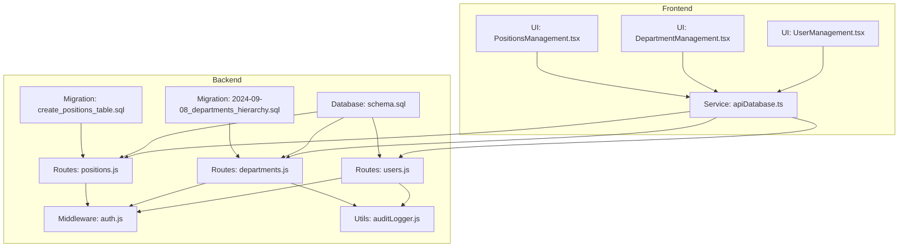
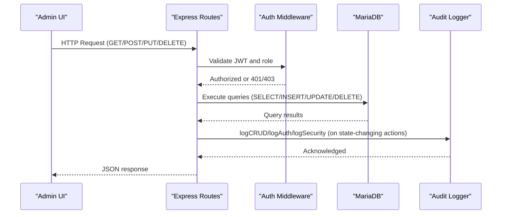
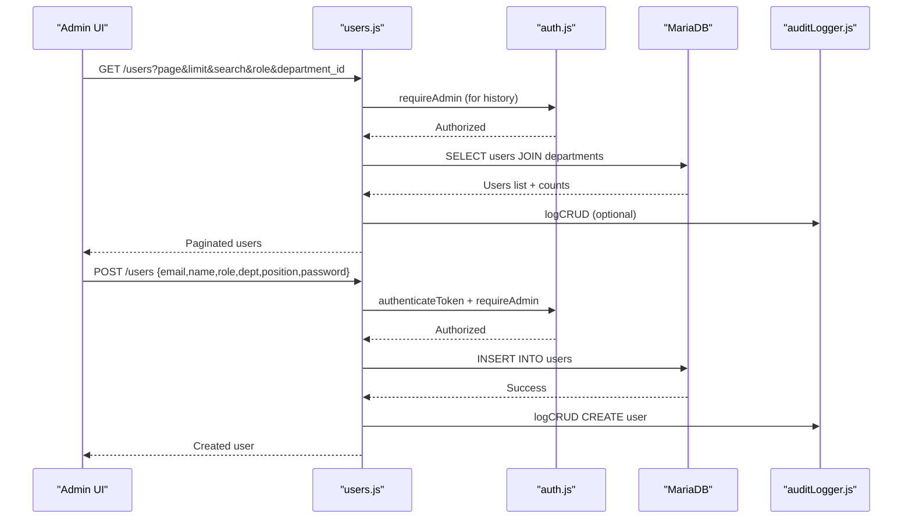
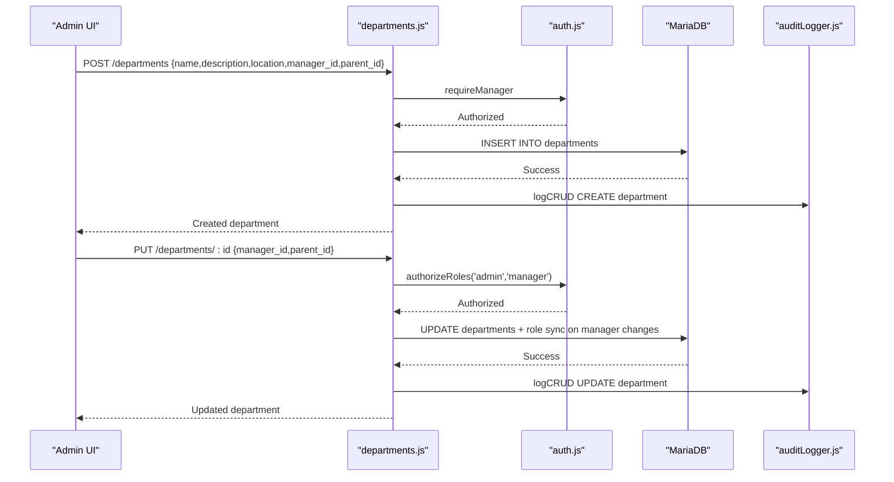
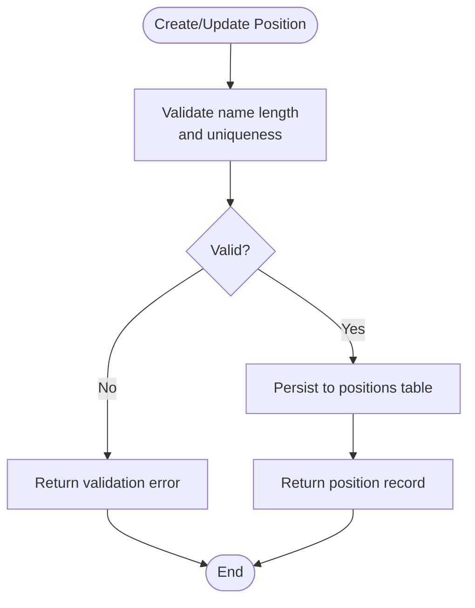
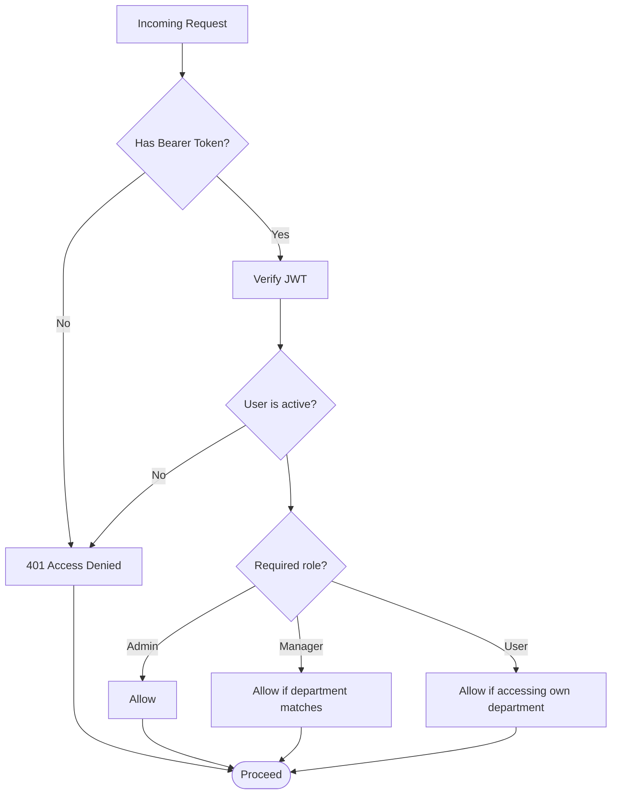
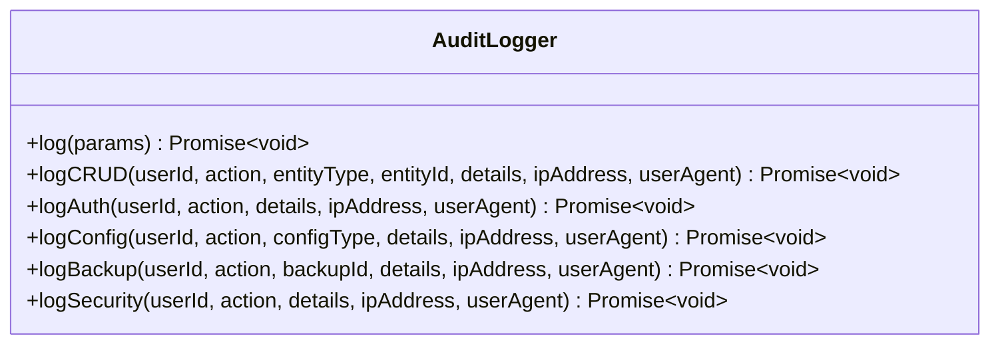
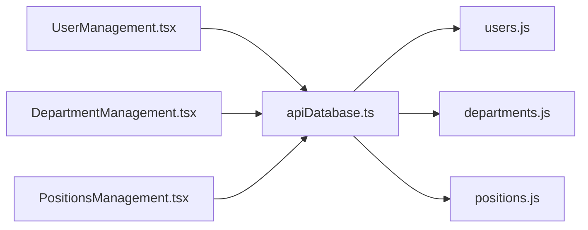
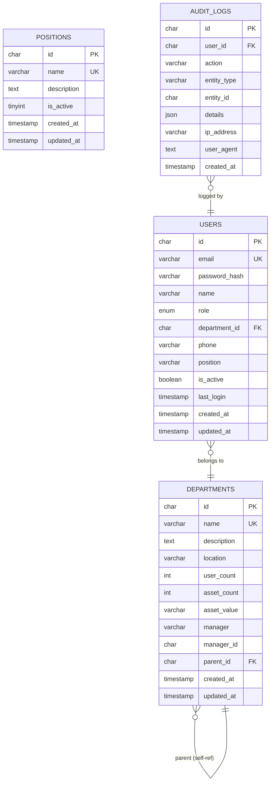
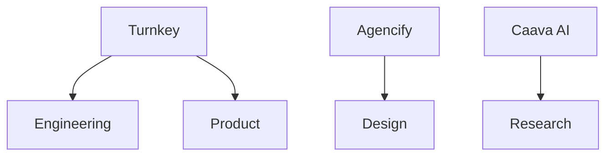

# User & Department Management

## Table of Contents
1. [Introduction](#introduction)
2. [Project Structure](#project-structure)
3. [Core Components](#core-components)
4. [Architecture Overview](#architecture-overview)
5. [Detailed Component Analysis](#detailed-component-analysis)
6. [Dependency Analysis](#dependency-analysis)
7. [Performance Considerations](#performance-considerations)
8. [Troubleshooting Guide](#troubleshooting-guide)
9. [Conclusion](#conclusion)
10. [Appendices](#appendices)

## Introduction
This document provides comprehensive documentation for user and department management functionality within the assets management system. It covers user profile management, role assignments, department hierarchies, position-based attributes, onboarding workflows, administrative capabilities, and compliance features including audit trails. The system supports hierarchical departments, role-based access control, and centralized audit logging for security and compliance reporting.

## Project Structure
The user and department management system spans backend REST APIs, middleware for authorization, database schema and migrations, and frontend admin interfaces for managing users, departments, and positions.

## Core Components
- User Management API: Provides endpoints for listing, creating, updating, deleting users, password changes, and retrieving user history summaries and details.
- Department Management API: Supports hierarchical departments with parent-child relationships, manager assignment, and department statistics.
- Position Management API: Manages job positions with activation controls and optional inclusion of inactive positions.
- Authorization Middleware: Enforces role-based access control (admin, manager, user) and department-level access checks.
- Audit Logging Utility: Centralized logging for CRUD operations, authentication, configuration, backups, and security events.
- Frontend Admin Interfaces: React components for user, department, and position management with filtering, search, and batch operations.

## Architecture Overview
The system follows a layered architecture:
- Presentation Layer: React admin pages consume a unified API service wrapper.
- Application Layer: Express routes implement business logic with validation and authorization.
- Persistence Layer: MariaDB schema defines entities and relationships; triggers maintain department metrics.
- Compliance Layer: Audit logger records all significant actions for compliance reporting.

## Detailed Component Analysis

### User Management API
Key capabilities:
- Listing users with pagination, search, role filtering, and department filtering.
- Creating users with validation and notifying via internal mechanisms.
- Updating user profiles with role/department restrictions for non-admins.
- Deleting users with self-protection and audit logging.
- Changing passwords (admin-only).
- Retrieving user history summaries and detailed histories across assignments, issues, and requests.

### Department Management API
Key capabilities:
- Listing departments with manager, user count, and asset statistics.
- Creating departments with optional manager and parent assignment.
- Updating departments (including manager and parent changes with role synchronization).
- Deleting departments with cascading cleanup and role reversion.
- Hierarchical structure via parent_id with automatic root seeding.

### Position Management API
Key capabilities:
- Listing positions with optional inclusion of inactive ones.
- Creating positions with uniqueness enforcement.
- Updating positions with validation and deactivation controls.
- Deleting positions.

### Role-Based Access Control and Department Access
- Authentication middleware verifies JWT and ensures active accounts.
- Authorization helpers enforce admin-only routes, manager-or-admin routes, and department-level access checks.
- Department access logic allows admins full access, managers access to their own department, and users access only their own department.

### Audit Logging and Compliance
- Centralized audit logger captures CRUD, authentication, configuration, backup, and security events.
- Audit logs include user identity, action, entity type, entity ID, details, IP address, and user agent.
- Backend routes invoke audit logging for user and department operations.

### Frontend Administration Interfaces
- User Management: Full CRUD, password change, status toggle, search/filter, export/import, and bulk operations.
- Department Management: Hierarchical display, manager assignment, statistics, and bulk operations.
- Positions Management: Create/update/delete positions with search and status toggles.

## Dependency Analysis
- Entities and relationships are defined in the schema with foreign keys and indexes.
- Triggers maintain department statistics for user counts and asset values.
- Frontend services encapsulate API calls and normalize responses.

## Performance Considerations
- Pagination is enforced in user and department listings to avoid large result sets.
- Indexes exist on frequently queried columns (email, department_id, role, active status, audit indices).
- Triggers maintain department metrics; consider periodic recomputation if heavy write loads occur.
- Frontend uses client-side filtering for small datasets; backend filtering reduces payload sizes.

## Troubleshooting Guide
Common issues and resolutions:
- Access Denied (401/403): Ensure a valid JWT is present and the user’s role meets route requirements. Check department access rules for manager-level routes.
- User Already Exists: Validation prevents duplicate emails; resolve by using a unique email or updating an existing record.
- Department Name Conflict: Departments must have unique names; adjust the name or update an existing department.
- Audit Logging Failures: Audit logging is non-blocking; failures are logged to console and do not interrupt operations.

## Conclusion
The user and department management system provides robust administrative capabilities with strong role-based access control, hierarchical department support, and comprehensive audit logging. The frontend admin interfaces streamline onboarding, profile management, and oversight tasks, while the backend APIs ensure secure and compliant operations.

## Appendices

### Organizational Chart Visualization
The system supports hierarchical departments via parent_id. Root departments are seeded automatically, enabling multi-entity structures (e.g., Turnkey, Agencify, Caava AI). The frontend displays departments grouped under their respective roots and supports adding sub-departments with parent selection.

### Permission Matrix Configuration
- Admin: Full access to all resources and administrative functions.
- Manager: Can manage their own department’s users and assets; limited updates to department metadata.
- User: Can update personal profile and view assigned assets/issues; cannot change roles or departments.

### User Onboarding Workflow
- Admin creates user with initial password.
- User receives notifications via internal mechanisms.
- Admin assigns department and position.
- User activates account and completes profile.

### Department Administration Features
- Hierarchy management: Create parent/root departments and sub-departments.
- Budget allocation: Track asset values per department via triggers and manual updates.
- Team oversight: View user counts, manager assignments, and asset statistics.

### Position Management and Career Progression
- Positions are managed independently with activation controls.
- Users can be associated with positions; this supports career progression tracking.

### Activity Monitoring and Compliance Reporting
- User history summaries aggregate assignments, issues, and requests with last activity timestamps.
- Audit logs capture all significant actions with timestamps and contextual details for compliance reporting.

- `auditLogger.js:1-146`
