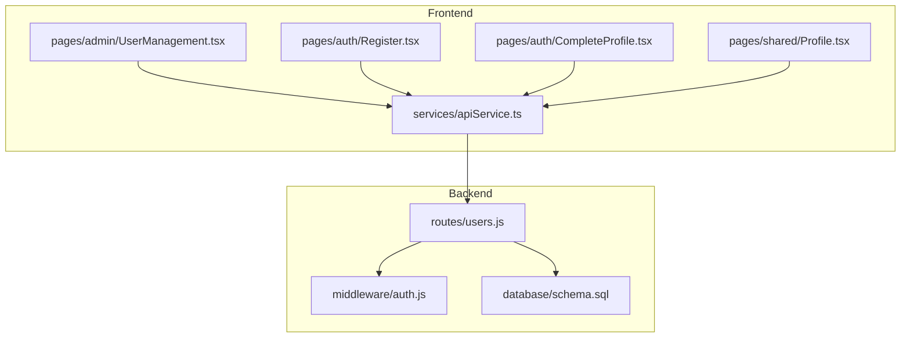
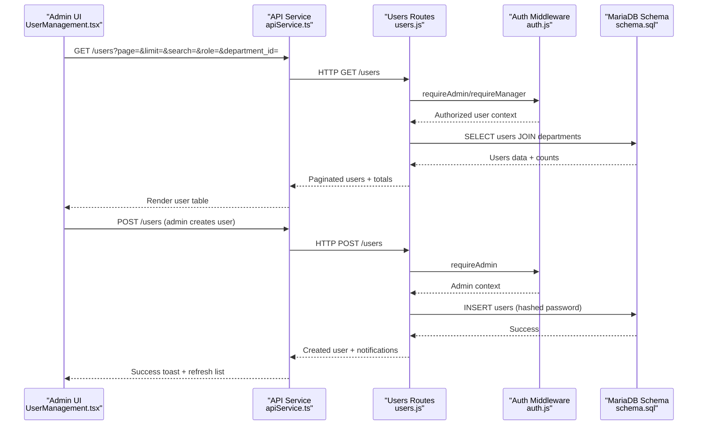
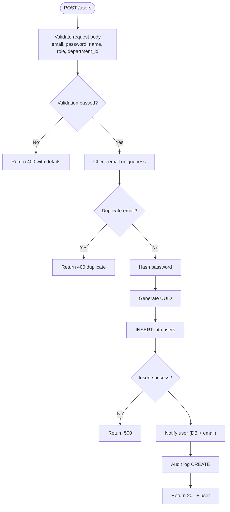
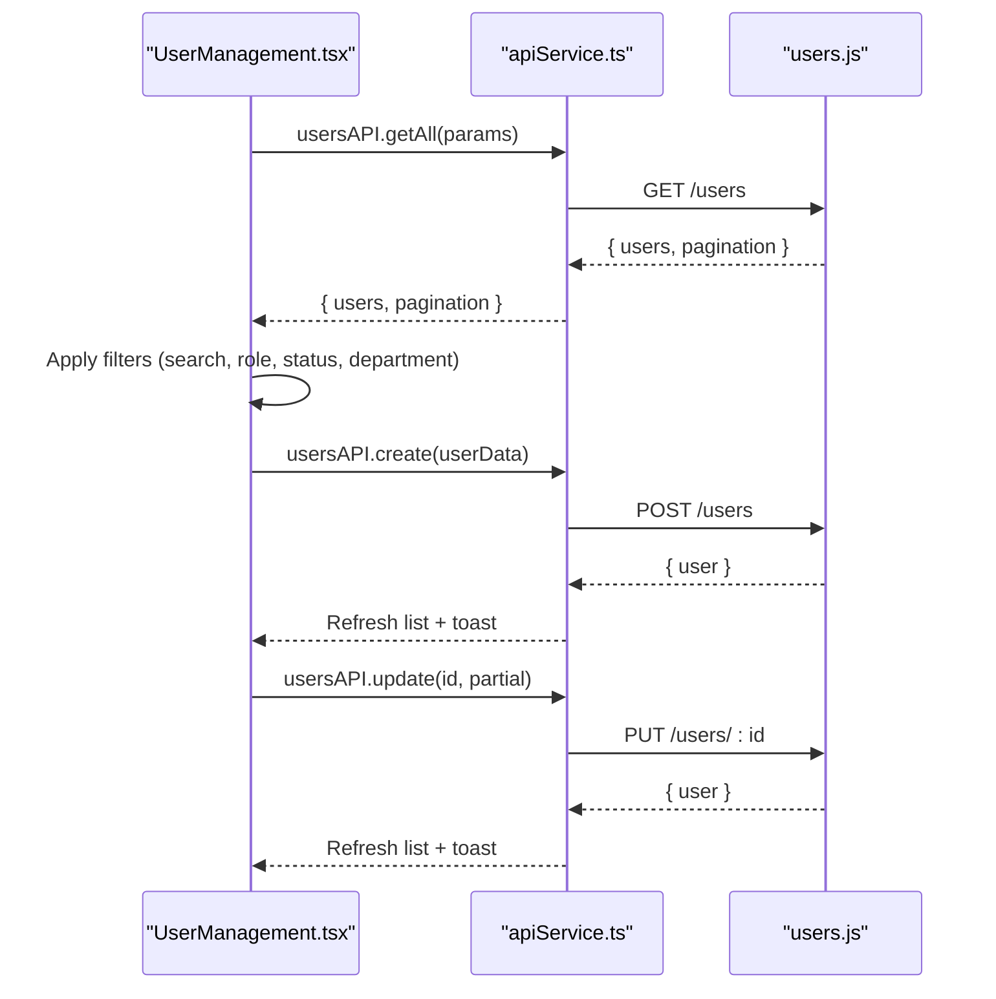
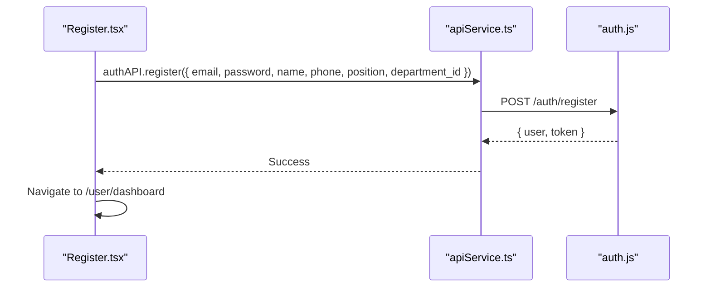
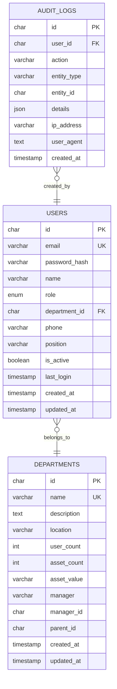
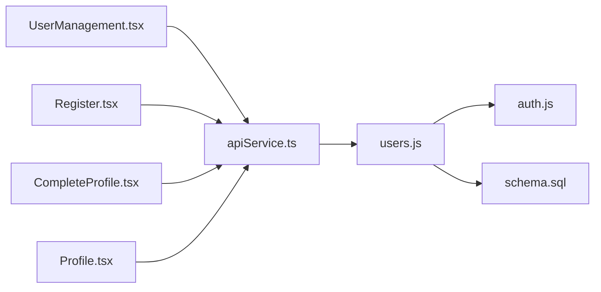

# User Profile Management

## Table of Contents
1. [Introduction](#introduction)
2. [Project Structure](#project-structure)
3. [Core Components](#core-components)
4. [Architecture Overview](#architecture-overview)
5. [Detailed Component Analysis](#detailed-component-analysis)
6. [Dependency Analysis](#dependency-analysis)
7. [Performance Considerations](#performance-considerations)
8. [Troubleshooting Guide](#troubleshooting-guide)
9. [Conclusion](#conclusion)

## Introduction
This document provides comprehensive coverage of user profile management functionality across the backend API and frontend administration interface. It documents user creation workflows, validation rules, role assignments, status management, search and filtering, bulk operations, import/export capabilities, UI components, and integration with the authentication system. It also outlines onboarding flows, profile completion processes, and compliance considerations derived from the codebase.

## Project Structure
The user profile management system spans backend REST APIs, middleware for authentication and authorization, and frontend pages for administration and user self-service.

## Core Components
- Backend REST API for user management:
  - GET /users with search, role, department filters, and pagination
  - GET /users/history for administrative user activity summaries
  - GET /users/:id and GET /users/:id/history for detailed views
  - POST /users for admin-created accounts with validation and notifications
  - PUT /users/:id for profile updates with role/department restrictions
  - DELETE /users/:id for account removal with safeguards
  - PUT /users/:id/password for admin-initiated password changes
- Middleware for authentication and authorization:
  - JWT token verification and active account checks
  - Role-based access control (requireAdmin, requireManager)
  - Department access enforcement
- Frontend administration:
  - UserManagement page with search, filters, bulk actions, import/export
  - User table with status toggles and action buttons
  - Modals for add/edit operations and password changes
- Frontend user self-service:
  - Registration flow with department/position selection
  - Profile completion for OAuth users
  - Profile editing and password change UI
- Data model:
  - users table with UUID primary key, role enumeration, and status flag
  - departments table with hierarchical structure and counts
  - MFA policy columns added via migration

## Architecture Overview
The system follows a layered architecture:
- Presentation layer: React pages for admin and user self-service
- Service layer: API service wrapper for HTTP communication
- Application layer: Express routes implementing user management operations
- Persistence layer: MariaDB with normalized tables and triggers

## Detailed Component Analysis

### Backend User Management API
- Endpoint definitions and validation:
  - GET /users: supports search by name/email, role, department_id, and roles list; applies server-side filtering and pagination; includes department joins and counts
  - GET /users/history: aggregates user activity across assignments, issues, and requests with dynamic joins and last_activity calculation
  - GET /users/:id and GET /users/:id/history: detailed user view with related histories
  - POST /users: admin-only creation with email uniqueness check, password hashing, UUID generation, notifications, and audit logging
  - PUT /users/:id: updates with strict validation, email uniqueness per user, role/department restrictions for non-admins, and audit logging
  - DELETE /users/:id: admin-only deletion with self-protection and audit logging
  - PUT /users/:id/password: admin-only password change with hashing and notifications
- Authorization and middleware:
  - authenticateToken validates JWT and ensures active accounts
  - requireAdmin and requireManager enforce role-based access
  - requireDepartmentAccess restricts department-specific operations
- Data integrity:
  - Triggers maintain department stats on user and asset changes
  - UUID primary keys and foreign key constraints

### Frontend Administration: UserManagement Page
- Features:
  - Search by name/email/position and filter by role, status, and department
  - Bulk selection and delete operations
  - Import users from CSV and export to CSV/JSON/Excel/PDF/Text
  - Modals for add, edit, and password change operations
  - Real-time statistics cards for user metrics
- Data flow:
  - Fetch users via apiService.usersAPI.getAll
  - Apply client-side filters and pagination
  - Perform CRUD operations through apiService wrappers
  - Handle department and position creation inline

### Authentication and Onboarding Flows
- Registration:
  - Collects name, email, phone, position, parent department, department, and passwords
  - Validates password strength and matching
  - Submits to auth.register endpoint and navigates to dashboard
- Google OAuth onboarding:
  - Completes profile with position, department, and optional phone
  - Navigates to dashboard upon completion
- Self-service profile:
  - Allows editing name, phone, email, position, and department (subject to role constraints)
  - Provides password change with complexity requirements

### Data Model and Compliance
- User model:
  - UUID primary key, unique email, role enum, department foreign key, phone, position, is_active flag, timestamps
  - MFA policy columns added via migration for policy enforcement and grace periods
- Department model:
  - Hierarchical structure with parent_id, counts, and computed asset value
- Triggers:
  - Maintain department user_count and asset statistics on changes

## Dependency Analysis
- Route dependencies:
  - users.js depends on express-validator for input validation, bcrypt for password hashing, database connection, notification service, auth middleware, and audit logger
- Middleware dependencies:
  - auth.js depends on jsonwebtoken and database queries for token verification and active account checks
- Frontend dependencies:
  - UserManagement.tsx depends on apiService for HTTP calls, lucide icons, and local state management
  - apiService.ts depends on axios and environment variables for base URL and credentials

## Performance Considerations
- Pagination defaults:
  - GET /users uses a default limit of 1000 with a maximum of 1000 to prevent heavy loads
- Filtering:
  - Server-side WHERE clauses with indexed columns (email, department_id, role, is_active)
  - Additional notInDepartment filtering applied client-side after query completion
- Asynchronous operations:
  - Parallel queries for counts and summaries in history endpoints
- Recommendations:
  - Index additional frequently-filtered columns if needed
  - Consider caching department and position lists
  - Validate large CSV imports server-side and batch inserts where possible

## Troubleshooting Guide
- Common API errors:
  - Validation failures: 400 with details array for malformed inputs
  - Access denied: 401 for missing/expired tokens or inactive accounts
  - Insufficient permissions: 403 for unauthorized role attempts
  - Not found: 404 when user or resource does not exist
  - Internal errors: 500 for database failures or unexpected exceptions
- Frontend error handling:
  - Toast notifications for user feedback
  - Reset filters button to recover from invalid selections
  - Import validation messages for CSV parsing issues

## Conclusion
The user profile management system integrates robust backend APIs with comprehensive frontend administration and self-service capabilities. It enforces strong validation, role-based access control, and maintains audit trails. The system supports efficient search and filtering, bulk operations, and import/export workflows, while providing clear onboarding and profile completion experiences for users.
